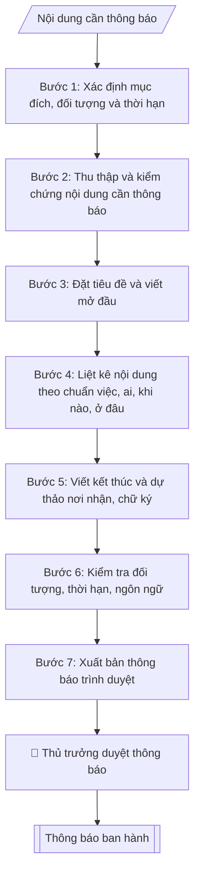

# Soạn thông báo

## Quy cách đầu ra và thông tin thiếu

Đọc [quy cách và cấu trúc sản phẩm](references/quy-cach-dau-ra.md) trước khi soạn/xuất. File giao chỉ gồm văn bản hoặc sản phẩm nghiệp vụ được yêu cầu; kiểm tra nội bộ không xuất kèm. Thiếu thông tin giữ nguyên trường/mục và chỗ điền theo mẫu gốc (dòng dấu chấm, dấu gạch hoặc ô trống); không tự điền dữ liệu mẫu, số 0, mã chờ xác minh hoặc dòng chờ ký. Mẫu chuyên ngành còn áp dụng được ưu tiên về cấu trúc, mã biểu và người ký. Các trường “bắt buộc” là điều kiện hoàn thiện hồ sơ, không ngăn việc soạn bản có chỗ chừa để điền. Mọi chỉ dẫn “để trống” trong skill được hiểu là không điền dữ liệu và giữ cách chừa chỗ của mẫu gốc, không phải xóa dấu chấm của mẫu.

## Kiểm soát áp dụng và phê duyệt

Trước khi chạy quy trình, xác định `ngay_ap_dung`, `loai_hinh_truong`, `quy_che_noi_bo`, `nguon_du_lieu` và `nguoi_kiem_duyet`. Chỉ yêu cầu thông tin có liên quan đến nghiệp vụ; không dùng giá trị giả định thay dữ liệu bắt buộc. Đối chiếu nội bộ hồ sơ có yếu tố pháp lý với văn bản gốc, hiệu lực, điều khoản áp dụng và chuyển tiếp; không tự đính kèm bảng kiểm tra vào file giao.

## Giới hạn và human gate

AI hỗ trợ chuẩn bị và đối chiếu. Cán bộ phụ trách kiểm tra dữ liệu/căn cứ, người có thẩm quyền duyệt và ký. Văn bản soạn chưa được coi là đã ban hành; không tự chèn nhãn trạng thái kiểm duyệt vào file giao; không đánh dấu đã ký, đã duyệt hoặc đã công bố nếu chưa có chứng cứ. Dữ liệu sinh viên, sức khỏe, nhân sự và tài chính phải hạn chế theo mục đích, phân quyền và che thông tin định danh khi dùng ví dụ. Không tải dữ liệu lên dịch vụ ngoài khi chưa có quyền. Kiểm tra Luật 91/2025/QH15 về bảo vệ dữ liệu cá nhân (hiệu lực 01/01/2026) và quy định áp dụng trước xử lý/chia sẻ dữ liệu cá nhân.

## Khi nào dùng
Khi cần thông tin chính thức đến toàn thể hoặc một nhóm đối tượng trong trường: lịch nghỉ,
triệu tập họp, quy định mới, kế hoạch, kết quả...

## Đầu vào (Input)

| Trường | Mô tả | Bắt buộc |
|---|---|---|
| `tieu_de` | Tiêu đề thông báo (ngắn, nêu việc) | Có |
| `doi_tuong` | Toàn thể CBVC / sinh viên / các đơn vị... | Có |
| `noi_dung` | Các điểm cần thông báo, dạng gạch đầu dòng | Có |
| `thoi_han` | Thời gian hiệu lực / hạn thực hiện (nếu có) | Không |
| `don_vi_ban_hanh` | Phòng/ban ban hành | Có |
| `nguoi_ky` | Chức danh người ký | Có |

## Quy trình

**Bước 1. Xác định mục đích, đối tượng và thời hạn**
- Làm gì: Đọc `tieu_de` để xác định mục đích thông báo (thông tin / yêu cầu thực hiện / triệu tập); đọc `doi_tuong` để xác định phạm vi người nhận (toàn trường / nhóm đơn vị / sinh viên...); đọc `thoi_han` để xác định thời gian hiệu lực hoặc hạn thực hiện; kiểm tra `don_vi_ban_hanh` và `nguoi_ky` có thẩm quyền ban hành thông báo về nội dung này không.
- Dùng input: `tieu_de`, `doi_tuong`, `thoi_han`, `don_vi_ban_hanh`, `nguoi_ky`.
- Vai trò: Chuyên viên Phòng HCTH · AI hỗ trợ: phân tích input, xác định yêu cầu · ⏱ ~20–45 phút (ước tính)
- Lưu ý nghiệp vụ: Thông báo yêu cầu thực hiện bắt buộc phải có thời hạn rõ ràng; thông báo gửi "toàn thể" mà nội dung chỉ liên quan một nhóm sẽ gây nhiễu — thu hẹp đối tượng cho đúng.
- → Kết quả bước: Xác nhận mục đích + đối tượng nhận + thời hạn của thông báo.

**Bước 2. Thu thập và kiểm chứng nội dung cần thông báo**
- Làm gì: Từ `noi_dung`, kiểm chứng từng điểm: sự kiện có thật không (đối chiếu quyết định/kế hoạch liên quan), ngày giờ có chính xác và rơi đúng thứ trong tuần không, địa điểm có tồn tại và đủ sức chứa đối tượng không; loại bỏ điểm trùng lặp, gộp các điểm cùng chủ đề.
- Dùng input: `noi_dung`, `thoi_han`.
- Vai trò: Chuyên viên Phòng HCTH · AI hỗ trợ: xử lý sơ bộ theo quy trình · ⏱ ~20–45 phút (ước tính)
- Lưu ý nghiệp vụ: Bẫy thường gặp — ngày tháng trong nội dung không khớp thứ (vd ghi "thứ Sáu, 01/01/2027" nhưng tra lịch lại là thứ khác); hạn đăng ký đặt sau ngày diễn ra sự kiện.
- → Kết quả bước: Danh sách nội dung đã kiểm chứng, loại trùng, sẵn sàng đưa vào thông báo.

**Bước 3. Đặt tiêu đề và viết mở đầu**
- Làm gì: Viết dòng "THÔNG BÁO" (in hoa, căn giữa) + trích yếu ở dòng dưới lấy từ `tieu_de`; viết dòng "Kính gửi" + `doi_tuong`; mở đầu 1–2 câu: nêu căn cứ/quyết định liên quan (nếu có) rồi đi thẳng vào nội dung ("...thông báo ... như sau:").
- Dùng input: `tieu_de`, `doi_tuong`.
- Vai trò: Chuyên viên Phòng HCTH · AI hỗ trợ: soạn dự thảo đúng thể thức · ⏱ ~20–45 phút (ước tính)
- Lưu ý nghiệp vụ: Tiêu đề không dài quá một dòng; mở đầu không kể lể dài dòng — thông báo càng vào việc nhanh càng tốt.
- → Kết quả bước: Phần tiêu đề + mở đầu hoàn chỉnh.

**Bước 4. Liệt kê nội dung theo chuẩn việc – ai – khi nào – ở đâu**
- Làm gì: Chuyển từng điểm trong `noi_dung` thành các mục đánh số 1., 2., 3...; mỗi mục phải trả lời đủ 4 câu hỏi: việc gì – ai thực hiện – khi nào – ở đâu; với thông báo yêu cầu thực hiện, mỗi mục ghi rõ đơn vị/cá nhân chịu trách nhiệm và hạn hoàn thành.
- Dùng input: `noi_dung`, `thoi_han`, `doi_tuong`.
- Vai trò: Chuyên viên Phòng HCTH · AI hỗ trợ: xử lý sơ bộ theo quy trình · ⏱ ~20–45 phút (ước tính)
- Lưu ý nghiệp vụ: Tránh câu bị động mập mờ ("sẽ được bố trí") — phải ghi rõ chủ thể thực hiện; thời gian ghi đầy đủ thứ, ngày/tháng/năm, giờ (nếu có).
- → Kết quả bước: Dự thảo nội dung đánh số, mỗi ý đủ 4 yếu tố.

**Bước 5. Viết kết thúc và dự thảo nơi nhận, chữ ký**
- Làm gì: Viết câu kết: với thông báo yêu cầu thực hiện — "Đề nghị các đơn vị, cá nhân nghiêm túc thực hiện./."; với thông báo thông tin — lời cảm ơn hoặc câu kết phù hợp; liệt kê nơi nhận ("- Như trên;" + "- Lưu: VT, [mã đơn vị]."); khối chữ ký theo `nguoi_ky` (ký thừa ủy quyền thì ghi "TL. HIỆU TRƯỞNG" + chức danh).
- Dùng input: `nguoi_ky`, `doi_tuong`.
- Vai trò: Chuyên viên Phòng HCTH · AI hỗ trợ: soạn dự thảo đúng thể thức · ⏱ ~20–45 phút (ước tính)
- Lưu ý nghiệp vụ: Thông báo do Trưởng phòng ký phải có quyết định ủy quyền còn hiệu lực; nơi nhận phải bao phủ hết `doi_tuong` đã xác định ở Bước 1.
- → Kết quả bước: Phần kết thúc + nơi nhận + khối chữ ký hoàn chỉnh.

**Bước 6. Kiểm tra đối tượng, thời hạn, ngôn ngữ**
- Làm gì: Đối chiếu: nơi nhận có bao phủ hết đối tượng trong `doi_tuong` không; thời hạn trong nội dung có rõ và nhất quán với `thoi_han` không; đọc lại toàn văn kiểm tra ngôn ngữ dễ hiểu, không vòng vo, không thuật ngữ chuyên môn khó hiểu với đối tượng nhận; kiểm tra thể thức (quốc hiệu, số ký hiệu, ngày tháng).
- Dùng input: toàn bộ input (đối chiếu chéo).
- Vai trò: Chuyên viên Phòng HCTH (Trưởng phòng kiểm tra lại) · AI hỗ trợ: quét lỗi theo checklist · ⏱ ~15–30 phút (ước tính)
- Lưu ý nghiệp vụ: Đọc thử với góc nhìn của người nhận ít thông tin nhất (vd sinh viên năm nhất) — chỗ nào khó hiểu thì viết lại.
- → Kết quả bước: Báo cáo kiểm tra + danh sách chỗ cần sửa (nếu có), trả về bước tương ứng để chỉnh.

**Bước 7. Xuất bản thông báo trình duyệt**
- Làm gì: Ghép toàn bộ thành thông báo hoàn chỉnh ở định dạng markdown; chuyển cho thủ trưởng đơn vị ban hành duyệt (human gate) trước khi phát hành trên các kênh (website, email, bảng tin).
- Dùng input: toàn bộ.
- Vai trò: Chuyên viên Phòng HCTH chuẩn bị, Hiệu trưởng phê duyệt · AI hỗ trợ: tổng hợp hồ sơ, soạn phiếu trình/tờ trình đầy đủ · ⏱ ~15–30 phút chuẩn bị + chờ duyệt (ước tính)
- Lưu ý nghiệp vụ: Thông báo có thời hạn gấp nên ghi rõ giờ phát hành dự kiến để đơn vị truyền thông kịp đăng.
- → Kết quả bước: Thông báo hoàn chỉnh, sẵn sàng ban hành.

## Luồng quy trình (Workflow)

## Đầu ra

Sản phẩm nghiệp vụ hoàn chỉnh theo [quy cách và cấu trúc](references/quy-cach-dau-ra.md), giữ các trường chưa có dữ liệu ở trạng thái trống. Không xuất kèm checklist/phụ lục kiểm tra đầu ra.

## Kiểm tra nội bộ trước khi giao

Các tiêu chí sau dùng để tự đối chiếu; không sao chép vào file xuất. Mục thiếu dữ liệu được để trống, không đánh dấu đã đạt hoặc đã duyệt.

- [ ] Bố cục khớp mẫu áp dụng và cấu trúc tại references/quy-cach-dau-ra.md.
- [ ] Nội dung và số liệu trong output khớp đúng với Input đã cho (không thêm, bớt hay suy diễn)
- [ ] Không bịa đặt số liệu, minh chứng, trích dẫn hay căn cứ
- [ ] Đúng thể thức và định dạng theo Thông báo càng ngắn càng tốt
- [ ] Căn cứ pháp lý được trích dẫn đầy đủ và còn hiệu lực
- [ ] Không coi bản soạn là đã ký/đã duyệt; việc phê duyệt thuộc người có thẩm quyền trước phát hành
- [ ] Thông báo yêu cầu thực hiện bắt buộc phải có thời hạn rõ ràng
- [ ] Thông báo gửi "toàn thể" mà nội dung chỉ liên quan một nhóm sẽ gây nhiễu — thu hẹp đối tượng cho đúng
- [ ] Tránh câu bị động mập mờ ("sẽ được bố trí") — phải ghi rõ chủ thể thực hiện

## Căn cứ & lưu ý
- Thông báo càng ngắn càng tốt; tránh văn hoa, vòng vo.
- Không dùng tên thật của trường/cá nhân khi mô phỏng.

## Quản trị phiên bản

- Phiên bản gói: `1.2.1`; ngày cập nhật: `2026-10-10`.
- Kho nguồn: https://github.com/phamtruong91/university-skills-framework
- Người duy trì trên GitHub: `phamtruong91` (Phạm Văn Trường). Người phê duyệt nghiệp vụ: **chưa chỉ định**.
- Commit nguồn trước cập nhật: `346719e6b0318ed034b4b016703f79733aa575e7`. Commit chứa phiên bản này xem bằng `git log -1 -- skills/soan-thong-bao`; không tự gán SHA chưa tạo.
- Giấy phép: theo LICENSE của kho; bản quyền CES Global.
- Lịch sử 1.1.0: bổ sung metadata giao diện, kiểm soát áp dụng, quản trị phiên bản.
- Trạng thái: dự thảo nghiệp vụ; kiểm tra pháp lý trước thực thi. Ngày cập nhật không đồng nghĩa mọi văn bản đã được rà soát toàn văn.
