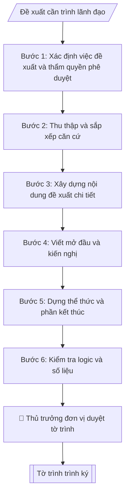

# Soạn tờ trình

## Kiểm soát áp dụng và phê duyệt

Trước khi chạy quy trình, xác định `ngay_ap_dung`, `loai_hinh_truong`, `quy_che_noi_bo`, `nguon_du_lieu` và `nguoi_kiem_duyet`. Chỉ yêu cầu thông tin có liên quan đến nghiệp vụ; không dùng giá trị giả định thay dữ liệu bắt buộc. Hồ sơ có yếu tố pháp lý phải kèm văn bản gốc, tình trạng hiệu lực, điều khoản áp dụng và chuyển tiếp.

## Giới hạn và human gate

AI hỗ trợ chuẩn bị và đối chiếu. Cán bộ phụ trách kiểm tra dữ liệu/căn cứ, người có thẩm quyền duyệt và ký. Mọi đầu ra mặc định là **DỰ THẢO – CHỜ KIỂM DUYỆT**; không đánh dấu đã ký, đã duyệt hoặc đã công bố nếu chưa có chứng cứ. Dữ liệu sinh viên, sức khỏe, nhân sự và tài chính phải hạn chế theo mục đích, phân quyền và che thông tin định danh khi dùng ví dụ. Không tải dữ liệu lên dịch vụ ngoài khi chưa có quyền. Kiểm tra Luật 91/2025/QH15 về bảo vệ dữ liệu cá nhân (hiệu lực 01/01/2026) và quy định áp dụng trước xử lý/chia sẻ dữ liệu cá nhân.


## Khi nào dùng
Khi một đơn vị/cá nhân cần trình lãnh đạo xem xét, quyết định một chủ trương, kế hoạch, dự án,
kinh phí...: mở ngành, tổ chức sự kiện, mua sắm, cử đi công tác, ban hành văn bản...

## Đầu vào (Input)

| Trường | Mô tả | Bắt buộc |
|---|---|---|
| `ten_to_trinh` | Tên tờ trình (ngắn gọn, nêu việc đề xuất) | Có |
| `kinh_gui` | Ban Giám hiệu / Hội đồng trường / Hiệu trưởng... | Có |
| `don_vi_trinh` | Đơn vị trình tờ trình | Có |
| `can_cu` | Các căn cứ pháp lý, thực tiễn (quy định, công văn, tình hình) | Có |
| `noi_dung_de_xuat` | Nội dung đề xuất chi tiết, dạng gạch đầu dòng | Có |
| `kien_nghi` | Kiến nghị cụ thể mong lãnh đạo quyết định | Có |
| `tai_lieu_kem_theo` | Danh mục tài liệu đính kèm (dự thảo, dự toán...) | Không |

## Quy trình

**Bước 1. Xác định việc đề xuất và thẩm quyền phê duyệt**
- Làm gì: Đọc `ten_to_trinh` và `noi_dung_de_xuat`, tóm tắt việc đề xuất trong một câu (làm gì – cho ai – để đạt gì); đọc `kinh_gui` để xác định cấp phê duyệt (Ban Giám hiệu / Hiệu trưởng / Hội đồng trường / cấp trên) vì cấp phê duyệt quyết định độ chi tiết số liệu và căn cứ cần viện dẫn; kiểm tra `don_vi_trinh` có đúng là đơn vị được giao nhiệm vụ liên quan không.
- Dùng input: `ten_to_trinh`, `kinh_gui`, `don_vi_trinh`, `noi_dung_de_xuat`.
- Vai trò: Chuyên viên Phòng HCTH · AI hỗ trợ: phân tích input, xác định yêu cầu · ⏱ ~20–45 phút (ước tính)
- Lưu ý nghiệp vụ: Việc vượt thẩm quyền của Ban Giám hiệu (vd: mở ngành mới, chiến lược dài hạn) phải trình Hội đồng trường — xác định sai cấp phê duyệt là lỗi nghiêm trọng khiến tờ trình bị trả lại.
- → Kết quả bước: Xác nhận việc đề xuất + cấp phê duyệt phù hợp.

**Bước 2. Thu thập và sắp xếp căn cứ**
- Làm gì: Từ `can_cu`, liệt kê từng văn bản pháp lý/quy định/công văn liên quan, kiểm tra hiệu lực (văn bản còn hiệu lực, không bị thay thế), sắp xếp từ văn bản có hiệu lực cao xuống thấp (luật → nghị định/thông tư → quy chế trường → nghị quyết hội đồng trường → công văn), bổ sung căn cứ thực tiễn (số liệu năm trước, tình hình thực tế) nếu `can_cu` còn thiếu.
- Dùng input: `can_cu`.
- Vai trò: Chuyên viên Phòng HCTH · AI hỗ trợ: xử lý sơ bộ theo quy trình · ⏱ ~20–45 phút (ước tính)
- Lưu ý nghiệp vụ: Bẫy thường gặp — viện dẫn văn bản đã hết hiệu lực hoặc bị thay thế; căn cứ thực tiễn thiếu số liệu khiến lý do đề xuất yếu. Mỗi căn cứ phải ghi đủ tên văn bản, số/ký hiệu, ngày ban hành.
- → Kết quả bước: Danh sách căn cứ đã kiểm chuẩn, sắp xếp đúng thứ tự hiệu lực.

**Bước 3. Xây dựng nội dung đề xuất chi tiết**
- Làm gì: Chuyển từng gạch đầu dòng trong `noi_dung_de_xuat` thành các mục đánh số 1., 2., 3..., mỗi mục một nội dung trọn vẹn; với nội dung liên quan kinh phí/nhân sự/thời gian, bổ sung số liệu cụ thể (tổng số, mức tăng/giảm so với năm trước, mốc thời gian); kiểm tra số liệu giữa các mục có nhất quán không; đối chiếu `tai_lieu_kem_theo` để đảm bảo tài liệu đính kèm khớp với nội dung đề xuất.
- Dùng input: `noi_dung_de_xuat`, `tai_lieu_kem_theo`.
- Vai trò: Chuyên viên Phòng HCTH · AI hỗ trợ: soạn dự thảo đúng thể thức · ⏱ ~20–45 phút (ước tính)
- Lưu ý nghiệp vụ: Đề xuất xin kinh phí phải có dự toán chi tiết ở tài liệu kèm theo, không dồn hết số liệu vào thân tờ trình; tránh đề xuất chung chung kiểu "tổ chức hiệu quả" mà thiếu chỉ tiêu đo được.
- → Kết quả bước: Dự thảo nội dung đề xuất có số liệu nhất quán + danh mục tài liệu kèm theo đã đối chiếu.

**Bước 4. Viết mở đầu và kiến nghị**
- Làm gì: Viết đoạn mở đầu sau dòng "Kính gửi": nêu lý do, sự cần thiết của việc đề xuất (gắn với nhiệm vụ của đơn vị và tình hình thực tế); sau phần nội dung đề xuất, viết kiến nghị: nêu dứt khoát trong 1–2 câu điều mong lãnh đạo xem xét, quyết định (phê duyệt cái gì, giao cho ai triển khai), lấy nguyên văn ý từ `kien_nghi`.
- Dùng input: `ten_to_trinh`, `don_vi_trinh`, `kien_nghi`.
- Vai trò: Chuyên viên Phòng HCTH · AI hỗ trợ: soạn dự thảo đúng thể thức · ⏱ ~20–45 phút (ước tính)
- Lưu ý nghiệp vụ: Kiến nghị phải là câu cầu khiến rõ ràng ("Kính đề nghị ... phê duyệt ..."), không viết lưng chừng kiểu "mong lãnh đạo cho ý kiến"; kiến nghị phải khớp đúng phạm vi nội dung đã đề xuất ở Bước 3.
- → Kết quả bước: Đoạn mở đầu + đoạn kiến nghị hoàn chỉnh.

**Bước 5. Dựng thể thức và phần kết thúc**
- Làm gì: Lắp ráp phần đầu: tên trường + quốc hiệu – tiêu ngữ, tên `don_vi_trinh`, số/ký hiệu tờ trình (ký hiệu TTr), địa danh ngày tháng, dòng chữ "TỜ TRÌNH" + tên tờ trình (in hoa, căn giữa), dòng "Kính gửi" + `kinh_gui`; phần kết thúc: câu kết "./.", nơi nhận ("- [cấp phê duyệt];", "- Lưu: VT, [mã đơn vị]."), danh mục tài liệu kèm theo, khối chữ ký người đứng đầu đơn vị trình (chức danh + họ tên).
- Dùng input: `don_vi_trinh`, `ten_to_trinh`, `kinh_gui`, `tai_lieu_kem_theo`.
- Vai trò: Chuyên viên Phòng HCTH · AI hỗ trợ: soạn dự thảo đúng thể thức · ⏱ ~20–45 phút (ước tính)
- Lưu ý nghiệp vụ: Người ký tờ trình là thủ trưởng đơn vị trình (Trưởng phòng/Trưởng khoa), không phải Hiệu trưởng; số tờ trình lấy tiếp theo sổ văn bản đi của đơn vị với ký hiệu "TTr".
- → Kết quả bước: Khung tờ trình hoàn chỉnh về thể thức, đã lắp đủ mở đầu – căn cứ – đề xuất – kiến nghị – kết thúc.

**Bước 6. Kiểm tra logic và số liệu**
- Làm gì: Đọc liền mạch từ lý do → căn cứ → đề xuất → kiến nghị, kiểm tra: lý do có dẫn tới đúng nội dung đề xuất không; căn cứ có đủ cơ sở pháp lý cho nội dung đề xuất không; kiến nghị có bao quát hết nội dung đề xuất không; số liệu trong thân tờ trình có khớp với tài liệu kèm theo không; chính tả, tên văn bản viện dẫn chính xác.
- Dùng input: toàn bộ input (đối chiếu chéo).
- Vai trò: Chuyên viên Phòng HCTH (Trưởng phòng kiểm tra lại) · AI hỗ trợ: quét lỗi theo checklist · ⏱ ~15–30 phút (ước tính)
- Lưu ý nghiệp vụ: Lỗi phổ biến — kiến nghị xin phê duyệt nội dung không có trong phần đề xuất, hoặc đề xuất có nội dung nhưng kiến nghị không nhắc tới; số liệu tổng trong thân không khớp bảng chi tiết đính kèm.
- → Kết quả bước: Báo cáo kiểm tra logic + danh sách lỗi cần sửa (nếu có), trả về bước tương ứng để chỉnh.

**Bước 7. Xuất bản tờ trình trình ký**
- Làm gì: Ghép toàn bộ thành tờ trình hoàn chỉnh ở định dạng markdown; đính kèm ghi chú các tài liệu cần đính kèm theo tờ trình; chuyển cho thủ trưởng đơn vị trình duyệt (human gate) trước khi trình lên cấp phê duyệt.
- Dùng input: toàn bộ.
- Vai trò: Chuyên viên Phòng HCTH chuẩn bị, Hiệu trưởng phê duyệt · AI hỗ trợ: tổng hợp hồ sơ, soạn phiếu trình/tờ trình đầy đủ · ⏱ ~15–30 phút chuẩn bị + chờ duyệt (ước tính)
- Lưu ý nghiệp vụ: Không sửa nội dung đề xuất sau khi thủ trưởng đơn vị đã ký nháy/duyệt mà không xin ý kiến lại.
- → Kết quả bước: Tờ trình hoàn chỉnh + ghi chú tài liệu đính kèm, sẵn sàng trình ký.

## Luồng quy trình (Workflow)



## Đầu ra (Output)
- Tờ trình hoàn chỉnh (markdown), sẵn sàng trình ký.
- Ghi chú các tài liệu cần đính kèm.

**Cấu trúc output chuẩn:** khung mẫu cố định của tờ trình — các phần bắt buộc theo đúng thứ tự xuất hiện:
1. Tên trường + Quốc hiệu "CỘNG HÒA XÃ HỘI CHỦ NGHĨA VIỆT NAM"
2. Tên đơn vị trình + Tiêu ngữ "Độc lập – Tự do – Hạnh phúc"
3. Số, ký hiệu tờ trình (ký hiệu "TTr"); địa danh, ngày tháng năm
4. Tên loại "TỜ TRÌNH" (in hoa, căn giữa) + tên tờ trình
5. Dòng "Kính gửi" + cấp phê duyệt
6. Phần mở đầu: lý do, sự cần thiết của việc đề xuất
7. Chuỗi căn cứ pháp lý và thực tiễn, sắp xếp từ văn bản có hiệu lực cao xuống thấp, kết bằng mệnh đề "Xét..."
8. Nội dung đề xuất: đánh số 1., 2., 3..., có số liệu cụ thể (kinh phí/nhân sự/thời gian)
9. Kiến nghị: 1–2 câu dứt khoát nêu điều mong lãnh đạo phê duyệt, kết bằng "./."
10. Nơi nhận; danh mục tài liệu kèm theo
11. Khối chữ ký: chức danh người đứng đầu đơn vị trình + họ tên

## Checklist nghiệm thu

Tiêu chí đạt: tất cả các ô dưới đây được đánh dấu.

- [ ] Đủ các phần theo Cấu trúc output chuẩn: Tên trường + Quốc hiệu "CỘNG HÒA XÃ HỘI CHỦ NGHĨA VIỆT NAM"; Tên đơn vị trình + Tiêu ngữ "Độc lập – Tự do – Hạnh phúc"; Số, ký hiệu tờ trình (ký hiệu "TTr"); địa danh, ngày tháng năm; Tên loại "TỜ TRÌNH" (in hoa, căn giữa) + tên tờ trình; … (đủ 11 phần)
- [ ] Nội dung và số liệu trong output khớp đúng với Input đã cho (không thêm, bớt hay suy diễn)
- [ ] Không bịa đặt số liệu, minh chứng, trích dẫn hay căn cứ
- [ ] Đúng thể thức và định dạng theo Tờ trình là văn bản nội bộ xin ý kiến quyết định — ngôn ngữ trang t…
- [ ] Căn cứ pháp lý được trích dẫn đầy đủ và còn hiệu lực
- [ ] Đã qua Human gate: người có thẩm quyền đã kiểm tra/duyệt trước khi phát hành
- [ ] Mỗi căn cứ phải ghi đủ tên văn bản, số/ký hiệu, ngày ban hành
- [ ] Đề xuất xin kinh phí phải có dự toán chi tiết ở tài liệu kèm theo, không dồn hết số liệu vào thân tờ trình
- [ ] Tránh đề xuất chung chung kiểu "tổ chức hiệu quả" mà thiếu chỉ tiêu đo được

## Ví dụ mô phỏng (dữ liệu giả lập)

> Tất cả tên trường, cá nhân, số liệu dưới đây đều là **giả lập**.

### Input mẫu

| Trường | Giá trị |
|---|---|
| `ten_to_trinh` | Tờ trình về việc phê duyệt Kế hoạch tuyển sinh đại học chính quy năm 2027 |
| `kinh_gui` | Ban Giám hiệu Trường Đại học A |
| `don_vi_trinh` | Phòng Đào tạo |
| `can_cu` | Quy chế tuyển sinh của Bộ GD&ĐT; Nghị quyết Hội đồng trường về chỉ tiêu đào tạo; kết quả tuyển sinh năm 2026 |
| `noi_dung_de_xuat` | 1. Tổng chỉ tiêu: 2.500 (tăng 200 so với 2026). 2. Giữ 03 phương thức: xét điểm thi TN THPT, xét học bạ, xét tuyển thẳng. 3. Thời gian: theo lịch chung của Bộ. |
| `kien_nghi` | Kính đề nghị Ban Giám hiệu phê duyệt Kế hoạch để Phòng Đào tạo triển khai. |
| `tai_lieu_kem_theo` | Dự thảo Kế hoạch tuyển sinh 2027; bảng chỉ tiêu chi tiết theo ngành |

### Output mẫu

```
TRƯỜNG ĐẠI HỌC A            CỘNG HÒA XÃ HỘI CHỦ NGHĨA VIỆT NAM
PHÒNG ĐÀO TẠO                            Độc lập – Tự do – Hạnh phúc
      Số: 56/TTr-ĐHA-ĐT
                                                 Thành phố C, ngày 09 tháng 10 năm 2026

                          TỜ TRÌNH
     Về việc phê duyệt Kế hoạch tuyển sinh đại học chính quy năm 2027

Kính gửi: Ban Giám hiệu Trường Đại học A

Nhằm chủ động triển khai công tác tuyển sinh đại học chính quy năm 2027 đúng
tiến độ và chỉ tiêu được giao, Phòng Đào tạo kính trình Ban Giám hiệu xem xét,
phê duyệt Kế hoạch tuyển sinh với các căn cứ và nội dung như sau:

Căn cứ Quy chế tuyển sinh trình độ đại học của Bộ Giáo dục và Đào tạo;
Căn cứ Nghị quyết của Hội đồng trường về chỉ tiêu đào tạo năm 2027;
Xét kết quả tuyển sinh năm 2026 và nhu cầu thực tế của Nhà trường,

Phòng Đào tạo kính trình Ban Giám hiệu xem xét, phê duyệt Kế hoạch tuyển sinh
đại học chính quy năm 2027 với các nội dung chính như sau:

1. Tổng chỉ tiêu tuyển sinh: 2.500 chỉ tiêu (tăng 200 chỉ tiêu so với năm 2026),
phân bổ chi tiết theo từng ngành tại bảng kèm theo.

2. Phương thức tuyển sinh: giữ nguyên 03 phương thức gồm xét điểm thi tốt nghiệp
THPT, xét kết quả học bạ THPT và xét tuyển thẳng theo quy định.

3. Thời gian tổ chức: thực hiện theo lịch trình chung của Bộ Giáo dục và Đào tạo.

Kính đề nghị Ban Giám hiệu phê duyệt Kế hoạch để Phòng Đào tạo triển khai thực hiện./.

Nơi nhận:                                          TRƯỞNG PHÒNG
- Ban Giám hiệu;                                       [CHỜ KÝ]
- Lưu: VT, ĐT.
Tài liệu kèm theo:                               ThS. Đỗ Thị A
- Dự thảo Kế hoạch tuyển sinh 2027;
- Bảng chỉ tiêu chi tiết theo ngành.
```

## Căn cứ & lưu ý
- Tờ trình là văn bản nội bộ xin ý kiến quyết định — ngôn ngữ trang trọng, kiến nghị dứt khoát.
- Không dùng tên thật của trường/cá nhân khi mô phỏng.

## Quản trị phiên bản

- Phiên bản gói: `1.1.0`; ngày cập nhật: `2026-10-09`.
- Kho nguồn: https://github.com/phamtruong91/dh-skills
- Người duy trì trên GitHub: `phamtruong91` (Phạm Văn Trường). Người phê duyệt nghiệp vụ: **chưa chỉ định**.
- Commit nguồn trước cập nhật: `78fd1d51b8acd1a724d9b9af6c488460bc7551ad`. Commit chứa phiên bản này xem bằng `git log -1 -- skills/soan-to-trinh`; không tự gán SHA chưa tạo.
- Giấy phép: theo LICENSE của kho; bản quyền CES Global.
- Lịch sử 1.1.0: bổ sung metadata giao diện, kiểm soát áp dụng, quản trị phiên bản.
- Trạng thái: dự thảo nghiệp vụ; kiểm tra pháp lý trước thực thi. Ngày cập nhật không đồng nghĩa mọi văn bản đã được rà soát toàn văn.
