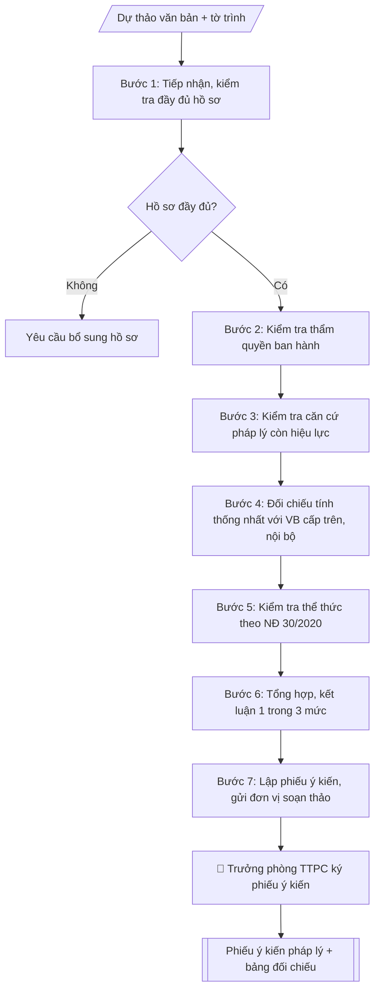

# Thẩm định pháp lý dự thảo văn bản nội bộ

## Định dạng và file đầu ra

Định dạng đầu ra có thể chọn theo sản phẩm/yêu cầu: .docx, .pdf. Đọc mục “Định dạng bổ sung” trong quy cách đầu ra trước khi chọn.

**Phải tạo file thực tế để tải xuống, không chỉ trả nội dung trong chat.** Định dạng mặc định của skill: **.docx**. Nếu có bảng số liệu nghiệp vụ yêu cầu file bảng tính riêng, tạo thêm Excel theo yêu cầu; không tự tạo file kiểm tra. Không chờ người dùng yêu cầu xuất file lần nữa. Ưu tiên định dạng người dùng chỉ định; đọc quy tắc xuất file tại references/quy-cach-dau-ra.md.

## Quy cách đầu ra và thông tin thiếu
Đọc [quy cách và cấu trúc sản phẩm](references/quy-cach-dau-ra.md) trước khi soạn/xuất. File giao chỉ gồm sản phẩm nghiệp vụ được yêu cầu; kiểm tra nội bộ không xuất kèm. Thiếu thông tin thì giữ nguyên trường/mục và chỗ điền theo mẫu gốc (dòng dấu chấm, dấu gạch hoặc ô trống); không tự điền dữ liệu mẫu, số 0, mã chờ xác minh hay dòng chờ ký. Mẫu chuyên ngành còn áp dụng được ưu tiên về cấu trúc, mã biểu và người ký. Bản đầy đủ: [quy tắc chung](references/quy-tac-chung.md).

## Kiểm soát áp dụng và phê duyệt
Trước khi chạy, xác định `ngay_ap_dung`, `loai_hinh_truong`, `quy_che_noi_bo`, `nguon_du_lieu`, `nguoi_kiem_duyet`; chỉ hỏi thông tin liên quan nghiệp vụ, không dùng giá trị giả định thay dữ liệu bắt buộc. Đối chiếu căn cứ pháp lý với văn bản gốc, hiệu lực, điều khoản áp dụng và chuyển tiếp. Bản đầy đủ: [quy tắc chung](references/quy-tac-chung.md).

## Giới hạn và human gate
AI hỗ trợ chuẩn bị và đối chiếu; cán bộ phụ trách kiểm tra dữ liệu/căn cứ, người có thẩm quyền duyệt và ký. Không đánh dấu đã ký, đã duyệt, đã công bố khi chưa có chứng cứ. Dữ liệu sinh viên, sức khỏe, nhân sự, tài chính chỉ dùng theo mục đích và phân quyền, che thông tin định danh khi dùng ví dụ (Luật 91/2025/QH15, hiệu lực 01/01/2026); không tải dữ liệu lên dịch vụ ngoài khi chưa có quyền. Bản đầy đủ: [quy tắc chung](references/quy-tac-chung.md).

## Khi nào dùng
Khi một đơn vị trong trường soạn thảo văn bản nội bộ (quy định, quy chế, hướng dẫn,
quyết định ban hành quy định...) và cần Phòng Thanh tra & Pháp chế rà soát, cho ý kiến
pháp lý trước khi trình Hiệu trưởng ký ban hành.

## Đầu vào (Input)

| Trường | Mô tả | Bắt buộc |
|---|---|---|
| `ten_du_thao` | Tên dự thảo văn bản cần thẩm định | Có |
| `don_vi_soan_thao` | Đơn vị chủ trì soạn thảo | Có |
| `noi_dung_du_thao` | Toàn văn hoặc tóm tắt các điều khoản chính của dự thảo | Có |
| `can_cu_du_thao_trich` | Các căn cứ pháp lý mà dự thảo viện dẫn | Có |
| `van_ban_cap_tren` | Văn bản của cấp trên và văn bản nội bộ hiện hành cần đối chiếu | Không |
| `nguoi_tham_dinh` | Cán bộ/đơn vị thực hiện thẩm định (Phòng Thanh tra & Pháp chế) | Có |

## Quy trình

**Bước 1. Tiếp nhận và kiểm tra đầy đủ hồ sơ**
- Làm gì: tiếp nhận dự thảo văn bản kèm tờ trình của đơn vị soạn thảo; kiểm tra hồ sơ có đủ các thành phần: dự thảo, tờ trình, tài liệu tham khảo kèm theo; nếu thiếu thì yêu cầu bổ sung, chưa tiến hành thẩm định.
- Dùng input: `ten_du_thao`, `don_vi_soan_thao`, `noi_dung_du_thao`, `nguoi_tham_dinh`.
- Vai trò: Chuyên viên Phòng Thanh tra – Pháp chế · AI hỗ trợ: soạn dự thảo, đối chiếu tự động, cảnh báo sai lệch · ⏱ ~1–2 giờ (ước tính)
- Lưu ý nghiệp vụ: không thẩm định dự thảo thiếu tờ trình hoặc thiếu căn cứ viện dẫn; ghi nhận ngày tiếp nhận để tính thời hạn thẩm định.
- → Kết quả bước: Phiếu tiếp nhận hồ sơ (đủ / thiếu + nội dung cần bổ sung).

**Bước 2. Kiểm tra thẩm quyền ban hành**
- Làm gì: xác định nội dung dự thảo thuộc thẩm quyền quyết định của cấp nào (Hiệu trưởng / Hội đồng trường / đơn vị); kiểm tra người ký dự kiến có đúng thẩm quyền không; phát hiện nội dung vượt thẩm quyền.
- Dùng input: `noi_dung_du_thao`, `don_vi_soan_thao`.
- Vai trò: Chuyên viên Phòng Thanh tra – Pháp chế · AI hỗ trợ: soạn dự thảo, đối chiếu tự động, cảnh báo sai lệch · ⏱ ~1–3 giờ (ước tính)
- Lưu ý nghiệp vụ: nội dung thuộc thẩm quyền Hội đồng trường mà để Hiệu trưởng ký là lỗi nghiêm trọng → kết luận "không đồng ý".
- → Kết quả bước: Kết quả kiểm tra thẩm quyền (phù hợp / vượt thẩm quyền + điểm vi phạm).

**Bước 3. Kiểm tra căn cứ pháp lý**
- Làm gì: với từng văn bản được dự thảo viện dẫn, kiểm tra: còn hiệu lực hay không; số, ký hiệu, ngày ban hành, cơ quan ban hành có chính xác không; có thiếu căn cứ quan trọng điều chỉnh trực tiếp nội dung dự thảo không.
- Dùng input: `can_cu_du_thao_trich`, `noi_dung_du_thao`.
- Vai trò: Chuyên viên Phòng Thanh tra – Pháp chế · AI hỗ trợ: soạn dự thảo, đối chiếu tự động, cảnh báo sai lệch · ⏱ ~1–2 giờ (ước tính)
- Lưu ý nghiệp vụ: căn cứ hết hiệu lực hoặc trích dẫn sai số/ký hiệu là lỗi phổ biến nhất; ghi rõ từng lỗi gắn với điều khoản liên quan.
- → Kết quả bước: Bảng kiểm tra căn cứ pháp lý (văn bản – tình trạng hiệu lực – lỗi phát hiện).

**Bước 4. Đối chiếu tính thống nhất**
- Làm gì: đối chiếu từng điều khoản dự thảo với văn bản cấp trên (luật, nghị định, thông tư) và văn bản nội bộ hiện hành của trường; phát hiện nội dung trái cấp trên, mâu thuẫn nội bộ, thuật ngữ không thống nhất.
- Dùng input: `noi_dung_du_thao`, `van_ban_cap_tren` (nếu có; nếu không có thì chỉ đối chiếu với văn bản người dùng cung cấp và ghi rõ phần chưa đối chiếu được, không tự giả định nội dung văn bản nội bộ).
- Vai trò: Chuyên viên Phòng Thanh tra – Pháp chế · AI hỗ trợ: soạn dự thảo, đối chiếu tự động, cảnh báo sai lệch · ⏱ ~1–2 giờ (ước tính)
- Lưu ý nghiệp vụ: mâu thuẫn về thời hạn, mức, trình tự giữa các văn bản nội bộ là bẫy thường gặp; ghi rõ điều khoản dự thảo đối chiếu với điều khoản của văn bản nào.
- → Kết quả bước: Bảng đối chiếu (điều khoản dự thảo – vấn đề phát hiện – văn bản đối chiếu).

**Bước 5. Kiểm tra thể thức theo Nghị định 30/2020/NĐ-CP**
- Làm gì: kiểm tra từng yếu tố thể thức: quốc hiệu – tiêu ngữ; số, ký hiệu; địa danh, ngày tháng; tên văn bản, trích yếu; bố cục điều/khoản (đánh số liên tục); ngôn ngữ hành chính; nơi nhận; thẩm quyền ký.
- Dùng input: `noi_dung_du_thao`.
- Vai trò: Chuyên viên Phòng Thanh tra – Pháp chế · AI hỗ trợ: đối chiếu tự động, cảnh báo sai lệch · ⏱ ~1–2 giờ (ước tính)
- Lưu ý nghiệp vụ: lỗi thể thức phổ biến: thiếu mục nơi nhận, nhảy số điều, ghi sai thẩm quyền ký (KT./TL.).
- → Kết quả bước: Danh sách lỗi thể thức.

**Bước 6. Tổng hợp và kết luận mức thẩm định**
- Làm gì: tổng hợp kết quả các Bước 2–5; phân loại mức kết luận: Đồng ý (đủ điều kiện trình ký) / Đồng ý với điều kiện chỉnh sửa (liệt kê từng điểm cần sửa, bổ sung) / Không đồng ý (trái pháp luật, vượt thẩm quyền, mâu thuẫn nghiêm trọng — nêu rõ lý do).
- Dùng input: (kết quả các Bước 2–5).
- Vai trò: Chuyên viên Phòng Thanh tra – Pháp chế · AI hỗ trợ: tổng hợp, chuẩn hóa dữ liệu, chuẩn bị hồ sơ trình đầy đủ · ⏱ ~1–2 giờ (ước tính)
- Lưu ý nghiệp vụ: một lỗi nghiêm trọng (vượt thẩm quyền, trái luật) là đủ để kết luận "không đồng ý" dù các phần khác đạt.
- → Kết quả bước: Mức kết luận thẩm định + danh sách điểm cần sửa / lý do không đồng ý.

**Bước 7. Lập và gửi phiếu ý kiến pháp lý**
- Làm gì: soạn phiếu ý kiến pháp lý theo cấu trúc chuẩn: I. Đánh giá chung; II. Ý kiến cụ thể (từng điểm); III. Kết luận (đánh dấu 1 trong 3 mức); gửi cho đơn vị soạn thảo để hoàn thiện trước khi trình ký; lưu phiếu vào hồ sơ văn bản.
- Dùng input: `nguoi_tham_dinh`, `ten_du_thao`, `don_vi_soan_thao`.
- Vai trò: Chuyên viên Phòng Thanh tra – Pháp chế · AI hỗ trợ: soạn dự thảo, chuẩn bị hồ sơ trình đầy đủ · ⏱ ~30–60 phút (ước tính)
- Lưu ý nghiệp vụ: đơn vị soạn thảo phải tiếp thu hoặc giải trình bằng văn bản nếu không tiếp thu; theo dõi đến khi dự thảo được hoàn thiện.
- → Kết quả bước: Phiếu ý kiến pháp lý (trình Trưởng phòng ký) + bảng đối chiếu, gửi đơn vị soạn thảo sau khi ký.

## Luồng quy trình (Workflow)


```

## Đầu ra

File nghiệp vụ thực tế theo định dạng mặc định ở đầu skill hoặc định dạng người dùng yêu cầu, kèm liên kết tải trong phản hồi cuối.

Sản phẩm nghiệp vụ hoàn chỉnh theo [quy cách và cấu trúc](references/quy-cach-dau-ra.md), giữ các trường chưa có dữ liệu ở trạng thái trống. Không xuất kèm checklist/phụ lục kiểm tra đầu ra.

## Kiểm tra nội bộ trước khi giao

- [ ] Bố cục khớp mẫu áp dụng và cấu trúc tại references/quy-cach-dau-ra.md.
- [ ] Có đầy đủ sản phẩm: Phiếu ý kiến pháp lý hoàn chỉnh, ghi rõ mức kết luận và từng điểm cần sửa
- [ ] Có đầy đủ sản phẩm: Bảng đối chiếu: nội dung dự thảo – vấn đề pháp lý phát hiện – đề xuất chỉnh sửa
- [ ] Mọi số liệu, tên, ngày tháng trong output khớp với Input đã cung cấp (không thêm bớt, không suy đoán)
- [ ] Không bịa đặt số liệu, minh chứng, trích dẫn hay căn cứ
- [ ] Đúng thể thức, định dạng văn bản theo quy định hiện hành
- [ ] Căn cứ pháp lý nêu đầy đủ, còn hiệu lực tại thời điểm lập
- [ ] Đã qua Human gate: người có thẩm quyền đã kiểm tra/ký duyệt trước khi phát hành
- [ ] Không thẩm định dự thảo thiếu tờ trình hoặc thiếu căn cứ viện dẫn
- [ ] Nội dung thuộc thẩm quyền Hội đồng trường mà để Hiệu trưởng ký là lỗi nghiêm trọng → kết luận "không đồng ý".

> Tiêu chí đạt: tất cả các ô đều được đánh dấu.

## Căn cứ & lưu ý
- Nghị định 30/2020/NĐ-CP về công tác văn thư (thể thức văn bản).
- Luật Giáo dục đại học 2012, sửa đổi bổ sung 2018; Điều lệ trường đại học.
- Quy chế tổ chức và hoạt động của trường; các văn bản nội bộ hiện hành có liên quan.
- Phiếu ý kiến pháp lý là tài liệu bắt buộc trong hồ sơ trình ký văn bản nội bộ quan
trọng; đơn vị soạn thảo phải tiếp thu hoặc giải trình bằng văn bản nếu không tiếp thu.
- Không dùng tên thật của trường/cá nhân khi mô phỏng.

## Quản trị phiên bản
- Phiên bản gói `1.3.2` (cập nhật 2026-10-10); hồ sơ đầy đủ tại [references/version.json](references/version.json).
- Người phê duyệt nghiệp vụ: **chưa chỉ định**. Trạng thái: dự thảo nghiệp vụ; kiểm tra pháp lý trước thực thi. Ngày cập nhật không đồng nghĩa mọi văn bản đã được rà soát toàn văn.
- Giấy phép theo LICENSE của kho (bản quyền CES Global). Lịch sử thay đổi: CHANGELOG.md.
