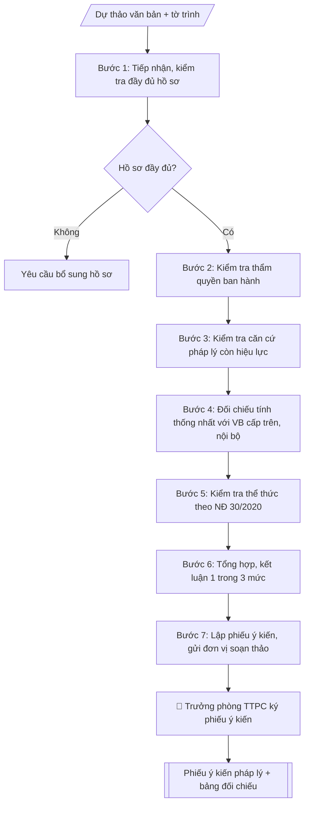

# Thẩm định pháp lý dự thảo văn bản nội bộ

## Kiểm soát áp dụng và phê duyệt

Trước khi chạy quy trình, xác định `ngay_ap_dung`, `loai_hinh_truong`, `quy_che_noi_bo`, `nguon_du_lieu` và `nguoi_kiem_duyet`. Chỉ yêu cầu thông tin có liên quan đến nghiệp vụ; không dùng giá trị giả định thay dữ liệu bắt buộc. Hồ sơ có yếu tố pháp lý phải kèm văn bản gốc, tình trạng hiệu lực, điều khoản áp dụng và chuyển tiếp.

## Giới hạn và human gate

AI hỗ trợ chuẩn bị và đối chiếu. Cán bộ phụ trách kiểm tra dữ liệu/căn cứ, người có thẩm quyền duyệt và ký. Mọi đầu ra mặc định là **DỰ THẢO – CHỜ KIỂM DUYỆT**; không đánh dấu đã ký, đã duyệt hoặc đã công bố nếu chưa có chứng cứ. Dữ liệu sinh viên, sức khỏe, nhân sự và tài chính phải hạn chế theo mục đích, phân quyền và che thông tin định danh khi dùng ví dụ. Không tải dữ liệu lên dịch vụ ngoài khi chưa có quyền. Kiểm tra Luật 91/2025/QH15 về bảo vệ dữ liệu cá nhân (hiệu lực 01/01/2026) và quy định áp dụng trước xử lý/chia sẻ dữ liệu cá nhân.


## Khi nào dùng
Khi một đơn vị trong trường soạn thảo văn bản nội bộ (quy định, quy chế, hướng dẫn,
quyết định ban hành quy định...) và cần Phòng Thanh tra & Pháp chế rà soát, cho ý kiến
pháp lý trước khi trình Hiệu trưởng ký ban hành.

## Đầu vào (Input)

| Trường | Mô tả | Bắt buộc |
|---|---|---|
| `ten_du_thao` | Tên dự thảo văn bản cần thẩm định | Có |
| `don_vi_soan_thao` | Đơn vị chủ trì soạn thảo | Có |
| `noi_dung_du_thao` | Toàn văn hoặc tóm tắt các điều khoản chính của dự thảo | Có |
| `can_cu_du_thao_trich` | Các căn cứ pháp lý mà dự thảo viện dẫn | Có |
| `van_ban_cap_tren` | Văn bản của cấp trên và văn bản nội bộ hiện hành cần đối chiếu | Không |
| `nguoi_tham_dinh` | Cán bộ/đơn vị thực hiện thẩm định (Phòng Thanh tra & Pháp chế) | Có |

## Quy trình

**Bước 1. Tiếp nhận và kiểm tra đầy đủ hồ sơ**
- Làm gì: tiếp nhận dự thảo văn bản kèm tờ trình của đơn vị soạn thảo; kiểm tra hồ sơ có đủ các thành phần: dự thảo, tờ trình, tài liệu tham khảo kèm theo; nếu thiếu thì yêu cầu bổ sung, chưa tiến hành thẩm định.
- Dùng input: `ten_du_thao`, `don_vi_soan_thao`, `noi_dung_du_thao`, `nguoi_tham_dinh`.
- Vai trò: Chuyên viên Phòng Thanh tra – Pháp chế · AI hỗ trợ: soạn dự thảo, đối chiếu tự động, cảnh báo sai lệch · ⏱ ~1–2 giờ (ước tính)
- Lưu ý nghiệp vụ: không thẩm định dự thảo thiếu tờ trình hoặc thiếu căn cứ viện dẫn; ghi nhận ngày tiếp nhận để tính thời hạn thẩm định.
- → Kết quả bước: Phiếu tiếp nhận hồ sơ (đủ / thiếu + nội dung cần bổ sung).

**Bước 2. Kiểm tra thẩm quyền ban hành**
- Làm gì: xác định nội dung dự thảo thuộc thẩm quyền quyết định của cấp nào (Hiệu trưởng / Hội đồng trường / đơn vị); kiểm tra người ký dự kiến có đúng thẩm quyền không; phát hiện nội dung vượt thẩm quyền.
- Dùng input: `noi_dung_du_thao`, `don_vi_soan_thao`.
- Vai trò: Chuyên viên Phòng Thanh tra – Pháp chế · AI hỗ trợ: soạn dự thảo, đối chiếu tự động, cảnh báo sai lệch · ⏱ ~1–3 giờ (ước tính)
- Lưu ý nghiệp vụ: nội dung thuộc thẩm quyền Hội đồng trường mà để Hiệu trưởng ký là lỗi nghiêm trọng → kết luận "không đồng ý".
- → Kết quả bước: Kết quả kiểm tra thẩm quyền (phù hợp / vượt thẩm quyền + điểm vi phạm).

**Bước 3. Kiểm tra căn cứ pháp lý**
- Làm gì: với từng văn bản được dự thảo viện dẫn, kiểm tra: còn hiệu lực hay không; số, ký hiệu, ngày ban hành, cơ quan ban hành có chính xác không; có thiếu căn cứ quan trọng điều chỉnh trực tiếp nội dung dự thảo không.
- Dùng input: `can_cu_du_thao_trich`, `noi_dung_du_thao`.
- Vai trò: Chuyên viên Phòng Thanh tra – Pháp chế · AI hỗ trợ: soạn dự thảo, đối chiếu tự động, cảnh báo sai lệch · ⏱ ~1–2 giờ (ước tính)
- Lưu ý nghiệp vụ: căn cứ hết hiệu lực hoặc trích dẫn sai số/ký hiệu là lỗi phổ biến nhất; ghi rõ từng lỗi gắn với điều khoản liên quan.
- → Kết quả bước: Bảng kiểm tra căn cứ pháp lý (văn bản – tình trạng hiệu lực – lỗi phát hiện).

**Bước 4. Đối chiếu tính thống nhất**
- Làm gì: đối chiếu từng điều khoản dự thảo với văn bản cấp trên (luật, nghị định, thông tư) và văn bản nội bộ hiện hành của trường; phát hiện nội dung trái cấp trên, mâu thuẫn nội bộ, thuật ngữ không thống nhất.
- Dùng input: `noi_dung_du_thao`, `van_ban_cap_tren` (nếu có; nếu không có thì tự tra cứu văn bản nội bộ liên quan).
- Vai trò: Chuyên viên Phòng Thanh tra – Pháp chế · AI hỗ trợ: soạn dự thảo, đối chiếu tự động, cảnh báo sai lệch · ⏱ ~1–2 giờ (ước tính)
- Lưu ý nghiệp vụ: mâu thuẫn về thời hạn, mức, trình tự giữa các văn bản nội bộ là bẫy thường gặp; ghi rõ điều khoản dự thảo đối chiếu với điều khoản của văn bản nào.
- → Kết quả bước: Bảng đối chiếu (điều khoản dự thảo – vấn đề phát hiện – văn bản đối chiếu).

**Bước 5. Kiểm tra thể thức theo Nghị định 30/2020/NĐ-CP**
- Làm gì: kiểm tra từng yếu tố thể thức: quốc hiệu – tiêu ngữ; số, ký hiệu; địa danh, ngày tháng; tên văn bản, trích yếu; bố cục điều/khoản (đánh số liên tục); ngôn ngữ hành chính; nơi nhận; thẩm quyền ký.
- Dùng input: `noi_dung_du_thao`.
- Vai trò: Chuyên viên Phòng Thanh tra – Pháp chế · AI hỗ trợ: đối chiếu tự động, cảnh báo sai lệch · ⏱ ~1–2 giờ (ước tính)
- Lưu ý nghiệp vụ: lỗi thể thức phổ biến: thiếu mục nơi nhận, nhảy số điều, ghi sai thẩm quyền ký (KT./TL.).
- → Kết quả bước: Danh sách lỗi thể thức.

**Bước 6. Tổng hợp và kết luận mức thẩm định**
- Làm gì: tổng hợp kết quả các Bước 2–5; phân loại mức kết luận: Đồng ý (đủ điều kiện trình ký) / Đồng ý với điều kiện chỉnh sửa (liệt kê từng điểm cần sửa, bổ sung) / Không đồng ý (trái pháp luật, vượt thẩm quyền, mâu thuẫn nghiêm trọng — nêu rõ lý do).
- Dùng input: (kết quả các Bước 2–5).
- Vai trò: Chuyên viên Phòng Thanh tra – Pháp chế · AI hỗ trợ: tổng hợp, chuẩn hóa dữ liệu, chuẩn bị hồ sơ trình đầy đủ · ⏱ ~1–2 giờ (ước tính)
- Lưu ý nghiệp vụ: một lỗi nghiêm trọng (vượt thẩm quyền, trái luật) là đủ để kết luận "không đồng ý" dù các phần khác đạt.
- → Kết quả bước: Mức kết luận thẩm định + danh sách điểm cần sửa / lý do không đồng ý.

**Bước 7. Lập và gửi phiếu ý kiến pháp lý**
- Làm gì: soạn phiếu ý kiến pháp lý theo cấu trúc chuẩn: I. Đánh giá chung; II. Ý kiến cụ thể (từng điểm); III. Kết luận (đánh dấu 1 trong 3 mức); gửi cho đơn vị soạn thảo để hoàn thiện trước khi trình ký; lưu phiếu vào hồ sơ văn bản.
- Dùng input: `nguoi_tham_dinh`, `ten_du_thao`, `don_vi_soan_thao`.
- Vai trò: Chuyên viên Phòng Thanh tra – Pháp chế · AI hỗ trợ: soạn dự thảo, chuẩn bị hồ sơ trình đầy đủ · ⏱ ~30–60 phút (ước tính)
- Lưu ý nghiệp vụ: đơn vị soạn thảo phải tiếp thu hoặc giải trình bằng văn bản nếu không tiếp thu; theo dõi đến khi dự thảo được hoàn thiện.
- → Kết quả bước: Phiếu ý kiến pháp lý đã ký + bảng đối chiếu gửi đơn vị soạn thảo.

## Luồng quy trình (Workflow)


```

## Đầu ra (Output)
- Phiếu ý kiến pháp lý hoàn chỉnh (markdown), ghi rõ mức kết luận và từng điểm cần sửa.
- Bảng đối chiếu: nội dung dự thảo – vấn đề pháp lý phát hiện – đề xuất chỉnh sửa.

**Cấu trúc output chuẩn:** Phiếu ý kiến pháp lý gồm các phần bắt buộc theo đúng thứ tự sau:
1. Phần đầu: quốc hiệu – tiêu ngữ, tên đơn vị thẩm định, số/ký hiệu, địa danh – ngày tháng, tên văn bản "PHIẾU Ý KIẾN PHÁP LÝ" + trích yếu (về dự thảo ... do ... soạn thảo); dòng "Kính gửi: ...".
2. I. Đánh giá chung (thẩm quyền ban hành, bố cục, nhận định tổng thể + số điểm cần sửa).
3. II. Ý kiến cụ thể (từng điểm: điều khoản – vấn đề phát hiện – đề xuất chỉnh sửa).
4. III. Kết luận (đánh dấu 1 trong 3 mức: đồng ý / đồng ý với điều kiện chỉnh sửa / không đồng ý).
5. Phần cuối: nơi nhận, chữ ký người thẩm định.

## Checklist nghiệm thu

- [ ] Đủ các phần theo "Cấu trúc output chuẩn": Phần đầu; I. Đánh giá chung (thẩm quyền ban hành, bố…; II. Ý kiến cụ thể (từng điểm; III. Kết luận (đánh dấu 1 trong 3 mức; Phần cuối
- [ ] Có đầy đủ sản phẩm: Phiếu ý kiến pháp lý hoàn chỉnh (markdown), ghi rõ mức kết luận và từng điểm cần sửa
- [ ] Có đầy đủ sản phẩm: Bảng đối chiếu: nội dung dự thảo – vấn đề pháp lý phát hiện – đề xuất chỉnh sửa
- [ ] Mọi số liệu, tên, ngày tháng trong output khớp với Input đã cung cấp (không thêm bớt, không suy đoán)
- [ ] Không bịa đặt số liệu, minh chứng, trích dẫn hay căn cứ
- [ ] Đúng thể thức, định dạng văn bản theo quy định hiện hành
- [ ] Căn cứ pháp lý nêu đầy đủ, còn hiệu lực tại thời điểm lập
- [ ] Đã qua Human gate: người có thẩm quyền đã kiểm tra/ký duyệt trước khi phát hành
- [ ] Không thẩm định dự thảo thiếu tờ trình hoặc thiếu căn cứ viện dẫn
- [ ] Nội dung thuộc thẩm quyền Hội đồng trường mà để Hiệu trưởng ký là lỗi nghiêm trọng → kết luận "không đồng ý".

> Tiêu chí đạt: tất cả các ô đều được đánh dấu.

## Ví dụ mô phỏng (dữ liệu giả lập)

> Tất cả tên trường, cá nhân, số liệu dưới đây đều là **giả lập**, không liên quan tổ chức/cá nhân có thật.

### Input mẫu

| Trường | Giá trị |
|---|---|
| `ten_du_thao` | Dự thảo Quy định quản lý đề tài nghiên cứu khoa học cấp Trường |
| `don_vi_soan_thao` | Phòng Khoa học công nghệ |
| `noi_dung_du_thao` | 10 điều: đối tượng, tiêu chí đề tài, hội đồng xét duyệt, kinh phí, nghiệm thu, xử lý vi phạm |
| `can_cu_du_thao_trich` | Luật Khoa học và Công nghệ 2013; Nghị định 30/2020/NĐ-CP |
| `van_ban_cap_tren` | Quy chế chi tiêu nội bộ của Trường (quy định thời hạn nghiệm thu 45 ngày) |
| `nguoi_tham_dinh` | Phòng Thanh tra & Pháp chế |

### Output mẫu

```
TRƯỜNG ĐẠI HỌC A            CỘNG HÒA XÃ HỘI CHỦ NGHĨA VIỆT NAM
PHÒNG THANH TRA & PHÁP CHẾ               Độc lập – Tự do – Hạnh phúc
      Số: 07/YKPL-ĐHA-TTPC
                                                 Thành phố C, ngày 09 tháng 10 năm 2026

PHIẾU Ý KIẾN PHÁP LÝ
Về dự thảo Quy định quản lý đề tài nghiên cứu khoa học cấp Trường
(do Phòng Khoa học công nghệ soạn thảo)

Kính gửi: Phòng Khoa học công nghệ

Sau khi rà soát dự thảo Quy định quản lý đề tài nghiên cứu khoa học cấp Trường,
Phòng Thanh tra & Pháp chế có ý kiến như sau:

I. ĐÁNH GIÁ CHUNG
Dự thảo thuộc thẩm quyền ban hành của Hiệu trưởng; bố cục cơ bản hợp lý, nội dung
không trái với quy định của pháp luật. Tuy nhiên còn một số điểm cần chỉnh sửa,
bổ sung trước khi trình ký.

II. Ý KIẾN CỤ THỂ

1. Về căn cứ pháp lý: dự thảo chưa viện dẫn Luật Giáo dục đại học năm 2012 (sửa
đổi, bổ sung năm 2018) là căn cứ trực tiếp điều chỉnh hoạt động khoa học công nghệ
trong cơ sở giáo dục đại học. Đề nghị bổ sung.

2. Về tính thống nhất: Điều 9 dự thảo quy định thời hạn nghiệm thu đề tài là
30 ngày, trong khi Quy chế chi tiêu nội bộ của Trường quy định thời hạn nghiệm
thu là 45 ngày. Đề nghị thống nhất thành 45 ngày để tránh mâu thuẫn giữa các văn
bản nội bộ.

3. Về thuật ngữ: Điều 6 dùng thuật ngữ "chủ nhiệm đề tài" trong khi Quy chế hoạt
động khoa học công nghệ hiện hành của Trường dùng thuật ngữ "chủ nhiệm nhiệm vụ".
Đề nghị thống nhất thuật ngữ trong toàn bộ dự thảo.

4. Về thể thức (Nghị định 30/2020/NĐ-CP): dự thảo thiếu mục "Nơi nhận"; đánh số
điều khoản bị nhảy số (thiếu Điều 7). Đề nghị bổ sung, rà soát lại toàn bộ.

III. KẾT LUẬN

[X] Đồng ý với điều kiện chỉnh sửa (04 điểm nêu tại Mục II)
[ ] Đồng ý
[ ] Không đồng ý

Đề nghị Phòng Khoa học công nghệ hoàn thiện dự thảo theo các ý kiến trên trước
khi trình Hiệu trưởng ký ban hành./.

Nơi nhận:                              KT. TRƯỞNG PHÒNG
- Phòng KHCN;                          PHÓ TRƯỞNG PHÒNG
- Lưu: TTPC.                               [CHỜ KÝ]

                                        ThS. Lê Thị C
```

### Bảng đối chiếu vấn đề – đề xuất (output kèm theo)

| Điều khoản | Vấn đề pháp lý | Đề xuất chỉnh sửa |
|---|---|---|
| Phần căn cứ | Thiếu viện dẫn Luật GDĐH 2012 (sửa đổi 2018) | Bổ sung căn cứ |
| Điều 9 | Thời hạn nghiệm thu 30 ngày mâu thuẫn Quy chế chi tiêu nội bộ (45 ngày) | Thống nhất thành 45 ngày |
| Điều 6 | Thuật ngữ "chủ nhiệm đề tài" không thống nhất | Dùng thống nhất "chủ nhiệm nhiệm vụ" |
| Thể thức | Thiếu Nơi nhận; nhảy số điều (thiếu Điều 7) | Bổ sung, rà soát lại |

### Checklist thẩm định (output kèm theo)
- [x] Thẩm quyền ban hành phù hợp
- [x] Căn cứ pháp lý còn hiệu lực, trích dẫn chính xác
- [x] Không trái văn bản cấp trên
- [x] Thống nhất với văn bản nội bộ hiện hành
- [x] Thể thức theo Nghị định 30/2020/NĐ-CP
- [x] Kết luận rõ một trong ba mức

## Căn cứ & lưu ý
- Nghị định 30/2020/NĐ-CP về công tác văn thư (thể thức văn bản).
- Luật Giáo dục đại học 2012, sửa đổi bổ sung 2018; Điều lệ trường đại học.
- Quy chế tổ chức và hoạt động của trường; các văn bản nội bộ hiện hành có liên quan.
- Phiếu ý kiến pháp lý là tài liệu bắt buộc trong hồ sơ trình ký văn bản nội bộ quan
trọng; đơn vị soạn thảo phải tiếp thu hoặc giải trình bằng văn bản nếu không tiếp thu.
- Không dùng tên thật của trường/cá nhân khi mô phỏng.

## Quản trị phiên bản

- Phiên bản gói: `1.1.0`; ngày cập nhật: `2026-10-09`.
- Kho nguồn: https://github.com/phamtruong91/dh-skills
- Người duy trì trên GitHub: `phamtruong91` (Phạm Văn Trường). Người phê duyệt nghiệp vụ: **chưa chỉ định**.
- Commit nguồn trước cập nhật: `78fd1d51b8acd1a724d9b9af6c488460bc7551ad`. Commit chứa phiên bản này xem bằng `git log -1 -- skills/tham-dinh-phap-ly-van-ban`; không tự gán SHA chưa tạo.
- Giấy phép: theo LICENSE của kho; bản quyền CES Global.
- Lịch sử 1.1.0: bổ sung metadata giao diện, kiểm soát áp dụng, quản trị phiên bản.
- Trạng thái: dự thảo nghiệp vụ; kiểm tra pháp lý trước thực thi. Ngày cập nhật không đồng nghĩa mọi văn bản đã được rà soát toàn văn.
