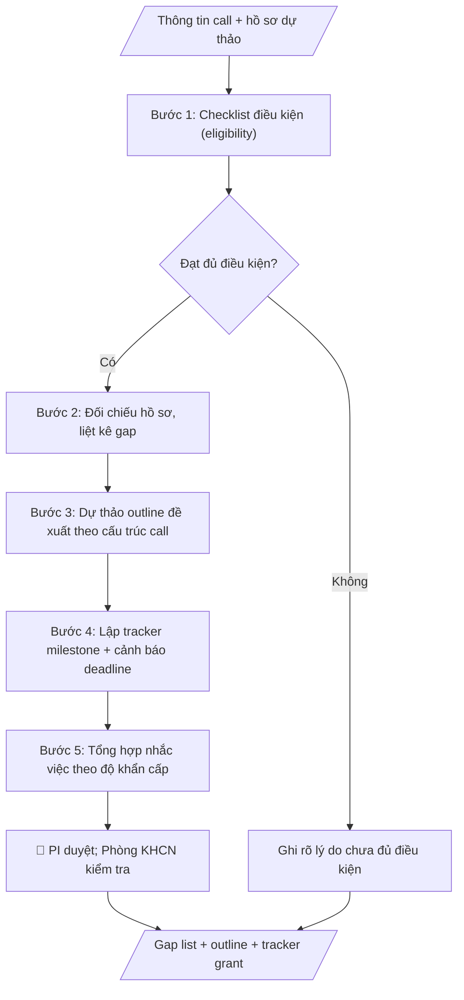

# Theo dõi grant nghiên cứu

## Định dạng và file đầu ra

Định dạng đầu ra có thể chọn theo sản phẩm/yêu cầu: .docx, .pdf. Đọc mục “Định dạng bổ sung” trong quy cách đầu ra trước khi chọn.

**Phải tạo file thực tế để tải xuống, không chỉ trả nội dung trong chat.** Định dạng mặc định của skill: **.docx**. Nếu có bảng số liệu nghiệp vụ yêu cầu file bảng tính riêng, tạo thêm Excel theo yêu cầu; không tự tạo file kiểm tra. Không chờ người dùng yêu cầu xuất file lần nữa. Ưu tiên định dạng người dùng chỉ định; đọc quy tắc xuất file tại references/quy-cach-dau-ra.md.

## Quy cách đầu ra và thông tin thiếu
Khi dựng file Word/Excel, áp dụng mục “Thể thức và bảng biểu khi dựng file” trong quy cách đầu ra (cỡ chữ từng thành phần, bảng nhiều trang, số trang, phụ lục). Đọc [quy cách và cấu trúc sản phẩm](references/quy-cach-dau-ra.md) trước khi soạn/xuất. File giao chỉ gồm sản phẩm nghiệp vụ được yêu cầu; kiểm tra nội bộ không xuất kèm. Thiếu thông tin thì giữ nguyên trường/mục và chỗ điền theo mẫu gốc (dòng dấu chấm, dấu gạch hoặc ô trống); không tự điền dữ liệu mẫu, số 0, mã chờ xác minh hay dòng chờ ký. Mẫu chuyên ngành còn áp dụng được ưu tiên về cấu trúc, mã biểu và người ký. Bản đầy đủ: [quy tắc chung](references/quy-tac-chung.md).

## Kiểm soát áp dụng và phê duyệt
Trước khi chạy, xác định `ngay_ap_dung`, `loai_hinh_truong`, `quy_che_noi_bo`, `nguon_du_lieu`, `nguoi_kiem_duyet`; chỉ hỏi thông tin liên quan nghiệp vụ, không dùng giá trị giả định thay dữ liệu bắt buộc. Đối chiếu căn cứ pháp lý với văn bản gốc, hiệu lực, điều khoản áp dụng và chuyển tiếp. Bản đầy đủ: [quy tắc chung](references/quy-tac-chung.md).

## Giới hạn và human gate
AI hỗ trợ chuẩn bị và đối chiếu; cán bộ phụ trách kiểm tra dữ liệu/căn cứ, người có thẩm quyền duyệt và ký. Không đánh dấu đã ký, đã duyệt, đã công bố khi chưa có chứng cứ. Dữ liệu sinh viên, sức khỏe, nhân sự, tài chính chỉ dùng theo mục đích và phân quyền, che thông tin định danh khi dùng ví dụ (Luật 91/2025/QH15, hiệu lực 01/01/2026); không tải dữ liệu lên dịch vụ ngoài khi chưa có quyền. Bản đầy đủ: [quy tắc chung](references/quy-tac-chung.md).

## Khi nào dùng
Khi chuẩn bị hồ sơ đề xuất xin tài trợ nghiên cứu, hoặc đang thực hiện grant cần theo dõi
milestone/deliverable/kinh phí. Dùng chung cho chủ nhiệm đề tài (PI), nhóm nghiên cứu,
phòng KHCN ở mọi trường.

## Đầu vào (Input)

| Trường | Mô tả | Bắt buộc |
|---|---|---|
| `thong_bao_call` | Thông báo mời nộp: điều kiện tham gia, yêu cầu hồ sơ, deadline, mẫu biểu | Có (giai đoạn đề xuất) |
| `ho_so_du_thao` | Hồ sơ dự thảo hiện có | Không |
| `grant_dang_thuc_hien` | Thông tin grant đang chạy: milestone, deliverable, tiến độ, kinh phí đã dùng | Không (giai đoạn theo dõi) |

## Quy trình

**Bước 1. Lập checklist điều kiện tham gia (eligibility)**
- Làm gì: Đọc `thong_bao_call`, tách từng điều kiện (tư cách chủ nhiệm, lĩnh vực ưu tiên, kinh phí tối đa, thời gian thực hiện, yêu cầu đặc thù); đối chiếu với năng lực và đề xuất hiện có; đánh dấu từng điều kiện: đạt / chưa đạt / cần làm rõ.
- Dùng input: `thong_bao_call`.
- Vai trò: Chủ nhiệm đề tài (PI) · AI hỗ trợ: đọc call, tách và đánh dấu sơ bộ từng điều kiện để PI xác nhận · ⏱ ~30 phút–1 giờ (ước tính)
- Lưu ý nghiệp vụ: điều kiện "cần làm rõ" phải kèm câu hỏi cụ thể để hỏi đơn vị tài trợ, không đoán; kinh phí và thời gian kiểm tra cả số tuyệt đối lẫn cách tính.
- → Kết quả bước: Eligibility checklist (đạt/chưa đạt/cần làm rõ từng điều kiện).

**Bước 2. Đối chiếu hồ sơ dự thảo, liệt kê gap**
- Làm gì: So từng hạng mục trong `ho_so_du_thao` với danh mục yêu cầu của call (thuyết minh, dự toán, CV chủ nhiệm, cam kết đơn vị...); liệt kê gap: thiếu tài liệu gì, mục nào chưa đúng mẫu, mục nào còn sơ sài; gắn mức độ cho từng gap (thiếu bắt buộc / cần bổ sung).
- Dùng input: `thong_bao_call`, `ho_so_du_thao`.
- Vai trò: Chuyên viên Phòng KHCN · AI hỗ trợ: đối chiếu hồ sơ với yêu cầu call, liệt kê gap (thiếu/sai mẫu/sơ sài) theo mức độ · ⏱ ~30–45 phút (ước tính)
- Lưu ý nghiệp vụ: phân biệt "thiếu tài liệu" với "có nhưng sai mẫu" — cách khắc phục khác nhau; mục còn sơ sài phải chỉ rõ cần bổ sung nội dung gì.
- → Kết quả bước: Gap list hồ sơ (thiếu/sai mẫu/sơ sài + mức độ).

**Bước 3. Dự thảo outline đề xuất theo cấu trúc call**
- Làm gì: Dự thảo outline đề xuất bám đúng thứ tự các mục mà call yêu cầu (tính cấp thiết, mục tiêu, nội dung & phương pháp, sản phẩm, tiến độ, dự toán, năng lực nhóm); mỗi mục ghi gợi ý nội dung cần viết — không viết hộ nội dung khoa học, không bịa số liệu.
- Dùng input: `thong_bao_call` (gap list từ bước 2).
- Vai trò: Chủ nhiệm đề tài (PI) · AI hỗ trợ: dự thảo outline theo đúng thứ tự cấu trúc call · ⏱ ~15–20 phút (ước tính)
- Lưu ý nghiệp vụ: thứ tự các mục phải y hệt call yêu cầu — sai thứ tự có thể bị loại về hành chính; outline chỉ là khung gợi ý, nội dung khoa học do PI viết.
- → Kết quả bước: Outline đề xuất theo đúng cấu trúc call.

**Bước 4. Lập tracker milestone và cảnh báo deadline**
- Làm gì: Nếu có `grant_dang_thuc_hien`: dựng bảng milestone → deliverable → deadline → trạng thái → kinh phí đã dùng; đánh dấu các hạng mục trễ hạn/sắp đến hạn. Nếu đang ở giai đoạn đề xuất: ghi deadline nộp hồ sơ và các mốc chuẩn bị tính ngược từ deadline.
- Dùng input: `grant_dang_thuc_hien`, `thong_bao_call`.
- Vai trò: Chủ nhiệm đề tài (PI) · AI hỗ trợ: dựng bảng tracker milestone/deliverable và cảnh báo deadline từ số liệu đã cho · ⏱ ~10–15 phút (ước tính)
- Lưu ý nghiệp vụ: không tự ý điều chỉnh kinh phí/milestone đã được phê duyệt; cảnh báo trễ hạn phải nêu rõ số ngày và hạng mục bị ảnh hưởng.
- → Kết quả bước: Tracker milestone/deliverable + cảnh báo deadline.

**Bước 5. Tổng hợp nhắc việc**
- Làm gì: Gộp checklist, gap list và tracker thành danh sách việc cần làm: deadline sắp tới, hạng mục còn thiếu, người phụ trách đề xuất; sắp xếp theo độ khẩn cấp.
- Dùng input: (kết quả các bước 1–4).
- Vai trò: Chủ nhiệm đề tài (PI) · AI hỗ trợ: tổng hợp danh sách nhắc việc, sắp xếp theo độ khẩn cấp · ⏱ ~10 phút (ước tính)
- Lưu ý nghiệp vụ: mỗi việc phải có deadline cụ thể và đầu mối rõ ràng; nhắc việc chỉ là hỗ trợ — không thay PI ra quyết định nộp hay điều chỉnh hồ sơ.
- → Kết quả bước: Danh sách nhắc việc theo độ khẩn cấp — sản phẩm cuối.
## Luồng quy trình (Workflow)

## Đầu ra

File nghiệp vụ thực tế theo định dạng mặc định ở đầu skill hoặc định dạng người dùng yêu cầu, kèm liên kết tải trong phản hồi cuối.

Sản phẩm nghiệp vụ hoàn chỉnh theo [quy cách và cấu trúc](references/quy-cach-dau-ra.md), giữ các trường chưa có dữ liệu ở trạng thái trống. Không xuất kèm checklist/phụ lục kiểm tra đầu ra.

## Kiểm tra nội bộ trước khi giao

- [ ] Bố cục khớp mẫu áp dụng và cấu trúc tại references/quy-cach-dau-ra.md.
- [ ] Thông tin call (hạn mức, thời gian, deadline) khớp đúng thông báo call trong Input.
- [ ] Eligibility checklist đánh dấu đầy đủ từng điều kiện: đạt / chưa đạt / cần làm rõ (điều kiện "cần làm rõ" kèm câu hỏi cụ thể để hỏi đơn vị tài trợ).
- [ ] Gap list phân biệt rõ thiếu tài liệu / sai mẫu / sơ sài, kèm mức độ bắt buộc.
- [ ] Outline đúng thứ tự các mục call yêu cầu; chỉ là khung gợi ý — không viết hộ nội dung khoa học, không bịa số liệu.
- [ ] Không tự ý điều chỉnh kinh phí/milestone đã phê duyệt trong tracker; cảnh báo trễ hạn nêu rõ số ngày và hạng mục bị ảnh hưởng.
- [ ] Mỗi việc trong danh sách nhắc việc có deadline cụ thể và đầu mối đề xuất, sắp xếp theo độ khẩn cấp.
- [ ] Đã qua Human gate: PI duyệt toàn bộ hồ sơ; Phòng KHCN kiểm tra tính đầy đủ, đúng mẫu.

> Tiêu chí đạt: tất cả các ô được đánh dấu.

## Human gate (người kiểm duyệt)
- **Chủ nhiệm đề tài (PI)** duyệt toàn bộ hồ sơ trước khi nộp.
- **Phòng KHCN** kiểm tra tính đầy đủ, đúng mẫu của hồ sơ.
- Hội đồng (nếu có) quyết định việc nộp/điều chỉnh.

## Giới hạn (guardrails)
- Không viết hoặc sáng tạo dữ liệu nghiên cứu giả (số liệu, kết quả) để "làm đẹp" hồ sơ.
- Không nộp hồ sơ, không ký thay, không cam kết thay đơn vị/chủ nhiệm.
- Không tự ý điều chỉnh kinh phí/milestone đã được phê duyệt trong tracker.

## Căn cứ & lưu ý
- Theo quy định của từng quỹ/tổ chức tài trợ và quy chế quản lý đề tài của trường.
- Không dùng tên thật của trường/cá nhân/tổ chức khi mô phỏng.

## Quản trị phiên bản
- Phiên bản gói `1.3.2` (cập nhật 2026-10-10); hồ sơ đầy đủ tại [references/version.json](references/version.json).
- Người phê duyệt nghiệp vụ: **chưa chỉ định**. Trạng thái: dự thảo nghiệp vụ; kiểm tra pháp lý trước thực thi. Ngày cập nhật không đồng nghĩa mọi văn bản đã được rà soát toàn văn.
- Giấy phép theo LICENSE của kho (bản quyền CES Global). Lịch sử thay đổi: CHANGELOG.md.
