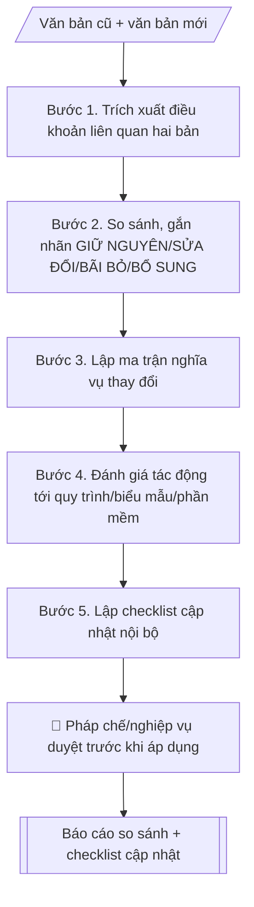

# Theo dõi thay đổi văn bản pháp quy

## Kiểm soát áp dụng và phê duyệt

Trước khi chạy quy trình, xác định `ngay_ap_dung`, `loai_hinh_truong`, `quy_che_noi_bo`, `nguon_du_lieu` và `nguoi_kiem_duyet`. Chỉ yêu cầu thông tin có liên quan đến nghiệp vụ; không dùng giá trị giả định thay dữ liệu bắt buộc. Hồ sơ có yếu tố pháp lý phải kèm văn bản gốc, tình trạng hiệu lực, điều khoản áp dụng và chuyển tiếp.

## Giới hạn và human gate

AI hỗ trợ chuẩn bị và đối chiếu. Cán bộ phụ trách kiểm tra dữ liệu/căn cứ, người có thẩm quyền duyệt và ký. Mọi đầu ra mặc định là **DỰ THẢO – CHỜ KIỂM DUYỆT**; không đánh dấu đã ký, đã duyệt hoặc đã công bố nếu chưa có chứng cứ. Dữ liệu sinh viên, sức khỏe, nhân sự và tài chính phải hạn chế theo mục đích, phân quyền và che thông tin định danh khi dùng ví dụ. Không tải dữ liệu lên dịch vụ ngoài khi chưa có quyền. Kiểm tra Luật 91/2025/QH15 về bảo vệ dữ liệu cá nhân (hiệu lực 01/01/2026) và quy định áp dụng trước xử lý/chia sẻ dữ liệu cá nhân.


## Khi nào dùng
Khi có văn bản pháp quy mới ban hành thay thế/sửa đổi/bổ sung văn bản đang áp dụng
(quy chế đào tạo, quy định tài chính, quy chế văn thư...), cần đánh giá tác động và
cập nhật hệ thống văn bản nội bộ. Dùng chung cho Phòng Thanh tra & Pháp chế và mọi
đơn vị chịu tác động.

## Đầu vào (Input)

| Trường | Mô tả | Bắt buộc |
|---|---|---|
| `van_ban_cu` | Tên, số/ký hiệu, ngày ban hành, nội dung các điều khoản liên quan | Có |
| `van_ban_moi` | Tên, số/ký hiệu, ngày ban hành, ngày hiệu lực, nội dung | Có |
| `linh_vuc` | Đào tạo / tài chính / tổ chức cán bộ / văn thư... | Có |
| `van_ban_noi_bo_lien_quan` | Danh sách văn bản/quy trình nội bộ đang viện dẫn văn bản cũ | Không |

## Quy trình

**Bước 1. Trích xuất điều khoản**
- Làm gì: đọc `van_ban_cu` và `van_ban_moi`, trích các điều khoản liên quan đến `linh_vuc`
  theo từng nội dung (không cần toàn văn nếu văn bản dài); với mỗi điều khoản ghi rõ
  số điều/khoản và trích từ bản nào.
- Dùng input: `van_ban_cu`, `van_ban_moi`, `linh_vuc`
- Vai trò: Cán bộ Phòng Thanh tra & Pháp chế · AI hỗ trợ: trích xuất điều khoản hai bản, ghi rõ số điều/khoản và nguồn trích · ⏱ ~15–30 phút (ước tính)
- Lưu ý nghiệp vụ: luôn dẫn chiếu số/ký hiệu văn bản và ngày hiệu lực của bản mới;
  không dùng văn bản đã hết hiệu lực làm căn cứ so sánh mà không ghi chú rõ.
- → Kết quả bước: "danh sách điều khoản liên quan hai bản" (nội dung + số điều/khoản +
  nguồn trích).

**Bước 2. So sánh và đánh dấu**
- Làm gì: đối chiếu từng nội dung giữa hai bản, gắn nhãn: GIỮ NGUYÊN / SỬA ĐỔI /
  BÃI BỎ / BỔ SUNG MỚI; với nội dung SỬA ĐỔI ghi ngắn gọn điểm khác biệt.
- Dùng input: kết quả bước 1 (danh sách điều khoản)
- Vai trò: Cán bộ Phòng Thanh tra & Pháp chế (xác nhận nhãn và điều khoản mơ hồ) · AI hỗ trợ: gắn nhãn so sánh sơ bộ từng nội dung · ⏱ ~30 phút–1 giờ (ước tính)
- Lưu ý nghiệp vụ: nội dung chỉ đổi cách diễn đạt mà không đổi nghĩa vụ → GIỮ NGUYÊN
  (ghi chú diễn đạt mới), tránh gắn nhầm SỬA ĐỔI; điều khoản mơ hồ ghi "cần ý kiến
  pháp chế", không tự diễn giải theo hướng có lợi/bất lợi cho một bên.
- → Kết quả bước: "bảng so sánh điều khoản cũ/mới có gắn nhãn".

**Bước 3. Lập ma trận nghĩa vụ thay đổi**
- Làm gì: với mỗi nội dung SỬA ĐỔI / BÃI BỎ / BỔ SUNG MỚI ở bước 2, xác định: đơn vị
  hoặc cá nhân nào phải làm gì khác so với trước đây; ghi thời hạn áp dụng theo ngày
  hiệu lực của văn bản mới.
- Dùng input: kết quả bước 2 (bảng so sánh), `van_ban_moi`, `van_ban_noi_bo_lien_quan`
- Vai trò: Cán bộ Phòng Thanh tra & Pháp chế phối hợp đơn vị nghiệp vụ (xác nhận đơn vị thực hiện và thời hạn) · AI hỗ trợ: lập ma trận nghĩa vụ dự thảo · ⏱ ~30 phút–1 giờ (ước tính)
- Lưu ý nghiệp vụ: nghĩa vụ phải cụ thể đến mức đơn vị biết phải làm gì ("sửa quy trình X",
  "bổ sung biểu mẫu Y"); thời hạn áp dụng không được muộn hơn ngày văn bản mới có hiệu lực.
- → Kết quả bước: "ma trận nghĩa vụ thay đổi" (thay đổi → đơn vị → việc phải làm khác
  → thời hạn).

**Bước 4. Đánh giá tác động**
- Làm gì: rà soát các quy trình, biểu mẫu, phần mềm của trường đang viện dẫn văn bản cũ
  để xác định cái nào bị ảnh hưởng bởi các thay đổi ở bước 3; phân loại mức tác động:
  phải sửa ngay / sửa trong kỳ / chỉ theo dõi.
- Dùng input: kết quả bước 3 (ma trận nghĩa vụ), `van_ban_noi_bo_lien_quan`
- Vai trò: Cán bộ Phòng Thanh tra & Pháp chế (xác nhận mức tác động) · AI hỗ trợ: rà soát tra cứu chéo văn bản nội bộ đang viện dẫn văn bản cũ · ⏱ ~30 phút–1 giờ (ước tính)
- Lưu ý nghiệp vụ: kiểm tra cả văn bản nội bộ không nằm trong danh sách đầu vào nhưng
  có viện dẫn số/ký hiệu văn bản cũ (tra cứu chéo); không bỏ sót phần mềm quản lý
  có hard-code quy định cũ.
- → Kết quả bước: "bảng đánh giá tác động" (quy trình / biểu mẫu / phần mềm →
  mức tác động).

**Bước 5. Lập checklist cập nhật**
- Làm gì: tổng hợp từ bước 4 danh sách văn bản nội bộ / biểu mẫu / quy trình cần sửa;
  với mỗi mục ghi đơn vị chủ trì và deadline đề xuất.
- Dùng input: kết quả bước 4 (bảng đánh giá tác động)
- Vai trò: Cán bộ Phòng Thanh tra & Pháp chế · AI hỗ trợ: tổng hợp checklist cập nhật nội bộ từ bảng đánh giá tác động · ⏱ ~10–15 phút (ước tính)
- Lưu ý nghiệp vụ: deadline đề xuất phải trước ngày văn bản mới có hiệu lực; checklist
  là đầu vào để thủ trưởng đơn vị duyệt phân công — phải đầy đủ, không thiếu mục.
- → Kết quả bước: "checklist cập nhật nội bộ" → cùng các sản phẩm trước tạo Output cuối
  (change brief).
## Luồng quy trình (Workflow)


## Đầu ra (Output)
- Change brief: tóm tắt thay đổi chính (1 trang).
- Bảng so sánh điều khoản cũ/mới.
- Ma trận nghĩa vụ thay đổi.
- Checklist cập nhật nội bộ.

**Cấu trúc output chuẩn** (sản phẩm chính: Change brief — báo cáo so sánh thay đổi):
1. Tiêu đề (tên văn bản mới, văn bản được thay thế, ngày hiệu lực).
2. Tóm tắt thay đổi chính (1 trang: bao nhiêu nội dung sửa đổi / bãi bỏ / bổ sung).
3. Bảng so sánh điều khoản cũ/mới (nội dung | bản cũ | bản mới | đánh dấu).
4. Ma trận nghĩa vụ thay đổi (thay đổi | đơn vị phải làm gì khác | thời hạn).
5. Đánh giá tác động (quy trình / biểu mẫu / phần mềm bị ảnh hưởng, mức tác động).
6. Checklist cập nhật nội bộ (việc cần sửa | đơn vị chủ trì | deadline).

## Checklist nghiệm thu

- [ ] Đủ 6 phần theo Cấu trúc output chuẩn: tiêu đề, tóm tắt thay đổi, bảng so sánh, ma trận nghĩa vụ, đánh giá tác động, checklist cập nhật.
- [ ] Mỗi điều khoản dẫn chiếu số/ký hiệu, ngày ban hành và ngày hiệu lực của văn bản mới; không dùng văn bản hết hiệu lực làm căn cứ mà không ghi chú rõ.
- [ ] Bảng so sánh gắn nhãn đúng: nội dung chỉ đổi diễn đạt mà không đổi nghĩa vụ → GIỮ NGUYÊN (ghi chú diễn đạt mới), không gắn nhầm SỬA ĐỔI.
- [ ] Ma trận nghĩa vụ cụ thể đến mức đơn vị biết phải làm gì ("sửa quy trình X", "bổ sung biểu mẫu Y"); thời hạn không muộn hơn ngày văn bản mới có hiệu lực.
- [ ] Đánh giá tác động bao phủ quy trình/biểu mẫu/phần mềm đang viện dẫn văn bản cũ, kể cả văn bản nội bộ ngoài danh sách đầu vào (đã tra cứu chéo) và phần mềm có hard-code quy định cũ.
- [ ] Checklist cập nhật đầy đủ mục, mỗi mục có đơn vị chủ trì và deadline trước ngày văn bản mới có hiệu lực.
- [ ] Không đưa kết luận pháp lý cuối cùng ("đúng/sai", "hợp pháp/không hợp pháp"); điều khoản mơ hồ ghi "cần ý kiến pháp chế" — mọi nhận định ghi rõ "để tham khảo".
- [ ] Đã qua Human gate: pháp chế/nghiệp vụ duyệt change brief và ma trận nghĩa vụ; thủ trưởng đơn vị duyệt checklist thuộc phạm vi đơn vị mình.

> Tiêu chí đạt: tất cả các ô được đánh dấu.

## Ví dụ mô phỏng (dữ liệu giả lập)

> Tất cả tên văn bản, nội dung dưới đây đều là **giả lập**, không trích văn bản thật.

### Input mẫu

| Trường | Giá trị |
|---|---|
| `van_ban_cu` | Quy chế đào tạo trình độ đại học (ban hành 2022, giả lập): Điều 5 — sinh viên được nghỉ tối đa 1 học kỳ liên tiếp |
| `van_ban_moi` | Quy chế đào tạo trình độ đại học (ban hành 2026, giả lập, hiệu lực 01/09/2026): Điều 5 — sinh viên được nghỉ tối đa 2 học kỳ liên tiếp; bổ sung Điều 5a về bảo lưu kết quả học trực tuyến |
| `linh_vuc` | Đào tạo |
| `van_ban_noi_bo_lien_quan` | Quy trình xét bảo lưu của Phòng Đào tạo; mẫu đơn xin nghỉ học |

### Output mẫu

```
CHANGE BRIEF — Quy chế đào tạo 2026 thay thế bản 2022 (giả lập)

1. Tiêu đề
Quy chế đào tạo trình độ đại học (ban hành 2026, hiệu lực 01/09/2026)
thay thế Quy chế đào tạo trình độ đại học (ban hành 2022).

2. Tóm tắt thay đổi chính
01 nội dung SỬA ĐỔI (thời gian nghỉ tối đa: 1 → 2 học kỳ liên tiếp);
01 nội dung BỔ SUNG MỚI (Điều 5a về bảo lưu kết quả học trực tuyến);
không có nội dung bị bãi bỏ.

3. So sánh điều khoản
| Nội dung | Bản 2022 | Bản 2026 | Đánh dấu |
|---|---|---|---|
| Thời gian nghỉ tối đa | 1 học kỳ liên tiếp (Điều 5) | 2 học kỳ liên tiếp (Điều 5) | SỬA ĐỔI |
| Bảo lưu kết quả học trực tuyến | Không có | Điều 5a mới | BỔ SUNG MỚI |

4. Ma trận nghĩa vụ thay đổi
| Thay đổi | Đơn vị phải làm gì khác | Thời hạn |
|---|---|---|
| Nghỉ tối đa 2 học kỳ | Phòng Đào tạo: sửa quy trình xét bảo lưu, mẫu đơn | Trước 01/09/2026 |
| Điều 5a mới | Các khoa: hướng dẫn SV; CNTT: cập nhật phần mềm quản lý | Trước 01/09/2026 |

5. Đánh giá tác động
- Quy trình xét bảo lưu (Phòng Đào tạo): phải sửa ngay.
- Mẫu đơn xin nghỉ học/bảo lưu: phải sửa ngay.
- Phần mềm quản lý đào tạo (Trung tâm CNTT): sửa trong kỳ (giới hạn số học kỳ nghỉ).

6. Checklist cập nhật
[ ] Quy trình xét bảo lưu — Phòng Đào tạo — trước 01/09/2026
[ ] Mẫu đơn xin nghỉ học/bảo lưu — Phòng Đào tạo — trước 01/09/2026
[ ] Phần mềm quản lý đào tạo — Trung tâm CNTT — trước 01/09/2026
```

## Human gate (người kiểm duyệt)
- **Pháp chế / cán bộ phụ trách nghiệp vụ** duyệt change brief và ma trận nghĩa vụ
  trước khi triển khai cập nhật.
- Thủ trưởng đơn vị duyệt checklist cập nhật thuộc phạm vi đơn vị mình.

## Giới hạn (guardrails)
- Không đưa ra kết luận pháp lý cuối cùng ("đúng/sai", "hợp pháp/không hợp pháp") —
  mọi nhận định ghi rõ "để tham khảo, cần ý kiến pháp chế".
- Không tự ý diễn giải điều khoản mơ hồ theo hướng có lợi/bất lợi cho một bên.
- Không thay thế việc tra cứu văn bản gốc — luôn dẫn chiếu số/ký hiệu văn bản.

## Căn cứ & lưu ý
- Văn bản pháp quy của Nhà nước và văn bản nội bộ của trường (phiên bản cụ thể).
- Không dùng tên thật của trường/cá nhân khi mô phỏng; ví dụ trên dùng văn bản giả lập.

## Quản trị phiên bản

- Phiên bản gói: `1.1.0`; ngày cập nhật: `2026-10-09`.
- Kho nguồn: https://github.com/phamtruong91/dh-skills
- Người duy trì trên GitHub: `phamtruong91` (Phạm Văn Trường). Người phê duyệt nghiệp vụ: **chưa chỉ định**.
- Commit nguồn trước cập nhật: `78fd1d51b8acd1a724d9b9af6c488460bc7551ad`. Commit chứa phiên bản này xem bằng `git log -1 -- skills/theo-doi-thay-doi-van-ban-phap-quy`; không tự gán SHA chưa tạo.
- Giấy phép: theo LICENSE của kho; bản quyền CES Global.
- Lịch sử 1.1.0: bổ sung metadata giao diện, kiểm soát áp dụng, quản trị phiên bản.
- Trạng thái: dự thảo nghiệp vụ; kiểm tra pháp lý trước thực thi. Ngày cập nhật không đồng nghĩa mọi văn bản đã được rà soát toàn văn.
