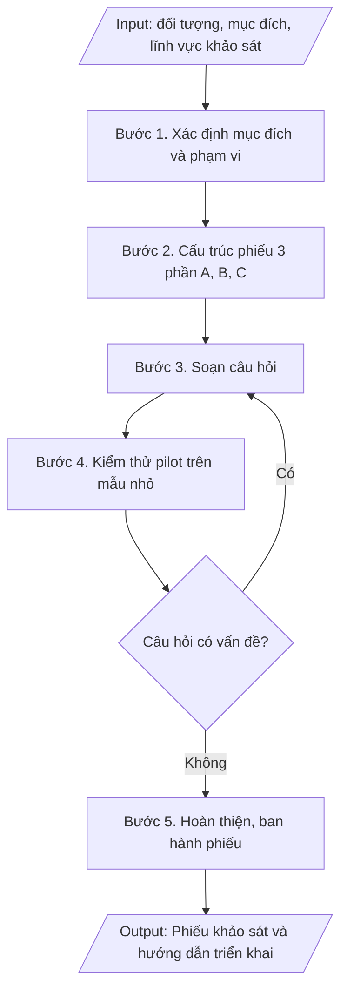

# Thiết kế phiếu khảo sát các bên liên quan

## Định dạng và file đầu ra
Định dạng đầu ra có thể chọn theo sản phẩm/yêu cầu: .docx, .pdf. Đọc mục “Định dạng bổ sung” trong quy cách đầu ra trước khi chọn.

**Phải tạo file thực tế để tải xuống, không chỉ trả nội dung trong chat.** Định dạng mặc định của skill: **.docx**. Nếu có bảng số liệu nghiệp vụ yêu cầu file bảng tính riêng, tạo thêm Excel theo yêu cầu; không tự tạo file kiểm tra. Không chờ người dùng yêu cầu xuất file lần nữa. Ưu tiên định dạng người dùng chỉ định; đọc quy tắc xuất file tại references/quy-cach-dau-ra.md.

## Quy cách đầu ra và thông tin thiếu
Đọc [quy cách và cấu trúc sản phẩm](references/quy-cach-dau-ra.md) trước khi soạn/xuất. File giao chỉ gồm sản phẩm nghiệp vụ được yêu cầu; kiểm tra nội bộ không xuất kèm. Thiếu thông tin thì giữ nguyên trường/mục và chỗ điền theo mẫu gốc (dòng dấu chấm, dấu gạch hoặc ô trống); không tự điền dữ liệu mẫu, số 0, mã chờ xác minh hay dòng chờ ký. Mẫu chuyên ngành còn áp dụng được ưu tiên về cấu trúc, mã biểu và người ký. Bản đầy đủ: [quy tắc chung](references/quy-tac-chung.md).

## Kiểm soát áp dụng và phê duyệt
Trước khi chạy, xác định `ngay_ap_dung`, `loai_hinh_truong`, `quy_che_noi_bo`, `nguon_du_lieu`, `nguoi_kiem_duyet`; chỉ hỏi thông tin liên quan nghiệp vụ, không dùng giá trị giả định thay dữ liệu bắt buộc. Đối chiếu căn cứ pháp lý với văn bản gốc, hiệu lực, điều khoản áp dụng và chuyển tiếp. Bản đầy đủ: [quy tắc chung](references/quy-tac-chung.md).

Nếu có cập nhật pháp lý dưới đây, đọc [căn cứ và điều kiện áp dụng](references/phap-ly.md) trước khi làm. Quy trình dưới đây giữ nghiệp vụ từ bản gốc; mọi viện dẫn văn bản, mẫu biểu, điều khoản phải theo căn cứ đã chọn trong phap-ly.md, không theo văn bản cũ.

## Giới hạn và human gate
AI hỗ trợ chuẩn bị và đối chiếu; cán bộ phụ trách kiểm tra dữ liệu/căn cứ, người có thẩm quyền duyệt và ký. Không đánh dấu đã ký, đã duyệt, đã công bố khi chưa có chứng cứ. Dữ liệu sinh viên, sức khỏe, nhân sự, tài chính chỉ dùng theo mục đích và phân quyền, che thông tin định danh khi dùng ví dụ (Luật 91/2025/QH15, hiệu lực 01/01/2026); không tải dữ liệu lên dịch vụ ngoài khi chưa có quyền. Bản đầy đủ: [quy tắc chung](references/quy-tac-chung.md).

## Khi nào dùng
Khi cần khảo sát ý kiến sinh viên / giảng viên / cựu sinh viên / nhà tuyển dụng về
chương trình đào tạo, chất lượng giảng dạy, dịch vụ hỗ trợ, chuẩn đầu ra...

## Đầu vào (Input)
| Trường | Mô tả | Bắt buộc |
|---|---|---|
| `doi_tuong` | Sinh viên / Giảng viên / Cựu sinh viên / Nhà tuyển dụng | Có |
| `muc_dich` | Mục đích khảo sát (VD: đánh giá CTĐT, khảo sát việc làm, lấy ý kiến chuẩn đầu ra) | Có |
| `linh_vuc` | Các lĩnh vực cần đánh giá (VD: chương trình, giảng viên, CSVC, dịch vụ) | Có |
| `so_cau_hoi` | Số lượng câu hỏi mong muốn | Không (mặc định: 15–20 câu) |
| `don_vi_thuc_hien` | Phòng KT&ĐBCL phối hợp đơn vị liên quan | Không |

## Quy trình
**Ràng buộc pháp lý khi thực hiện** (trích references/phap-ly.md; đối chiếu toàn văn và hiệu lực tại ngày nghiệp vụ):
- Thông tư 20/2026/TT-BGDĐT, hiệu lực 15/05/2026: Yêu cầu ngày hoàn tất tự đánh giá, ngày đăng ký đánh giá ngoài, khung tiêu chuẩn và minh chứng. Điều 51: chỉ cơ sở đã tự đánh giá VÀ đăng ký đánh giá ngoài trước 15/05/2026 được tiếp tục khung 12/2017, hoàn tất chậm nhất 31/12/2026. Ngoài chuyển tiếp dùng 20/2026; không chuyển thang điểm cơ học.
- Thông tư 04/2025/TT-BGDĐT, hiệu lực 04/04/2025: Tách kiểm định chương trình khỏi kiểm định cơ sở. Yêu cầu phiên bản tiêu chuẩn, ngày đăng ký và bộ minh chứng; trích tiêu chí từ phụ lục hiện hành. Không mặc định khung 11 tiêu chuẩn của 04/2016 là khung hiện hành; đối chiếu chuyển tiếp trước khi tiếp tục hồ sơ cũ.
- Trước Bước 1: chọn căn cứ theo đối tượng, loại hình trường và chuyển tiếp; lập bảng văn bản / điều khoản / lý do áp dụng / bằng chứng. Thiếu văn bản gốc hoặc điều khoản thì ghi nhận nội bộ [CẦN XÁC MINH] (không đưa vào file giao), để trống phần tương ứng, chưa kết luận tuân thủ.
- Các con số, thời hạn, số điều, số mức xếp loại, hệ số và mẫu biểu nêu trong các bước dưới đây được giữ từ quy trình gốc (trước cập nhật pháp lý); chỉ dùng khi đã đối chiếu đúng với căn cứ đã chọn, khác thì theo căn cứ. Danh sách điểm cần đối chiếu: docs/DIEM_CAN_DOI_CHIEU_PHAP_LY.md.

**Bước 1. Xác định mục đích và phạm vi**
- Làm gì: Chốt 01 mục đích duy nhất cho phiếu khảo sát từ `muc_dich` (mỗi phiếu chỉ phục vụ 01 mục đích rõ ràng); xác định đối tượng khảo sát (`doi_tuong`), phạm vi (khoa/ngành/khóa hoặc toàn trường), cỡ mẫu tối thiểu và cách chọn mẫu; thống nhất các lĩnh vực cần đánh giá từ `linh_vuc`.
- Dùng input: `doi_tuong`, `muc_dich`, `linh_vuc`, `don_vi_thuc_hien`.
- Vai trò: Phòng Khảo thí & ĐBCL (đơn vị chủ trì) · AI hỗ trợ: tổng hợp đề cương khảo sát (mục đích, đối tượng, phạm vi, cỡ mẫu) để chốt · ⏱ ~2 giờ (ước tính)
- Lưu ý nghiệp vụ: bẫy thường gặp — nhồi nhiều mục đích vào 01 phiếu khiến phiếu dài, tỷ lệ phản hồi thấp; cỡ mẫu quá nhỏ làm kết quả không có ý nghĩa thống kê.
- → Kết quả bước: Đề cương khảo sát (mục đích, đối tượng, phạm vi, cỡ mẫu, các lĩnh vực đánh giá).

**Bước 2. Cấu trúc phiếu gồm 03 phần**
- Làm gì: Dựng khung phiếu theo cấu trúc cố định: **Phần A – Thông tin chung** (giới tính, khóa, ngành/đơn vị công tác, năm tốt nghiệp... — không thu thập thông tin định danh cá nhân nhạy cảm); **Phần B – Câu hỏi đánh giá** (thang đo Likert 5 mức: 1=Rất không đồng ý ... 5=Rất đồng ý, nhóm theo lĩnh vực: chương trình đào tạo, đội ngũ giảng viên, CSVC, dịch vụ hỗ trợ, chuẩn đầu ra/kỹ năng); **Phần C – Câu hỏi mở** (02–03 câu lấy ý kiến đề xuất, góp ý tự do).
- Dùng input: `linh_vuc`, `so_cau_hoi`.
- Vai trò: Chuyên viên Phòng Khảo thí & ĐBCL · AI hỗ trợ: dựng khung phiếu 3 phần (A, B, C) theo các lĩnh vực đánh giá · ⏱ ~30 phút (ước tính)
- Lưu ý nghiệp vụ: tổng số câu hỏi nên trong khoảng 15–20 câu để đảm bảo tỷ lệ hoàn thành; Phần A chỉ hỏi thông tin cần thiết cho phân tích theo nhóm, không hỏi thừa.
- → Kết quả bước: Khung phiếu 3 phần (A, B, C) với số câu hỏi phân bổ theo lĩnh vực.

**Bước 3. Soạn câu hỏi**
- Làm gì: Viết từng câu hỏi cụ thể theo khung ở Bước 2: mỗi câu hỏi chỉ đo 01 nội dung duy nhất; diễn đạt trung lập, tránh câu hỏi gợi ý/thiên lệch; sắp xếp thứ tự từ chung đến riêng, từ dễ đến khó; đánh mã số câu hỏi (A1, A2... B1, B2... C1, C2...).
- Dùng input: `muc_dich`, `linh_vuc`, `so_cau_hoi`.
- Vai trò: Chuyên viên Phòng Khảo thí & ĐBCL · AI hỗ trợ: soạn dự thảo câu hỏi, kiểm tra câu hỏi 02 nội dung/thiên lệch · ⏱ ~2 giờ (ước tính)
- Lưu ý nghiệp vụ: bẫy thường gặp — câu hỏi 02 nội dung trong 01 câu ("giảng viên giảng dạy tốt và nhiệt tình"), từ ngữ mơ hồ ("chất lượng cao"), thang đo không cân đối; mỗi câu hỏi phải gắn được với 01 lĩnh vực đánh giá đã chốt.
- → Kết quả bước: Dự thảo phiếu khảo sát đầy đủ câu hỏi đã đánh mã.

**Bước 4. Kiểm thử (pilot)**
- Làm gì: Thử nghiệm dự thảo phiếu trên 10–20 người thuộc đúng đối tượng khảo sát; ghi nhận thời gian hoàn thành trung bình, các câu hỏi bị hiểu sai/trùng lặp/khó trả lời; điều chỉnh, loại bỏ hoặc viết lại câu hỏi có vấn đề; nếu thay đổi lớn thì pilot lại vòng 2.
- Dùng input: `doi_tuong`.
- Vai trò: Nhóm thực hiện khảo sát (Phòng Khảo thí & ĐBCL) · AI hỗ trợ: tổng hợp phản hồi pilot, thống kê thời gian hoàn thành trung bình · ⏱ ~2–3 ngày làm việc (ước tính)
- Lưu ý nghiệp vụ: người tham gia pilot không đưa vào mẫu khảo sát chính thức; ghi lại mọi thay đổi sau pilot để giải trình khi cần.
- → Kết quả bước: Phiếu khảo sát đã hiệu đính sau kiểm thử + biên bản ghi nhận thay đổi.

**Bước 5. Hoàn thiện**
- Làm gì: Chốt phiếu khảo sát chính thức; soạn hướng dẫn triển khai kèm theo: đối tượng, cỡ mẫu tối thiểu, hình thức (online/giấy), thời gian thực hiện, đơn vị thực hiện, cách đảm bảo tỷ lệ phản hồi (nhắc nhở, động viên); ban hành và gửi đến đơn vị thực hiện.
- Dùng input: `doi_tuong`, `don_vi_thuc_hien`.
- Vai trò: Trưởng phòng Khảo thí & ĐBCL (chốt và ban hành) · AI hỗ trợ: kiểm tra thể thức phiếu và hướng dẫn triển khai trước khi ban hành · ⏱ ~1 ngày làm việc (ước tính)
- Lưu ý nghiệp vụ: tỷ lệ phản hồi thấp làm sai lệch kết quả — hướng dẫn triển khai phải có kế hoạch nhắc nhở cụ thể; phiếu là minh chứng kiểm định cho tiêu chí thu thập ý kiến các bên liên quan.
- → Kết quả bước: Phiếu khảo sát chính thức + hướng dẫn triển khai khảo sát.

## Luồng quy trình (Workflow)

## Đầu ra
- Phiếu khảo sát hoàn chỉnh (03 phần).
- Hướng dẫn triển khai khảo sát (đối tượng, cỡ mẫu, hình thức, thời gian).

File nghiệp vụ thực tế theo định dạng mặc định ở đầu skill hoặc định dạng người dùng yêu cầu, kèm liên kết tải trong phản hồi cuối.

Sản phẩm nghiệp vụ hoàn chỉnh theo [quy cách và cấu trúc](references/quy-cach-dau-ra.md), giữ các trường chưa có dữ liệu ở trạng thái trống. Không xuất kèm checklist/phụ lục kiểm tra đầu ra.

## Kiểm tra nội bộ trước khi giao
Các tiêu chí sau dùng để tự đối chiếu; không sao chép vào file xuất. Mục thiếu dữ liệu được để trống, không đánh dấu đã đạt hoặc đã duyệt.

- [ ] Đủ các phần và đúng bố cục theo cấu trúc tại references/quy-cach-dau-ra.md (không theo cấu trúc của bản gốc).
- [ ] Phiếu phục vụ đúng 01 mục đích đã chốt trong Input; câu hỏi bao phủ các lĩnh vực đánh giá trong Input.
- [ ] Không sao chép nguyên văn phiếu của đơn vị khác mà không điều chỉnh cho phù hợp mục đích.
- [ ] Đúng quy định của trường về thu thập ý kiến các bên liên quan; bảo mật thông tin người trả lời: không thu thập thông tin định danh cá nhân nhạy cảm, cam kết chỉ dùng cho cải tiến chất lượng.
- [ ] Phiếu và hướng dẫn triển khai phù hợp quy định hiện hành của trường, áp dụng đúng đối tượng và chu kỳ khảo sát.
- [ ] Đã qua Human gate: người có thẩm quyền theo quy trình đã duyệt.
- [ ] Mỗi câu hỏi chỉ đo 01 nội dung duy nhất, diễn đạt trung lập, đã đánh mã (A1, B1, C1...); tổng số câu trong khoảng 15–20; thang đo Likert 5 mức cân đối, ghi rõ quy ước.
- [ ] Đã kiểm thử pilot trên 10–20 người đúng đối tượng; người tham gia pilot không đưa vào mẫu chính thức; mọi thay đổi sau pilot đã được ghi lại.
- [ ] Cỡ mẫu tối thiểu đảm bảo ý nghĩa thống kê; hướng dẫn triển khai có kế hoạch nhắc nhở cụ thể để đảm bảo tỷ lệ phản hồi.

## Căn cứ & lưu ý
- Căn cứ hiện hành: xem [căn cứ và điều kiện áp dụng](references/phap-ly.md); phải đối chiếu văn bản gốc, hiệu lực và chuyển tiếp tại ngày nghiệp vụ.
- Không thu thập thông tin định danh không cần thiết; cam kết bảo mật và chỉ dùng cho
  mục đích cải tiến chất lượng.
- Tỷ lệ phản hồi thấp làm sai lệch kết quả — cần kế hoạch nhắc nhở, động viên đối tượng khảo sát.
- Không dùng tên thật của trường/cá nhân khi mô phỏng.

## Tư liệu đối chiếu
Bản gốc trước cập nhật pháp lý (kèm ví dụ giả lập) lưu tại `references/quy-trinh-lich-su.md`, chỉ để đối chiếu hồ sơ lịch sử; không dùng căn cứ, mẫu hay số liệu trong đó làm chỉ dẫn hiện hành.

## Quản trị phiên bản
- Phiên bản gói `1.3.2` (cập nhật 2026-10-10); hồ sơ đầy đủ tại [references/version.json](references/version.json).
- Người phê duyệt nghiệp vụ: **chưa chỉ định**. Trạng thái: dự thảo nghiệp vụ; kiểm tra pháp lý trước thực thi. Ngày cập nhật không đồng nghĩa mọi văn bản đã được rà soát toàn văn.
- Giấy phép theo LICENSE của kho (bản quyền CES Global). Lịch sử thay đổi: CHANGELOG.md.
