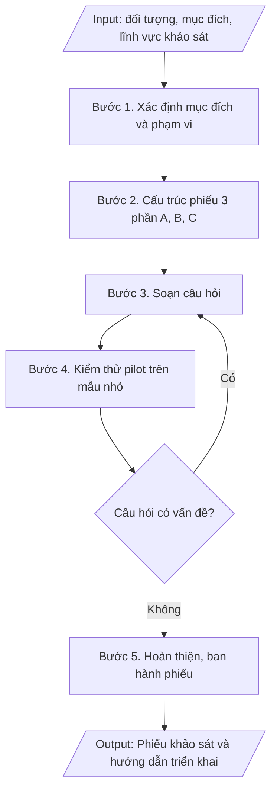

# Tư liệu lịch sử – không phải quy trình hiện hành

Nội dung từ phiên bản nguồn trước 1.1.0, giữ để đối chiếu dữ liệu đầu vào và thay đổi; căn cứ, điều kiện, mẫu và ví dụ có thể đã lỗi thời. Không dùng để thực hiện nghiệp vụ hiện tại.

## Khi nào dùng
Khi cần khảo sát ý kiến sinh viên / giảng viên / cựu sinh viên / nhà tuyển dụng về
chương trình đào tạo, chất lượng giảng dạy, dịch vụ hỗ trợ, chuẩn đầu ra...

## Đầu vào (Input)

| Trường | Mô tả | Bắt buộc |
|---|---|---|
| `doi_tuong` | Sinh viên / Giảng viên / Cựu sinh viên / Nhà tuyển dụng | Có |
| `muc_dich` | Mục đích khảo sát (VD: đánh giá CTĐT, khảo sát việc làm, lấy ý kiến chuẩn đầu ra) | Có |
| `linh_vuc` | Các lĩnh vực cần đánh giá (VD: chương trình, giảng viên, CSVC, dịch vụ) | Có |
| `so_cau_hoi` | Số lượng câu hỏi mong muốn | Không (mặc định: 15–20 câu) |
| `don_vi_thuc_hien` | Phòng KT&ĐBCL phối hợp đơn vị liên quan | Không |

## Quy trình

**Bước 1. Xác định mục đích và phạm vi**
- Làm gì: Chốt 01 mục đích duy nhất cho phiếu khảo sát từ `muc_dich` (mỗi phiếu chỉ phục vụ 01 mục đích rõ ràng); xác định đối tượng khảo sát (`doi_tuong`), phạm vi (khoa/ngành/khóa hoặc toàn trường), cỡ mẫu tối thiểu và cách chọn mẫu; thống nhất các lĩnh vực cần đánh giá từ `linh_vuc`.
- Dùng input: `doi_tuong`, `muc_dich`, `linh_vuc`, `don_vi_thuc_hien`.
- Vai trò: Phòng Khảo thí & ĐBCL (đơn vị chủ trì) · AI hỗ trợ: tổng hợp đề cương khảo sát (mục đích, đối tượng, phạm vi, cỡ mẫu) để chốt · ⏱ ~2 giờ (ước tính)
- Lưu ý nghiệp vụ: bẫy thường gặp — nhồi nhiều mục đích vào 01 phiếu khiến phiếu dài, tỷ lệ phản hồi thấp; cỡ mẫu quá nhỏ làm kết quả không có ý nghĩa thống kê.
- → Kết quả bước: Đề cương khảo sát (mục đích, đối tượng, phạm vi, cỡ mẫu, các lĩnh vực đánh giá).

**Bước 2. Cấu trúc phiếu gồm 03 phần**
- Làm gì: Dựng khung phiếu theo cấu trúc cố định: **Phần A – Thông tin chung** (giới tính, khóa, ngành/đơn vị công tác, năm tốt nghiệp... — không thu thập thông tin định danh cá nhân nhạy cảm); **Phần B – Câu hỏi đánh giá** (thang đo Likert 5 mức: 1=Rất không đồng ý ... 5=Rất đồng ý, nhóm theo lĩnh vực: chương trình đào tạo, đội ngũ giảng viên, CSVC, dịch vụ hỗ trợ, chuẩn đầu ra/kỹ năng); **Phần C – Câu hỏi mở** (02–03 câu lấy ý kiến đề xuất, góp ý tự do).
- Dùng input: `linh_vuc`, `so_cau_hoi`.
- Vai trò: Chuyên viên Phòng Khảo thí & ĐBCL · AI hỗ trợ: dựng khung phiếu 3 phần (A, B, C) theo các lĩnh vực đánh giá · ⏱ ~30 phút (ước tính)
- Lưu ý nghiệp vụ: tổng số câu hỏi nên trong khoảng 15–20 câu để đảm bảo tỷ lệ hoàn thành; Phần A chỉ hỏi thông tin cần thiết cho phân tích theo nhóm, không hỏi thừa.
- → Kết quả bước: Khung phiếu 3 phần (A, B, C) với số câu hỏi phân bổ theo lĩnh vực.

**Bước 3. Soạn câu hỏi**
- Làm gì: Viết từng câu hỏi cụ thể theo khung ở Bước 2: mỗi câu hỏi chỉ đo 01 nội dung duy nhất; diễn đạt trung lập, tránh câu hỏi gợi ý/thiên lệch; sắp xếp thứ tự từ chung đến riêng, từ dễ đến khó; đánh mã số câu hỏi (A1, A2... B1, B2... C1, C2...).
- Dùng input: `muc_dich`, `linh_vuc`, `so_cau_hoi`.
- Vai trò: Chuyên viên Phòng Khảo thí & ĐBCL · AI hỗ trợ: soạn dự thảo câu hỏi, kiểm tra câu hỏi 02 nội dung/thiên lệch · ⏱ ~2 giờ (ước tính)
- Lưu ý nghiệp vụ: bẫy thường gặp — câu hỏi 02 nội dung trong 01 câu ("giảng viên giảng dạy tốt và nhiệt tình"), từ ngữ mơ hồ ("chất lượng cao"), thang đo không cân đối; mỗi câu hỏi phải gắn được với 01 lĩnh vực đánh giá đã chốt.
- → Kết quả bước: Dự thảo phiếu khảo sát đầy đủ câu hỏi đã đánh mã.

**Bước 4. Kiểm thử (pilot)**
- Làm gì: Thử nghiệm dự thảo phiếu trên 10–20 người thuộc đúng đối tượng khảo sát; ghi nhận thời gian hoàn thành trung bình, các câu hỏi bị hiểu sai/trùng lặp/khó trả lời; điều chỉnh, loại bỏ hoặc viết lại câu hỏi có vấn đề; nếu thay đổi lớn thì pilot lại vòng 2.
- Dùng input: `doi_tuong`.
- Vai trò: Nhóm thực hiện khảo sát (Phòng Khảo thí & ĐBCL) · AI hỗ trợ: tổng hợp phản hồi pilot, thống kê thời gian hoàn thành trung bình · ⏱ ~2–3 ngày làm việc (ước tính)
- Lưu ý nghiệp vụ: người tham gia pilot không đưa vào mẫu khảo sát chính thức; ghi lại mọi thay đổi sau pilot để giải trình khi cần.
- → Kết quả bước: Phiếu khảo sát đã hiệu đính sau kiểm thử + biên bản ghi nhận thay đổi.

**Bước 5. Hoàn thiện**
- Làm gì: Chốt phiếu khảo sát chính thức; soạn hướng dẫn triển khai kèm theo: đối tượng, cỡ mẫu tối thiểu, hình thức (online/giấy), thời gian thực hiện, đơn vị thực hiện, cách đảm bảo tỷ lệ phản hồi (nhắc nhở, động viên); ban hành và gửi đến đơn vị thực hiện.
- Dùng input: `doi_tuong`, `don_vi_thuc_hien`.
- Vai trò: Trưởng phòng Khảo thí & ĐBCL (chốt và ban hành) · AI hỗ trợ: kiểm tra thể thức phiếu và hướng dẫn triển khai trước khi ban hành · ⏱ ~1 ngày làm việc (ước tính)
- Lưu ý nghiệp vụ: tỷ lệ phản hồi thấp làm sai lệch kết quả — hướng dẫn triển khai phải có kế hoạch nhắc nhở cụ thể; phiếu là minh chứng kiểm định cho tiêu chí thu thập ý kiến các bên liên quan.
- → Kết quả bước: Phiếu khảo sát chính thức + hướng dẫn triển khai khảo sát.

## Luồng quy trình (Workflow)


## Đầu ra (Output)
- Phiếu khảo sát hoàn chỉnh (03 phần).
- Hướng dẫn triển khai khảo sát (đối tượng, cỡ mẫu, hình thức, thời gian).

**Cấu trúc output chuẩn:** bộ sản phẩm gồm 02 phần, các mục bắt buộc theo đúng thứ tự:
A. Phiếu khảo sát:
1. Tiêu đề phiếu (PHIẾU KHẢO SÁT + đối tượng) + đơn vị ban hành;
2. Mục đích khảo sát + cam kết bảo mật, chỉ sử dụng cho cải tiến chất lượng;
3. Phần A – Thông tin chung (câu hỏi A1, A2...: giới tính, ngành, năm tốt nghiệp, tình trạng việc làm...);
4. Phần B – Đánh giá (thang đo Likert 5 mức ghi rõ quy ước; câu hỏi B1, B2... nhóm theo lĩnh vực);
5. Phần C – Ý kiến đóng góp (câu hỏi mở C1, C2...);
6. Lời cảm ơn.
B. Hướng dẫn triển khai (dạng bảng): đối tượng – cỡ mẫu tối thiểu – hình thức – thời gian – đơn vị thực hiện.

## Checklist nghiệm thu

- [ ] Đủ các phần theo "Cấu trúc output chuẩn": (A) Phiếu khảo sát: tiêu đề phiếu + đơn vị ban hành; mục đích khảo sát + cam kết bảo mật; Phần A – Thông tin chung; Phần B – Đánh giá (thang đo Likert 5 mức ghi rõ quy ước; câu hỏi nhóm theo lĩnh vực); Phần C – Ý kiến đóng góp; lời cảm ơn; (B) Hướng dẫn triển khai (đối tượng – cỡ mẫu tối thiểu – hình thức – thời gian – đơn vị thực hiện).
- [ ] Phiếu phục vụ đúng 01 mục đích đã chốt trong Input; câu hỏi bao phủ các lĩnh vực đánh giá trong Input.
- [ ] Không sao chép nguyên văn phiếu của đơn vị khác mà không điều chỉnh cho phù hợp mục đích.
- [ ] Đúng quy định của trường về thu thập ý kiến các bên liên quan; bảo mật thông tin người trả lời: không thu thập thông tin định danh cá nhân nhạy cảm, cam kết chỉ dùng cho cải tiến chất lượng.
- [ ] Phiếu và hướng dẫn triển khai phù hợp quy định hiện hành của trường, áp dụng đúng đối tượng và chu kỳ khảo sát.
- [ ] Đã qua Human gate: người có thẩm quyền theo quy trình đã duyệt.
- [ ] Mỗi câu hỏi chỉ đo 01 nội dung duy nhất, diễn đạt trung lập, đã đánh mã (A1, B1, C1...); tổng số câu trong khoảng 15–20; thang đo Likert 5 mức cân đối, ghi rõ quy ước.
- [ ] Đã kiểm thử pilot trên 10–20 người đúng đối tượng; người tham gia pilot không đưa vào mẫu chính thức; mọi thay đổi sau pilot đã được ghi lại.
- [ ] Cỡ mẫu tối thiểu đảm bảo ý nghĩa thống kê; hướng dẫn triển khai có kế hoạch nhắc nhở cụ thể để đảm bảo tỷ lệ phản hồi.

Tiêu chí đạt = tất cả các ô được đánh dấu.

## Ví dụ mô phỏng (dữ liệu giả lập)

> Tất cả tên trường, cá nhân, số liệu dưới đây đều là **giả lập**, không liên quan tổ chức/cá nhân có thật.

### Input mẫu

| Trường | Giá trị |
|---|---|
| `doi_tuong` | Cựu sinh viên |
| `muc_dich` | Đánh giá mức độ đáp ứng chuẩn đầu ra và tình hình việc làm sau tốt nghiệp |
| `linh_vuc` | Chuẩn đầu ra, kỹ năng nghề nghiệp, việc làm |
| `so_cau_hoi` | 18 câu |

### Output mẫu

```
PHIẾU KHẢO SÁT CỰU SINH VIÊN
Trường Đại học A – Phòng Khảo thí & Đảm bảo chất lượng

Mục đích: đánh giá mức độ đáp ứng chuẩn đầu ra của chương trình đào tạo và
tình hình việc làm của cựu sinh viên sau tốt nghiệp. Thông tin chỉ phục vụ
cải tiến chất lượng đào tạo.

PHẦN A. THÔNG TIN CHUNG (khoanh tròn / điền thông tin)
A1. Giới tính: 1. Nam   2. Nữ
A2. Ngành tốt nghiệp: ........................
A3. Năm tốt nghiệp: 1. 2024   2. 2025   3. 2026
A4. Tình trạng việc làm hiện tại:
    1. Đã có việc làm đúng ngành   2. Đã có việc làm trái ngành
    3. Đang tìm việc   4. Học tiếp sau đại học

PHẦN B. ĐÁNH GIÁ (đánh dấu X vào 1 ô cho mỗi câu; thang đo:
1=Rất không đồng ý, 2=Không đồng ý, 3=Trung lập, 4=Đồng ý, 5=Rất đồng ý)

Nhóm 1. Chuẩn đầu ra chương trình
B1. Kiến thức chuyên ngành được trang bị đáp ứng yêu cầu công việc. [1][2][3][4][5]
B2. Kỹ năng thực hành, vận dụng kiến thức vào thực tế tốt.           [1][2][3][4][5]
B3. Kỹ năng mềm (giao tiếp, làm việc nhóm) được rèn luyện đầy đủ.    [1][2][3][4][5]
B4. Ngoại ngữ, tin học đáp ứng yêu cầu của nhà tuyển dụng.           [1][2][3][4][5]

Nhóm 2. Việc làm và thu nhập
B5. Tôi tìm được việc làm trong vòng 6 tháng sau tốt nghiệp.         [1][2][3][4][5]
B6. Mức thu nhập hiện tại phù hợp với trình độ đào tạo.              [1][2][3][4][5]
B7. Nhà trường hỗ trợ tốt trong kết nối việc làm.                    [1][2][3][4][5]

PHẦN C. Ý KIẾN ĐÓNG GÓP
C1. Theo Anh/Chị, chương trình đào tạo cần bổ sung/thay đổi nội dung gì?
    ...........................................................................
C2. Đề xuất của Anh/Chị để nâng cao khả năng việc làm cho sinh viên:
    ...........................................................................

Xin trân trọng cảm ơn sự hợp tác của Anh/Chị!
```

**Hướng dẫn triển khai (kèm theo)**

| Mục | Nội dung |
|---|---|
| Đối tượng | Cựu SV tốt nghiệp các năm 2024–2026 |
| Cỡ mẫu tối thiểu | 30% số SV tốt nghiệp mỗi ngành |
| Hình thức | Online (Google Form) + điện thoại bổ sung |
| Thời gian | 01/11/2026 – 30/11/2026 |
| Đơn vị thực hiện | P. KT&ĐBCL phối hợp P. CTSV và các khoa |

## Căn cứ & lưu ý
- Thông tư 12/2017/TT-BGDĐT; Thông tư 04/2016/TT-BGDĐT (yêu cầu thu thập ý kiến các bên liên quan).
- Không thu thập thông tin định danh không cần thiết; cam kết bảo mật và chỉ dùng cho
  mục đích cải tiến chất lượng.
- Tỷ lệ phản hồi thấp làm sai lệch kết quả — cần kế hoạch nhắc nhở, động viên đối tượng khảo sát.
- Không dùng tên thật của trường/cá nhân khi mô phỏng.
