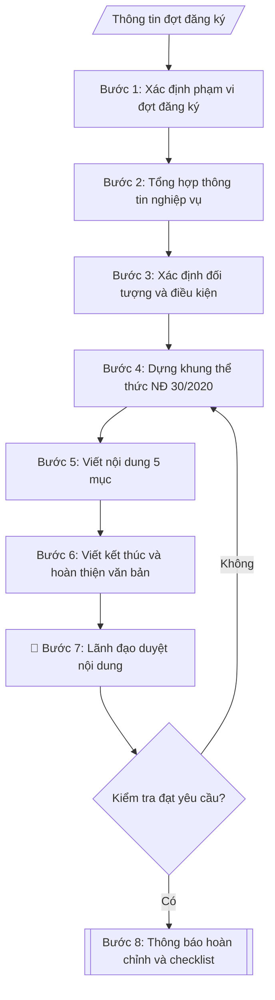

# Skill: Thông báo đăng ký đề tài NCKH các cấp

## Khi nào dùng
Khi Phòng Khoa học công nghệ cần ban hành thông báo triển khai đợt đăng ký đề tài
nghiên cứu khoa học: xác định cấp đề tài, thời hạn nộp hồ sơ, thành phần hồ sơ,
định mức kinh phí và nơi tiếp nhận, gửi đến các khoa/viện/trung tâm trong trường.

## Đầu vào (Input)

| Trường | Mô tả | Bắt buộc |
|---|---|---|
| `dot_dang_ky` | Đợt đăng ký (VD: đợt 1 năm 2027) | Có |
| `cap_de_tai` | Cấp trường / Cấp bộ (tỉnh) / Cấp nhà nước (có thể nhiều cấp trong một thông báo) | Có |
| `doi_tuong` | Đối tượng được đăng ký (cán bộ, giảng viên; tiêu chí chủ nhiệm đề tài) | Có |
| `so_luong_chi_tieu` | Số lượng đề tài dự kiến tuyển chọn theo từng cấp | Có |
| `dinh_muc_kinh_phi` | Mức kinh phí tối đa cho 01 đề tài theo từng cấp | Có |
| `ho_so_yeu_cau` | Thành phần hồ sơ đăng ký (thuyết minh, lý lịch khoa học, dự toán...) | Có |
| `thoi_han_nop` | Hạn cuối nộp hồ sơ (ngày/tháng/năm) | Có |
| `noi_nop` | Nơi tiếp nhận hồ sơ (phòng, địa chỉ, hình thức nộp trực tiếp/online) | Có |
| `dau_moi_lien_he` | Họ tên, điện thoại, email cán bộ phụ trách | Không |
| `can_cu` | Căn cứ ban hành (kế hoạch KHCN năm, quyết định phân bổ kinh phí...) | Không |
| `nguoi_ky` | Hiệu trưởng / Phó Hiệu trưởng / Trưởng phòng KHCN | Có |
| `noi_nhan` | Danh sách nơi nhận | Có |

## Quy trình

**Bước 1. Xác định phạm vi đợt đăng ký**
- Làm gì: đọc `dot_dang_ky` để xác định đợt và năm; lập bảng gồm từng cấp trong `cap_de_tai`, điền `so_luong_chi_tieu` và `dinh_muc_kinh_phi` tương ứng từng cấp; kiểm tra tổng (định mức × chỉ tiêu) có khớp kế hoạch kinh phí KHCN năm đã duyệt không.
- Dùng input: `dot_dang_ky`, `cap_de_tai`, `so_luong_chi_tieu`, `dinh_muc_kinh_phi`.
- Vai trò: Chuyên viên Phòng KHCN · AI hỗ trợ: lập bảng phạm vi và kiểm tra tổng kinh phí · ⏱ ~30–45 phút (ước tính)
- Lưu ý nghiệp vụ: định mức cấp bộ/nhà nước thường do Bộ chủ quản quy định, không được tự đặt vượt trần; nếu một thông báo gộp nhiều cấp phải tách rõ từng cấp trong bảng để tránh nhầm lẫn.
- → Kết quả bước: bảng phạm vi đợt đăng ký (cấp đề tài – chỉ tiêu – định mức kinh phí).

**Bước 2. Tổng hợp thông tin nghiệp vụ**
- Làm gì: trích `thoi_han_nop`, `noi_nop`, `ho_so_yeu_cau`, `dau_moi_lien_he` từ input; đối chiếu `thoi_han_nop` với ngày dự kiến ban hành — thời hạn phải sau ngày ban hành ít nhất 15 ngày làm việc (khuyến nghị 30 ngày); kiểm tra `ho_so_yeu_cau` đã ghi đủ số bản cho từng thành phần hồ sơ chưa.
- Dùng input: `thoi_han_nop`, `noi_nop`, `ho_so_yeu_cau`, `dau_moi_lien_he`.
- Vai trò: Chuyên viên Phòng KHCN · AI hỗ trợ: tổng hợp và kiểm tra logic thời hạn · ⏱ ~30–45 phút (ước tính)
- Lưu ý nghiệp vụ: bẫy thường gặp — ghi thời hạn chung chung ("cuối tháng 11") thay vì giờ + ngày cụ thể; quên ghi hình thức nộp bản mềm; thiếu đầu mối liên hệ khiến đơn vị không biết hỏi ai.
- → Kết quả bước: phiếu tổng hợp thông tin nghiệp vụ (bảng: hạng mục – nội dung – trạng thái đạt/chưa đạt sau kiểm tra thời hạn).

**Bước 3. Xác định đối tượng và điều kiện đăng ký**
- Làm gì: cụ thể hóa `doi_tuong` thành 3 nhóm điều kiện: (a) ai được đăng ký (cán bộ/giảng viên cơ hữu...); (b) điều kiện chủ nhiệm theo từng cấp trong `cap_de_tai` (trình độ, thâm niên, công trình công bố); (c) điều kiện loại trừ (đang chủ nhiệm đề tài quá hạn chưa nghiệm thu); bổ sung lĩnh vực ưu tiên theo `can_cu` (kế hoạch KHCN năm).
- Dùng input: `doi_tuong`, `cap_de_tai`, `can_cu`.
- Vai trò: Trưởng Phòng KHCN · AI hỗ trợ: cụ thể hóa điều kiện theo từng cấp · ⏱ ~45–60 phút (ước tính)
- Lưu ý nghiệp vụ: điều kiện chủ nhiệm cấp bộ/nhà nước phải theo quy định của Bộ chủ quản, không được hạ chuẩn; quy định loại trừ phải rõ ràng để tránh khiếu nại sau này.
- → Kết quả bước: danh sách điều kiện đăng ký phân theo từng cấp đề tài.

**Bước 4. Dựng khung thể thức văn bản theo NĐ 30/2020**
- Làm gì: dựng khung văn bản hành chính đúng thứ tự: Quốc hiệu – Tiêu ngữ → Tên cơ quan ban hành → Số, ký hiệu → Địa danh, ngày tháng năm → Tiêu đề → Kính gửi → Nội dung → Nơi nhận → Chữ ký; điền `nguoi_ky`, `noi_nhan` vào đúng vị trí; kiểm tra thẩm quyền ký phù hợp với cấp đề tài.
- Dùng input: `nguoi_ky`, `noi_nhan`, `dot_dang_ky`.
- Vai trò: Chuyên viên Phòng KHCN · AI hỗ trợ: dựng khung văn bản đúng thể thức Nghị định 30/2020 · ⏱ ~20–30 phút (ước tính)
- Lưu ý nghiệp vụ: tiêu đề phải ghi rõ đợt và năm ("Về việc đăng ký đề tài NCKH đợt 1 năm 2027"); nơi nhận phải có dòng "Lưu: VT, ..." theo quy định văn thư; kiểm tra số, ký hiệu văn bản với Văn thư để không bị trùng.
- → Kết quả bước: khung văn bản đúng thể thức, sẵn sàng điền nội dung.

**Bước 5. Viết nội dung thông báo (5 mục)**
- Làm gì: viết 5 mục từ kết quả các bước 1–3: 1. Đối tượng, điều kiện đăng ký; 2. Cấp đề tài, số lượng chỉ tiêu, định mức kinh phí (dạng bảng); 3. Hồ sơ đăng ký (liệt kê từng thành phần + số bản); 4. Thời hạn và nơi nộp hồ sơ; 5. Thông tin liên hệ, giải đáp thắc mắc.
- Dùng input: kết quả bước 1 (`so_luong_chi_tieu`, `dinh_muc_kinh_phi`), bước 2 (`ho_so_yeu_cau`, `thoi_han_nop`, `noi_nop`, `dau_moi_lien_he`), bước 3 (`doi_tuong`).
- Vai trò: Chuyên viên Phòng KHCN · AI hỗ trợ: soạn dự thảo 5 mục nội dung từ kết quả các bước trước · ⏱ ~45–60 phút (ước tính)
- Lưu ý nghiệp vụ: số liệu kinh phí ở mục 2 phải khớp 100% với bảng bước 1; mục 4 phải ghi rõ hậu quả nộp muộn ("hồ sơ nộp sau thời hạn trên không được xem xét").
- → Kết quả bước: dự thảo nội dung thông báo đầy đủ 5 mục.

**Bước 6. Viết phần kết thúc và hoàn thiện văn bản**
- Làm gì: viết câu kết đề nghị các đơn vị phổ biến thông báo đến cán bộ, giảng viên; thêm ký hiệu kết thúc "./."; ghép phần kết thúc và khối chữ ký vào khung văn bản ở bước 4.
- Dùng input: `nguoi_ky`, `noi_nhan`, kết quả bước 4, bước 5.
- Vai trò: Chuyên viên Phòng KHCN · AI hỗ trợ: viết phần kết thúc và ráp hoàn chỉnh văn bản · ⏱ ~15–20 phút (ước tính)
- Lưu ý nghiệp vụ: ký hiệu "./." đặt sau câu kết thúc nội dung, trước khối "Nơi nhận"; khối chữ ký ghi đúng chức danh người ký theo `nguoi_ky` (VD: "TL. HIỆU TRƯỞNG / TRƯỞNG PHÒNG KHCN").
- → Kết quả bước: dự thảo thông báo hoàn chỉnh (thể thức + nội dung + kết thúc).

**Bước 7. Kiểm tra toàn diện và trình lãnh đạo duyệt**
- Làm gì: chạy checklist kiểm tra: thể thức NĐ 30/2020, chính tả, số liệu kinh phí khớp kế hoạch, logic thời hạn (không rơi vào ngày nghỉ/lễ), thẩm quyền ký, nơi nhận đầy đủ; trình lãnh đạo duyệt nội dung; nếu không đạt thì quay lại bước 4 hoặc 5 để sửa.
- Dùng input: toàn bộ input + kết quả bước 6.
- Vai trò: Trưởng Phòng KHCN · AI hỗ trợ: chạy checklist kiểm tra kỹ thuật · ⏱ ~1–2 giờ (ước tính, kể cả thời gian chờ duyệt)
- Lưu ý nghiệp vụ: lỗi hay gặp nhất là thời hạn nộp rơi vào ngày nghỉ/lễ và số ký hiệu văn bản bị trùng; kiểm tra số văn bản với Văn thư trước khi trình ký.
- → Kết quả bước: thông báo đã được lãnh đạo duyệt + checklist kiểm tra đã đánh dấu.

**Bước 8. Xuất bản**
- Làm gì: xuất văn bản hoàn chỉnh ở định dạng markdown, sẵn sàng trình ký/chuyển sang Word; lưu kèm checklist kiểm tra vào hồ sơ đợt đăng ký.
- Dùng input: kết quả bước 7.
- Vai trò: Chuyên viên Phòng KHCN · AI hỗ trợ: xuất văn bản markdown và lưu checklist vào hồ sơ đợt đăng ký · ⏱ ~10–15 phút (ước tính)
- Lưu ý nghiệp vụ: sau khi ký, lưu 01 bản có số văn bản chính thức để làm căn cứ cho các bước tiếp nhận hồ sơ sau này.
- → Kết quả bước: văn bản thông báo hoàn chỉnh + checklist kiểm tra.

## Luồng quy trình (Workflow)



## Đầu ra (Output)
- Văn bản thông báo hoàn chỉnh.
- Checklist kiểm tra thể thức và nội dung.

**Cấu trúc output chuẩn:** khung cố định của văn bản Thông báo, các phần bắt buộc theo đúng thứ tự xuất hiện:
1. Quốc hiệu – Tiêu ngữ (căn phải, chữ in hoa)
2. Tên cơ quan ban hành (căn trái) + Số, ký hiệu văn bản
3. Địa danh, ngày tháng năm ban hành (căn phải)
4. Tiêu đề "THÔNG BÁO" + dòng trích yếu nội dung (ghi rõ đợt, năm đăng ký)
5. Kính gửi các đơn vị nhận
6. Căn cứ ban hành (nếu có)
7. Nội dung đánh số 5 mục: (1) Đối tượng, điều kiện đăng ký; (2) Cấp đề tài, số lượng chỉ tiêu, định mức kinh phí (dạng bảng); (3) Hồ sơ đăng ký (từng thành phần + số bản); (4) Thời hạn và nơi nộp hồ sơ; (5) Thông tin liên hệ, giải đáp thắc mắc
8. Câu kết thúc đề nghị các đơn vị phổ biến + ký hiệu "./."
9. Khối Nơi nhận (trái) và Chữ ký (phải, đúng chức danh người ký)

## Checklist nghiệm thu

- [ ] Đủ 9 phần theo "Cấu trúc output chuẩn": Quốc hiệu – Tiêu ngữ → tên cơ quan + số ký hiệu → địa danh, ngày tháng → tiêu đề → Kính gửi → căn cứ → nội dung 5 mục → câu kết thúc + "./." → Nơi nhận và Chữ ký
- [ ] Số liệu trong output (chỉ tiêu, định mức kinh phí theo từng cấp) khớp 100% với Input (`dot_dang_ky`, `so_luong_chi_tieu`, `dinh_muc_kinh_phi`)
- [ ] Không bịa đặt căn cứ pháp lý, số ký hiệu văn bản, thông tin đơn vị
- [ ] Đúng thể thức văn bản hành chính theo Nghị định 30/2020/NĐ-CP
- [ ] Căn cứ pháp lý đầy đủ, còn hiệu lực (kế hoạch KHCN năm, quyết định phân bổ kinh phí; quy định của Bộ chủ quản đối với cấp bộ trở lên)
- [ ] Đủ 5 mục nội dung: (1) đối tượng, điều kiện đăng ký; (2) cấp/số lượng/định mức kinh phí (dạng bảng); (3) hồ sơ đăng ký; (4) thời hạn và nơi nộp; (5) thông tin liên hệ
- [ ] Thời hạn nộp sau ngày ban hành ít nhất 15 ngày làm việc, không rơi vào ngày nghỉ/lễ; ghi rõ hậu quả nộp muộn
- [ ] Thẩm quyền ký phù hợp cấp đề tài; nơi nhận đầy đủ kèm dòng "Lưu: VT, ..."; số ký hiệu văn bản đã kiểm tra với Văn thư, không trùng
- [ ] Đã qua Human gate: lãnh đạo có thẩm quyền đã duyệt nội dung trước khi ban hành

Tiêu chí đạt = tất cả các ô được đánh dấu.

## Ví dụ mô phỏng (dữ liệu giả lập)

> Tất cả tên trường, cá nhân, số liệu dưới đây đều là **giả lập**, không liên quan tổ chức/cá nhân có thật.

### Input mẫu

| Trường | Giá trị |
|---|---|
| `dot_dang_ky` | Đợt 1 năm 2027 |
| `cap_de_tai` | Cấp trường; Cấp bộ |
| `doi_tuong` | Cán bộ, giảng viên cơ hữu của Trường; chủ nhiệm đề tài cấp trường phải có trình độ thạc sĩ trở lên |
| `so_luong_chi_tieu` | Cấp trường: 20 đề tài; Cấp bộ: 03 đề tài |
| `dinh_muc_kinh_phi` | Cấp trường: tối đa 50 triệu đồng/đề tài; Cấp bộ: tối đa 300 triệu đồng/đề tài |
| `ho_so_yeu_cau` | 1. Phiếu đăng ký; 2. Thuyết minh đề tài (03 bản); 3. Lý lịch khoa học của chủ nhiệm; 4. Dự toán kinh phí chi tiết |
| `thoi_han_nop` | 17h00 ngày 30/11/2026 |
| `noi_nop` | Phòng Khoa học công nghệ, tầng 3 nhà A, nộp trực tiếp và bản mềm qua email |
| `dau_moi_lien_he` | TS. Đỗ Thị A – ĐT: 09xx.xxx.xxx – Email: khcn@dha.edu.vn |
| `nguoi_ky` | Trưởng phòng KHCN (thừa ủy quyền Hiệu trưởng) |
| `noi_nhan` | Các khoa, viện, trung tâm; Lưu: VT, KHCN |

### Output mẫu

```
TRƯỜNG ĐẠI HỌC A            CỘNG HÒA XÃ HỘI CHỦ NGHĨA VIỆT NAM
PHÒNG KHOA HỌC CÔNG NGHỆ                Độc lập – Tự do – Hạnh phúc
      Số: 45/TB-ĐHA-KHCN
                                                 Thành phố C, ngày 09 tháng 10 năm 2026

THÔNG BÁO
Về việc đăng ký đề tài nghiên cứu khoa học đợt 1 năm 2027

Kính gửi: Các khoa, viện, trung tâm trực thuộc Trường

Căn cứ Kế hoạch hoạt động khoa học công nghệ năm 2027 đã được Hiệu trưởng phê duyệt,
Phòng Khoa học công nghệ thông báo về việc đăng ký đề tài nghiên cứu khoa học
đợt 1 năm 2027 như sau:

1. Đối tượng, điều kiện đăng ký
- Đối tượng: cán bộ, giảng viên cơ hữu của Trường Đại học A.
- Chủ nhiệm đề tài cấp trường phải có trình độ thạc sĩ trở lên; chủ nhiệm đề tài
cấp bộ phải có trình độ tiến sĩ và có ít nhất 01 công trình công bố liên quan.
- Cá nhân đang chủ nhiệm đề tài quá hạn chưa nghiệm thu không được đăng ký đợt này.

2. Cấp đề tài, số lượng và định mức kinh phí
- Đề tài cấp trường: 20 đề tài, kinh phí tối đa 50 triệu đồng/đề tài.
- Đề tài cấp bộ: 03 đề tài, kinh phí tối đa 300 triệu đồng/đề tài.
- Ưu tiên các đề tài thuộc lĩnh vực trí tuệ nhân tạo, chuyển đổi số và kinh tế xanh.

3. Hồ sơ đăng ký (nộp 01 bộ)
- Phiếu đăng ký đề tài theo mẫu;
- Thuyết minh đề tài (03 bản in);
- Lý lịch khoa học của chủ nhiệm đề tài;
- Dự toán kinh phí chi tiết theo biểu mẫu.

4. Thời hạn và nơi nộp hồ sơ
- Thời hạn: trước 17h00 ngày 30/11/2026.
- Nơi nộp: Phòng Khoa học công nghệ, tầng 3 nhà A (bản giấy) và bản mềm
qua email khcn@dha.edu.vn. Hồ sơ nộp sau thời hạn trên không được xem xét.

5. Liên hệ: TS. Đỗ Thị A – ĐT: 09xx.xxx.xxx – Email: khcn@dha.edu.vn.

Đề nghị các đơn vị phổ biến thông báo này đến toàn thể cán bộ, giảng viên./.

Nơi nhận:                                    TL. HIỆU TRƯỞNG
- Như trên;                                  TRƯỞNG PHÒNG KHCN
- Lưu: VT, KHCN.                                  (đã ký)

                                            TS. Đỗ Thị A
```

### Checklist kiểm tra (output kèm theo)
- [x] Quốc hiệu – Tiêu ngữ đúng vị trí, chữ in hoa
- [x] Số, ký hiệu văn bản
- [x] Địa danh, ngày tháng năm
- [x] Tiêu đề thông báo rõ đợt, năm
- [x] Đủ 5 nội dung: đối tượng – cấp/số lượng/kinh phí – hồ sơ – thời hạn/nơi nộp – liên hệ
- [x] Thời hạn nộp sau ngày ban hành ít nhất 15 ngày làm việc
- [x] Số liệu kinh phí khớp kế hoạch được duyệt
- [x] Nơi nhận đầy đủ, thẩm quyền ký phù hợp

## Căn cứ & lưu ý
- Nghị định 30/2020/NĐ-CP về công tác văn thư (thể thức văn bản).
- Quy chế quản lý đề tài NCKH cấp trường của Trường Đại học A (giả lập).
- Quy định quản lý nhiệm vụ KHCN cấp bộ của Bộ chủ quản (đối với đề tài cấp bộ trở lên).
- Thời hạn nộp hồ sơ nên chừa ít nhất 30 ngày kể từ ngày ban hành để đơn vị chuẩn bị.
- Không dùng tên thật của trường/cá nhân khi mô phỏng.
