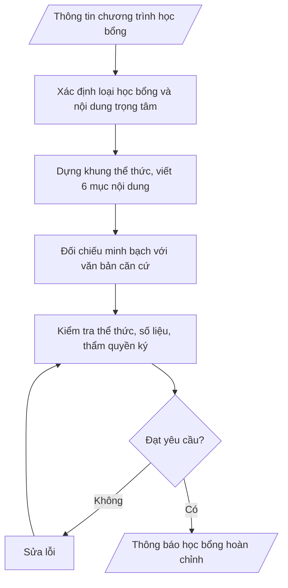

# Soạn thông báo học bổng

## Định dạng và file đầu ra

Định dạng đầu ra có thể chọn theo sản phẩm/yêu cầu: .docx, .pdf. Đọc mục “Định dạng bổ sung” trong quy cách đầu ra trước khi chọn.

**Phải tạo file thực tế để tải xuống, không chỉ trả nội dung trong chat.** Định dạng mặc định của skill: **.docx**. Nếu có bảng số liệu nghiệp vụ yêu cầu file bảng tính riêng, tạo thêm Excel theo yêu cầu; không tự tạo file kiểm tra. Không chờ người dùng yêu cầu xuất file lần nữa. Ưu tiên định dạng người dùng chỉ định; đọc quy tắc xuất file tại references/quy-cach-dau-ra.md.

## Quy cách đầu ra và thông tin thiếu

Đọc [quy cách và cấu trúc sản phẩm](references/quy-cach-dau-ra.md) trước khi soạn/xuất. File giao chỉ gồm văn bản hoặc sản phẩm nghiệp vụ được yêu cầu; kiểm tra nội bộ không xuất kèm. Thiếu thông tin giữ nguyên trường/mục và chỗ điền theo mẫu gốc (dòng dấu chấm, dấu gạch hoặc ô trống); không tự điền dữ liệu mẫu, số 0, mã chờ xác minh hoặc dòng chờ ký. Mẫu chuyên ngành còn áp dụng được ưu tiên về cấu trúc, mã biểu và người ký. Các trường “bắt buộc” là điều kiện hoàn thiện hồ sơ, không ngăn việc soạn bản có chỗ chừa để điền. Mọi chỉ dẫn “để trống” trong skill được hiểu là không điền dữ liệu và giữ cách chừa chỗ của mẫu gốc, không phải xóa dấu chấm của mẫu.

## Kiểm soát áp dụng và phê duyệt

Trước khi chạy quy trình, xác định `ngay_ap_dung`, `loai_hinh_truong`, `quy_che_noi_bo`, `nguon_du_lieu` và `nguoi_kiem_duyet`. Chỉ yêu cầu thông tin có liên quan đến nghiệp vụ; không dùng giá trị giả định thay dữ liệu bắt buộc. Đối chiếu nội bộ hồ sơ có yếu tố pháp lý với văn bản gốc, hiệu lực, điều khoản áp dụng và chuyển tiếp; không tự đính kèm bảng kiểm tra vào file giao.

## Giới hạn và human gate

AI hỗ trợ chuẩn bị và đối chiếu. Cán bộ phụ trách kiểm tra dữ liệu/căn cứ, người có thẩm quyền duyệt và ký. Văn bản soạn chưa được coi là đã ban hành; không tự chèn nhãn trạng thái kiểm duyệt vào file giao; không đánh dấu đã ký, đã duyệt hoặc đã công bố nếu chưa có chứng cứ. Dữ liệu sinh viên, sức khỏe, nhân sự và tài chính phải hạn chế theo mục đích, phân quyền và che thông tin định danh khi dùng ví dụ. Không tải dữ liệu lên dịch vụ ngoài khi chưa có quyền. Kiểm tra Luật 91/2025/QH15 về bảo vệ dữ liệu cá nhân (hiệu lực 01/01/2026) và quy định áp dụng trước xử lý/chia sẻ dữ liệu cá nhân.

## Khi nào dùng
Khi cần ban hành thông báo công khai về một chương trình học bổng: học bổng khuyến khích học tập
của trường, học bổng tài trợ của doanh nghiệp/tổ chức/cá nhân, học bổng chính sách xã hội theo quy
định của Nhà nước, để sinh viên biết, đăng ký và nộp hồ sơ đúng hạn.

## Đầu vào (Input)

| Trường | Mô tả | Bắt buộc |
|---|---|---|
| `ten_hoc_bong` | Tên đầy đủ của chương trình học bổng | Có |
| `loai_hoc_bong` | Khuyến khích học tập / Tài trợ doanh nghiệp–tổ chức / Chính sách xã hội | Có |
| `doi_tuong` | Đối tượng được xét (khóa, hệ đào tạo, khoa, điều kiện chung) | Có |
| `dieu_kien` | Các điều kiện cụ thể để được xét (điểm học tập, điểm rèn luyện, hoàn cảnh...) | Có |
| `muc_hoc_bong` | Mức học bổng theo từng loại/hạng + số suất (nếu có) | Có |
| `ho_so` | Thành phần hồ sơ đăng ký xét học bổng | Có |
| `thoi_han` | Thời hạn nộp hồ sơ (ngày bắt đầu – ngày kết thúc) | Có |
| `noi_nop` | Nơi nộp hồ sơ (phòng, địa chỉ, hình thức trực tiếp/trực tuyến) | Có |
| `can_cu` | Căn cứ ban hành (quyết định phê duyệt, văn bản tài trợ, quy chế...) | Có |
| `lien_he` | Đầu mối liên hệ giải đáp (họ tên, điện thoại, email) | Không |
| `nguoi_ky` | Trưởng phòng Công tác sinh viên (thừa ủy quyền) / Phó Hiệu trưởng | Có |

## Quy trình

**Bước 1. Xác định loại học bổng và nội dung trọng tâm**
- Làm gì: căn cứ `loai_hoc_bong` để chốt hướng soạn: Khuyến khích học tập thì nhấn mạnh tiêu chí điểm học tập, điểm rèn luyện, số suất theo khoa/khóa; Tài trợ doanh nghiệp–tổ chức thì nêu tên đơn vị tài trợ, tổng giá trị, điều kiện riêng của nhà tài trợ; Chính sách xã hội thì viện dẫn văn bản quy phạm của Nhà nước và đối tượng chính sách được hưởng.
- Dùng input: `loai_hoc_bong`, `ten_hoc_bong`, `can_cu`.
- Vai trò: Chuyên viên Phòng Công tác sinh viên · AI hỗ trợ: phân tích loại học bổng và chốt định hướng nội dung · ⏱ ~15–30 phút (ước tính)
- Lưu ý nghiệp vụ: học bổng tài trợ không được tự ý sửa điều kiện của nhà tài trợ; học bổng chính sách phải viện dẫn văn bản quy phạm còn hiệu lực — sai tên văn bản hoặc văn bản hết hiệu lực là lỗi nghiêm trọng.
- → Kết quả bước: định hướng nội dung theo loại học bổng (trọng tâm cần nhấn mạnh).

**Bước 2. Dựng khung thể thức thông báo**
- Làm gì: dựng khung theo Nghị định 30/2020/NĐ-CP: Quốc hiệu – Tiêu ngữ → tên cơ quan, đơn vị ban hành → số, ký hiệu → địa danh, ngày tháng năm → tiêu đề "THÔNG BÁO" → trích yếu ("V/v ...") → khung nơi nhận → khối chữ ký theo `nguoi_ky` (Trưởng phòng CTSV thừa ủy quyền / Phó Hiệu trưởng).
- Dùng input: `can_cu`, `nguoi_ky`, `ten_hoc_bong`.
- Vai trò: Chuyên viên Phòng Công tác sinh viên · AI hỗ trợ: dựng khung thể thức thông báo theo Nghị định 30/2020 · ⏱ ~30 phút (ước tính)
- Lưu ý nghiệp vụ: thẩm quyền ký phải khớp loại học bổng và phân cấp ủy quyền của trường; số, ký hiệu văn bản lấy theo sổ văn thư, không tự đặt.
- → Kết quả bước: khung thể thức thông báo (đầy đủ các yếu tố hình thức, chưa có nội dung chi tiết).

**Bước 3. Viết nội dung theo 6 mục bắt buộc**
- Làm gì: viết đầy đủ 6 mục, mỗi mục một tiêu đề rõ ràng: 1. Đối tượng; 2. Điều kiện xét (liệt kê dạng gạch đầu dòng, sắp xếp theo thứ tự ưu tiên xét); 3. Mức học bổng và số suất (dạng bảng nếu có nhiều hạng); 4. Hồ sơ đăng ký (đánh số thứ tự từng loại giấy tờ; ghi rõ bản chính/bản sao, có công chứng hay không); 5. Thời hạn và nơi nộp hồ sơ; 6. Thông tin liên hệ giải đáp (nếu có).
- Dùng input: `doi_tuong`, `dieu_kien`, `muc_hoc_bong`, `ho_so`, `thoi_han`, `noi_nop`, `lien_he`.
- Vai trò: Chuyên viên Phòng Công tác sinh viên · AI hỗ trợ: soạn dự thảo nội dung 6 mục bắt buộc · ⏱ ~30–45 phút (ước tính)
- Lưu ý nghiệp vụ: điều kiện nào xét trước thì liệt kê trước; hồ sơ phải ghi rõ bản chính hay bản sao (công chứng hay không) — thiếu chi tiết này sinh viên sẽ nộp sai và phải bổ sung; mục 6 được bỏ qua chỉ khi `lien_he` không cung cấp.
- → Kết quả bước: dự thảo nội dung 6 mục của thông báo.

**Bước 4. Đối chiếu minh bạch với văn bản căn cứ**
- Làm gì: đối chiếu từng điều kiện, mức học bổng, số suất, thời hạn trong dự thảo với `can_cu` (quyết định phê duyệt, văn bản tài trợ, quy chế); đảm bảo không thêm điều kiện ngoài căn cứ; thời hạn nộp hồ sơ ghi cả ngày bắt đầu và ngày kết thúc kèm giờ hành chính.
- Dùng input: `can_cu`, `dieu_kien`, `muc_hoc_bong`, `thoi_han`.
- Vai trò: Chuyên viên Phòng Công tác sinh viên · AI hỗ trợ: đối chiếu từng điều khoản với văn bản căn cứ · ⏱ ~30–60 phút (ước tính)
- Lưu ý nghiệp vụ: mọi con số (mức tiền, số suất, ngày tháng) phải lấy đúng từ văn bản căn cứ — đây là điểm kiểm tra đầu tiên khi có khiếu nại; nếu phát hiện căn cứ và yêu cầu thực tế vênh nhau thì báo lại đơn vị ban hành, không tự điều chỉnh trong thông báo.
- → Kết quả bước: bảng đối chiếu căn cứ (nội dung dự thảo – điều khoản căn cứ tương ứng – điểm đã xử lý).

**Bước 5. Kiểm tra thể thức, số liệu và thẩm quyền**
- Làm gì: kiểm tra thể thức theo Nghị định 30/2020/NĐ-CP, chính tả, tính nhất quán số liệu (mức tiền, số suất, ngày tháng giữa các mục), thẩm quyền ký, nơi nhận đầy đủ (các khoa, website trường, bảng tin sinh viên, lưu hồ sơ).
- Dùng input: `nguoi_ky`, `muc_hoc_bong`, `thoi_han`, `noi_nop`.
- Vai trò: Chuyên viên Phòng Công tác sinh viên · AI hỗ trợ: kiểm tra tự động thể thức và số liệu · ⏱ ~30 phút (ước tính)
- Lưu ý nghiệp vụ: nơi nhận thiếu "website trường" thì thông báo không đến được sinh viên — kiểm tra kỹ; ngày ban hành thông báo phải trước ngày bắt đầu nhận hồ sơ.
- → Kết quả bước: checklist kiểm tra đã đánh dấu (đủ 6 mục, thể thức, số liệu, nơi nhận).

**Bước 6. Xuất bản thông báo**
- Làm gì: hoàn thiện văn bản thông báo file theo định dạng đầu ra của skill, sẵn sàng trình ký và đăng tải (website trường, bảng tin).
- Dùng input: kết quả các Bước 1–5.
- Vai trò: Chuyên viên Phòng Công tác sinh viên · AI hỗ trợ: chuẩn bị hồ sơ trình ký, nhắc lịch và theo dõi tiến độ · ⏱ ~0,5–1 ngày làm việc (ước tính)
- Lưu ý nghiệp vụ: sau khi ký, phải đăng tải đồng thời trên website và gửi các khoa — thông báo ký mà không đăng thì coi như chưa ban hành đến sinh viên.
- → Kết quả bước: văn bản thông báo học bổng hoàn chỉnh, sẵn sàng trình ký / đăng tải.

## Luồng quy trình (Workflow)

## Đầu ra

File nghiệp vụ thực tế theo định dạng mặc định ở đầu skill hoặc định dạng người dùng yêu cầu, kèm liên kết tải trong phản hồi cuối.

Sản phẩm nghiệp vụ hoàn chỉnh theo [quy cách và cấu trúc](references/quy-cach-dau-ra.md), giữ các trường chưa có dữ liệu ở trạng thái trống. Không xuất kèm checklist/phụ lục kiểm tra đầu ra.

## Kiểm tra nội bộ trước khi giao

- [ ] Bố cục khớp mẫu áp dụng và cấu trúc tại references/quy-cach-dau-ra.md.
- [ ] Đủ 6 mục nội dung: đối tượng; điều kiện xét; mức học bổng và số suất; hồ sơ đăng ký; thời hạn và nơi nộp hồ sơ; thông tin liên hệ giải đáp.
- [ ] Số liệu/nội dung khớp Input và văn bản căn cứ: mức tiền, số suất, ngày tháng; không thêm điều kiện ngoài căn cứ.
- [ ] Không bịa đặt số hiệu, ngày ban hành của văn bản căn cứ, tên đơn vị tài trợ, điều kiện xét.
- [ ] Thể thức đúng Nghị định 30/2020/NĐ-CP; số, ký hiệu lấy theo sổ văn thư; thẩm quyền ký khớp phân cấp.
- [ ] Hồ sơ ghi rõ bản chính/bản sao, công chứng hay không; nơi nhận có website trường; ngày ban hành trước ngày bắt đầu nhận hồ sơ.
- [ ] Căn cứ pháp lý đầy đủ, còn hiệu lực (học bổng chính sách viện dẫn văn bản quy phạm còn hiệu lực).
- [ ] Đã qua Human gate: Trưởng phòng CTSV (thừa ủy quyền) hoặc Phó Hiệu trưởng ký duyệt.

Tiêu chí đạt = tất cả các ô được đánh dấu.

## Căn cứ & lưu ý
- Nghị định 30/2020/NĐ-CP về công tác văn thư (thể thức thông báo).
- Quyết định 44/2007/QĐ-BGDĐT về học bổng khuyến khích học tập đối với học sinh,
  sinh viên trong các trường chuyên, trường năng khiếu, trường đại học, cao đẳng.
- Đối với học bổng tài trợ: ghi đúng tên đơn vị tài trợ và nội dung theo văn bản
  thỏa thuận tài trợ; không tự ý sửa điều kiện của nhà tài trợ.
- Đối với học bổng chính sách: viện dẫn đúng văn bản quy phạm của Nhà nước còn hiệu lực.
- Không dùng tên thật của trường/cá nhân/đơn vị tài trợ khi mô phỏng.

## Quản trị phiên bản

- Phiên bản gói: `1.3.1`; ngày cập nhật: `2026-10-10`.
- Kho nguồn: https://github.com/phamtruong91/university-skills-framework
- Người duy trì trên GitHub: `phamtruong91` (Phạm Văn Trường). Người phê duyệt nghiệp vụ: **chưa chỉ định**.
- Commit nguồn trước cập nhật: `346719e6b0318ed034b4b016703f79733aa575e7`. Commit chứa phiên bản này xem bằng `git log -1 -- skills/thong-bao-hoc-bong`; không tự gán SHA chưa tạo.
- Giấy phép: theo LICENSE của kho; bản quyền CES Global.
- Lịch sử 1.1.0: bổ sung metadata giao diện, kiểm soát áp dụng, quản trị phiên bản.
- Trạng thái: dự thảo nghiệp vụ; kiểm tra pháp lý trước thực thi. Ngày cập nhật không đồng nghĩa mọi văn bản đã được rà soát toàn văn.
