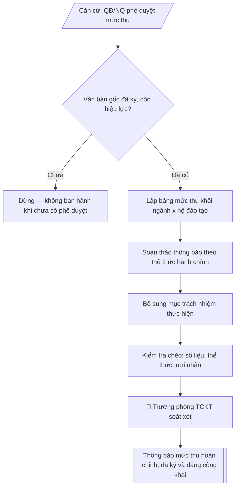

# Skill: Soạn thông báo mức thu học phí / lệ phí

## Khi nào dùng
Khi ban hành hoặc cập nhật mức thu học phí, lệ phí năm học mới: công bố theo khối ngành
(Kỹ thuật, Kinh tế, Xã hội...), theo hệ đào tạo (chính quy, vừa làm vừa học), kèm thời hạn
và hình thức nộp.

## Đầu vào (Input)

| Trường | Mô tả | Bắt buộc |
|---|---|---|
| `nam_hoc` | Năm học áp dụng (vd: 2026–2027) | Có |
| `can_cu` | Căn cứ ban hành (Quyết định số..., Nghị quyết Hội đồng trường...) | Có |
| `khoi_nganh` | Danh sách khối ngành cần công bố (vd: Kỹ thuật, Kinh tế, Xã hội) | Có |
| `he_dao_tao` | Các hệ đào tạo áp dụng (Chính quy, Vừa làm vừa học...) | Có |
| `muc_thu` | Bảng mức thu theo từng khối ngành × hệ đào tạo, đơn vị đồng/tín chỉ và đồng/năm | Có |
| `thoi_han_nop` | Thời hạn nộp học phí (theo đợt: đợt 1, đợt 2...) | Có |
| `hinh_thuc_nop` | Hình thức nộp (chuyển khoản, cổng thanh toán trực tuyến...) + tài khoản thụ hưởng | Có |
| `le_phi` | Các lệ phí kèm theo (lệ phí nhập học, lệ phí thi lại, cấp lại thẻ SV...) | Không |
| `nguoi_ky` | Hiệu trưởng / Phó Hiệu trưởng phụ trách tài chính | Có |
| `ngay_ban_hanh` | Ngày ban hành thông báo | Không (mặc định: ngày hiện tại) |

## Quy trình

**Bước 1. Xác thực văn bản gốc phê duyệt mức thu**
- Làm gì: đối chiếu `can_cu` (số ký hiệu, ngày ban hành, cơ quan ban hành, phạm vi áp dụng
  theo `nam_hoc`) với bản gốc lưu tại Văn thư / Phòng Tài chính – Kế toán; kiểm tra văn bản
  đã được ký, đóng dấu, còn hiệu lực và đúng thẩm quyền (Hội đồng trường đối với đơn vị
  tự chủ tài chính; Hiệu trưởng theo phân cấp).
- Dùng input: `can_cu`, `nam_hoc`.
- Vai trò: Chuyên viên Phòng TCKT · AI hỗ trợ: đối chiếu tự động, cảnh báo sai lệch, lưu trữ hồ sơ · ⏱ ~1–3 giờ (ước tính)
- Lưu ý nghiệp vụ: tuyệt đối không ban hành thông báo khi văn bản gốc chưa ký/đóng dấu
  hoặc mức thu trong văn bản gốc không khớp với số liệu được giao; ghi lại chính xác số
  ký hiệu và ngày văn bản gốc để trích dẫn trong thông báo.
- → Kết quả bước: biên bản xác nhận căn cứ pháp lý (số văn bản, cơ quan ban hành, phạm vi
  áp dụng, tình trạng hiệu lực).

**Bước 2. Lập bảng mức thu theo khối ngành × hệ đào tạo**
- Làm gì: sắp xếp các dòng theo `khoi_nganh` → `he_dao_tao`; mỗi ô điền đủ hai mức:
  đồng/tín chỉ và đồng/năm (đồng/năm = đồng/tín chỉ × khối lượng học tập chuẩn của hệ đào
  tạo trong năm); đối chiếu từng con số với bảng mức thu trong văn bản gốc đã xác thực
  ở Bước 1.
- Dùng input: `muc_thu`, `khoi_nganh`, `he_dao_tao`, `can_cu` (để đối chiếu).
- Vai trò: Chuyên viên Phòng TCKT · AI hỗ trợ: đối chiếu tự động, cảnh báo sai lệch, lập bảng biểu, định dạng · ⏱ ~30–60 phút (ước tính)
- Lưu ý nghiệp vụ: mức thu hệ Vừa làm vừa học không được thấp hơn hệ chính quy cùng khối
  ngành; mức đồng/năm chỉ là bình quân ước tính — số tiền thực nộp của sinh viên tính theo
  số tín chỉ đăng ký thực tế, phải ghi chú rõ trong thông báo để tránh tranh chấp.
- → Kết quả bước: bảng mức thu hoàn chỉnh (khối ngành × hệ đào tạo, hai đơn vị tính,
  đã đối chiếu khớp với văn bản gốc).

**Bước 3. Soạn thảo thông báo theo thể thức văn bản hành chính**
- Làm gì: viết toàn văn thông báo theo đúng trình tự thể thức: Quốc hiệu – Tiêu ngữ →
  tên trường → số, ký hiệu văn bản → địa danh, ngày tháng năm (`ngay_ban_hanh`) → tiêu đề
  "THÔNG BÁO" + trích yếu → Kính gửi → Nội dung gồm: (1) căn cứ ban hành; (2) bảng mức thu
  chi tiết từ Bước 2; (3) thời hạn nộp (`thoi_han_nop`, ghi rõ từng đợt); (4) hình thức nộp
  (`hinh_thuc_nop`: số tài khoản, ngân hàng, chủ tài khoản, nội dung ghi chú chuyển khoản);
  (5) lệ phí kèm theo (`le_phi`, nếu có) → nơi nhận → chữ ký (`nguoi_ky`).
- Dùng input: toàn bộ input trên, trọng tâm `thoi_han_nop`, `hinh_thuc_nop`, `le_phi`,
  `nguoi_ky`, `ngay_ban_hanh`.
- Vai trò: Chuyên viên Phòng TCKT · AI hỗ trợ: soạn dự thảo · ⏱ ~30–60 phút (ước tính)
- Lưu ý nghiệp vụ: nội dung ghi chú chuyển khoản (mã sinh viên, họ tên) là điểm gây sai
  đối soát nhiều nhất — phải hướng dẫn rõ ràng; lệ phí trình bày thành mục riêng, không
  gộp chung vào bảng học phí.
- → Kết quả bước: dự thảo văn bản thông báo đầy đủ thể thức.

**Bước 4. Bổ sung mục trách nhiệm thực hiện**
- Làm gì: ghi rõ trách nhiệm từng đơn vị: Phòng Tài chính – Kế toán là đầu mối giải đáp,
  đối soát và xác nhận học phí đã nộp; các khoa/viện phổ biến thông báo đến sinh viên, học
  viên; Phòng Công tác sinh viên hướng dẫn diện miễn, giảm học phí.
- Dùng input: phân công nghiệp vụ chuẩn của trường (không có trường input riêng).
- Vai trò: Chuyên viên Phòng TCKT · AI hỗ trợ: xử lý sơ bộ, tổng hợp · ⏱ ~1–2 giờ (ước tính)
- Lưu ý nghiệp vụ: ghi trách nhiệm theo tên đơn vị, không ghi tên cá nhân, để văn bản
  không lỗi thời khi thay đổi nhân sự.
- → Kết quả bước: dự thảo thông báo đầy đủ nội dung (đã có mục trách nhiệm thực hiện).

**Bước 5. Kiểm tra chéo và soát xét**
- Làm gì: đối chiếu từng số liệu trong bảng mức thu với văn bản gốc; kiểm tra số ký hiệu,
  ngày tháng, thẩm quyền ký (`nguoi_ky`), nơi nhận đầy đủ (toàn thể sinh viên, các đơn vị,
  cổng thông tin điện tử); soát chính tả, định dạng bảng, đơn vị tính.
- Dùng input: `can_cu` (đối chiếu số liệu), `nguoi_ky`.
- Vai trò: Trưởng phòng Tài chính – Kế toán · AI hỗ trợ: đối chiếu tự động, cảnh báo sai lệch, tính toán, phân tích số liệu · ⏱ ~1–2 giờ (ước tính)
- Lưu ý nghiệp vụ: sai một con số trong bảng mức thu đồng nghĩa phải ban hành thông báo
  đính chính — kiểm tra kỹ dấu phân cách hàng nghìn và đơn vị tính (ghi "đồng", không viết
  tắt trong văn bản chính thức).
- → Kết quả bước: danh sách lỗi cần sửa (nếu có) và bản thông báo đã soát xong.

**Bước 6. Trình ký và xuất bản**
- Làm gì: trình người có thẩm quyền ký (`nguoi_ky`), đóng dấu; đăng tải trên cổng thông tin
  điện tử của trường tại chuyên mục công khai; gửi các khoa/viện để phổ biến; lưu văn thư.
- Dùng input: `nguoi_ky`.
- Vai trò: Chuyên viên Phòng TCKT (chuẩn bị hồ sơ trình); Hiệu trưởng (người ký) ban hành · AI hỗ trợ: chuẩn bị hồ sơ trình đầy đủ, chuẩn bị bản phát hành · ⏱ ~1–3 giờ (ước tính)
- Lưu ý nghiệp vụ: thông báo mức thu học phí thuộc nội dung phải công khai theo Thông tư
  36/2017/TT-BGDĐT — bắt buộc đăng công khai trên cổng thông tin, không chỉ gửi nội bộ.
- → Kết quả bước: văn bản thông báo mức thu hoàn chỉnh, đã ký và đăng công khai.

## Luồng quy trình (Workflow)



## Đầu ra (Output)
- Văn bản thông báo mức thu học phí hoàn chỉnh, đúng thể thức.
- Bảng mức thu chi tiết theo khối ngành × hệ đào tạo.

**Cấu trúc output chuẩn:** khung mẫu cố định của văn bản thông báo, các phần theo đúng
thứ tự xuất hiện:
1. Quốc hiệu – Tiêu ngữ;
2. Tên trường, số và ký hiệu văn bản, địa danh và ngày tháng năm ban hành;
3. Tiêu đề "THÔNG BÁO" + trích yếu nội dung;
4. "Kính gửi" (đối tượng nhận: sinh viên, học viên, các đơn vị);
5. Căn cứ ban hành (Nghị quyết/Quyết định phê duyệt mức thu);
6. Nội dung mức thu: bảng học phí theo từng hệ đào tạo (cột: khối ngành, đồng/tín chỉ,
   đồng/năm) + ghi chú cách tính mức bình quân;
7. Thời hạn nộp học phí theo từng đợt;
8. Hình thức nộp (tài khoản thụ hưởng, nội dung ghi chú chuyển khoản);
9. Lệ phí kèm theo (nếu có);
10. Trách nhiệm thực hiện của các đơn vị;
11. Hiệu lực thi hành và cam kết công khai;
12. Nơi nhận – chữ ký người có thẩm quyền (ghi rõ họ tên, chức vụ).

## Checklist nghiệm thu

- [ ] Đủ các phần theo "Cấu trúc output chuẩn": Quốc hiệu; Tên trường, số và ký hiệu văn bản, địa danh…; Tiêu đề "THÔNG BÁO" + trích yếu nội dung;; "Kính gửi" (đối tượng nhận; Căn cứ ban hành (Nghị quyết/Quyết định phê…; Nội dung mức thu; …
- [ ] Có đầy đủ sản phẩm: Văn bản thông báo mức thu học phí hoàn chỉnh, đúng thể thức
- [ ] Có đầy đủ sản phẩm: Bảng mức thu chi tiết theo khối ngành × hệ đào tạo
- [ ] Mọi số liệu, tên, ngày tháng trong output khớp với Input đã cung cấp (không thêm bớt, không suy đoán)
- [ ] Không bịa đặt số liệu, minh chứng, trích dẫn hay căn cứ
- [ ] Đúng thể thức, định dạng văn bản theo quy định hiện hành
- [ ] Căn cứ pháp lý nêu đầy đủ, còn hiệu lực tại thời điểm lập
- [ ] Đã qua Human gate: người có thẩm quyền đã kiểm tra/ký duyệt trước khi phát hành
- [ ] Tuyệt đối không ban hành thông báo khi văn bản gốc chưa ký/đóng dấu
- [ ] Mức thu hệ Vừa làm vừa học không được thấp hơn hệ chính quy cùng khối

> Tiêu chí đạt: tất cả các ô đều được đánh dấu.

## Ví dụ mô phỏng (dữ liệu giả lập)

> Tất cả tên trường, cá nhân, số liệu dưới đây đều là **giả lập**, không liên quan tổ chức/cá nhân có thật.

### Input mẫu

| Trường | Giá trị |
|---|---|
| `nam_hoc` | 2026–2027 |
| `can_cu` | Nghị quyết số 12/NQ-HĐT ngày 20/8/2026 của Hội đồng trường Đại học A |
| `khoi_nganh` | Kỹ thuật; Kinh tế; Xã hội |
| `he_dao_tao` | Chính quy; Vừa làm vừa học |
| `muc_thu` | Xem bảng Output mẫu |
| `thoi_han_nop` | Đợt 1: trước 30/9/2026; Đợt 2: trước 28/02/2027 |
| `hinh_thuc_nop` | Chuyển khoản vào tài khoản 1234567890 – Ngân hàng A – Chi nhánh B, chủ tài khoản: Trường Đại học A; hoặc cổng thanh toán trực tuyến trên hệ thống quản lý đào tạo |
| `le_phi` | Lệ phí nhập học tân sinh viên: 200.000 đồng/SV; lệ phí thi lại: 150.000 đồng/học phần |
| `nguoi_ky` | Hiệu trưởng |
| `ngay_ban_hanh` | 09/10/2026 |

### Output mẫu

```
CỘNG HÒA XÃ HỘI CHỦ NGHĨA VIỆT NAM
Độc lập – Tự do – Hạnh phúc

TRƯỜNG ĐẠI HỌC A
Số: 45/TB-ĐHA-TCKT                           Thành phố C, ngày 09 tháng 10 năm 2026

THÔNG BÁO
V/v mức thu học phí và lệ phí năm học 2026–2027

Kính gửi: Toàn thể sinh viên, học viên và các đơn vị trong Trường

Căn cứ Nghị quyết số 12/NQ-HĐT ngày 20/8/2026 của Hội đồng trường Đại học A
về việc quy định mức thu học phí năm học 2026–2027,
Trường Đại học A thông báo mức thu học phí và lệ phí như sau:

1. Mức thu học phí

1.1. Hệ chính quy

| TT | Khối ngành | Mức thu (đồng/tín chỉ) | Mức bình quân (đồng/năm) |
|----|-----------|------------------------|--------------------------|
| 1 | Kỹ thuật | 580.000 | 17.400.000 |
| 2 | Kinh tế | 480.000 | 14.400.000 |
| 3 | Xã hội | 430.000 | 12.900.000 |

1.2. Hệ vừa làm vừa học

| TT | Khối ngành | Mức thu (đồng/tín chỉ) | Mức bình quân (đồng/năm) |
|----|-----------|------------------------|--------------------------|
| 1 | Kỹ thuật | 700.000 | 14.000.000 |
| 2 | Kinh tế | 580.000 | 11.600.000 |
| 3 | Xã hội | 520.000 | 10.400.000 |

Ghi chú: Mức bình quân đồng/năm được tính theo khối lượng học tập chuẩn
(30 tín chỉ/năm đối với hệ chính quy, 20 tín chỉ/năm đối với hệ vừa làm vừa học);
số tiền thực nộp của mỗi sinh viên được tính theo số tín chỉ đăng ký thực tế.

2. Thời hạn nộp học phí
- Đợt 1: trước ngày 30/9/2026;
- Đợt 2: trước ngày 28/02/2027.

3. Hình thức nộp
- Chuyển khoản vào tài khoản: 1234567890 – Ngân hàng A – Chi nhánh B,
  chủ tài khoản: Trường Đại học A (ghi rõ mã sinh viên, họ tên, nội dung nộp);
- Hoặc nộp trực tuyến qua cổng thanh toán trên hệ thống quản lý đào tạo của Trường.

4. Lệ phí kèm theo
- Lệ phí nhập học tân sinh viên: 200.000 đồng/sinh viên;
- Lệ phí thi lại: 150.000 đồng/học phần.

5. Trách nhiệm thực hiện
- Phòng Tài chính – Kế toán là đầu mối giải đáp các vấn đề liên quan đến mức thu,
  đối soát và xác nhận học phí đã nộp;
- Các khoa, viện phổ biến Thông báo này đến toàn thể sinh viên, học viên;
- Phòng Công tác sinh viên hướng dẫn sinh viên thuộc diện miễn, giảm học phí
  và hỗ trợ học phí theo quy định.

Thông báo này có hiệu lực từ ngày ký và được đăng công khai trên cổng thông tin
điện tử của Trường./.

Nơi nhận:                                          HIỆU TRƯỞNG
- Toàn thể sinh viên, học viên (qua khoa/viện);         (đã ký)
- Các đơn vị trong Trường;
- Cổng thông tin điện tử Trường;
- Lưu: VT, TCKT.

                                        PGS.TS. Trần Văn D
```

## Căn cứ & lưu ý
- Mức thu học phí thực tế phải tuân thủ Nghị định 81/2021/NĐ-CP và Nghị định 97/2023/NĐ-CP
  về cơ chế thu, quản lý học phí; số liệu trong ví dụ chỉ là giả lập minh họa.
- Thông báo mức thu học phí thuộc nội dung phải công khai theo Thông tư 36/2017/TT-BGDĐT
  (3 công khai); phải đăng trên cổng thông tin điện tử của trường.
- Đối với đơn vị tự chủ tài chính, mức thu do Hội đồng trường quyết định trong khung
  quy định của pháp luật.
- Không dùng tên thật của trường/cá nhân khi mô phỏng.
