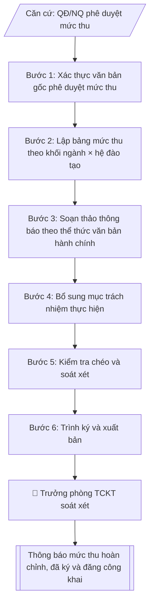

# Soạn thông báo mức thu học phí / lệ phí

## Định dạng và file đầu ra
Định dạng đầu ra có thể chọn theo sản phẩm/yêu cầu: .docx, .pdf. Đọc mục “Định dạng bổ sung” trong quy cách đầu ra trước khi chọn.

**Phải tạo file thực tế để tải xuống, không chỉ trả nội dung trong chat.** Định dạng mặc định của skill: **.docx**. Nếu có bảng số liệu nghiệp vụ yêu cầu file bảng tính riêng, tạo thêm Excel theo yêu cầu; không tự tạo file kiểm tra. Không chờ người dùng yêu cầu xuất file lần nữa. Ưu tiên định dạng người dùng chỉ định; đọc quy tắc xuất file tại references/quy-cach-dau-ra.md.

## Quy cách đầu ra và thông tin thiếu
Khi dựng file Word/Excel, áp dụng mục “Thể thức và bảng biểu khi dựng file” trong quy cách đầu ra (cỡ chữ từng thành phần, bảng nhiều trang, số trang, phụ lục). Đọc [quy cách và cấu trúc sản phẩm](references/quy-cach-dau-ra.md) trước khi soạn/xuất. File giao chỉ gồm sản phẩm nghiệp vụ được yêu cầu; kiểm tra nội bộ không xuất kèm. Thiếu thông tin thì giữ nguyên trường/mục và chỗ điền theo mẫu gốc (dòng dấu chấm, dấu gạch hoặc ô trống); không tự điền dữ liệu mẫu, số 0, mã chờ xác minh hay dòng chờ ký. Mẫu chuyên ngành còn áp dụng được ưu tiên về cấu trúc, mã biểu và người ký. Bản đầy đủ: [quy tắc chung](references/quy-tac-chung.md).

## Kiểm soát áp dụng và phê duyệt
Trước khi chạy, xác định `ngay_ap_dung`, `loai_hinh_truong`, `quy_che_noi_bo`, `nguon_du_lieu`, `nguoi_kiem_duyet`; chỉ hỏi thông tin liên quan nghiệp vụ, không dùng giá trị giả định thay dữ liệu bắt buộc. Đối chiếu căn cứ pháp lý với văn bản gốc, hiệu lực, điều khoản áp dụng và chuyển tiếp. Bản đầy đủ: [quy tắc chung](references/quy-tac-chung.md).

Nếu có cập nhật pháp lý dưới đây, đọc [căn cứ và điều kiện áp dụng](references/phap-ly.md) trước khi làm. Quy trình dưới đây giữ nghiệp vụ từ bản gốc; mọi viện dẫn văn bản, mẫu biểu, điều khoản phải theo căn cứ đã chọn trong phap-ly.md, không theo văn bản cũ.

## Giới hạn và human gate
AI hỗ trợ chuẩn bị và đối chiếu; cán bộ phụ trách kiểm tra dữ liệu/căn cứ, người có thẩm quyền duyệt và ký. Không đánh dấu đã ký, đã duyệt, đã công bố khi chưa có chứng cứ. Dữ liệu sinh viên, sức khỏe, nhân sự, tài chính chỉ dùng theo mục đích và phân quyền, che thông tin định danh khi dùng ví dụ (Luật 91/2025/QH15, hiệu lực 01/01/2026); không tải dữ liệu lên dịch vụ ngoài khi chưa có quyền. Bản đầy đủ: [quy tắc chung](references/quy-tac-chung.md).

## Khi nào dùng
Khi ban hành hoặc cập nhật mức thu học phí, lệ phí năm học mới: công bố theo khối ngành
(Kỹ thuật, Kinh tế, Xã hội...), theo hệ đào tạo (chính quy, vừa làm vừa học), kèm thời hạn
và hình thức nộp.

## Đầu vào (Input)
| Trường | Mô tả | Bắt buộc |
|---|---|---|
| `nam_hoc` | Năm học áp dụng (vd: 2026–2027) | Có |
| `can_cu` | Căn cứ ban hành (Quyết định số..., Nghị quyết Hội đồng trường...) | Có |
| `khoi_nganh` | Danh sách khối ngành cần công bố (vd: Kỹ thuật, Kinh tế, Xã hội) | Có |
| `he_dao_tao` | Các hệ đào tạo áp dụng (Chính quy, Vừa làm vừa học...) | Có |
| `muc_thu` | Bảng mức thu theo từng khối ngành × hệ đào tạo, đơn vị đồng/tín chỉ và đồng/năm | Có |
| `thoi_han_nop` | Thời hạn nộp học phí (theo đợt: đợt 1, đợt 2...) | Có |
| `hinh_thuc_nop` | Hình thức nộp (chuyển khoản, cổng thanh toán trực tuyến...) + tài khoản thụ hưởng | Có |
| `le_phi` | Các lệ phí kèm theo (lệ phí nhập học, lệ phí thi lại, cấp lại thẻ SV...) | Không |
| `nguoi_ky` | Hiệu trưởng / Phó Hiệu trưởng phụ trách tài chính | Có |
| `ngay_ban_hanh` | Ngày ban hành thông báo | Không (mặc định: ngày hiện tại) |

## Quy trình
**Ràng buộc pháp lý khi thực hiện** (trích references/phap-ly.md; đối chiếu toàn văn và hiệu lực tại ngày nghiệp vụ):
- Thông tư 09/2024/TT-BGDĐT, hiệu lực 19/07/2024, thay 36/2017: Chuyển từ mẫu ba công khai cũ sang nội dung công khai và báo cáo thường niên theo 09/2024. Đối chiếu phần thông tin chung, phần giáo dục đại học và phụ lục báo cáo thường niên; lưu nội dung trên website tối thiểu 5 năm. Ghi thời điểm, đường dẫn công bố, người duyệt và bằng chứng cập nhật. Không tự thêm số liệu hoặc tự công bố; không coi báo cáo gửi cơ quan quản lý là nghĩa vụ định kỳ nếu không có căn cứ/yêu cầu bằng văn bản.
- Nghị định 238/2025/NĐ-CP, hiệu lực 03/09/2025: Yêu cầu năm học, trình độ, ngành, loại hình trường, mức tự chủ, quyết định học phí được duyệt và đối tượng miễn/giảm/hỗ trợ. Đối chiếu 238/2025 và chuyển tiếp; không lấy mức trần, tỷ lệ tăng hoặc đối tượng từ 81/2021/97/2023 làm mặc định hiện hành. Chỉ tính khi đủ căn cứ và dữ liệu từng người học.
- Trước Bước 1: chọn căn cứ theo đối tượng, loại hình trường và chuyển tiếp; lập bảng văn bản / điều khoản / lý do áp dụng / bằng chứng. Thiếu văn bản gốc hoặc điều khoản thì ghi nhận nội bộ [CẦN XÁC MINH] (không đưa vào file giao), để trống phần tương ứng, chưa kết luận tuân thủ.
- Các con số, thời hạn, số điều, số mức xếp loại, hệ số và mẫu biểu nêu trong các bước dưới đây được giữ từ quy trình gốc (trước cập nhật pháp lý); chỉ dùng khi đã đối chiếu đúng với căn cứ đã chọn, khác thì theo căn cứ. Danh sách điểm cần đối chiếu: docs/DIEM_CAN_DOI_CHIEU_PHAP_LY.md.

**Bước 1. Xác thực văn bản gốc phê duyệt mức thu**
- Làm gì: đối chiếu `can_cu` (số ký hiệu, ngày ban hành, cơ quan ban hành, phạm vi áp dụng
  theo `nam_hoc`) với bản gốc lưu tại Văn thư / Phòng Tài chính – Kế toán; kiểm tra văn bản
  đã được ký, đóng dấu, còn hiệu lực và đúng thẩm quyền (Hội đồng trường đối với đơn vị
  tự chủ tài chính; Hiệu trưởng theo phân cấp).
- Dùng input: `can_cu`, `nam_hoc`.
- Vai trò: Chuyên viên Phòng TCKT · AI hỗ trợ: đối chiếu tự động, cảnh báo sai lệch, lưu trữ hồ sơ · ⏱ ~1–3 giờ (ước tính)
- Lưu ý nghiệp vụ: tuyệt đối không ban hành thông báo khi văn bản gốc chưa ký/đóng dấu
  hoặc mức thu trong văn bản gốc không khớp với số liệu được giao; ghi lại chính xác số
  ký hiệu và ngày văn bản gốc để trích dẫn trong thông báo.
- → Kết quả bước: biên bản xác nhận căn cứ pháp lý (số văn bản, cơ quan ban hành, phạm vi
  áp dụng, tình trạng hiệu lực).

**Bước 2. Lập bảng mức thu theo khối ngành × hệ đào tạo**
- Làm gì: sắp xếp các dòng theo `khoi_nganh` → `he_dao_tao`; mỗi ô điền đủ hai mức:
  đồng/tín chỉ và đồng/năm (đồng/năm = đồng/tín chỉ × khối lượng học tập chuẩn của hệ đào
  tạo trong năm); đối chiếu từng con số với bảng mức thu trong văn bản gốc đã xác thực
  ở Bước 1.
- Dùng input: `muc_thu`, `khoi_nganh`, `he_dao_tao`, `can_cu` (để đối chiếu).
- Vai trò: Chuyên viên Phòng TCKT · AI hỗ trợ: đối chiếu tự động, cảnh báo sai lệch, lập bảng biểu, định dạng · ⏱ ~30–60 phút (ước tính)
- Lưu ý nghiệp vụ: mức thu hệ Vừa làm vừa học không được thấp hơn hệ chính quy cùng khối
  ngành; mức đồng/năm chỉ là bình quân ước tính — số tiền thực nộp của sinh viên tính theo
  số tín chỉ đăng ký thực tế, phải ghi chú rõ trong thông báo để tránh tranh chấp.
- → Kết quả bước: bảng mức thu hoàn chỉnh (khối ngành × hệ đào tạo, hai đơn vị tính,
  đã đối chiếu khớp với văn bản gốc).

**Bước 3. Soạn thảo thông báo theo thể thức văn bản hành chính**
- Làm gì: viết toàn văn thông báo theo đúng trình tự thể thức: Quốc hiệu – Tiêu ngữ →
  tên trường → số, ký hiệu văn bản → địa danh, ngày tháng năm (`ngay_ban_hanh`) → tiêu đề
  "THÔNG BÁO" + trích yếu → Kính gửi → Nội dung gồm: (1) căn cứ ban hành; (2) bảng mức thu
  chi tiết từ Bước 2; (3) thời hạn nộp (`thoi_han_nop`, ghi rõ từng đợt); (4) hình thức nộp
  (`hinh_thuc_nop`: số tài khoản, ngân hàng, chủ tài khoản, nội dung ghi chú chuyển khoản);
  (5) lệ phí kèm theo (`le_phi`, nếu có) → nơi nhận → chữ ký (`nguoi_ky`).
- Dùng input: toàn bộ input trên, trọng tâm `thoi_han_nop`, `hinh_thuc_nop`, `le_phi`,
  `nguoi_ky`, `ngay_ban_hanh`.
- Vai trò: Chuyên viên Phòng TCKT · AI hỗ trợ: soạn dự thảo · ⏱ ~30–60 phút (ước tính)
- Lưu ý nghiệp vụ: nội dung ghi chú chuyển khoản (mã sinh viên, họ tên) là điểm gây sai
  đối soát nhiều nhất — phải hướng dẫn rõ ràng; lệ phí trình bày thành mục riêng, không
  gộp chung vào bảng học phí.
- → Kết quả bước: dự thảo văn bản thông báo đầy đủ thể thức.

**Bước 4. Bổ sung mục trách nhiệm thực hiện**
- Làm gì: ghi rõ trách nhiệm từng đơn vị: Phòng Tài chính – Kế toán là đầu mối giải đáp,
  đối soát và xác nhận học phí đã nộp; các khoa/viện phổ biến thông báo đến sinh viên, học
  viên; Phòng Công tác sinh viên hướng dẫn diện miễn, giảm học phí.
- Dùng input: phân công nghiệp vụ chuẩn của trường (không có trường input riêng).
- Vai trò: Chuyên viên Phòng TCKT · AI hỗ trợ: xử lý sơ bộ, tổng hợp · ⏱ ~1–2 giờ (ước tính)
- Lưu ý nghiệp vụ: ghi trách nhiệm theo tên đơn vị, không ghi tên cá nhân, để văn bản
  không lỗi thời khi thay đổi nhân sự.
- → Kết quả bước: dự thảo thông báo đầy đủ nội dung (đã có mục trách nhiệm thực hiện).

**Bước 5. Kiểm tra chéo và soát xét**
- Làm gì: đối chiếu từng số liệu trong bảng mức thu với văn bản gốc; kiểm tra số ký hiệu,
  ngày tháng, thẩm quyền ký (`nguoi_ky`), nơi nhận đầy đủ (toàn thể sinh viên, các đơn vị,
  cổng thông tin điện tử); soát chính tả, định dạng bảng, đơn vị tính.
- Dùng input: `can_cu` (đối chiếu số liệu), `nguoi_ky`.
- Vai trò: Trưởng phòng Tài chính – Kế toán · AI hỗ trợ: đối chiếu tự động, cảnh báo sai lệch, tính toán, phân tích số liệu · ⏱ ~1–2 giờ (ước tính)
- Lưu ý nghiệp vụ: sai một con số trong bảng mức thu đồng nghĩa phải ban hành thông báo
  đính chính — kiểm tra kỹ dấu phân cách hàng nghìn và đơn vị tính (ghi "đồng", không viết
  tắt trong văn bản chính thức).
- → Kết quả bước: danh sách lỗi cần sửa (nếu có) và bản thông báo đã soát xong.

**Bước 6. Trình ký và xuất bản**
- Làm gì: trình người có thẩm quyền ký (`nguoi_ky`), đóng dấu; đăng tải trên cổng thông tin
  điện tử của trường tại chuyên mục công khai; gửi các khoa/viện để phổ biến; lưu văn thư.
- Dùng input: `nguoi_ky`.
- Vai trò: Chuyên viên Phòng TCKT (chuẩn bị hồ sơ trình); Hiệu trưởng (người ký) ban hành · AI hỗ trợ: chuẩn bị hồ sơ trình đầy đủ, chuẩn bị bản phát hành · ⏱ ~1–3 giờ (ước tính)
- Lưu ý nghiệp vụ: thông báo mức thu học phí thuộc nội dung phải công khai theo văn bản hiện hành nêu tại phap-ly.md — bắt buộc đăng công khai trên cổng thông tin, không chỉ gửi nội bộ.
- → Kết quả bước: văn bản thông báo mức thu hoàn chỉnh, đã ký và đăng công khai.

## Luồng quy trình (Workflow)

## Đầu ra
- Văn bản thông báo mức thu học phí hoàn chỉnh, đúng thể thức.
- Bảng mức thu chi tiết theo khối ngành × hệ đào tạo.

File nghiệp vụ thực tế theo định dạng mặc định ở đầu skill hoặc định dạng người dùng yêu cầu, kèm liên kết tải trong phản hồi cuối.

Sản phẩm nghiệp vụ hoàn chỉnh theo [quy cách và cấu trúc](references/quy-cach-dau-ra.md), giữ các trường chưa có dữ liệu ở trạng thái trống. Không xuất kèm checklist/phụ lục kiểm tra đầu ra.

## Kiểm tra nội bộ trước khi giao
Các tiêu chí sau dùng để tự đối chiếu; không sao chép vào file xuất. Mục thiếu dữ liệu được để trống, không đánh dấu đã đạt hoặc đã duyệt.

- [ ] Đủ các phần và đúng bố cục theo cấu trúc tại references/quy-cach-dau-ra.md (không theo cấu trúc của bản gốc).
- [ ] Có đầy đủ sản phẩm: Văn bản thông báo mức thu học phí hoàn chỉnh, đúng thể thức
- [ ] Có đầy đủ sản phẩm: Bảng mức thu chi tiết theo khối ngành × hệ đào tạo
- [ ] Mọi số liệu, tên, ngày tháng trong output khớp với Input đã cung cấp (không thêm bớt, không suy đoán)
- [ ] Không bịa đặt số liệu, minh chứng, trích dẫn hay căn cứ
- [ ] Đúng thể thức, định dạng văn bản theo quy định hiện hành
- [ ] Căn cứ pháp lý nêu đầy đủ, còn hiệu lực tại thời điểm lập
- [ ] Đã qua Human gate: người có thẩm quyền đã kiểm tra/ký duyệt trước khi phát hành
- [ ] Tuyệt đối không ban hành thông báo khi văn bản gốc chưa ký/đóng dấu
- [ ] Mức thu hệ Vừa làm vừa học không được thấp hơn hệ chính quy cùng khối

## Căn cứ & lưu ý
- Căn cứ hiện hành: xem [căn cứ và điều kiện áp dụng](references/phap-ly.md); phải đối chiếu văn bản gốc, hiệu lực và chuyển tiếp tại ngày nghiệp vụ.
- Mức thu học phí thực tế phải tuân thủ Nghị định 81/2021/NĐ-CP và Nghị định 97/2023/NĐ-CP
  về cơ chế thu, quản lý học phí; số liệu trong ví dụ chỉ là giả lập minh họa.
- Đối với đơn vị tự chủ tài chính, mức thu do Hội đồng trường quyết định trong khung
  quy định của pháp luật.
- Không dùng tên thật của trường/cá nhân khi mô phỏng.

## Tư liệu đối chiếu
Bản gốc trước cập nhật pháp lý (kèm ví dụ giả lập) lưu tại `references/quy-trinh-lich-su.md`, chỉ để đối chiếu hồ sơ lịch sử; không dùng căn cứ, mẫu hay số liệu trong đó làm chỉ dẫn hiện hành.

## Quản trị phiên bản
- Phiên bản gói `1.3.2` (cập nhật 2026-10-10); hồ sơ đầy đủ tại [references/version.json](references/version.json).
- Người phê duyệt nghiệp vụ: **chưa chỉ định**. Trạng thái: dự thảo nghiệp vụ; kiểm tra pháp lý trước thực thi. Ngày cập nhật không đồng nghĩa mọi văn bản đã được rà soát toàn văn.
- Giấy phép theo LICENSE của kho (bản quyền CES Global). Lịch sử thay đổi: CHANGELOG.md.
