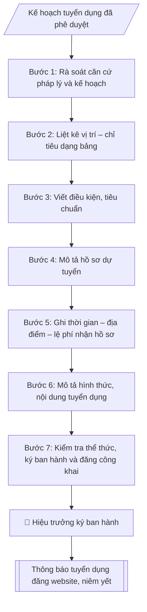

# Soạn thông báo tuyển dụng

## Định dạng và file đầu ra
Định dạng đầu ra có thể chọn theo sản phẩm/yêu cầu: .docx, .pdf. Đọc mục “Định dạng bổ sung” trong quy cách đầu ra trước khi chọn.

**Phải tạo file thực tế để tải xuống, không chỉ trả nội dung trong chat.** Định dạng mặc định của skill: **.docx**. Nếu có bảng số liệu nghiệp vụ yêu cầu file bảng tính riêng, tạo thêm Excel theo yêu cầu; không tự tạo file kiểm tra. Không chờ người dùng yêu cầu xuất file lần nữa. Ưu tiên định dạng người dùng chỉ định; đọc quy tắc xuất file tại references/quy-cach-dau-ra.md.

## Quy cách đầu ra và thông tin thiếu
Khi dựng file Word/Excel, áp dụng mục “Thể thức và bảng biểu khi dựng file” trong quy cách đầu ra (cỡ chữ từng thành phần, bảng nhiều trang, số trang, phụ lục). Đọc [quy cách và cấu trúc sản phẩm](references/quy-cach-dau-ra.md) trước khi soạn/xuất. File giao chỉ gồm sản phẩm nghiệp vụ được yêu cầu; kiểm tra nội bộ không xuất kèm. Thiếu thông tin thì giữ nguyên trường/mục và chỗ điền theo mẫu gốc (dòng dấu chấm, dấu gạch hoặc ô trống); không tự điền dữ liệu mẫu, số 0, mã chờ xác minh hay dòng chờ ký. Mẫu chuyên ngành còn áp dụng được ưu tiên về cấu trúc, mã biểu và người ký. Bản đầy đủ: [quy tắc chung](references/quy-tac-chung.md).

## Kiểm soát áp dụng và phê duyệt
Trước khi chạy, xác định `ngay_ap_dung`, `loai_hinh_truong`, `quy_che_noi_bo`, `nguon_du_lieu`, `nguoi_kiem_duyet`; chỉ hỏi thông tin liên quan nghiệp vụ, không dùng giá trị giả định thay dữ liệu bắt buộc. Đối chiếu căn cứ pháp lý với văn bản gốc, hiệu lực, điều khoản áp dụng và chuyển tiếp. Bản đầy đủ: [quy tắc chung](references/quy-tac-chung.md).

Nếu có cập nhật pháp lý dưới đây, đọc [căn cứ và điều kiện áp dụng](references/phap-ly.md) trước khi làm. Quy trình dưới đây giữ nghiệp vụ từ bản gốc; mọi viện dẫn văn bản, mẫu biểu, điều khoản phải theo căn cứ đã chọn trong phap-ly.md, không theo văn bản cũ.

## Giới hạn và human gate
AI hỗ trợ chuẩn bị và đối chiếu; cán bộ phụ trách kiểm tra dữ liệu/căn cứ, người có thẩm quyền duyệt và ký. Không đánh dấu đã ký, đã duyệt, đã công bố khi chưa có chứng cứ. Dữ liệu sinh viên, sức khỏe, nhân sự, tài chính chỉ dùng theo mục đích và phân quyền, che thông tin định danh khi dùng ví dụ (Luật 91/2025/QH15, hiệu lực 01/01/2026); không tải dữ liệu lên dịch vụ ngoài khi chưa có quyền. Bản đầy đủ: [quy tắc chung](references/quy-tac-chung.md).

## Khi nào dùng
Khi kế hoạch tuyển dụng viên chức đã được Hiệu trưởng phê duyệt và cần ban hành Thông báo tuyển dụng
để đăng công khai trên website trường, niêm yết tại trụ sở và gửi các kênh truyền thông: liệt kê đầy đủ
vị trí, chỉ tiêu, tiêu chuẩn từng vị trí, thành phần hồ sơ, thời gian – địa điểm – lệ phí nhận hồ sơ,
hình thức và nội dung xét/thi tuyển.

## Đầu vào (Input)
| Trường | Mô tả | Bắt buộc |
|---|---|---|
| `dot_tuyen_dung` | Tên đợt tuyển dụng (VD: tuyển dụng viên chức năm 2026) | Có |
| `vi_tri_chi_tieu` | Danh sách vị trí: tên vị trí + chức danh nghề nghiệp/mã số + số lượng chỉ tiêu + đơn vị sử dụng | Có |
| `tieu_chuan_chung` | Điều kiện chung: quốc tịch, tuổi, sức khỏe, lý lịch, văn bằng... | Có |
| `tieu_chuan_rieng` | Tiêu chuẩn riêng từng vị trí: trình độ, ngành đào tạo, chứng chỉ, kinh nghiệm | Có |
| `ho_so_gom` | Thành phần hồ sơ: Phiếu đăng ký dự tuyển (mẫu văn bản hiện hành nêu tại phap-ly.md) + các giấy tờ kèm theo | Có |
| `thoi_han_nhan` | Thời gian nhận hồ sơ (từ ngày – đến ngày, tối thiểu 30 ngày) | Có |
| `dia_diem_nhan` | Địa điểm nhận hồ sơ trực tiếp / địa chỉ nhận qua bưu điện | Có |
| `hinh_thuc_tuyen` | Xét tuyển / Thi tuyển; nội dung vòng 1, vòng 2; thang điểm, điểm liệt | Có |
| `le_phi` | Mức lệ phí dự tuyển (nếu thu) | Không |
| `lien_he` | Đầu mối liên hệ: đơn vị, điện thoại, email, website tra cứu | Có |
| `nguoi_ky` | Hiệu trưởng / Phó Hiệu trưởng (thừa ủy quyền) | Có |

## Quy trình
**Ràng buộc pháp lý khi thực hiện** (trích references/phap-ly.md; đối chiếu toàn văn và hiệu lực tại ngày nghiệp vụ):
- Luật 129/2025/QH15; Nghị định 259/2026/NĐ-CP; phạm vi: Viên chức đơn vị sự nghiệp công lập; kiểm tra chuyển tiếp và quy định riêng về nhà giáo: Cập nhật căn cứ tuyển dụng, hợp đồng làm việc, bổ nhiệm, điều động và đào tạo viên chức. Không tái sử dụng số điều hoặc mẫu phiếu của NĐ 115. Phải yêu cầu ngày tuyển dụng, ngày phê duyệt kế hoạch, loại hợp đồng, trạng thái hồ sơ và bản văn NĐ 259 để chọn điều khoản chuyển tiếp; không tự áp dụng điều22 Luật Viên chức2010. Các văn bản cũ chỉ là căn cứ lịch sử khi chuyển tiếp cho phép.
- Luật Nhà giáo; Nghị định 93/2026/NĐ-CP; khoản 9 Điều 62 NĐ 259/2026; phạm vi: Viên chức là nhà giáo: Thêm input đối tượng là nhà giáo hay viên chức khác. Nếu pháp luật nhà giáo có quy định khác về thẩm quyền, tiêu chuẩn, điều kiện, trình tự, thủ tục tuyển dụng/sử dụng/quản lý, áp dụng quy định nhà giáo và hướng dẫn Bộ GDĐT thay vì quy tắc chung NĐ 259.
- Trước Bước 1: chọn căn cứ theo đối tượng, loại hình trường và chuyển tiếp; lập bảng văn bản / điều khoản / lý do áp dụng / bằng chứng. Thiếu văn bản gốc hoặc điều khoản thì ghi nhận nội bộ [CẦN XÁC MINH] (không đưa vào file giao), để trống phần tương ứng, chưa kết luận tuân thủ.
- Các con số, thời hạn, số điều, số mức xếp loại, hệ số và mẫu biểu nêu trong các bước dưới đây được giữ từ quy trình gốc (trước cập nhật pháp lý); chỉ dùng khi đã đối chiếu đúng với căn cứ đã chọn, khác thì theo căn cứ. Danh sách điểm cần đối chiếu: docs/DIEM_CAN_DOI_CHIEU_PHAP_LY.md.

**Bước 1. Rà soát căn cứ pháp lý và kế hoạch**
- Làm gì: lấy số lượng, cơ cấu vị trí từ Kế hoạch tuyển dụng đã được phê duyệt; đối chiếu `tieu_chuan_chung`, `tieu_chuan_rieng` với đề án vị trí việc làm và điều kiện đăng ký dự tuyển tại văn bản hiện hành nêu tại phap-ly.md; lập bảng đối chiếu (chỉ tiêu kế hoạch – chỉ tiêu dự thảo thông báo) để đảm bảo khớp nhau.
- Dùng input: `dot_tuyen_dung`, `vi_tri_chi_tieu`, `tieu_chuan_chung`, `tieu_chuan_rieng`.
- Vai trò: Chuyên viên Phòng TCCB (Trưởng phòng kiểm tra lại) · AI hỗ trợ: quét lỗi theo checklist · ⏱ ~15–30 phút (ước tính)
- Lưu ý nghiệp vụ: thông báo chỉ được ban hành sau khi kế hoạch đã phê duyệt — ban hành trước là sai trình tự; tổng chỉ tiêu trong thông báo phải khớp 100% kế hoạch; tiêu chuẩn không được đặt thêm điều kiện trái quy định (VD: giới hạn độ tuổi, giới tính khi không có căn cứ).
- → Kết quả bước: bảng đối chiếu căn cứ (kế hoạch – đề án VTVL – văn bản hiện hành nêu tại phap-ly.md).

**Bước 2. Liệt kê vị trí – chỉ tiêu dạng bảng**
- Làm gì: từ `vi_tri_chi_tieu`, trình bày dạng bảng: STT | Vị trí việc làm | Chức danh nghề nghiệp (mã số) | Đơn vị sử dụng | Số lượng; tính tổng chỉ tiêu và đối chiếu với kế hoạch đã duyệt.
- Dùng input: `vi_tri_chi_tieu`.
- Vai trò: Chuyên viên Phòng TCCB · AI hỗ trợ: xử lý sơ bộ theo quy trình · ⏱ ~20–45 phút (ước tính)
- Lưu ý nghiệp vụ: ghi đúng mã số chức danh nghề nghiệp (VD: V.07.01.03) — sai mã số là lỗi nghiêm trọng; tên vị trí việc làm phải khớp đề án vị trí việc làm; kiểm tra tổng số lượng từng dòng cộng lại bằng tổng chỉ tiêu.
- → Kết quả bước: bảng vị trí – chỉ tiêu – đơn vị (mục 1 của thông báo).

**Bước 3. Viết điều kiện, tiêu chuẩn**
- Làm gì: tách 2 mục — (a) Điều kiện chung cho mọi vị trí từ `tieu_chuan_chung` (quốc tịch, tuổi, lý lịch, sức khỏe, không vi phạm pháp luật); (b) Tiêu chuẩn cụ thể từng vị trí từ `tieu_chuan_rieng` (trình độ, ngành/chuyên ngành đào tạo, chứng chỉ ngoại ngữ – tin học, kinh nghiệm, yêu cầu khác).
- Dùng input: `tieu_chuan_chung`, `tieu_chuan_rieng`.
- Vai trò: Chuyên viên Phòng TCCB · AI hỗ trợ: soạn dự thảo đúng thể thức · ⏱ ~20–45 phút (ước tính)
- Lưu ý nghiệp vụ: điều kiện chung bám sát luật viên chức và nghị định hướng dẫn hiện hành, theo văn bản hiện hành nêu tại phap-ly.md, không tự sáng tạo thêm; tiêu chuẩn riêng phải tương ứng đúng từng vị trí trong bảng Bước 2 — bẫy là viết tiêu chuẩn của vị trí này gán nhầm sang vị trí khác.
- → Kết quả bước: dự thảo mục 2 (điều kiện chung) và mục 3 (tiêu chuẩn từng vị trí).

**Bước 4. Mô tả hồ sơ dự tuyển**
- Làm gì: từ `ho_so_gom`, liệt kê đầy đủ thành phần hồ sơ: Phiếu đăng ký dự tuyển (theo mẫu văn bản hiện hành nêu tại phap-ly.md); bản sao văn bằng, chứng chỉ; giấy khám sức khỏe; ảnh; bản sao CCCD...; ghi rõ hồ sơ nộp bản sao, khi trúng tuyển xuất trình bản gốc để đối chiếu.
- Dùng input: `ho_so_gom`.
- Vai trò: Chuyên viên Phòng TCCB · AI hỗ trợ: xử lý sơ bộ theo quy trình · ⏱ ~20–45 phút (ước tính)
- Lưu ý nghiệp vụ: liệt kê đúng tên từng loại giấy tờ theo quy định — thiếu thành phần hồ sơ gây khiếu nại; ghi rõ thời hạn hiệu lực của giấy khám sức khỏe (06 tháng); không yêu cầu giấy tờ ngoài quy định.
- → Kết quả bước: dự thảo mục 4 (hồ sơ đăng ký dự tuyển).

**Bước 5. Ghi thời gian – địa điểm – lệ phí nhận hồ sơ**
- Làm gì: từ `thoi_han_nhan`, ghi rõ thời gian nhận (từ ngày – đến ngày, giờ hành chính), đảm bảo **ít nhất 30 ngày** kể từ ngày thông báo; từ `dia_diem_nhan`, ghi địa điểm nộp trực tiếp và/hoặc gửi qua bưu điện (ghi rõ tính theo dấu bưu điện); từ `le_phi`, ghi mức lệ phí (nếu thu).
- Dùng input: `thoi_han_nhan`, `dia_diem_nhan`, `le_phi`.
- Vai trò: Chuyên viên Phòng TCCB · AI hỗ trợ: xử lý sơ bộ theo quy trình · ⏱ ~20–45 phút (ước tính)
- Lưu ý nghiệp vụ: đếm đủ 30 ngày theo lịch — bẫy là tính thiếu ngày nghỉ; địa chỉ nhận hồ sơ phải chính xác, có số điện thoại liên hệ; lệ phí theo đúng quy định, không tự đặt mức.
- → Kết quả bước: dự thảo mục 5 (thời gian, địa điểm, lệ phí).

**Bước 6. Mô tả hình thức, nội dung tuyển dụng**
- Làm gì: từ `hinh_thuc_tuyen`, mô tả rõ: xét tuyển (vòng 1 kiểm tra điều kiện + vòng 2 phỏng vấn/thực hành) hoặc thi tuyển (các vòng thi, môn thi); ghi thang điểm (100), điểm liệt (dưới 50), cách tính điểm ưu tiên; ghi kênh công khai danh sách vòng 2 và kết quả trúng tuyển.
- Dùng input: `hinh_thuc_tuyen`, `lien_he` (kênh công khai kết quả).
- Vai trò: Chuyên viên Phòng TCCB · AI hỗ trợ: xử lý sơ bộ theo quy trình · ⏱ ~20–45 phút (ước tính)
- Lưu ý nghiệp vụ: nội dung vòng 2 phải khớp với phương án đã phê duyệt trong kế hoạch; điểm liệt và cách cộng điểm ưu tiên ghi đúng quy định văn bản hiện hành nêu tại phap-ly.md; cam kết công khai kết quả trên website để đảm bảo minh bạch.
- → Kết quả bước: dự thảo mục 6 (hình thức, nội dung tuyển dụng).

**Bước 7. Kiểm tra thể thức, ký ban hành và đăng công khai**
- Làm gì: kiểm tra toàn văn: thể thức theo NĐ 30/2020 (tiêu đề "THÔNG BÁO", không có trích yếu "V/v"); chính tả; số liệu chỉ tiêu khớp kế hoạch; thẩm quyền ký (`nguoi_ky`); nơi nhận (đăng website, niêm yết, lưu); trình `nguoi_ky` ký ban hành; đăng lên website trường, niêm yết tại trụ sở, lưu bằng chứng đăng tải.
- Dùng input: `lien_he`, `nguoi_ky`, toàn bộ dự thảo các bước 2–6.
- Vai trò: Hiệu trưởng (người ký) · AI hỗ trợ: chuẩn bị hồ sơ trình ký đầy đủ để xem xét nhanh · ⏱ ~0.5–1 ngày làm việc (ước tính)
- Lưu ý nghiệp vụ: kiểm tra lần cuối số ký hiệu, ngày tháng ban hành trước khi ký; lưu ảnh chụp trang web đã đăng và biên bản niêm yết làm bằng chứng đã công khai đúng quy định.
- → Kết quả bước: Thông báo tuyển dụng đã ký ban hành, đăng website và niêm yết.

## Luồng quy trình (Workflow)

## Đầu ra
- Văn bản Thông báo tuyển dụng hoàn chỉnh, đúng thể thức.
- Bảng tổng hợp vị trí – chỉ tiêu – tiêu chuẩn (theo định dạng đầu ra của skill, tiện đăng web).
- Checklist kiểm tra nội dung (đánh dấu từng thành phần đã đủ/chưa).

File nghiệp vụ thực tế theo định dạng mặc định ở đầu skill hoặc định dạng người dùng yêu cầu, kèm liên kết tải trong phản hồi cuối.

Sản phẩm nghiệp vụ hoàn chỉnh theo [quy cách và cấu trúc](references/quy-cach-dau-ra.md), giữ các trường chưa có dữ liệu ở trạng thái trống. Không xuất kèm checklist/phụ lục kiểm tra đầu ra.

## Kiểm tra nội bộ trước khi giao
Các tiêu chí sau dùng để tự đối chiếu; không sao chép vào file xuất. Mục thiếu dữ liệu được để trống, không đánh dấu đã đạt hoặc đã duyệt.

- [ ] Đủ các phần và đúng bố cục theo cấu trúc tại references/quy-cach-dau-ra.md (không theo cấu trúc của bản gốc).
- [ ] Nội dung và số liệu trong output khớp đúng với Input đã cho (không thêm, bớt hay suy diễn)
- [ ] Không bịa đặt số liệu, minh chứng, trích dẫn hay căn cứ
- [ ] Đúng thể thức và cấu trúc theo references/quy-cach-dau-ra.md và căn cứ đã chọn tại references/phap-ly.md.
- [ ] Căn cứ pháp lý được trích dẫn đầy đủ và còn hiệu lực
- [ ] Đã qua Human gate: người có thẩm quyền đã kiểm tra/duyệt trước khi phát hành
- [ ] Tổng chỉ tiêu trong thông báo phải khớp 100% kế hoạch
- [ ] Tiêu chuẩn không được đặt thêm điều kiện trái quy định (VD: giới hạn độ tuổi, giới tính khi không có căn cứ)
- [ ] Ghi đúng mã số chức danh nghề nghiệp (VD: V.07.01.03) — sai mã số là lỗi nghiêm trọng

## Căn cứ & lưu ý
- Căn cứ hiện hành: xem [căn cứ và điều kiện áp dụng](references/phap-ly.md); phải đối chiếu văn bản gốc, hiệu lực và chuyển tiếp tại ngày nghiệp vụ.
- Quy định công tác cán bộ của Nhà trường / cơ quan chủ quản.
- Nghị định 30/2020/NĐ-CP về thể thức văn bản (thông báo dùng tiêu đề "THÔNG BÁO", không có trích yếu "V/v").
- Không dùng tên thật của trường/cá nhân khi mô phỏng; mọi số liệu, địa chỉ, số điện thoại trong ví dụ đều giả lập.

## Tư liệu đối chiếu
Bản gốc trước cập nhật pháp lý (kèm ví dụ giả lập) lưu tại `references/quy-trinh-lich-su.md`, chỉ để đối chiếu hồ sơ lịch sử; không dùng căn cứ, mẫu hay số liệu trong đó làm chỉ dẫn hiện hành.

## Quản trị phiên bản
- Phiên bản gói `1.3.2` (cập nhật 2026-10-10); hồ sơ đầy đủ tại [references/version.json](references/version.json).
- Người phê duyệt nghiệp vụ: **chưa chỉ định**. Trạng thái: dự thảo nghiệp vụ; kiểm tra pháp lý trước thực thi. Ngày cập nhật không đồng nghĩa mọi văn bản đã được rà soát toàn văn.
- Giấy phép theo LICENSE của kho (bản quyền CES Global). Lịch sử thay đổi: CHANGELOG.md.
