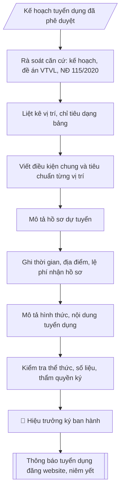

# Skill: Soạn thông báo tuyển dụng

## Khi nào dùng
Khi kế hoạch tuyển dụng viên chức đã được Hiệu trưởng phê duyệt và cần ban hành Thông báo tuyển dụng
để đăng công khai trên website trường, niêm yết tại trụ sở và gửi các kênh truyền thông: liệt kê đầy đủ
vị trí, chỉ tiêu, tiêu chuẩn từng vị trí, thành phần hồ sơ, thời gian – địa điểm – lệ phí nhận hồ sơ,
hình thức và nội dung xét/thi tuyển.

## Đầu vào (Input)

| Trường | Mô tả | Bắt buộc |
|---|---|---|
| `dot_tuyen_dung` | Tên đợt tuyển dụng (VD: tuyển dụng viên chức năm 2026) | Có |
| `vi_tri_chi_tieu` | Danh sách vị trí: tên vị trí + chức danh nghề nghiệp/mã số + số lượng chỉ tiêu + đơn vị sử dụng | Có |
| `tieu_chuan_chung` | Điều kiện chung: quốc tịch, tuổi, sức khỏe, lý lịch, văn bằng... | Có |
| `tieu_chuan_rieng` | Tiêu chuẩn riêng từng vị trí: trình độ, ngành đào tạo, chứng chỉ, kinh nghiệm | Có |
| `ho_so_gom` | Thành phần hồ sơ: Phiếu đăng ký dự tuyển (mẫu NĐ 115/2020) + các giấy tờ kèm theo | Có |
| `thoi_han_nhan` | Thời gian nhận hồ sơ (từ ngày – đến ngày, tối thiểu 30 ngày) | Có |
| `dia_diem_nhan` | Địa điểm nhận hồ sơ trực tiếp / địa chỉ nhận qua bưu điện | Có |
| `hinh_thuc_tuyen` | Xét tuyển / Thi tuyển; nội dung vòng 1, vòng 2; thang điểm, điểm liệt | Có |
| `le_phi` | Mức lệ phí dự tuyển (nếu thu) | Không |
| `lien_he` | Đầu mối liên hệ: đơn vị, điện thoại, email, website tra cứu | Có |
| `nguoi_ky` | Hiệu trưởng / Phó Hiệu trưởng (thừa ủy quyền) | Có |

## Quy trình

**Bước 1. Rà soát căn cứ pháp lý và kế hoạch**
- Làm gì: lấy số lượng, cơ cấu vị trí từ Kế hoạch tuyển dụng đã được phê duyệt; đối chiếu `tieu_chuan_chung`, `tieu_chuan_rieng` với đề án vị trí việc làm và điều kiện đăng ký dự tuyển tại Nghị định 115/2020/NĐ-CP; lập bảng đối chiếu (chỉ tiêu kế hoạch – chỉ tiêu dự thảo thông báo) để đảm bảo khớp nhau.
- Dùng input: `dot_tuyen_dung`, `vi_tri_chi_tieu`, `tieu_chuan_chung`, `tieu_chuan_rieng`.
- Vai trò: Chuyên viên Phòng TCCB (Trưởng phòng kiểm tra lại) · AI hỗ trợ: quét lỗi theo checklist · ⏱ ~15–30 phút (ước tính)
- Lưu ý nghiệp vụ: thông báo chỉ được ban hành sau khi kế hoạch đã phê duyệt — ban hành trước là sai trình tự; tổng chỉ tiêu trong thông báo phải khớp 100% kế hoạch; tiêu chuẩn không được đặt thêm điều kiện trái quy định (VD: giới hạn độ tuổi, giới tính khi không có căn cứ).
- → Kết quả bước: bảng đối chiếu căn cứ (kế hoạch – đề án VTVL – NĐ 115/2020).

**Bước 2. Liệt kê vị trí – chỉ tiêu dạng bảng**
- Làm gì: từ `vi_tri_chi_tieu`, trình bày dạng bảng: STT | Vị trí việc làm | Chức danh nghề nghiệp (mã số) | Đơn vị sử dụng | Số lượng; tính tổng chỉ tiêu và đối chiếu với kế hoạch đã duyệt.
- Dùng input: `vi_tri_chi_tieu`.
- Vai trò: Chuyên viên Phòng TCCB · AI hỗ trợ: xử lý sơ bộ theo quy trình · ⏱ ~20–45 phút (ước tính)
- Lưu ý nghiệp vụ: ghi đúng mã số chức danh nghề nghiệp (VD: V.07.01.03) — sai mã số là lỗi nghiêm trọng; tên vị trí việc làm phải khớp đề án vị trí việc làm; kiểm tra tổng số lượng từng dòng cộng lại bằng tổng chỉ tiêu.
- → Kết quả bước: bảng vị trí – chỉ tiêu – đơn vị (mục 1 của thông báo).

**Bước 3. Viết điều kiện, tiêu chuẩn**
- Làm gì: tách 2 mục — (a) Điều kiện chung cho mọi vị trí từ `tieu_chuan_chung` (quốc tịch, tuổi, lý lịch, sức khỏe, không vi phạm pháp luật); (b) Tiêu chuẩn cụ thể từng vị trí từ `tieu_chuan_rieng` (trình độ, ngành/chuyên ngành đào tạo, chứng chỉ ngoại ngữ – tin học, kinh nghiệm, yêu cầu khác).
- Dùng input: `tieu_chuan_chung`, `tieu_chuan_rieng`.
- Vai trò: Chuyên viên Phòng TCCB · AI hỗ trợ: soạn dự thảo đúng thể thức · ⏱ ~20–45 phút (ước tính)
- Lưu ý nghiệp vụ: điều kiện chung bám sát Điều 22 Luật Viên chức và NĐ 115/2020, không tự sáng tạo thêm; tiêu chuẩn riêng phải tương ứng đúng từng vị trí trong bảng Bước 2 — bẫy là viết tiêu chuẩn của vị trí này gán nhầm sang vị trí khác.
- → Kết quả bước: dự thảo mục 2 (điều kiện chung) và mục 3 (tiêu chuẩn từng vị trí).

**Bước 4. Mô tả hồ sơ dự tuyển**
- Làm gì: từ `ho_so_gom`, liệt kê đầy đủ thành phần hồ sơ: Phiếu đăng ký dự tuyển (theo mẫu NĐ 115/2020); bản sao văn bằng, chứng chỉ; giấy khám sức khỏe; ảnh; bản sao CCCD...; ghi rõ hồ sơ nộp bản sao, khi trúng tuyển xuất trình bản gốc để đối chiếu.
- Dùng input: `ho_so_gom`.
- Vai trò: Chuyên viên Phòng TCCB · AI hỗ trợ: xử lý sơ bộ theo quy trình · ⏱ ~20–45 phút (ước tính)
- Lưu ý nghiệp vụ: liệt kê đúng tên từng loại giấy tờ theo quy định — thiếu thành phần hồ sơ gây khiếu nại; ghi rõ thời hạn hiệu lực của giấy khám sức khỏe (06 tháng); không yêu cầu giấy tờ ngoài quy định.
- → Kết quả bước: dự thảo mục 4 (hồ sơ đăng ký dự tuyển).

**Bước 5. Ghi thời gian – địa điểm – lệ phí nhận hồ sơ**
- Làm gì: từ `thoi_han_nhan`, ghi rõ thời gian nhận (từ ngày – đến ngày, giờ hành chính), đảm bảo **ít nhất 30 ngày** kể từ ngày thông báo; từ `dia_diem_nhan`, ghi địa điểm nộp trực tiếp và/hoặc gửi qua bưu điện (ghi rõ tính theo dấu bưu điện); từ `le_phi`, ghi mức lệ phí (nếu thu).
- Dùng input: `thoi_han_nhan`, `dia_diem_nhan`, `le_phi`.
- Vai trò: Chuyên viên Phòng TCCB · AI hỗ trợ: xử lý sơ bộ theo quy trình · ⏱ ~20–45 phút (ước tính)
- Lưu ý nghiệp vụ: đếm đủ 30 ngày theo lịch — bẫy là tính thiếu ngày nghỉ; địa chỉ nhận hồ sơ phải chính xác, có số điện thoại liên hệ; lệ phí theo đúng quy định, không tự đặt mức.
- → Kết quả bước: dự thảo mục 5 (thời gian, địa điểm, lệ phí).

**Bước 6. Mô tả hình thức, nội dung tuyển dụng**
- Làm gì: từ `hinh_thuc_tuyen`, mô tả rõ: xét tuyển (vòng 1 kiểm tra điều kiện + vòng 2 phỏng vấn/thực hành) hoặc thi tuyển (các vòng thi, môn thi); ghi thang điểm (100), điểm liệt (dưới 50), cách tính điểm ưu tiên; ghi kênh công khai danh sách vòng 2 và kết quả trúng tuyển.
- Dùng input: `hinh_thuc_tuyen`, `lien_he` (kênh công khai kết quả).
- Vai trò: Chuyên viên Phòng TCCB · AI hỗ trợ: xử lý sơ bộ theo quy trình · ⏱ ~20–45 phút (ước tính)
- Lưu ý nghiệp vụ: nội dung vòng 2 phải khớp với phương án đã phê duyệt trong kế hoạch; điểm liệt và cách cộng điểm ưu tiên ghi đúng quy định NĐ 115/2020; cam kết công khai kết quả trên website để đảm bảo minh bạch.
- → Kết quả bước: dự thảo mục 6 (hình thức, nội dung tuyển dụng).

**Bước 7. Kiểm tra thể thức, ký ban hành và đăng công khai**
- Làm gì: kiểm tra toàn văn: thể thức theo NĐ 30/2020 (tiêu đề "THÔNG BÁO", không có trích yếu "V/v"); chính tả; số liệu chỉ tiêu khớp kế hoạch; thẩm quyền ký (`nguoi_ky`); nơi nhận (đăng website, niêm yết, lưu); trình `nguoi_ky` ký ban hành; đăng lên website trường, niêm yết tại trụ sở, lưu bằng chứng đăng tải.
- Dùng input: `lien_he`, `nguoi_ky`, toàn bộ dự thảo các bước 2–6.
- Vai trò: Hiệu trưởng (người ký) · AI hỗ trợ: chuẩn bị hồ sơ trình ký đầy đủ để xem xét nhanh · ⏱ ~0.5–1 ngày làm việc (ước tính)
- Lưu ý nghiệp vụ: kiểm tra lần cuối số ký hiệu, ngày tháng ban hành trước khi ký; lưu ảnh chụp trang web đã đăng và biên bản niêm yết làm bằng chứng đã công khai đúng quy định.
- → Kết quả bước: Thông báo tuyển dụng đã ký ban hành, đăng website và niêm yết.

## Luồng quy trình (Workflow)



## Đầu ra (Output)
- Văn bản Thông báo tuyển dụng hoàn chỉnh, đúng thể thức.
- Bảng tổng hợp vị trí – chỉ tiêu – tiêu chuẩn (dạng markdown, tiện đăng web).
- Checklist kiểm tra nội dung (đánh dấu từng thành phần đã đủ/chưa).

**Cấu trúc output chuẩn:** khung mẫu cố định của văn bản Thông báo tuyển dụng, theo đúng thứ tự:
1. Quốc hiệu, tiêu ngữ ("CỘNG HÒA XÃ HỘI CHỦ NGHĨA VIỆT NAM" / "Độc lập – Tự do – Hạnh phúc");
2. Tên cơ quan ban hành + số ký hiệu văn bản; địa danh, ngày tháng năm ban hành;
3. Tiêu đề "THÔNG BÁO" + tên đợt tuyển dụng;
4. Căn cứ pháp lý (Nghị định 115/2020/NĐ-CP; Kế hoạch tuyển dụng đã phê duyệt);
5. Mục 1. Số lượng, vị trí tuyển dụng (bảng: STT | Vị trí việc làm | Chức danh nghề nghiệp | Đơn vị | Số lượng);
6. Mục 2. Điều kiện đăng ký dự tuyển (điều kiện chung);
7. Mục 3. Tiêu chuẩn cụ thể từng vị trí;
8. Mục 4. Hồ sơ đăng ký dự tuyển (thành phần; nộp bản sao, đối chiếu bản gốc khi trúng tuyển);
9. Mục 5. Thời gian, địa điểm nhận hồ sơ (+ lệ phí dự tuyển);
10. Mục 6. Hình thức, nội dung tuyển dụng (vòng 1, vòng 2, thang điểm, điểm liệt, điểm ưu tiên);
11. Mục 7. Thông tin liên hệ + kênh công khai kết quả;
12. Nơi nhận; chữ ký người có thẩm quyền (chức danh, họ tên).

## Checklist nghiệm thu

Tiêu chí đạt: tất cả các ô dưới đây được đánh dấu.

- [ ] Đủ các phần theo Cấu trúc output chuẩn: Quốc hiệu, tiêu ngữ ("CỘNG HÒA XÃ HỘI CHỦ NGHĨA VIỆT NAM" / "Độc lậ…; Tên cơ quan ban hành + số ký hiệu văn bản; địa danh, ngày tháng năm…; Tiêu đề "THÔNG BÁO" + tên đợt tuyển dụng; Căn cứ pháp lý (Nghị định 115/2020/NĐ-CP; Kế hoạch tuyển dụng đã ph…; … (đủ 12 phần)
- [ ] Nội dung và số liệu trong output khớp đúng với Input đã cho (không thêm, bớt hay suy diễn)
- [ ] Không bịa đặt số liệu, minh chứng, trích dẫn hay căn cứ
- [ ] Đúng thể thức và định dạng theo Nghị định 115/2020/NĐ-CP về tuyển dụng viên chức (điều kiện dự tuyể…
- [ ] Căn cứ pháp lý được trích dẫn đầy đủ và còn hiệu lực
- [ ] Đã qua Human gate: người có thẩm quyền đã kiểm tra/duyệt trước khi phát hành
- [ ] Tổng chỉ tiêu trong thông báo phải khớp 100% kế hoạch
- [ ] Tiêu chuẩn không được đặt thêm điều kiện trái quy định (VD: giới hạn độ tuổi, giới tính khi không có căn cứ)
- [ ] Ghi đúng mã số chức danh nghề nghiệp (VD: V.07.01.03) — sai mã số là lỗi nghiêm trọng

## Ví dụ mô phỏng (dữ liệu giả lập)

> Tất cả tên trường, cá nhân, số liệu dưới đây đều là **giả lập**, không liên quan tổ chức/cá nhân có thật.

### Input mẫu

| Trường | Giá trị |
|---|---|
| `dot_tuyen_dung` | Tuyển dụng viên chức năm 2026 |
| `vi_tri_chi_tieu` | 1) Giảng viên hạng III (V.07.01.03) – Khoa CNTT – 04; 2) Chuyên viên (01.003) – Phòng Đào tạo – 01 |
| `tieu_chuan_chung` | Công dân Việt Nam, từ đủ 18 tuổi trở lên, có lý lịch rõ ràng, đủ sức khỏe công tác, không trong thời gian bị truy cứu trách nhiệm hình sự |
| `tieu_chuan_rieng` | Giảng viên: Thạc sĩ trở lên đúng ngành CNTT/KHMT; B1 ngoại ngữ; tin học cơ bản; ưu tiên Tiến sĩ. Chuyên viên: Đại học trở lên ngành phù hợp; tin học văn phòng thành thạo |
| `ho_so_gom` | Phiếu đăng ký dự tuyển (mẫu NĐ 115/2020); bản sao văn bằng, chứng chỉ; giấy khám sức khỏe (6 tháng); 02 ảnh 4x6; bản sao CCCD |
| `thoi_han_nhan` | Từ 10/10/2026 đến hết 10/11/2026 (giờ hành chính) |
| `dia_diem_nhan` | Phòng Tổ chức – Cán bộ, Trường Đại học A, số 1, đường B, thành phố C (giả lập); hoặc gửi bưu điện theo địa chỉ trên |
| `hinh_thuc_tuyen` | Xét tuyển: vòng 1 kiểm tra điều kiện; vòng 2 phỏng vấn 30 phút, thang điểm 100, điểm liệt dưới 50; cộng điểm ưu tiên theo quy định |
| `le_phi` | 500.000 đồng/người |
| `lien_he` | Phòng Tổ chức – Cán bộ – ĐT: 024.3xxx.xxxx (giả lập) – Email: tccb@dha.edu.vn (giả lập) – Website: www.dha.edu.vn (giả lập) |

### Output mẫu

```
TRƯỜNG ĐẠI HỌC A            CỘNG HÒA XÃ HỘI CHỦ NGHĨA VIỆT NAM
                                         Độc lập – Tự do – Hạnh phúc
      Số: 96/TB-ĐHA-TCCB
                                                 Thành phố C, ngày 10 tháng 10 năm 2026

THÔNG BÁO
Tuyển dụng viên chức năm 2026

Căn cứ Nghị định số 115/2020/NĐ-CP ngày 25/9/2020 của Chính phủ quy định về
tuyển dụng, sử dụng và quản lý viên chức;
Căn cứ Kế hoạch tuyển dụng viên chức năm 2026 của Trường Đại học A,
Trường Đại học A thông báo tuyển dụng viên chức năm 2026 như sau:

1. Số lượng, vị trí tuyển dụng

 STT | Vị trí việc làm      | Chức danh nghề nghiệp | Đơn vị        | Số lượng
-----|------------------------|-----------------------|---------------|----------
  1  | Giảng viên           | Hạng III (V.07.01.03) | Khoa CNTT     |    04
  2  | Chuyên viên          | (mã số 01.003)        | Phòng Đào tạo |    01

2. Điều kiện đăng ký dự tuyển
Người đăng ký dự tuyển phải có đủ các điều kiện sau:
- Là công dân Việt Nam, từ đủ 18 tuổi trở lên;
- Có lý lịch rõ ràng, có đủ sức khỏe để thực hiện công việc;
- Không trong thời gian bị truy cứu trách nhiệm hình sự, chấp hành án phạt tù,
  cải tạo không giam giữ, quản chế hoặc đang bị áp dụng biện pháp xử lý hành chính.

3. Tiêu chuẩn cụ thể từng vị trí
- Giảng viên hạng III: có bằng Thạc sĩ trở lên đúng ngành Công nghệ thông tin/
  Khoa học máy tính; chứng chỉ ngoại ngữ trình độ B1, chứng chỉ tin học cơ bản;
  ưu tiên ứng viên có trình độ Tiến sĩ, có công trình khoa học đã công bố.
- Chuyên viên: tốt nghiệp Đại học trở lên các ngành Quản lý giáo dục, Hành chính
  học hoặc ngành phù hợp; sử dụng thành thạo tin học văn phòng.

4. Hồ sơ đăng ký dự tuyển
- Phiếu đăng ký dự tuyển theo mẫu ban hành kèm theo Nghị định 115/2020/NĐ-CP;
- Bản sao văn bằng, chứng chỉ theo yêu cầu của vị trí dự tuyển;
- Giấy chứng nhận sức khỏe còn giá trị trong 06 tháng;
- 02 ảnh 4x6 (chụp trong 06 tháng); bản sao Căn cước công dân.
Hồ sơ nộp bản sao; khi trúng tuyển, ứng viên xuất trình bản gốc để đối chiếu.

5. Thời gian, địa điểm nhận hồ sơ
- Thời gian: từ ngày 10/10/2026 đến hết ngày 10/11/2026 (trong giờ hành chính).
- Địa điểm: Phòng Tổ chức – Cán bộ, Trường Đại học A, Số 123, đường B,
  thành phố C; hoặc gửi qua đường bưu điện theo địa chỉ trên
  (tính theo dấu bưu điện).
- Lệ phí dự tuyển: 500.000 đồng/người.

6. Hình thức, nội dung tuyển dụng: Xét tuyển.
- Vòng 1: kiểm tra điều kiện, tiêu chuẩn của người dự tuyển theo yêu cầu của
  vị trí việc làm.
- Vòng 2: phỏng vấn (30 phút/người) về kiến thức chuyên môn, kỹ năng sư phạm,
  xử lý tình huống và định hướng gắn bó; thang điểm 100, điểm liệt dưới 50 điểm.
  Người dự tuyển được cộng điểm ưu tiên theo quy định hiện hành.

7. Thông tin liên hệ: Phòng Tổ chức – Cán bộ – ĐT: 024.3xxx.xxxx;
Email: tccb@dha.edu.vn; Website: www.dha.edu.vn.
Danh sách người đủ điều kiện dự vòng 2 và kết quả trúng tuyển được đăng tải
công khai trên website của Trường.

Nơi nhận:                                         HIỆU TRƯỞNG
- Website Trường (đăng tin);                                (đã ký)
- Niêm yết tại trụ sở;
- Lưu: VT, TCCB.
                                              PGS.TS. Trần Văn B
```

### Checklist kiểm tra nội dung (output kèm theo)
- [x] Căn cứ pháp lý (NĐ 115/2020, Kế hoạch tuyển dụng đã duyệt)
- [x] Bảng vị trí – chỉ tiêu – đơn vị (tổng khớp kế hoạch)
- [x] Điều kiện chung + tiêu chuẩn riêng từng vị trí
- [x] Thành phần hồ sơ đầy đủ, ghi rõ nộp bản sao/đối chiếu bản gốc
- [x] Thời hạn nhận hồ sơ ≥ 30 ngày; địa điểm trực tiếp + bưu điện
- [x] Hình thức, nội dung, thang điểm, điểm liệt vòng 2
- [x] Lệ phí, đầu mối liên hệ, kênh công khai kết quả
- [x] Thể thức NĐ 30/2020, thẩm quyền ký, nơi nhận

## Căn cứ & lưu ý
- Nghị định 115/2020/NĐ-CP về tuyển dụng viên chức (điều kiện dự tuyển, hồ sơ, thời hạn thông báo, điểm ưu tiên).
- Quy định công tác cán bộ của Nhà trường / cơ quan chủ quản.
- Nghị định 30/2020/NĐ-CP về thể thức văn bản (thông báo dùng tiêu đề "THÔNG BÁO", không có trích yếu "V/v").
- Không dùng tên thật của trường/cá nhân khi mô phỏng; mọi số liệu, địa chỉ, số điện thoại trong ví dụ đều giả lập.
