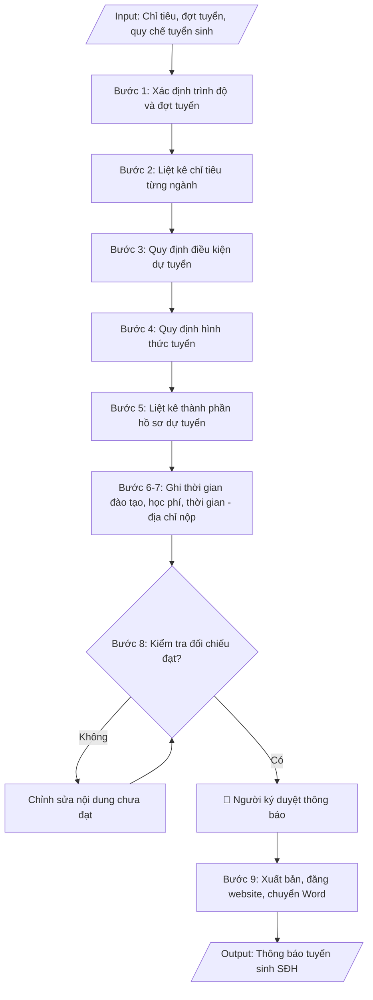

# Skill: Thông báo tuyển sinh thạc sĩ / tiến sĩ

## Khi nào dùng
Khi Phòng Đào tạo Sau đại học cần ban hành thông báo tuyển sinh trình độ thạc sĩ và/hoặc
tiến sĩ cho từng đợt trong năm, theo chỉ tiêu và kế hoạch đã được phê duyệt.

## Đầu vào (Input)

| Trường | Mô tả | Bắt buộc |
|---|---|---|
| `trinh_do` | Thạc sĩ / Tiến sĩ / Cả hai | Có |
| `dot_tuyen` | Đợt tuyển sinh (vd: Đợt 1 năm 2026) | Có |
| `chi_tieu_sdh` | Chỉ tiêu tuyển sinh từng ngành, từng trình độ | Có |
| `dieu_kien_du_tuyen` | Điều kiện dự tuyển: văn bằng, kinh nghiệm công tác, ngoại ngữ | Có |
| `hinh_thuc_tuyen` | Xét tuyển / Thi tuyển; môn thi hoặc tiêu chí xét tuyển | Có |
| `ho_so` | Thành phần hồ sơ dự tuyển | Có |
| `thoi_gian_dao_tao` | Thời gian đào tạo chuẩn từng trình độ | Có |
| `hoc_phi` | Học phí toàn khóa hoặc theo năm/tín chỉ | Không |
| `thoi_gian` | Hạn nộp hồ sơ, lịch thi/xét tuyển, lịch nhập học | Có |
| `dia_chi_nop` | Địa chỉ nộp hồ sơ | Có |
| `link_dang_ky` | Link đăng ký trực tuyến | Không |
| `nguoi_ky` | Người ký thông báo | Không (mặc định: Trưởng phòng Đào tạo SĐH) |

## Quy trình

**Bước 1. Xác định trình độ và đợt tuyển**
- Làm gì: ghi rõ thông báo áp dụng cho trình độ thạc sĩ, tiến sĩ hay cả hai; ghi rõ đợt tuyển sinh
  trong năm (ví dụ: Đợt 1 năm 2026); xác định đây là thông báo cho toàn trường hay theo khoa/ngành.
- Dùng input: `trinh_do`, `dot_tuyen`
- Vai trò: Chuyên viên Phòng Sau đại học · AI hỗ trợ: chốt phạm vi trình độ và đợt tuyển sinh trong tiêu đề · ⏱ ~15 phút (ước tính)
- Lưu ý nghiệp vụ: mỗi đợt tuyển chỉ có một thông báo chính thức; nếu tuyển cả hai trình độ thì
  nội dung các mục sau phải tách riêng rõ ràng theo trình độ, không lẫn lộn.
- → Kết quả bước: dòng tiêu đề phạm vi thông báo (trình độ + đợt tuyển) đã chốt.

**Bước 2. Liệt kê chỉ tiêu từng ngành**
- Làm gì: lập bảng chỉ tiêu chi tiết theo từng ngành đào tạo và từng trình độ (gồm mã ngành);
  đối chiếu tổng chỉ tiêu với kế hoạch tuyển sinh SĐH đã được Hiệu trưởng phê duyệt.
- Dùng input: `chi_tieu_sdh`, `trinh_do`
- Vai trò: Chuyên viên Phòng Sau đại học · AI hỗ trợ: lập bảng chỉ tiêu theo ngành/trình độ, đối chiếu kế hoạch đã duyệt · ⏱ ~45 phút (ước tính)
- Lưu ý nghiệp vụ: chỉ tiêu không được vượt quá năng lực đào tạo sau đại học đã xác định của
  trường; mã ngành phải đúng danh mục mã ngành đào tạo (thạc sĩ đầu 8, tiến sĩ đầu 9).
- → Kết quả bước: bảng chỉ tiêu tuyển sinh theo ngành và trình độ (có mã ngành).

**Bước 3. Quy định điều kiện dự tuyển**
- Làm gì: soạn điều kiện dự tuyển tách theo trình độ, đúng quy chế:
  - Thạc sĩ (Thông tư 23/2021/TT-BGDĐT): yêu cầu về văn bằng tốt nghiệp đại học (ngành phù hợp /
    ngành gần và các trường hợp phải học bổ sung kiến thức); điều kiện ngoại ngữ (bậc 3/6 trở lên
    hoặc tương đương).
  - Tiến sĩ (Thông tư 18/2021/TT-BGDĐT): yêu cầu về văn bằng thạc sĩ (hoặc đại học loại giỏi trở
    lên đối với trường hợp đặc biệt); kinh nghiệm nghiên cứu; công trình khoa học đã công bố;
    năng lực ngoại ngữ (bậc 4/6 trở lên hoặc tương đương).
- Dùng input: `dieu_kien_du_tuyen`, `trinh_do`
- Vai trò: Chuyên viên Phòng Sau đại học · AI hỗ trợ: soạn điều kiện dự tuyển đúng TT 23/2021, TT 18/2021 · ⏱ ~45 phút (ước tính)
- Lưu ý nghiệp vụ: mọi điều kiện ghi trong thông báo phải có căn cứ trong quy chế — không tự đặt
  thêm điều kiện ngoài quy chế; ghi rõ trường hợp "ngành gần" phải học bổ sung để thí sinh biết.
- → Kết quả bước: mục điều kiện dự tuyển theo từng trình độ, đúng TT 23/2021 và TT 18/2021.

**Bước 4. Quy định hình thức tuyển**
- Làm gì: ghi rõ hình thức tuyển của từng trình độ: xét tuyển (đánh giá hồ sơ, phỏng vấn, đánh giá
  đề cương nghiên cứu, bảo vệ đề cương trước tiểu ban — đối với tiến sĩ) hoặc thi tuyển (môn thi,
  hình thức thi, thang điểm, điểm liệt); nêu rõ cách tính điểm trúng tuyển và nguyên tắc xét trúng tuyển.
- Dùng input: `hinh_thuc_tuyen`, `trinh_do`
- Vai trò: Chuyên viên Phòng Sau đại học · AI hỗ trợ: soạn mục hình thức tuyển (xét tuyển/thi tuyển) theo từng trình độ · ⏱ ~30 phút (ước tính)
- Lưu ý nghiệp vụ: cách tính điểm trúng tuyển phải công khai, không mập mờ; nếu có điểm liệt thì
  ghi rõ mức điểm liệt từng môn/thành phần.
- → Kết quả bước: mục hình thức tuyển sinh theo từng trình độ (tiêu chí, thang điểm, cách tính
  điểm trúng tuyển).

**Bước 5. Liệt kê thành phần hồ sơ dự tuyển**
- Làm gì: liệt kê đầy đủ, đánh số từng loại giấy tờ: đơn dự tuyển theo mẫu; sơ yếu lý lịch có xác
  nhận; bản sao công chứng văn bằng, bảng điểm; bản sao chứng chỉ ngoại ngữ; đề cương nghiên cứu
  (đối với tiến sĩ); thư giới thiệu của nhà khoa học; minh chứng công trình khoa học (nếu có).
- Dùng input: `ho_so`, `trinh_do`
- Vai trò: Chuyên viên Phòng Sau đại học · AI hỗ trợ: liệt kê đầy đủ, đánh số từng loại giấy tờ hồ sơ · ⏱ ~20 phút (ước tính)
- Lưu ý nghiệp vụ: ghi rõ loại nào cần công chứng, loại nào cần bản gốc để đối chiếu; hồ sơ của
  tiến sĩ bắt buộc có đề cương nghiên cứu — thiếu là không đủ điều kiện xét.
- → Kết quả bước: danh mục thành phần hồ sơ dự tuyển đầy đủ, phân biệt theo trình độ.

**Bước 6. Ghi rõ thời gian đào tạo và học phí**
- Làm gì: ghi thời gian đào tạo chuẩn của từng trình độ (thạc sĩ 2 năm; tiến sĩ 3 năm đối với người
  đã có bằng thạc sĩ, 4 năm đối với người tốt nghiệp đại học); ghi mức học phí toàn khóa hoặc theo
  năm học/tín chỉ của từng trình độ.
- Dùng input: `thoi_gian_dao_tao`, `hoc_phi`, `trinh_do`
- Vai trò: Chuyên viên Phòng Sau đại học · AI hỗ trợ: soạn mục thời gian đào tạo chuẩn và học phí theo quy định · ⏱ ~20 phút (ước tính)
- Lưu ý nghiệp vụ: mức học phí phải khớp với quyết định học phí hiện hành của trường; ghi rõ học
  phí đã bao gồm hay chưa bao gồm lệ phí bảo vệ, in ấn luận văn/luận án.
- → Kết quả bước: mục thời gian đào tạo và học phí theo từng trình độ.

**Bước 7. Ghi rõ thời gian – địa chỉ nộp hồ sơ**
- Làm gì: ghi đầy đủ mốc thời gian: hạn nộp hồ sơ, lịch thi/xét tuyển, lịch công bố kết quả, lịch
  nhập học; ghi địa chỉ nộp hồ sơ trực tiếp/qua bưu điện và link đăng ký trực tuyến (nếu có).
- Dùng input: `thoi_gian`, `dia_chi_nop`, `link_dang_ky`
- Vai trò: Chuyên viên Phòng Sau đại học · AI hỗ trợ: soạn mục thời gian – địa chỉ, đối chiếu thông tin liên hệ · ⏱ ~30 phút (ước tính)
- Lưu ý nghiệp vụ: các mốc thời gian phải logic (hạn nộp < lịch xét < công bố < nhập học) và khớp
  với kế hoạch tuyển sinh đã duyệt; kiểm tra link đăng ký trực tuyến còn hoạt động.
- → Kết quả bước: mục thời gian và địa điểm nộp hồ sơ đầy đủ, logic.

**Bước 8. Kiểm tra, đối chiếu trước khi duyệt**
- Làm gì: đối chiếu toàn bộ nội dung với quy chế (TT 23/2021, TT 18/2021) và kế hoạch đã duyệt:
  điều kiện, chỉ tiêu, hình thức tuyển; kiểm tra link, số điện thoại, email, địa chỉ liên hệ;
  rà chính tả, thể thức văn bản.
- Dùng input: `chi_tieu_sdh`, `dieu_kien_du_tuyen`, `hinh_thuc_tuyen`, `link_dang_ky`
- Vai trò: Trưởng phòng Sau đại học · AI hỗ trợ: đối chiếu toàn bộ nội dung với quy chế TT 23/2021, TT 18/2021 · ⏱ ~1 giờ (ước tính)
- Lưu ý nghiệp vụ: sai số điện thoại, email, link đăng ký là lỗi phổ biến và gây hậu quả trực tiếp
  đến thí sinh — kiểm tra bằng cách gọi thử/truy cập thử; mọi nội dung chưa đạt thì chỉnh sửa
  rồi kiểm tra lại.
- → Kết quả bước: bản thông báo đã qua kiểm tra, đối chiếu đạt yêu cầu, sẵn sàng trình ký.

**Bước 9. Xuất bản thông báo**
- Làm gì: hoàn thiện thông báo ở định dạng markdown; trình người có thẩm quyền ký duyệt; đăng lên
  website trường và chuyển sang Word để lưu trữ, phát hành.
- Dùng input: `nguoi_ky`
- Vai trò: Hiệu trưởng/Phó Hiệu trưởng phụ trách ký duyệt · AI hỗ trợ: kiểm tra thể thức trước khi trình ký · ⏱ ~1 giờ (ước tính)
- Lưu ý nghiệp vụ: lưu bản đã ký (scan/PDF) kèm bản Word để đối chiếu khi có khiếu nại về nội dung
  tuyển sinh; thông báo trên website phải là bản mới nhất, gỡ bản cũ nếu có sửa đổi.
- → Kết quả bước: thông báo tuyển sinh SĐH đã ký duyệt, đã đăng website và lưu trữ.

## Luồng quy trình (Workflow)


## Đầu ra (Output)
- Thông báo tuyển sinh thạc sĩ/tiến sĩ hoàn chỉnh.
- Checklist kiểm tra trước khi công bố.

**Cấu trúc output chuẩn:** khung mẫu cố định của thông báo tuyển sinh sau đại học, các phần theo đúng thứ tự:
1. Phần đầu văn bản: tên trường + đơn vị ban hành (Phòng Đào tạo Sau đại học); quốc hiệu – tiêu ngữ;
   số, ký hiệu thông báo; địa danh, ngày tháng năm ban hành.
2. Tên thông báo và phạm vi: "THÔNG BÁO TUYỂN SINH SAU ĐẠI HỌC…" + trình độ (thạc sĩ/tiến sĩ) + đợt tuyển.
3. Phần căn cứ: Quy chế tuyển sinh và đào tạo trình độ thạc sĩ (TT 23/2021/TT-BGDĐT); Quy chế tuyển
   sinh và đào tạo trình độ tiến sĩ (TT 18/2021/TT-BGDĐT).
4. Nội dung chính theo thứ tự: I. Chỉ tiêu tuyển sinh (bảng theo ngành, có mã ngành, tách theo
   trình độ); II. Điều kiện dự tuyển (tách theo trình độ); III. Hình thức tuyển sinh (tách theo
   trình độ); IV. Hồ sơ dự tuyển; V. Thời gian đào tạo và học phí; VI. Thời gian và địa điểm
   nộp hồ sơ.
5. Thông tin liên hệ: số điện thoại, email.
6. Phần cuối: nơi nhận; chữ ký, họ tên người ký.
7. Sản phẩm kèm theo: checklist kiểm tra trước khi công bố.


## Checklist nghiệm thu
- [ ] Đủ các phần theo "Cấu trúc output chuẩn": phần đầu văn bản; tên thông báo + phạm vi (trình độ, đợt tuyển); phần căn cứ (TT 23/2021, TT 18/2021); nội dung I–VI (chỉ tiêu; điều kiện dự tuyển; hình thức tuyển; hồ sơ; thời gian đào tạo và học phí; thời gian – địa điểm nộp hồ sơ); thông tin liên hệ; nơi nhận, chữ ký; checklist trước công bố.
- [ ] Số liệu/nội dung trong output khớp với Input đã cho (trình độ, đợt tuyển, chỉ tiêu từng ngành, điều kiện, hình thức, hồ sơ, học phí, mốc thời gian, địa chỉ).
- [ ] Không bịa đặt số liệu, minh chứng, trích dẫn.
- [ ] Đúng thể thức văn bản hành chính của thông báo.
- [ ] Căn cứ pháp lý đầy đủ, còn hiệu lực (Thông tư 23/2021/TT-BGDĐT đối với thạc sĩ; Thông tư 18/2021/TT-BGDĐT đối với tiến sĩ).
- [ ] Đã qua Human gate: người có thẩm quyền (Trưởng phòng Đào tạo SĐH) đã ký duyệt thông báo.
- [ ] Chỉ tiêu không vượt năng lực đào tạo SĐH; mã ngành đúng danh mục (thạc sĩ đầu 8, tiến sĩ đầu 9); mỗi đợt tuyển chỉ một thông báo chính thức, nội dung hai trình độ tách riêng rõ ràng.
- [ ] Điều kiện dự tuyển đúng quy chế, không tự đặt thêm điều kiện ngoài quy chế; trường hợp "ngành gần" phải học bổ sung được ghi rõ.
- [ ] Mốc thời gian logic (nộp hồ sơ < xét tuyển < công bố < nhập học) và khớp kế hoạch đã duyệt; học phí khớp quyết định học phí hiện hành; số điện thoại, email, link đăng ký đã kiểm tra hoạt động thực tế.
Tiêu chí đạt = tất cả các ô được đánh dấu.

## Ví dụ mô phỏng (dữ liệu giả lập)

> Tất cả tên trường, cá nhân, số liệu dưới đây đều là **giả lập**, không liên quan tổ chức/cá nhân có thật.

### Input mẫu

| Trường | Giá trị |
|---|---|
| `trinh_do` | Thạc sĩ và Tiến sĩ |
| `dot_tuyen` | Đợt 1 năm 2026 |
| `chi_tieu_sdh` | Thạc sĩ: Quản trị kinh doanh 60, Kế toán 40, CNTT 50. Tiến sĩ: Quản trị kinh doanh 8, CNTT 6 |
| `dieu_kien_du_tuyen` | Thạc sĩ: tốt nghiệp ĐH ngành phù hợp; ngoại ngữ bậc 3/6 trở lên hoặc chứng chỉ tương đương; ngành gần phải học bổ sung. Tiến sĩ: tốt nghiệp thạc sĩ ngành phù hợp; có ít nhất 01 bài báo khoa học; ngoại ngữ bậc 4/6 |
| `hinh_thuc_tuyen` | Thạc sĩ: xét tuyển (đánh giá hồ sơ + phỏng vấn). Tiến sĩ: xét tuyển (đánh giá hồ sơ, đề cương nghiên cứu + bảo vệ đề cương trước tiểu ban) |
| `ho_so` | Đơn dự tuyển; sơ yếu lý lịch; bản sao văn bằng, bảng điểm; bản sao chứng chỉ ngoại ngữ; đề cương nghiên cứu (tiến sĩ); 02 thư giới thiệu; minh chứng công trình khoa học (tiến sĩ) |
| `thoi_gian_dao_tao` | Thạc sĩ: 2 năm; Tiến sĩ: 3 năm (thạc sĩ lên tiến sĩ) |
| `hoc_phi` | Thạc sĩ: 28 triệu đồng/năm; Tiến sĩ: 45 triệu đồng/năm |
| `thoi_gian` | Nhận hồ sơ: 01/3 – 30/4/2026. Xét tuyển: 15 – 20/5/2026. Công bố kết quả: 30/5/2026. Nhập học: 15/6/2026 |
| `dia_chi_nop` | Phòng Đào tạo Sau đại học, Trường Đại học A, 123 đường B, thành phố C |
| `nguoi_ky` | Trưởng phòng Đào tạo SĐH |

### Output mẫu

```
TRƯỜNG ĐẠI HỌC A            CỘNG HÒA XÃ HỘI CHỦ NGHĨA VIỆT NAM
PHÒNG ĐÀO TẠO SAU ĐẠI HỌC                    Độc lập – Tự do – Hạnh phúc
      Số: 32/TB-ĐHA-SĐH
                                                 Thành phố C, ngày 10 tháng 02 năm 2026

              THÔNG BÁO TUYỂN SINH SAU ĐẠI HỌC ĐỢT 1 NĂM 2026
                       (Trình độ thạc sĩ và tiến sĩ)

Căn cứ Quy chế tuyển sinh và đào tạo trình độ thạc sĩ ban hành kèm theo Thông tư
số 23/2021/TT-BGDĐT và Quy chế tuyển sinh và đào tạo trình độ tiến sĩ ban hành
kèm theo Thông tư số 18/2021/TT-BGDĐT của Bộ trưởng Bộ Giáo dục và Đào tạo,
Trường Đại học A thông báo tuyển sinh sau đại học đợt 1 năm 2026 như sau:

I. CHỈ TIÊU TUYỂN SINH

1. Trình độ thạc sĩ

| TT | Ngành đào tạo       | Mã ngành | Chỉ tiêu |
|----|---------------------|----------|----------|
| 1  | Quản trị kinh doanh | 8340101  | 60       |
| 2  | Kế toán             | 8340301  | 40       |
| 3  | Công nghệ thông tin | 8480101  | 50       |

2. Trình độ tiến sĩ

| TT | Ngành đào tạo       | Mã ngành | Chỉ tiêu |
|----|---------------------|----------|----------|
| 1  | Quản trị kinh doanh | 9340101  | 8        |
| 2  | Công nghệ thông tin | 9480101  | 6        |

II. ĐIỀU KIỆN DỰ TUYỂN

1. Trình độ thạc sĩ
- Đã tốt nghiệp đại học ngành phù hợp với ngành đăng ký dự tuyển; trường hợp
  tốt nghiệp ngành gần phải học bổ sung kiến thức theo quy định.
- Có năng lực ngoại ngữ từ bậc 3/6 trở lên theo Khung năng lực ngoại ngữ 6 bậc
  dùng cho Việt Nam hoặc chứng chỉ tương đương.

2. Trình độ tiến sĩ
- Đã tốt nghiệp thạc sĩ ngành phù hợp; có ít nhất 01 bài báo khoa học liên quan
  đến lĩnh vực dự định nghiên cứu.
- Có năng lực ngoại ngữ từ bậc 4/6 trở lên theo Khung năng lực ngoại ngữ 6 bậc
  dùng cho Việt Nam hoặc chứng chỉ tương đương.
- Có đề cương nghiên cứu và dự kiến người hướng dẫn.

III. HÌNH THỨC TUYỂN SINH
1. Trình độ thạc sĩ: xét tuyển (đánh giá hồ sơ dự tuyển và phỏng vấn trực tiếp).
2. Trình độ tiến sĩ: xét tuyển (đánh giá hồ sơ, đề cương nghiên cứu; ứng viên
   bảo vệ đề cương trước tiểu ban đánh giá).

IV. HỒ SƠ DỰ TUYỂN
- Đơn dự tuyển theo mẫu của Trường.
- Sơ yếu lý lịch có xác nhận.
- Bản sao công chứng văn bằng tốt nghiệp, bảng điểm.
- Bản sao chứng chỉ ngoại ngữ.
- Đề cương nghiên cứu (đối với trình độ tiến sĩ).
- 02 thư giới thiệu của nhà khoa học.
- Minh chứng công trình khoa học đã công bố (đối với trình độ tiến sĩ).

V. THỜI GIAN ĐÀO TẠO VÀ HỌC PHÍ
- Thời gian đào tạo: thạc sĩ 02 năm; tiến sĩ 03 năm (đối với người đã có bằng
  thạc sĩ).
- Học phí: thạc sĩ 28.000.000đ/năm; tiến sĩ 45.000.000đ/năm.

VI. THỜI GIAN VÀ ĐỊA ĐIỂM NỘP HỒ SƠ
- Nhận hồ sơ: từ 01/3/2026 đến 30/4/2026.
- Xét tuyển: 15 – 20/5/2026.
- Công bố kết quả: 30/5/2026.
- Nhập học: 15/6/2026.
- Địa điểm: Phòng Đào tạo Sau đại học, Trường Đại học A,
  123 đường B, thành phố C.

Mọi chi tiết xin liên hệ: 024.3xxx.xxxx – sdh@dha.edu.vn.

Nơi nhận:                                        TRƯỞNG PHÒNG ĐÀO TẠO SĐH
- Các khoa có đào tạo SĐH;
- Đăng website trường;                                   (đã ký)
- Lưu: VT, SĐH.
                                                     TS. Trần Văn D
```

### Checklist trước khi công bố (output kèm theo)
- [x] Chỉ tiêu từng ngành, từng trình độ trong phạm vi năng lực đào tạo SĐH
- [x] Điều kiện dự tuyển đúng Thông tư 23/2021 (thạc sĩ), 18/2021 (tiến sĩ)
- [x] Hình thức tuyển, hồ sơ, thời gian đào tạo, học phí đầy đủ
- [x] Thời gian nộp hồ sơ, xét tuyển, nhập học rõ ràng
- [x] Địa chỉ, số điện thoại, email liên hệ chính xác
- [x] Thể thức văn bản, chính tả đã rà soát

## Căn cứ & lưu ý
- Thông tư 23/2021/TT-BGDĐT ngày 30/8/2021 của Bộ GD&ĐT ban hành Quy chế tuyển
  sinh và đào tạo trình độ thạc sĩ.
- Thông tư 18/2021/TT-BGDĐT ngày 28/6/2021 của Bộ GD&ĐT ban hành Quy chế tuyển
  sinh và đào tạo trình độ tiến sĩ.
- Chỉ tiêu tuyển sinh sau đại học hằng năm do Hiệu trưởng quyết định trên cơ sở
  năng lực đào tạo và nhu cầu xã hội.
- Không dùng tên thật của trường/cá nhân khi mô phỏng.
