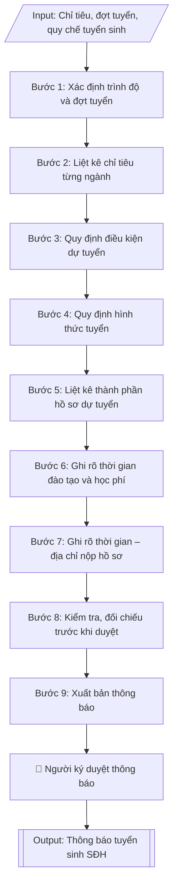

# Thông báo tuyển sinh thạc sĩ / tiến sĩ

## Định dạng và file đầu ra

Định dạng đầu ra có thể chọn theo sản phẩm/yêu cầu: .docx, .pdf. Đọc mục “Định dạng bổ sung” trong quy cách đầu ra trước khi chọn.

**Phải tạo file thực tế để tải xuống, không chỉ trả nội dung trong chat.** Định dạng mặc định của skill: **.docx**. Nếu có bảng số liệu nghiệp vụ yêu cầu file bảng tính riêng, tạo thêm Excel theo yêu cầu; không tự tạo file kiểm tra. Không chờ người dùng yêu cầu xuất file lần nữa. Ưu tiên định dạng người dùng chỉ định; đọc quy tắc xuất file tại references/quy-cach-dau-ra.md.

## Quy cách đầu ra và thông tin thiếu
Khi dựng file Word/Excel, áp dụng mục “Thể thức và bảng biểu khi dựng file” trong quy cách đầu ra (cỡ chữ từng thành phần, bảng nhiều trang, số trang, phụ lục). Đọc [quy cách và cấu trúc sản phẩm](references/quy-cach-dau-ra.md) trước khi soạn/xuất. File giao chỉ gồm sản phẩm nghiệp vụ được yêu cầu; kiểm tra nội bộ không xuất kèm. Thiếu thông tin thì giữ nguyên trường/mục và chỗ điền theo mẫu gốc (dòng dấu chấm, dấu gạch hoặc ô trống); không tự điền dữ liệu mẫu, số 0, mã chờ xác minh hay dòng chờ ký. Mẫu chuyên ngành còn áp dụng được ưu tiên về cấu trúc, mã biểu và người ký. Bản đầy đủ: [quy tắc chung](references/quy-tac-chung.md).

Khi người dùng yêu cầu bộ slide (.pptx), đọc mục “Xuất PowerPoint (.pptx) khi được yêu cầu” trong quy cách đầu ra.

## Kiểm soát áp dụng và phê duyệt
Trước khi chạy, xác định `ngay_ap_dung`, `loai_hinh_truong`, `quy_che_noi_bo`, `nguon_du_lieu`, `nguoi_kiem_duyet`; chỉ hỏi thông tin liên quan nghiệp vụ, không dùng giá trị giả định thay dữ liệu bắt buộc. Đối chiếu căn cứ pháp lý với văn bản gốc, hiệu lực, điều khoản áp dụng và chuyển tiếp. Bản đầy đủ: [quy tắc chung](references/quy-tac-chung.md).

## Giới hạn và human gate
AI hỗ trợ chuẩn bị và đối chiếu; cán bộ phụ trách kiểm tra dữ liệu/căn cứ, người có thẩm quyền duyệt và ký. Không đánh dấu đã ký, đã duyệt, đã công bố khi chưa có chứng cứ. Dữ liệu sinh viên, sức khỏe, nhân sự, tài chính chỉ dùng theo mục đích và phân quyền, che thông tin định danh khi dùng ví dụ (Luật 91/2025/QH15, hiệu lực 01/01/2026); không tải dữ liệu lên dịch vụ ngoài khi chưa có quyền. Bản đầy đủ: [quy tắc chung](references/quy-tac-chung.md).

## Khi nào dùng
Khi Phòng Đào tạo Sau đại học cần ban hành thông báo tuyển sinh trình độ thạc sĩ và/hoặc
tiến sĩ cho từng đợt trong năm, theo chỉ tiêu và kế hoạch đã được phê duyệt.

## Đầu vào (Input)

| Trường | Mô tả | Bắt buộc |
|---|---|---|
| `trinh_do` | Thạc sĩ / Tiến sĩ / Cả hai | Có |
| `dot_tuyen` | Đợt tuyển sinh (vd: Đợt 1 năm 2026) | Có |
| `chi_tieu_sdh` | Chỉ tiêu tuyển sinh từng ngành, từng trình độ | Có |
| `dieu_kien_du_tuyen` | Điều kiện dự tuyển: văn bằng, kinh nghiệm công tác, ngoại ngữ | Có |
| `hinh_thuc_tuyen` | Xét tuyển / Thi tuyển; môn thi hoặc tiêu chí xét tuyển | Có |
| `ho_so` | Thành phần hồ sơ dự tuyển | Có |
| `thoi_gian_dao_tao` | Thời gian đào tạo chuẩn từng trình độ | Có |
| `hoc_phi` | Học phí toàn khóa hoặc theo năm/tín chỉ | Không |
| `thoi_gian` | Hạn nộp hồ sơ, lịch thi/xét tuyển, lịch nhập học | Có |
| `dia_chi_nop` | Địa chỉ nộp hồ sơ | Có |
| `link_dang_ky` | Link đăng ký trực tuyến | Không |
| `nguoi_ky` | Người ký thông báo | Không (mặc định: Trưởng phòng Đào tạo SĐH) |

## Quy trình

**Bước 1. Xác định trình độ và đợt tuyển**
- Làm gì: ghi rõ thông báo áp dụng cho trình độ thạc sĩ, tiến sĩ hay cả hai; ghi rõ đợt tuyển sinh
  trong năm (ví dụ: Đợt 1 năm 2026); xác định đây là thông báo cho toàn trường hay theo khoa/ngành.
- Dùng input: `trinh_do`, `dot_tuyen`
- Vai trò: Chuyên viên Phòng Sau đại học · AI hỗ trợ: chốt phạm vi trình độ và đợt tuyển sinh trong tiêu đề · ⏱ ~15 phút (ước tính)
- Lưu ý nghiệp vụ: mỗi đợt tuyển chỉ có một thông báo chính thức; nếu tuyển cả hai trình độ thì
  nội dung các mục sau phải tách riêng rõ ràng theo trình độ, không lẫn lộn.
- → Kết quả bước: dòng tiêu đề phạm vi thông báo (trình độ + đợt tuyển) đã chốt.

**Bước 2. Liệt kê chỉ tiêu từng ngành**
- Làm gì: lập bảng chỉ tiêu chi tiết theo từng ngành đào tạo và từng trình độ (gồm mã ngành);
  đối chiếu tổng chỉ tiêu với kế hoạch tuyển sinh SĐH đã được Hiệu trưởng phê duyệt.
- Dùng input: `chi_tieu_sdh`, `trinh_do`
- Vai trò: Chuyên viên Phòng Sau đại học · AI hỗ trợ: lập bảng chỉ tiêu theo ngành/trình độ, đối chiếu kế hoạch đã duyệt · ⏱ ~45 phút (ước tính)
- Lưu ý nghiệp vụ: chỉ tiêu không được vượt quá năng lực đào tạo sau đại học đã xác định của
  trường; mã ngành phải đúng danh mục mã ngành đào tạo (thạc sĩ đầu 8, tiến sĩ đầu 9).
- → Kết quả bước: bảng chỉ tiêu tuyển sinh theo ngành và trình độ (có mã ngành).

**Bước 3. Quy định điều kiện dự tuyển**
- Làm gì: soạn điều kiện dự tuyển tách theo trình độ, đúng quy chế:
  - Thạc sĩ (Thông tư 23/2021/TT-BGDĐT): yêu cầu về văn bằng tốt nghiệp đại học (ngành phù hợp /
    ngành gần và các trường hợp phải học bổ sung kiến thức); điều kiện ngoại ngữ (bậc 3/6 trở lên
    hoặc tương đương).
  - Tiến sĩ (Thông tư 18/2021/TT-BGDĐT): yêu cầu về văn bằng thạc sĩ (hoặc đại học loại giỏi trở
    lên đối với trường hợp đặc biệt); kinh nghiệm nghiên cứu; công trình khoa học đã công bố;
    năng lực ngoại ngữ (bậc 4/6 trở lên hoặc tương đương).
- Dùng input: `dieu_kien_du_tuyen`, `trinh_do`
- Vai trò: Chuyên viên Phòng Sau đại học · AI hỗ trợ: soạn điều kiện dự tuyển đúng TT 23/2021, TT 18/2021 · ⏱ ~45 phút (ước tính)
- Lưu ý nghiệp vụ: mọi điều kiện ghi trong thông báo phải có căn cứ trong quy chế — không tự đặt
  thêm điều kiện ngoài quy chế; ghi rõ trường hợp "ngành gần" phải học bổ sung để thí sinh biết.
- → Kết quả bước: mục điều kiện dự tuyển theo từng trình độ, đúng TT 23/2021 và TT 18/2021.

**Bước 4. Quy định hình thức tuyển**
- Làm gì: ghi rõ hình thức tuyển của từng trình độ: xét tuyển (đánh giá hồ sơ, phỏng vấn, đánh giá
  đề cương nghiên cứu, bảo vệ đề cương trước tiểu ban — đối với tiến sĩ) hoặc thi tuyển (môn thi,
  hình thức thi, thang điểm, điểm liệt); nêu rõ cách tính điểm trúng tuyển và nguyên tắc xét trúng tuyển.
- Dùng input: `hinh_thuc_tuyen`, `trinh_do`
- Vai trò: Chuyên viên Phòng Sau đại học · AI hỗ trợ: soạn mục hình thức tuyển (xét tuyển/thi tuyển) theo từng trình độ · ⏱ ~30 phút (ước tính)
- Lưu ý nghiệp vụ: cách tính điểm trúng tuyển phải công khai, không mập mờ; nếu có điểm liệt thì
  ghi rõ mức điểm liệt từng môn/thành phần.
- → Kết quả bước: mục hình thức tuyển sinh theo từng trình độ (tiêu chí, thang điểm, cách tính
  điểm trúng tuyển).

**Bước 5. Liệt kê thành phần hồ sơ dự tuyển**
- Làm gì: liệt kê đầy đủ, đánh số từng loại giấy tờ: đơn dự tuyển theo mẫu; sơ yếu lý lịch có xác
  nhận; bản sao công chứng văn bằng, bảng điểm; bản sao chứng chỉ ngoại ngữ; đề cương nghiên cứu
  (đối với tiến sĩ); thư giới thiệu của nhà khoa học; minh chứng công trình khoa học (nếu có).
- Dùng input: `ho_so`, `trinh_do`
- Vai trò: Chuyên viên Phòng Sau đại học · AI hỗ trợ: liệt kê đầy đủ, đánh số từng loại giấy tờ hồ sơ · ⏱ ~20 phút (ước tính)
- Lưu ý nghiệp vụ: ghi rõ loại nào cần công chứng, loại nào cần bản gốc để đối chiếu; hồ sơ của
  tiến sĩ bắt buộc có đề cương nghiên cứu — thiếu là không đủ điều kiện xét.
- → Kết quả bước: danh mục thành phần hồ sơ dự tuyển đầy đủ, phân biệt theo trình độ.

**Bước 6. Ghi rõ thời gian đào tạo và học phí**
- Làm gì: ghi thời gian đào tạo chuẩn của từng trình độ (thạc sĩ 2 năm; tiến sĩ 3 năm đối với người
  đã có bằng thạc sĩ, 4 năm đối với người tốt nghiệp đại học); ghi mức học phí toàn khóa hoặc theo
  năm học/tín chỉ của từng trình độ.
- Dùng input: `thoi_gian_dao_tao`, `hoc_phi`, `trinh_do`
- Vai trò: Chuyên viên Phòng Sau đại học · AI hỗ trợ: soạn mục thời gian đào tạo chuẩn và học phí theo quy định · ⏱ ~20 phút (ước tính)
- Lưu ý nghiệp vụ: mức học phí phải khớp với quyết định học phí hiện hành của trường; ghi rõ học
  phí đã bao gồm hay chưa bao gồm lệ phí bảo vệ, in ấn luận văn/luận án.
- → Kết quả bước: mục thời gian đào tạo và học phí theo từng trình độ.

**Bước 7. Ghi rõ thời gian – địa chỉ nộp hồ sơ**
- Làm gì: ghi đầy đủ mốc thời gian: hạn nộp hồ sơ, lịch thi/xét tuyển, lịch công bố kết quả, lịch
  nhập học; ghi địa chỉ nộp hồ sơ trực tiếp/qua bưu điện và link đăng ký trực tuyến (nếu có).
- Dùng input: `thoi_gian`, `dia_chi_nop`, `link_dang_ky`
- Vai trò: Chuyên viên Phòng Sau đại học · AI hỗ trợ: soạn mục thời gian – địa chỉ, đối chiếu thông tin liên hệ · ⏱ ~30 phút (ước tính)
- Lưu ý nghiệp vụ: các mốc thời gian phải logic (hạn nộp < lịch xét < công bố < nhập học) và khớp
  với kế hoạch tuyển sinh đã duyệt; kiểm tra link đăng ký trực tuyến còn hoạt động.
- → Kết quả bước: mục thời gian và địa điểm nộp hồ sơ đầy đủ, logic.

**Bước 8. Kiểm tra, đối chiếu trước khi duyệt**
- Làm gì: đối chiếu toàn bộ nội dung với quy chế (TT 23/2021, TT 18/2021) và kế hoạch đã duyệt:
  điều kiện, chỉ tiêu, hình thức tuyển; kiểm tra link, số điện thoại, email, địa chỉ liên hệ;
  rà chính tả, thể thức văn bản.
- Dùng input: `chi_tieu_sdh`, `dieu_kien_du_tuyen`, `hinh_thuc_tuyen`, `link_dang_ky`
- Vai trò: Trưởng phòng Sau đại học · AI hỗ trợ: đối chiếu toàn bộ nội dung với quy chế TT 23/2021, TT 18/2021 · ⏱ ~1 giờ (ước tính)
- Lưu ý nghiệp vụ: sai số điện thoại, email, link đăng ký là lỗi phổ biến và gây hậu quả trực tiếp
  đến thí sinh — kiểm tra bằng cách gọi thử/truy cập thử; mọi nội dung chưa đạt thì chỉnh sửa
  rồi kiểm tra lại.
- → Kết quả bước: bản thông báo đã qua kiểm tra, đối chiếu đạt yêu cầu, sẵn sàng trình ký.

**Bước 9. Xuất bản thông báo**
- Làm gì: hoàn thiện thông báo file theo định dạng đầu ra của skill; trình người có thẩm quyền ký duyệt; đăng lên
  website trường và xuất file Word để lưu trữ, phát hành.
- Dùng input: `nguoi_ky`
- Vai trò: Hiệu trưởng/Phó Hiệu trưởng phụ trách ký duyệt · AI hỗ trợ: kiểm tra thể thức trước khi trình ký · ⏱ ~1 giờ (ước tính)
- Lưu ý nghiệp vụ: lưu bản đã ký (scan/PDF) kèm bản Word để đối chiếu khi có khiếu nại về nội dung
  tuyển sinh; thông báo trên website phải là bản mới nhất, gỡ bản cũ nếu có sửa đổi.
- → Kết quả bước: thông báo tuyển sinh SĐH đã ký duyệt, đã đăng website và lưu trữ.

## Luồng quy trình (Workflow)

## Đầu ra

File nghiệp vụ thực tế theo định dạng mặc định ở đầu skill hoặc định dạng người dùng yêu cầu, kèm liên kết tải trong phản hồi cuối.

Sản phẩm nghiệp vụ hoàn chỉnh theo [quy cách và cấu trúc](references/quy-cach-dau-ra.md), giữ các trường chưa có dữ liệu ở trạng thái trống. Không xuất kèm checklist/phụ lục kiểm tra đầu ra.

## Kiểm tra nội bộ trước khi giao
- [ ] Bố cục khớp mẫu áp dụng và cấu trúc tại references/quy-cach-dau-ra.md.
- [ ] Số liệu/nội dung trong output khớp với Input đã cho (trình độ, đợt tuyển, chỉ tiêu từng ngành, điều kiện, hình thức, hồ sơ, học phí, mốc thời gian, địa chỉ).
- [ ] Không bịa đặt số liệu, minh chứng, trích dẫn.
- [ ] Đúng thể thức văn bản hành chính của thông báo.
- [ ] Căn cứ pháp lý đầy đủ, còn hiệu lực (Thông tư 23/2021/TT-BGDĐT đối với thạc sĩ; Thông tư 18/2021/TT-BGDĐT đối với tiến sĩ).
- [ ] Đã qua Human gate: người có thẩm quyền (Trưởng phòng Đào tạo SĐH) đã ký duyệt thông báo.
- [ ] Chỉ tiêu không vượt năng lực đào tạo SĐH; mã ngành đúng danh mục (thạc sĩ đầu 8, tiến sĩ đầu 9); mỗi đợt tuyển chỉ một thông báo chính thức, nội dung hai trình độ tách riêng rõ ràng.
- [ ] Điều kiện dự tuyển đúng quy chế, không tự đặt thêm điều kiện ngoài quy chế; trường hợp "ngành gần" phải học bổ sung được ghi rõ.
- [ ] Mốc thời gian logic (nộp hồ sơ < xét tuyển < công bố < nhập học) và khớp kế hoạch đã duyệt; học phí khớp quyết định học phí hiện hành; số điện thoại, email, link đăng ký đã kiểm tra hoạt động thực tế.
Tiêu chí đạt = tất cả các ô được đánh dấu.

## Căn cứ & lưu ý
- Thông tư 23/2021/TT-BGDĐT ngày 30/8/2021 của Bộ GD&ĐT ban hành Quy chế tuyển
  sinh và đào tạo trình độ thạc sĩ.
- Thông tư 18/2021/TT-BGDĐT ngày 28/6/2021 của Bộ GD&ĐT ban hành Quy chế tuyển
  sinh và đào tạo trình độ tiến sĩ.
- Chỉ tiêu tuyển sinh sau đại học hằng năm do Hiệu trưởng quyết định trên cơ sở
  năng lực đào tạo và nhu cầu xã hội.
- Không dùng tên thật của trường/cá nhân khi mô phỏng.

## Quản trị phiên bản
- Phiên bản gói `1.3.2` (cập nhật 2026-10-10); hồ sơ đầy đủ tại [references/version.json](references/version.json).
- Người phê duyệt nghiệp vụ: **chưa chỉ định**. Trạng thái: dự thảo nghiệp vụ; kiểm tra pháp lý trước thực thi. Ngày cập nhật không đồng nghĩa mọi văn bản đã được rà soát toàn văn.
- Giấy phép theo LICENSE của kho (bản quyền CES Global). Lịch sử thay đổi: CHANGELOG.md.
