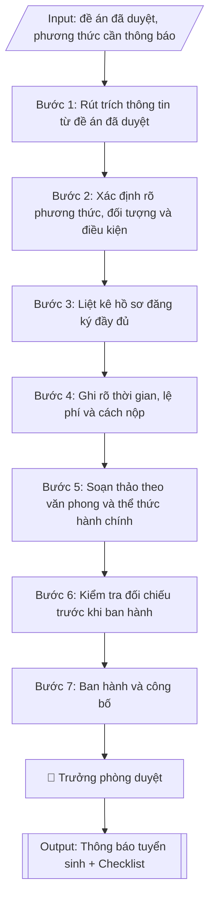

# Soạn thông báo tuyển sinh theo phương thức

## Định dạng và file đầu ra
Định dạng đầu ra có thể chọn theo sản phẩm/yêu cầu: .docx, .pdf. Đọc mục “Định dạng bổ sung” trong quy cách đầu ra trước khi chọn.

**Phải tạo file thực tế để tải xuống, không chỉ trả nội dung trong chat.** Định dạng mặc định của skill: **.docx**. Nếu có bảng số liệu nghiệp vụ yêu cầu file bảng tính riêng, tạo thêm Excel theo yêu cầu; không tự tạo file kiểm tra. Không chờ người dùng yêu cầu xuất file lần nữa. Ưu tiên định dạng người dùng chỉ định; đọc quy tắc xuất file tại references/quy-cach-dau-ra.md.

## Quy cách đầu ra và thông tin thiếu
Khi dựng file Word/Excel, áp dụng mục “Thể thức và bảng biểu khi dựng file” trong quy cách đầu ra (cỡ chữ từng thành phần, bảng nhiều trang, số trang, phụ lục). Đọc [quy cách và cấu trúc sản phẩm](references/quy-cach-dau-ra.md) trước khi soạn/xuất. File giao chỉ gồm sản phẩm nghiệp vụ được yêu cầu; kiểm tra nội bộ không xuất kèm. Thiếu thông tin thì giữ nguyên trường/mục và chỗ điền theo mẫu gốc (dòng dấu chấm, dấu gạch hoặc ô trống); không tự điền dữ liệu mẫu, số 0, mã chờ xác minh hay dòng chờ ký. Mẫu chuyên ngành còn áp dụng được ưu tiên về cấu trúc, mã biểu và người ký. Bản đầy đủ: [quy tắc chung](references/quy-tac-chung.md).

Khi người dùng yêu cầu bộ slide (.pptx), đọc mục “Xuất PowerPoint (.pptx) khi được yêu cầu” trong quy cách đầu ra.

## Kiểm soát áp dụng và phê duyệt
Trước khi chạy, xác định `ngay_ap_dung`, `loai_hinh_truong`, `quy_che_noi_bo`, `nguon_du_lieu`, `nguoi_kiem_duyet`; chỉ hỏi thông tin liên quan nghiệp vụ, không dùng giá trị giả định thay dữ liệu bắt buộc. Đối chiếu căn cứ pháp lý với văn bản gốc, hiệu lực, điều khoản áp dụng và chuyển tiếp. Bản đầy đủ: [quy tắc chung](references/quy-tac-chung.md).

Nếu có cập nhật pháp lý dưới đây, đọc [căn cứ và điều kiện áp dụng](references/phap-ly.md) trước khi làm. Quy trình dưới đây giữ nghiệp vụ từ bản gốc; mọi viện dẫn văn bản, mẫu biểu, điều khoản phải theo căn cứ đã chọn trong phap-ly.md, không theo văn bản cũ.

## Giới hạn và human gate
AI hỗ trợ chuẩn bị và đối chiếu; cán bộ phụ trách kiểm tra dữ liệu/căn cứ, người có thẩm quyền duyệt và ký. Không đánh dấu đã ký, đã duyệt, đã công bố khi chưa có chứng cứ. Dữ liệu sinh viên, sức khỏe, nhân sự, tài chính chỉ dùng theo mục đích và phân quyền, che thông tin định danh khi dùng ví dụ (Luật 91/2025/QH15, hiệu lực 01/01/2026); không tải dữ liệu lên dịch vụ ngoài khi chưa có quyền. Bản đầy đủ: [quy tắc chung](references/quy-tac-chung.md).

## Khi nào dùng
Khi cần ban hành thông báo tuyển sinh cho một phương thức xét tuyển cụ thể (xét điểm thi
TN THPT, xét học bạ, xét tuyển thẳng, xét kết quả ĐGNL/ĐGTD...) hoặc một đợt tuyển sinh bổ
sung, dựa trên đề án tuyển sinh đã được phê duyệt.

## Đầu vào (Input)
| Trường | Mô tả | Bắt buộc |
|---|---|---|
| `phuong_thuc` | Phương thức xét tuyển của thông báo (vd: Xét tuyển theo kết quả học tập THPT) | Có |
| `de_an_can_cu` | Số, ngày ký của đề án tuyển sinh đã duyệt | Có |
| `doi_tuong` | Đối tượng được đăng ký xét tuyển | Có |
| `dieu_kien` | Điều kiện xét tuyển (ngưỡng điểm, hạnh kiểm, tốt nghiệp...) | Có |
| `nganh_tuyen` | Danh sách ngành tuyển theo phương thức + chỉ tiêu | Có |
| `ho_so` | Thành phần hồ sơ đăng ký | Có |
| `thoi_gian` | Thời gian nhận hồ sơ, xét tuyển, công bố kết quả, nhập học | Có |
| `le_phi` | Lệ phí xét tuyển | Không |
| `dia_chi_nop` | Địa chỉ nộp hồ sơ trực tiếp / qua bưu điện | Có |
| `link_dang_ky` | Link đăng ký trực tuyến | Không |
| `lien_he` | Điện thoại, email tư vấn tuyển sinh | Không |

## Quy trình
**Ràng buộc pháp lý khi thực hiện** (trích references/phap-ly.md; đối chiếu toàn văn và hiệu lực tại ngày nghiệp vụ):
- Thông tư 06/2026/TT-BGDĐT, hiệu lực 15/02/2026: Yêu cầu năm tuyển sinh, phương thức, trình độ và đề án đã duyệt. Đối chiếu quy chế 06/2026 và hướng dẫn năm tuyển sinh về điều kiện, quy đổi điểm, điểm cộng, thứ tự nguyện vọng; không giữ công thức cũ hoặc cộng hai lần chứng chỉ. Không tự đặt chỉ tiêu/ngưỡng khi chưa có quyết định và căn cứ.
- Trước Bước 1: chọn căn cứ theo đối tượng, loại hình trường và chuyển tiếp; lập bảng văn bản / điều khoản / lý do áp dụng / bằng chứng. Thiếu văn bản gốc hoặc điều khoản thì ghi nhận nội bộ [CẦN XÁC MINH] (không đưa vào file giao), để trống phần tương ứng, chưa kết luận tuân thủ.
- Các con số, thời hạn, số điều, số mức xếp loại, hệ số và mẫu biểu nêu trong các bước dưới đây được giữ từ quy trình gốc (trước cập nhật pháp lý); chỉ dùng khi đã đối chiếu đúng với căn cứ đã chọn, khác thì theo căn cứ. Danh sách điểm cần đối chiếu: docs/DIEM_CAN_DOI_CHIEU_PHAP_LY.md.

**Bước 1. Rút trích thông tin từ đề án đã duyệt**
- Làm gì: mở đề án tuyển sinh đã được phê duyệt (số, ngày ký trong `de_an_can_cu`); chỉ lấy
  đúng các thông tin đã duyệt cho `phuong_thuc` cần thông báo: danh sách ngành, chỉ tiêu,
  ngưỡng đầu vào, lệ phí; lập bảng đối chiếu nguồn để mỗi con số trong thông báo đều truy
  được về điều/mục tương ứng trong đề án.
- Dùng input: `phuong_thuc`, `de_an_can_cu`, `nganh_tuyen`, `dieu_kien`, `le_phi`.
- Vai trò: Chuyên viên Phòng Đào tạo · AI hỗ trợ: rút trích sơ bộ thông tin, lập bảng đối chiếu nguồn với đề án · ⏱ ~30 phút (ước tính)
- Lưu ý nghiệp vụ: tuyệt đối không tự ý thêm ngành, thay đổi chỉ tiêu hoặc hạ ngưỡng so
  với đề án — đây là lỗi pháp lý nghiêm trọng; nếu phát hiện đề án thiếu thông tin cần
  thiết thì dừng lại, xin điều chỉnh đề án bằng văn bản trước khi viết thông báo.
- → Kết quả bước: bảng rút trích thông tin đã duyệt cho phương thức cần thông báo (có
  ghi nguồn điều/mục trong đề án).

**Bước 2. Xác định rõ phương thức, đối tượng và điều kiện**
- Làm gì: ghi tên đầy đủ của `phuong_thuc`; diễn giải `doi_tuong` và `dieu_kien` bằng câu văn
  dễ hiểu cho thí sinh và phụ huynh (tránh thuật ngữ hành chính khó hiểu); nêu cụ thể cách
  tính điểm xét tuyển của phương thức này (công thức, hệ số nếu có).
- Dùng input: `phuong_thuc`, `doi_tuong`, `dieu_kien`.
- Vai trò: Chuyên viên Phòng Đào tạo · AI hỗ trợ: diễn giải văn phong phổ thông, kiểm tra tính đo lường được của điều kiện · ⏱ ~30 phút (ước tính)
- Lưu ý nghiệp vụ: điều kiện phải đo lường được (vd: "điểm trung bình lớp 12 ≥ 6,5" chứ
  không viết "học lực khá trở lên" gây tranh cãi); mọi ngưỡng trong thông báo phải bằng đúng
  ngưỡng trong đề án.
- → Kết quả bước: mục "Đối tượng và điều kiện xét tuyển" hoàn chỉnh, văn phong phổ thông.

**Bước 3. Liệt kê hồ sơ đăng ký đầy đủ**
- Làm gì: liệt kê từng loại giấy tờ trong `ho_so`: phiếu đăng ký (ghi rõ theo mẫu nào, lấy ở
  đâu), bản sao học bạ/bằng tốt nghiệp/CCCD (ghi rõ bản chính hay bản sao, có cần công chứng
  không), giấy chứng nhận ưu tiên; ghi số lượng bản của từng loại; đánh số thứ tự để thí sinh
  tự kiểm tra.
- Dùng input: `ho_so`.
- Vai trò: Chuyên viên Phòng Đào tạo · AI hỗ trợ: soạn danh mục giấy tờ, kiểm tra loại bản và số lượng · ⏱ ~20 phút (ước tính)
- Lưu ý nghiệp vụ: bẫy thường gặp — quên ghi "bản sao công chứng" hay "bản chính" khiến thí
  sinh nộp sai phải bổ sung; thiếu mục giấy tờ ưu tiên làm thí sinh mất quyền lợi; hồ sơ
  nộp trực tuyến và nộp trực tiếp có thể khác nhau, phải ghi riêng nếu khác.
- → Kết quả bước: danh mục hồ sơ đánh số thứ tự, ghi rõ loại bản và số lượng từng loại.

**Bước 4. Ghi rõ thời gian, lệ phí và cách nộp**
- Làm gì: ghi cụ thể từ `thoi_gian`: ngày bắt đầu/kết thúc nhận hồ sơ, lịch xét tuyển, ngày
  công bố kết quả, thời gian nhập học; ghi mức `le_phi` và hình thức nộp; ghi `dia_chi_nop`
  (nộp trực tiếp/qua bưu điện) và `link_dang_ky` (nộp trực tuyến); kiểm tra link truy cập
  được trước khi đưa vào văn bản.
- Dùng input: `thoi_gian`, `le_phi`, `dia_chi_nop`, `link_dang_ky`, `lien_he`.
- Vai trò: Chuyên viên Phòng Đào tạo · AI hỗ trợ: soạn các mục thời gian/lệ phí/cách nộp, kiểm tra link và địa chỉ liên hệ · ⏱ ~30 phút (ước tính)
- Lưu ý nghiệp vụ: thời gian phải ghi đủ ngày/tháng/năm, tránh "trong tháng 7"; kiểm tra
  link đăng ký hoạt động thật (bẫy: link sai/chết là lỗi công bố nghiêm trọng); số điện
  thoại, email tư vấn phải có người trực trong suốt đợt nhận hồ sơ.
- → Kết quả bước: các mục thời gian, lệ phí, cách thức nộp hồ sơ hoàn chỉnh và đã kiểm
  tra link/liên hệ.

**Bước 5. Soạn thảo theo văn phong và thể thức hành chính**
- Làm gì: ráp các mục đã chuẩn bị ở Bước 2–4 thành văn bản hoàn chỉnh; đảm bảo đầy đủ thể
  thức: quốc hiệu, tiêu ngữ, tên cơ quan ban hành, số ký hiệu, địa điểm – ngày tháng, tên
  văn bản, căn cứ đề án, nội dung các mục, nơi nhận, chữ ký; văn phong rõ ràng, ngắn gọn,
  thu hút nhưng chuẩn hành chính, không quảng cáo quá đà.
- Dùng input: toàn bộ các trường input (tổng hợp).
- Vai trò: Chuyên viên Phòng Đào tạo · AI hỗ trợ: ráp dự thảo đầy đủ thể thức văn bản hành chính · ⏱ ~30 phút (ước tính)
- Lưu ý nghiệp vụ: phần "Căn cứ" phải trích đúng số, ngày ký của đề án đã duyệt; tên phương
  thức trong tiêu đề phải khớp 100% tên phương thức trong đề án.
- → Kết quả bước: dự thảo thông báo tuyển sinh đầy đủ thể thức văn bản hành chính.

**Bước 6. Kiểm tra đối chiếu trước khi ban hành**
- Làm gì: đối chiếu từng con số trong dự thảo với đề án đã duyệt (ngành, chỉ tiêu, ngưỡng,
  lệ phí); kiểm tra lại link đăng ký, số điện thoại, địa chỉ nộp hồ sơ; rà chính tả và thể
  thức; lập checklist đánh dấu từng nội dung đã kiểm tra.
- Dùng input: `de_an_can_cu`, `link_dang_ky`, `lien_he`, `dia_chi_nop` (đối chiếu).
- Vai trò: Chuyên viên Phòng Đào tạo (người thứ hai đọc soát độc lập) · AI hỗ trợ: đối chiếu sơ bộ số liệu với đề án, lập checklist kiểm tra · ⏱ ~45 phút (ước tính)
- Lưu ý nghiệp vụ: đây là cổng chặn lỗi cuối — sai một con số chỉ tiêu hay một ký tự trong
  link đăng ký đều gây hậu quả công khai; nên có người thứ hai đọc soát độc lập.
- → Kết quả bước: checklist kiểm tra trước khi công bố có đánh dấu đạt từng nội dung;
  dự thảo đã sửa lỗi (nếu có).

**Bước 7. Ban hành và công bố**
- Làm gì: trình người có thẩm quyền (Trưởng phòng Đào tạo) ký ban hành; đăng thông báo lên
  website trường, fanpage và các kênh truyền thông; chuyển file sang định dạng Word để lưu
  hồ sơ và gửi các khoa phối hợp.
- Dùng input: `phuong_thuc` (để ghi đúng tên phương thức trong tiêu đề khi đăng tải).
- Vai trò: Trưởng phòng Đào tạo ký ban hành; chuyên viên Phòng Đào tạo đăng công khai · AI hỗ trợ: chuẩn bị tài liệu trình ký và đăng tải lên các kênh · ⏱ ~30 phút (ước tính)
- Lưu ý nghiệp vụ: ghi lại ngày giờ đăng công khai để làm bằng chứng đã công bố đúng hạn;
  mọi điều chỉnh sau công bố phải ban hành thông báo sửa đổi, không được sửa lặng lẽ.
- → Kết quả bước: thông báo tuyển sinh hoàn chỉnh đã ký, đã đăng công khai và lưu hồ sơ.

## Luồng quy trình (Workflow)

## Đầu ra
- Thông báo tuyển sinh hoàn chỉnh theo phương thức.
- Checklist kiểm tra trước khi công bố.

File nghiệp vụ thực tế theo định dạng mặc định ở đầu skill hoặc định dạng người dùng yêu cầu, kèm liên kết tải trong phản hồi cuối.

Sản phẩm nghiệp vụ hoàn chỉnh theo [quy cách và cấu trúc](references/quy-cach-dau-ra.md), giữ các trường chưa có dữ liệu ở trạng thái trống. Không xuất kèm checklist/phụ lục kiểm tra đầu ra.

## Kiểm tra nội bộ trước khi giao
Các tiêu chí sau dùng để tự đối chiếu; không sao chép vào file xuất. Mục thiếu dữ liệu được để trống, không đánh dấu đã đạt hoặc đã duyệt.

- [ ] Đủ các phần và đúng bố cục theo cấu trúc tại references/quy-cach-dau-ra.md (không theo cấu trúc của bản gốc).
- [ ] Tên phương thức, danh sách ngành, chỉ tiêu, ngưỡng, lệ phí khớp 100% đề án đã duyệt (đúng số, ngày ký nêu trong phần Căn cứ).
- [ ] Không tự ý thêm ngành, thay đổi chỉ tiêu hay hạ ngưỡng so với đề án.
- [ ] Điều kiện xét tuyển diễn đạt dễ hiểu, đo lường được (không gây tranh cãi khi áp dụng).
- [ ] Hồ sơ ghi rõ loại bản (bản chính/bản sao công chứng) và số lượng từng loại giấy tờ.
- [ ] Thời gian ghi đủ ngày/tháng/năm; link đăng ký trực tuyến truy cập được; số điện thoại/email tư vấn có người trực.
- [ ] Mọi số liệu, địa chỉ, link, thông tin liên hệ khớp với Input đã cho; không bịa đặt.
- [ ] Đúng thể thức văn bản hành chính theo NĐ 30/2020/NĐ-CP.
- [ ] Căn cứ pháp lý đầy đủ, còn hiệu lực (đề án đã duyệt + Quy chế tuyển sinh văn bản hiện hành nêu tại phap-ly.md).
- [ ] Đã qua Human gate: Trưởng phòng Đào tạo đã ký ban hành.

## Căn cứ & lưu ý
- Căn cứ hiện hành: xem [căn cứ và điều kiện áp dụng](references/phap-ly.md); phải đối chiếu văn bản gốc, hiệu lực và chuyển tiếp tại ngày nghiệp vụ.
- Đề án tuyển sinh hằng năm đã được Hiệu trưởng phê duyệt.
- Thông tin trên thông báo phải khớp 100% với đề án đã duyệt; mọi điều chỉnh
  (nếu có) phải được phê duyệt bằng văn bản trước khi công bố.
- Không dùng tên thật của trường/cá nhân khi mô phỏng.

## Tư liệu đối chiếu
Bản gốc trước cập nhật pháp lý (kèm ví dụ giả lập) lưu tại `references/quy-trinh-lich-su.md`, chỉ để đối chiếu hồ sơ lịch sử; không dùng căn cứ, mẫu hay số liệu trong đó làm chỉ dẫn hiện hành.

## Quản trị phiên bản
- Phiên bản gói `1.3.2` (cập nhật 2026-10-10); hồ sơ đầy đủ tại [references/version.json](references/version.json).
- Người phê duyệt nghiệp vụ: **chưa chỉ định**. Trạng thái: dự thảo nghiệp vụ; kiểm tra pháp lý trước thực thi. Ngày cập nhật không đồng nghĩa mọi văn bản đã được rà soát toàn văn.
- Giấy phép theo LICENSE của kho (bản quyền CES Global). Lịch sử thay đổi: CHANGELOG.md.
