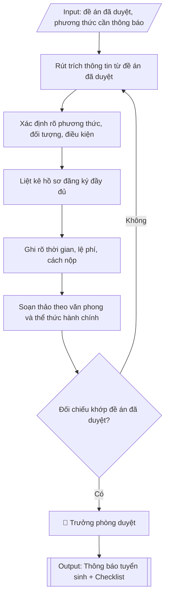

# Skill: Soạn thông báo tuyển sinh theo phương thức

## Khi nào dùng
Khi cần ban hành thông báo tuyển sinh cho một phương thức xét tuyển cụ thể (xét điểm thi
TN THPT, xét học bạ, xét tuyển thẳng, xét kết quả ĐGNL/ĐGTD...) hoặc một đợt tuyển sinh bổ
sung, dựa trên đề án tuyển sinh đã được phê duyệt.

## Đầu vào (Input)

| Trường | Mô tả | Bắt buộc |
|---|---|---|
| `phuong_thuc` | Phương thức xét tuyển của thông báo (vd: Xét tuyển theo kết quả học tập THPT) | Có |
| `de_an_can_cu` | Số, ngày ký của đề án tuyển sinh đã duyệt | Có |
| `doi_tuong` | Đối tượng được đăng ký xét tuyển | Có |
| `dieu_kien` | Điều kiện xét tuyển (ngưỡng điểm, hạnh kiểm, tốt nghiệp...) | Có |
| `nganh_tuyen` | Danh sách ngành tuyển theo phương thức + chỉ tiêu | Có |
| `ho_so` | Thành phần hồ sơ đăng ký | Có |
| `thoi_gian` | Thời gian nhận hồ sơ, xét tuyển, công bố kết quả, nhập học | Có |
| `le_phi` | Lệ phí xét tuyển | Không |
| `dia_chi_nop` | Địa chỉ nộp hồ sơ trực tiếp / qua bưu điện | Có |
| `link_dang_ky` | Link đăng ký trực tuyến | Không |
| `lien_he` | Điện thoại, email tư vấn tuyển sinh | Không |

## Quy trình

**Bước 1. Rút trích thông tin từ đề án đã duyệt**
- Làm gì: mở đề án tuyển sinh đã được phê duyệt (số, ngày ký trong `de_an_can_cu`); chỉ lấy
  đúng các thông tin đã duyệt cho `phuong_thuc` cần thông báo: danh sách ngành, chỉ tiêu,
  ngưỡng đầu vào, lệ phí; lập bảng đối chiếu nguồn để mỗi con số trong thông báo đều truy
  được về điều/mục tương ứng trong đề án.
- Dùng input: `phuong_thuc`, `de_an_can_cu`, `nganh_tuyen`, `dieu_kien`, `le_phi`.
- Vai trò: Chuyên viên Phòng Đào tạo · AI hỗ trợ: rút trích sơ bộ thông tin, lập bảng đối chiếu nguồn với đề án · ⏱ ~30 phút (ước tính)
- Lưu ý nghiệp vụ: tuyệt đối không tự ý thêm ngành, thay đổi chỉ tiêu hoặc hạ ngưỡng so
  với đề án — đây là lỗi pháp lý nghiêm trọng; nếu phát hiện đề án thiếu thông tin cần
  thiết thì dừng lại, xin điều chỉnh đề án bằng văn bản trước khi viết thông báo.
- → Kết quả bước: bảng rút trích thông tin đã duyệt cho phương thức cần thông báo (có
  ghi nguồn điều/mục trong đề án).

**Bước 2. Xác định rõ phương thức, đối tượng và điều kiện**
- Làm gì: ghi tên đầy đủ của `phuong_thuc`; diễn giải `doi_tuong` và `dieu_kien` bằng câu văn
  dễ hiểu cho thí sinh và phụ huynh (tránh thuật ngữ hành chính khó hiểu); nêu cụ thể cách
  tính điểm xét tuyển của phương thức này (công thức, hệ số nếu có).
- Dùng input: `phuong_thuc`, `doi_tuong`, `dieu_kien`.
- Vai trò: Chuyên viên Phòng Đào tạo · AI hỗ trợ: diễn giải văn phong phổ thông, kiểm tra tính đo lường được của điều kiện · ⏱ ~30 phút (ước tính)
- Lưu ý nghiệp vụ: điều kiện phải đo lường được (vd: "điểm trung bình lớp 12 ≥ 6,5" chứ
  không viết "học lực khá trở lên" gây tranh cãi); mọi ngưỡng trong thông báo phải bằng đúng
  ngưỡng trong đề án.
- → Kết quả bước: mục "Đối tượng và điều kiện xét tuyển" hoàn chỉnh, văn phong phổ thông.

**Bước 3. Liệt kê hồ sơ đăng ký đầy đủ**
- Làm gì: liệt kê từng loại giấy tờ trong `ho_so`: phiếu đăng ký (ghi rõ theo mẫu nào, lấy ở
  đâu), bản sao học bạ/bằng tốt nghiệp/CCCD (ghi rõ bản chính hay bản sao, có cần công chứng
  không), giấy chứng nhận ưu tiên; ghi số lượng bản của từng loại; đánh số thứ tự để thí sinh
  tự kiểm tra.
- Dùng input: `ho_so`.
- Vai trò: Chuyên viên Phòng Đào tạo · AI hỗ trợ: soạn danh mục giấy tờ, kiểm tra loại bản và số lượng · ⏱ ~20 phút (ước tính)
- Lưu ý nghiệp vụ: bẫy thường gặp — quên ghi "bản sao công chứng" hay "bản chính" khiến thí
  sinh nộp sai phải bổ sung; thiếu mục giấy tờ ưu tiên làm thí sinh mất quyền lợi; hồ sơ
  nộp trực tuyến và nộp trực tiếp có thể khác nhau, phải ghi riêng nếu khác.
- → Kết quả bước: danh mục hồ sơ đánh số thứ tự, ghi rõ loại bản và số lượng từng loại.

**Bước 4. Ghi rõ thời gian, lệ phí và cách nộp**
- Làm gì: ghi cụ thể từ `thoi_gian`: ngày bắt đầu/kết thúc nhận hồ sơ, lịch xét tuyển, ngày
  công bố kết quả, thời gian nhập học; ghi mức `le_phi` và hình thức nộp; ghi `dia_chi_nop`
  (nộp trực tiếp/qua bưu điện) và `link_dang_ky` (nộp trực tuyến); kiểm tra link truy cập
  được trước khi đưa vào văn bản.
- Dùng input: `thoi_gian`, `le_phi`, `dia_chi_nop`, `link_dang_ky`, `lien_he`.
- Vai trò: Chuyên viên Phòng Đào tạo · AI hỗ trợ: soạn các mục thời gian/lệ phí/cách nộp, kiểm tra link và địa chỉ liên hệ · ⏱ ~30 phút (ước tính)
- Lưu ý nghiệp vụ: thời gian phải ghi đủ ngày/tháng/năm, tránh "trong tháng 7"; kiểm tra
  link đăng ký hoạt động thật (bẫy: link sai/chết là lỗi công bố nghiêm trọng); số điện
  thoại, email tư vấn phải có người trực trong suốt đợt nhận hồ sơ.
- → Kết quả bước: các mục thời gian, lệ phí, cách thức nộp hồ sơ hoàn chỉnh và đã kiểm
  tra link/liên hệ.

**Bước 5. Soạn thảo theo văn phong và thể thức hành chính**
- Làm gì: ráp các mục đã chuẩn bị ở Bước 2–4 thành văn bản hoàn chỉnh; đảm bảo đầy đủ thể
  thức: quốc hiệu, tiêu ngữ, tên cơ quan ban hành, số ký hiệu, địa điểm – ngày tháng, tên
  văn bản, căn cứ đề án, nội dung các mục, nơi nhận, chữ ký; văn phong rõ ràng, ngắn gọn,
  thu hút nhưng chuẩn hành chính, không quảng cáo quá đà.
- Dùng input: toàn bộ các trường input (tổng hợp).
- Vai trò: Chuyên viên Phòng Đào tạo · AI hỗ trợ: ráp dự thảo đầy đủ thể thức văn bản hành chính · ⏱ ~30 phút (ước tính)
- Lưu ý nghiệp vụ: phần "Căn cứ" phải trích đúng số, ngày ký của đề án đã duyệt; tên phương
  thức trong tiêu đề phải khớp 100% tên phương thức trong đề án.
- → Kết quả bước: dự thảo thông báo tuyển sinh đầy đủ thể thức văn bản hành chính.

**Bước 6. Kiểm tra đối chiếu trước khi ban hành**
- Làm gì: đối chiếu từng con số trong dự thảo với đề án đã duyệt (ngành, chỉ tiêu, ngưỡng,
  lệ phí); kiểm tra lại link đăng ký, số điện thoại, địa chỉ nộp hồ sơ; rà chính tả và thể
  thức; lập checklist đánh dấu từng nội dung đã kiểm tra.
- Dùng input: `de_an_can_cu`, `link_dang_ky`, `lien_he`, `dia_chi_nop` (đối chiếu).
- Vai trò: Chuyên viên Phòng Đào tạo (người thứ hai đọc soát độc lập) · AI hỗ trợ: đối chiếu sơ bộ số liệu với đề án, lập checklist kiểm tra · ⏱ ~45 phút (ước tính)
- Lưu ý nghiệp vụ: đây là cổng chặn lỗi cuối — sai một con số chỉ tiêu hay một ký tự trong
  link đăng ký đều gây hậu quả công khai; nên có người thứ hai đọc soát độc lập.
- → Kết quả bước: checklist kiểm tra trước khi công bố có đánh dấu đạt từng nội dung;
  dự thảo đã sửa lỗi (nếu có).

**Bước 7. Ban hành và công bố**
- Làm gì: trình người có thẩm quyền (Trưởng phòng Đào tạo) ký ban hành; đăng thông báo lên
  website trường, fanpage và các kênh truyền thông; chuyển file sang định dạng Word để lưu
  hồ sơ và gửi các khoa phối hợp.
- Dùng input: `phuong_thuc` (để ghi đúng tên phương thức trong tiêu đề khi đăng tải).
- Vai trò: Trưởng phòng Đào tạo ký ban hành; chuyên viên Phòng Đào tạo đăng công khai · AI hỗ trợ: chuẩn bị tài liệu trình ký và đăng tải lên các kênh · ⏱ ~30 phút (ước tính)
- Lưu ý nghiệp vụ: ghi lại ngày giờ đăng công khai để làm bằng chứng đã công bố đúng hạn;
  mọi điều chỉnh sau công bố phải ban hành thông báo sửa đổi, không được sửa lặng lẽ.
- → Kết quả bước: thông báo tuyển sinh hoàn chỉnh đã ký, đã đăng công khai và lưu hồ sơ.

## Luồng quy trình (Workflow)


## Đầu ra (Output)
- Thông báo tuyển sinh hoàn chỉnh theo phương thức.
- Checklist kiểm tra trước khi công bố.

**Cấu trúc output chuẩn:** khung mẫu CỐ ĐỊNH của sản phẩm chính (Thông báo tuyển sinh theo
phương thức), các phần bắt buộc theo đúng thứ tự xuất hiện:
1. Tiêu đề hành chính: quốc hiệu, tiêu ngữ, tên cơ quan ban hành, số ký hiệu, địa điểm –
   ngày tháng.
2. Tên văn bản: THÔNG BÁO TUYỂN SINH ĐẠI HỌC NĂM ... (ghi rõ phương thức xét tuyển).
3. Căn cứ: số, ngày ký của đề án tuyển sinh đã duyệt.
4. Mục 1 – Đối tượng và điều kiện xét tuyển.
5. Mục 2 – Ngành tuyển sinh và chỉ tiêu: bảng (TT, ngành, mã ngành, chỉ tiêu).
6. Mục 3 – Hồ sơ đăng ký xét tuyển: danh mục đánh số thứ tự, ghi rõ loại bản và số lượng.
7. Mục 4 – Thời gian: nhận hồ sơ, xét tuyển, công bố kết quả, nhập học.
8. Mục 5 – Lệ phí xét tuyển.
9. Mục 6 – Cách thức nộp hồ sơ: trực tiếp/qua bưu điện (địa chỉ), trực tuyến (link).
10. Thông tin liên hệ tư vấn (điện thoại, email).
11. Nơi nhận, chữ ký người ký ban hành và con dấu.
12. Phụ lục kèm theo: Checklist kiểm tra trước khi công bố.

## Checklist nghiệm thu

- [ ] Đủ 12 phần theo "Cấu trúc output chuẩn": tiêu đề hành chính, tên văn bản (kèm phương thức), căn cứ đề án đã duyệt, Mục 1 đối tượng và điều kiện, Mục 2 ngành và chỉ tiêu, Mục 3 hồ sơ đăng ký, Mục 4 thời gian, Mục 5 lệ phí, Mục 6 cách thức nộp hồ sơ, thông tin liên hệ tư vấn, nơi nhận và chữ ký, phụ lục checklist.
- [ ] Tên phương thức, danh sách ngành, chỉ tiêu, ngưỡng, lệ phí khớp 100% đề án đã duyệt (đúng số, ngày ký nêu trong phần Căn cứ).
- [ ] Không tự ý thêm ngành, thay đổi chỉ tiêu hay hạ ngưỡng so với đề án.
- [ ] Điều kiện xét tuyển diễn đạt dễ hiểu, đo lường được (không gây tranh cãi khi áp dụng).
- [ ] Hồ sơ ghi rõ loại bản (bản chính/bản sao công chứng) và số lượng từng loại giấy tờ.
- [ ] Thời gian ghi đủ ngày/tháng/năm; link đăng ký trực tuyến truy cập được; số điện thoại/email tư vấn có người trực.
- [ ] Mọi số liệu, địa chỉ, link, thông tin liên hệ khớp với Input đã cho; không bịa đặt.
- [ ] Đúng thể thức văn bản hành chính theo NĐ 30/2020/NĐ-CP.
- [ ] Căn cứ pháp lý đầy đủ, còn hiệu lực (đề án đã duyệt + Quy chế tuyển sinh TT 08/2022/TT-BGDĐT).
- [ ] Đã qua Human gate: Trưởng phòng Đào tạo đã ký ban hành.

Tiêu chí đạt = tất cả các ô được đánh dấu.

## Ví dụ mô phỏng (dữ liệu giả lập)

> Tất cả tên trường, cá nhân, số liệu dưới đây đều là **giả lập**, không liên quan tổ chức/cá nhân có thật.

### Input mẫu

| Trường | Giá trị |
|---|---|
| `phuong_thuc` | Xét tuyển theo kết quả học tập THPT (học bạ) |
| `de_an_can_cu` | Đề án số 45/ĐA-ĐHA-ĐT ngày 15/01/2026 |
| `doi_tuong` | Thí sinh đã tốt nghiệp THPT hoặc tương đương |
| `dieu_kien` | Điểm trung bình lớp 12 ≥ 6,5; hạnh kiểm lớp 12 từ Khá trở lên |
| `nganh_tuyen` | CNTT (125 chỉ tiêu), Quản trị kinh doanh (112), Kế toán (100), Ngôn ngữ Anh (75), Kỹ thuật điện – điện tử (88) |
| `ho_so` | 1. Phiếu đăng ký xét tuyển (theo mẫu). 2. Bản sao học bạ THPT (công chứng). 3. Bản sao bằng tốt nghiệp THPT hoặc giấy chứng nhận tốt nghiệp tạm thời. 4. Bản sao CCCD. 5. Giấy chứng nhận ưu tiên (nếu có). |
| `thoi_gian` | Nhận hồ sơ: 01/3 – 30/6/2026. Xét tuyển: 01 – 05/7/2026. Công bố kết quả: 08/7/2026. Nhập học: 15 – 20/7/2026. |
| `le_phi` | 50.000đ/hồ sơ |
| `dia_chi_nop` | Phòng Đào tạo, Trường Đại học A, 123 đường B, thành phố C |
| `link_dang_ky` | https://tuyensinh.dha.edu.vn |
| `lien_he` | 024.3xxx.xxxx – tuyensinh@dha.edu.vn |

### Output mẫu

```
TRƯỜNG ĐẠI HỌC A            CỘNG HÒA XÃ HỘI CHỦ NGHĨA VIỆT NAM
PHÒNG ĐÀO TẠO                                Độc lập – Tự do – Hạnh phúc
      Số: 78/TB-ĐHA-ĐT
                                                 Thành phố C, ngày 20 tháng 02 năm 2026

           THÔNG BÁO TUYỂN SINH ĐẠI HỌC NĂM 2026
        (Phương thức xét tuyển theo kết quả học tập THPT)

Căn cứ Đề án tuyển sinh đại học năm 2026 số 45/ĐA-ĐHA-ĐT ngày 15/01/2026 của
Trường Đại học A, Nhà trường thông báo tuyển sinh đại học hệ chính quy
năm 2026 theo phương thức xét tuyển kết quả học tập THPT (học bạ) như sau:

1. Đối tượng và điều kiện xét tuyển
- Đối tượng: thí sinh đã tốt nghiệp THPT hoặc tương đương.
- Điều kiện: điểm trung bình lớp 12 từ 6,5 trở lên; hạnh kiểm lớp 12 đạt loại
  Khá trở lên.

2. Ngành tuyển sinh và chỉ tiêu

| TT | Ngành               | Mã ngành | Chỉ tiêu |
|----|---------------------|----------|----------|
| 1  | Công nghệ thông tin | 7480101  | 125      |
| 2  | Quản trị kinh doanh | 7340101  | 112      |
| 3  | Kế toán             | 7340301  | 100      |
| 4  | Ngôn ngữ Anh        | 7220201  | 75       |
| 5  | Kỹ thuật điện – điện tử | 7520201 | 88    |

3. Hồ sơ đăng ký xét tuyển
- Phiếu đăng ký xét tuyển theo mẫu của Trường.
- Bản sao công chứng học bạ THPT.
- Bản sao bằng tốt nghiệp THPT hoặc giấy chứng nhận tốt nghiệp tạm thời.
- Bản sao căn cước công dân.
- Giấy chứng nhận ưu tiên (nếu có).

4. Thời gian
- Nhận hồ sơ: từ 01/3/2026 đến 30/6/2026.
- Xét tuyển: 01 – 05/7/2026.
- Công bố kết quả: 08/7/2026.
- Nhập học: 15 – 20/7/2026.

5. Lệ phí xét tuyển: 50.000đ/hồ sơ.

6. Cách thức nộp hồ sơ
- Trực tiếp hoặc qua bưu điện: Phòng Đào tạo, Trường Đại học A,
  123 đường B, thành phố C.
- Trực tuyến: https://tuyensinh.dha.edu.vn

Mọi thắc mắc xin liên hệ: 024.3xxx.xxxx – tuyensinh@dha.edu.vn.

Nơi nhận:                                             TRƯỞNG PHÒNG ĐÀO TẠO
- Các khoa (để phối hợp);
- Đăng website trường;                                     (đã ký)
- Lưu: VT, ĐT.
                                                     ThS. Đỗ Thị A
```

### Checklist trước khi công bố (output kèm theo)
- [x] Ngành, chỉ tiêu, ngưỡng đầu vào khớp đề án đã duyệt
- [x] Hồ sơ, thời gian, lệ phí đầy đủ và rõ ràng
- [x] Địa chỉ nộp hồ sơ, link đăng ký trực tuyến chính xác
- [x] Số điện thoại, email liên hệ tư vấn tuyển sinh
- [x] Thể thức văn bản, chính tả đã rà soát

## Căn cứ & lưu ý
- Đề án tuyển sinh hằng năm đã được Hiệu trưởng phê duyệt.
- Thông tư 08/2022/TT-BGDĐT về Quy chế tuyển sinh đại học; tuyển sinh cao đẳng
  ngành Giáo dục Mầm non.
- Thông tin trên thông báo phải khớp 100% với đề án đã duyệt; mọi điều chỉnh
  (nếu có) phải được phê duyệt bằng văn bản trước khi công bố.
- Không dùng tên thật của trường/cá nhân khi mô phỏng.
