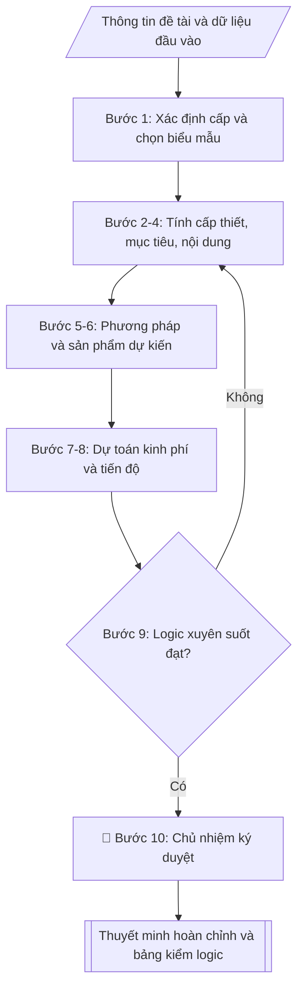

# Soạn thuyết minh đề tài NCKH

## Quy cách đầu ra và thông tin thiếu

Đọc [quy cách và cấu trúc sản phẩm](references/quy-cach-dau-ra.md) trước khi soạn/xuất. File giao chỉ gồm văn bản hoặc sản phẩm nghiệp vụ được yêu cầu; kiểm tra nội bộ không xuất kèm. Thiếu thông tin giữ nguyên trường/mục và chỗ điền theo mẫu gốc (dòng dấu chấm, dấu gạch hoặc ô trống); không tự điền dữ liệu mẫu, số 0, mã chờ xác minh hoặc dòng chờ ký. Mẫu chuyên ngành còn áp dụng được ưu tiên về cấu trúc, mã biểu và người ký. Các trường “bắt buộc” là điều kiện hoàn thiện hồ sơ, không ngăn việc soạn bản có chỗ chừa để điền. Mọi chỉ dẫn “để trống” trong skill được hiểu là không điền dữ liệu và giữ cách chừa chỗ của mẫu gốc, không phải xóa dấu chấm của mẫu.

## Kiểm soát áp dụng và phê duyệt

Trước khi chạy quy trình, xác định `ngay_ap_dung`, `loai_hinh_truong`, `quy_che_noi_bo`, `nguon_du_lieu` và `nguoi_kiem_duyet`. Chỉ yêu cầu thông tin có liên quan đến nghiệp vụ; không dùng giá trị giả định thay dữ liệu bắt buộc. Đối chiếu nội bộ hồ sơ có yếu tố pháp lý với văn bản gốc, hiệu lực, điều khoản áp dụng và chuyển tiếp; không tự đính kèm bảng kiểm tra vào file giao.

## Giới hạn và human gate

AI hỗ trợ chuẩn bị và đối chiếu. Cán bộ phụ trách kiểm tra dữ liệu/căn cứ, người có thẩm quyền duyệt và ký. Văn bản soạn chưa được coi là đã ban hành; không tự chèn nhãn trạng thái kiểm duyệt vào file giao; không đánh dấu đã ký, đã duyệt hoặc đã công bố nếu chưa có chứng cứ. Dữ liệu sinh viên, sức khỏe, nhân sự và tài chính phải hạn chế theo mục đích, phân quyền và che thông tin định danh khi dùng ví dụ. Không tải dữ liệu lên dịch vụ ngoài khi chưa có quyền. Kiểm tra Luật 91/2025/QH15 về bảo vệ dữ liệu cá nhân (hiệu lực 01/01/2026) và quy định áp dụng trước xử lý/chia sẻ dữ liệu cá nhân.

## Khi nào dùng
Khi chủ nhiệm đề tài (hoặc Phòng KHCN hỗ trợ) cần soạn bản thuyết minh đề tài NCKH
để nộp hồ sơ đăng ký, bảo vệ trước hội đồng xét duyệt các cấp (cấp trường, cấp bộ,
cấp nhà nước). Thuyết minh là căn cứ để hội đồng đánh giá, phê duyệt và sau này
ký hợp đồng thực hiện đề tài.

## Đầu vào (Input)

| Trường | Mô tả | Bắt buộc |
|---|---|---|
| `ten_de_tai` | Tên đầy đủ của đề tài | Có |
| `cap_de_tai` | Cấp trường / Cấp bộ (tỉnh) / Cấp nhà nước | Có |
| `chu_nhiem` | Họ tên, học hàm/học vị chủ nhiệm đề tài | Có |
| `co_quan_chu_tri` | Đơn vị chủ trì (khoa/viện/trung tâm) | Có |
| `thanh_vien` | Danh sách thành viên tham gia chính | Không |
| `thoi_gian_thuc_hien` | Tổng thời gian (tháng), từ tháng/năm đến tháng/năm | Có |
| `tong_kinh_phi` | Tổng kinh phí dự kiến (đồng) | Có |
| `y_tinh_cap_thiet` | Các ý chính về thực trạng, khoảng trống nghiên cứu, ý nghĩa | Có |
| `muc_tieu` | Mục tiêu chung và các mục tiêu cụ thể | Có |
| `noi_dung_nghien_cuu` | Các nội dung/mảng công việc nghiên cứu | Có |
| `phuong_phap` | Phương pháp luận, phương pháp thu thập và xử lý dữ liệu, phạm vi | Có |
| `san_pham_du_kien` | Sản phẩm khoa học, ứng dụng, đào tạo dự kiến | Có |
| `du_toan_kinh_phi` | Chi tiết kinh phí theo từng khoản mục | Có |
| `tien_do` | Các mốc thời gian theo giai đoạn, gắn sản phẩm | Có |

## Quy trình

**Bước 1. Xác định cấp đề tài và chọn biểu mẫu**
- Làm gì: đọc `cap_de_tai` để chọn biểu mẫu thuyết minh tương ứng (cấp càng cao yêu cầu càng chi tiết); lập khối thông tin hành chính: `ten_de_tai`, `chu_nhiem`, `thanh_vien`, `co_quan_chu_tri`, `thoi_gian_thuc_hien`, `tong_kinh_phi` (ghi cả số và chữ); tra cứu danh mục đề tài của trường để kiểm tra tên đề tài không trùng với đề tài đã/đang thực hiện.
- Dùng input: `cap_de_tai`, `ten_de_tai`, `chu_nhiem`, `thanh_vien`, `co_quan_chu_tri`, `thoi_gian_thuc_hien`, `tong_kinh_phi`.
- Vai trò: Chủ nhiệm đề tài · AI hỗ trợ: tra cứu biểu mẫu đúng cấp và kiểm tra trùng tên đề tài · ⏱ ~30–45 phút (ước tính)
- Lưu ý nghiệp vụ: tên đề tài phải ngắn gọn, nêu rõ đối tượng + phạm vi + yếu tố mới; tránh tên quá chung chung hoặc quá dài khó nhớ.
- → Kết quả bước: khối thông tin hành chính + biểu mẫu đã chọn đúng cấp đề tài.

**Bước 2. Viết mục 1 – Tính cấp thiết**
- Làm gì: từ `y_tinh_cap_thiet` viết 4 ý theo thứ tự: (a) thực trạng vấn đề (kèm số liệu minh họa); (b) tổng quan trong và ngoài nước ngắn gọn → chỉ ra khoảng trống nghiên cứu; (c) lý do phải nghiên cứu ngay; (d) ý nghĩa khoa học và ý nghĩa thực tiễn.
- Dùng input: `y_tinh_cap_thiet`.
- Vai trò: Chủ nhiệm đề tài · AI hỗ trợ: soạn dự thảo từ ý chính · ⏱ ~45–60 phút (ước tính)
- Lưu ý nghiệp vụ: bẫy thường gặp — viết dài dòng như tổng quan luận văn; hội đồng chỉ cần thấy rõ "khoảng trống" và "tại sao là bây giờ"; mỗi ý viết 1 đoạn ngắn.
- → Kết quả bước: dự thảo mục 1 – Tính cấp thiết.

**Bước 3. Viết mục 2 – Mục tiêu nghiên cứu**
- Làm gì: từ `muc_tieu` viết 01 mục tiêu chung + 3–5 mục tiêu cụ thể, diễn đạt theo nguyên tắc SMART (cụ thể, đo lường được, khả thi); đánh số các mục tiêu cụ thể để đối chiếu ở các mục sau.
- Dùng input: `muc_tieu`.
- Vai trò: Chủ nhiệm đề tài · AI hỗ trợ: diễn đạt theo SMART và đánh số · ⏱ ~30–45 phút (ước tính)
- Lưu ý nghiệp vụ: mỗi mục tiêu cụ thể phải đo lường được (có con số: ≥85%, 5.000 mẫu, 03 HTX); tránh viết mục tiêu dạng hoạt động ("tiến hành thu thập...") thay vì kết quả cần đạt.
- → Kết quả bước: dự thảo mục 2 – Mục tiêu (chung + cụ thể đã đánh số).

**Bước 4. Viết mục 3 – Nội dung nghiên cứu**
- Làm gì: từ `noi_dung_nghien_cuu` chia thành các nội dung đánh số (Nội dung 1, 2, 3...); mỗi nội dung mô tả công việc cụ thể và ghi rõ "phục vụ mục tiêu cụ thể số mấy" (đối chiếu với kết quả bước 3).
- Dùng input: `noi_dung_nghien_cuu`, kết quả bước 3.
- Vai trò: Chủ nhiệm đề tài · AI hỗ trợ: chia nội dung và gắn mục tiêu tương ứng · ⏱ ~30–45 phút (ước tính)
- Lưu ý nghiệp vụ: nguyên tắc 1–1 — mỗi mục tiêu cụ thể phải có ít nhất 01 nội dung đáp ứng; nội dung nào không gắn với mục tiêu nào là thừa, cần cắt bỏ.
- → Kết quả bước: dự thảo mục 3 – Nội dung nghiên cứu (mỗi nội dung đã gắn mục tiêu tương ứng).

**Bước 5. Viết mục 4 – Phương pháp nghiên cứu**
- Làm gì: từ `phuong_phap` viết 4 ý: cách tiếp cận/phương pháp luận; phương pháp thu thập dữ liệu; phương pháp xử lý/phân tích; đối tượng và phạm vi nghiên cứu (không gian, thời gian).
- Dùng input: `phuong_phap`.
- Vai trò: Chủ nhiệm đề tài · AI hỗ trợ: soạn dự thảo 4 ý · ⏱ ~30–45 phút (ước tính)
- Lưu ý nghiệp vụ: phải đủ chi tiết để người khác có thể lặp lại nghiên cứu; ghi rõ công cụ/phần mềm sử dụng và phương pháp đánh giá (VD: kiểm chứng chéo k-fold).
- → Kết quả bước: dự thảo mục 4 – Phương pháp nghiên cứu.

**Bước 6. Viết mục 5 – Sản phẩm dự kiến**
- Làm gì: từ `san_pham_du_kien` liệt kê theo 3 nhóm: (a) sản phẩm khoa học (bài báo, báo cáo, sáng chế); (b) sản phẩm ứng dụng (quy trình, phần mềm, mô hình); (c) sản phẩm đào tạo (thạc sĩ, sinh viên NCKH); mỗi sản phẩm ghi rõ số lượng và yêu cầu chất lượng; đối chiếu: mỗi nội dung ở bước 4 phải cho ra ít nhất 01 sản phẩm.
- Dùng input: `san_pham_du_kien`, kết quả bước 4.
- Vai trò: Chủ nhiệm đề tài · AI hỗ trợ: liệt kê theo 3 nhóm và đối chiếu với nội dung · ⏱ ~30–45 phút (ước tính)
- Lưu ý nghiệp vụ: yêu cầu chất lượng phải cụ thể ("tạp chí trong nước có phản biện", không ghi chung chung "bài báo"); số lượng sản phẩm phải tương xứng với kinh phí và thời gian thực hiện.
- → Kết quả bước: dự thảo mục 5 – Sản phẩm dự kiến (3 nhóm, có số lượng + yêu cầu chất lượng).

**Bước 7. Lập mục 6 – Dự toán kinh phí chi tiết**
- Làm gì: từ `du_toan_kinh_phi` lập bảng các khoản mục (thuê khoán nhân công, vật tư/thiết bị, hội thảo, công tác phí, quản lý phí, dự phòng...), mỗi khoản mục ghi nội dung chi và thành tiền; cộng tổng và đối chiếu phải khớp `tong_kinh_phi` đúng từng đồng; kiểm tra tỷ lệ các khoản mục không vượt định mức (VD: quản lý phí khoảng 10%).
- Dùng input: `du_toan_kinh_phi`, `tong_kinh_phi`.
- Vai trò: Chủ nhiệm đề tài · AI hỗ trợ: lập bảng, tính tổng và kiểm tra định mức · ⏱ ~45–60 phút (ước tính)
- Lưu ý nghiệp vụ: bẫy hay gặp — cộng tổng sai do làm tròn; quản lý phí vượt trần quy định; khoản "dự phòng" bị cắt ở một số cấp đề tài — kiểm tra quy định của cấp đề tài trước khi chốt.
- → Kết quả bước: dự thảo mục 6 – Dự toán kinh phí (bảng chi tiết, tổng khớp từng đồng).

**Bước 8. Lập mục 7 – Tiến độ thực hiện**
- Làm gì: từ `tien_do` lập bảng theo quý (hoặc 6 tháng); mỗi giai đoạn ghi công việc và sản phẩm hoàn thành; kiểm tra: tổng số quý phải bằng `thoi_gian_thuc_hien` (VD: 24 tháng = 8 quý), mốc cuối cùng phải là nghiệm thu; mỗi sản phẩm ở bước 6 phải xuất hiện trong ít nhất 01 mốc tiến độ.
- Dùng input: `tien_do`, `thoi_gian_thuc_hien`, kết quả bước 6.
- Vai trò: Chủ nhiệm đề tài · AI hỗ trợ: lập bảng theo quý và gắn sản phẩm · ⏱ ~30–45 phút (ước tính)
- Lưu ý nghiệp vụ: tiến độ phải chừa thời gian viết báo cáo tổng kết và nghiệm thu ở quý cuối; không dồn toàn bộ sản phẩm vào 1–2 quý cuối.
- → Kết quả bước: dự thảo mục 7 – Tiến độ thực hiện (bảng theo quý, gắn sản phẩm, mốc cuối là nghiệm thu).

**Bước 9. Kiểm tra tính logic xuyên suốt**
- Làm gì: lập bảng kiểm đối chiếu 6 chiều: mục tiêu ↔ nội dung ↔ phương pháp ↔ sản phẩm ↔ kinh phí ↔ tiến độ; đánh dấu từng ô khớp/không khớp; sửa các điểm lệch rồi mới chuyển sang bước 10.
- Dùng input: kết quả bước 2–8.
- Vai trò: Chủ nhiệm đề tài · AI hỗ trợ: đối chiếu logic 6 chiều và đánh dấu điểm lệch cần sửa · ⏱ ~30–45 phút (ước tính)
- Lưu ý nghiệp vụ: 3 lỗi phổ biến nhất — (1) sản phẩm không có nội dung nào tạo ra; (2) kinh phí cho khoản mục không có trong nội dung; (3) tiến độ không đủ thời gian cho nội dung đã đăng ký.
- → Kết quả bước: bảng kiểm logic 6 chiều đã khớp + danh sách điểm đã sửa.

**Bước 10. Hoàn thiện và xuất bản**
- Làm gì: kiểm tra chính tả, số liệu, tính khả thi lần cuối; trình chủ nhiệm ký duyệt; xuất thuyết minh hoàn chỉnh ở định dạng markdown, sẵn sàng in/chuyển sang Word.
- Dùng input: kết quả bước 9, `chu_nhiem`.
- Vai trò: Chủ nhiệm đề tài · AI hỗ trợ: chuẩn bị hồ sơ trình ký, nhắc lịch và theo dõi tiến độ · ⏱ ~30 phút (ước tính)
- Lưu ý nghiệp vụ: sau khi chủ nhiệm ký, mọi thay đổi phải có văn bản điều chỉnh — không sửa tay vào bản đã ký.
- → Kết quả bước: bản thuyết minh hoàn chỉnh đã ký duyệt + bảng kiểm logic.

## Luồng quy trình (Workflow)

## Đầu ra

Sản phẩm nghiệp vụ hoàn chỉnh theo [quy cách và cấu trúc](references/quy-cach-dau-ra.md), giữ các trường chưa có dữ liệu ở trạng thái trống. Không xuất kèm checklist/phụ lục kiểm tra đầu ra.

## Kiểm tra nội bộ trước khi giao

- [ ] Bố cục khớp mẫu áp dụng và cấu trúc tại references/quy-cach-dau-ra.md.
- [ ] Số liệu trong output khớp Input: tổng kinh phí (số + chữ) = `tong_kinh_phi`; tổng các khoản mục dự toán khớp từng đồng; số quý tiến độ = `thoi_gian_thuc_hien`
- [ ] Không bịa đặt số liệu, công trình công bố, trích dẫn tài liệu
- [ ] Đúng biểu mẫu thuyết minh của cấp đề tài; bảng dự toán và tiến độ trình bày rõ ràng
- [ ] Căn cứ pháp lý đầy đủ, còn hiệu lực (quy chế quản lý đề tài cấp trường / biểu mẫu của Bộ chủ quản)
- [ ] Tính logic xuyên suốt: mỗi mục tiêu cụ thể có ít nhất 01 nội dung đáp ứng; mỗi nội dung cho ra ít nhất 01 sản phẩm; bảng kiểm logic 6 chiều đã khớp
- [ ] Mục tiêu cụ thể viết theo SMART, đo lường được; tên đề tài không trùng đề tài đã/đang thực hiện
- [ ] Dự toán tuân thủ định mức chi hiện hành và trần kinh phí của cấp đề tài (quản lý phí, dự phòng đúng quy định)
- [ ] Đã qua Human gate: chủ nhiệm đề tài đã kiểm tra và ký duyệt

Tiêu chí đạt = tất cả các ô được đánh dấu.

## Căn cứ & lưu ý
- Quy chế quản lý đề tài NCKH cấp trường của Trường Đại học A (giả lập);
  biểu mẫu thuyết minh của Bộ chủ quản đối với đề tài cấp bộ/nhà nước.
- Mục tiêu cụ thể nên viết theo SMART; tránh mục tiêu chung chung, không đo lường được.
- Dự toán kinh phí phải tuân thủ định mức chi hiện hành và khớp với định mức của cấp đề tài.
- Không dùng tên thật của trường/cá nhân khi mô phỏng.

## Quản trị phiên bản

- Phiên bản gói: `1.2.1`; ngày cập nhật: `2026-10-10`.
- Kho nguồn: https://github.com/phamtruong91/university-skills-framework
- Người duy trì trên GitHub: `phamtruong91` (Phạm Văn Trường). Người phê duyệt nghiệp vụ: **chưa chỉ định**.
- Commit nguồn trước cập nhật: `346719e6b0318ed034b4b016703f79733aa575e7`. Commit chứa phiên bản này xem bằng `git log -1 -- skills/thuyet-minh-de-tai-nckh`; không tự gán SHA chưa tạo.
- Giấy phép: theo LICENSE của kho; bản quyền CES Global.
- Lịch sử 1.1.0: bổ sung metadata giao diện, kiểm soát áp dụng, quản trị phiên bản.
- Trạng thái: dự thảo nghiệp vụ; kiểm tra pháp lý trước thực thi. Ngày cập nhật không đồng nghĩa mọi văn bản đã được rà soát toàn văn.
