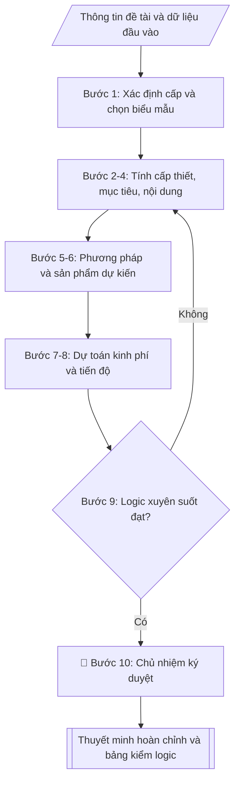

# Skill: Soạn thuyết minh đề tài NCKH

## Khi nào dùng
Khi chủ nhiệm đề tài (hoặc Phòng KHCN hỗ trợ) cần soạn bản thuyết minh đề tài NCKH
để nộp hồ sơ đăng ký, bảo vệ trước hội đồng xét duyệt các cấp (cấp trường, cấp bộ,
cấp nhà nước). Thuyết minh là căn cứ để hội đồng đánh giá, phê duyệt và sau này
ký hợp đồng thực hiện đề tài.

## Đầu vào (Input)

| Trường | Mô tả | Bắt buộc |
|---|---|---|
| `ten_de_tai` | Tên đầy đủ của đề tài | Có |
| `cap_de_tai` | Cấp trường / Cấp bộ (tỉnh) / Cấp nhà nước | Có |
| `chu_nhiem` | Họ tên, học hàm/học vị chủ nhiệm đề tài | Có |
| `co_quan_chu_tri` | Đơn vị chủ trì (khoa/viện/trung tâm) | Có |
| `thanh_vien` | Danh sách thành viên tham gia chính | Không |
| `thoi_gian_thuc_hien` | Tổng thời gian (tháng), từ tháng/năm đến tháng/năm | Có |
| `tong_kinh_phi` | Tổng kinh phí dự kiến (đồng) | Có |
| `y_tinh_cap_thiet` | Các ý chính về thực trạng, khoảng trống nghiên cứu, ý nghĩa | Có |
| `muc_tieu` | Mục tiêu chung và các mục tiêu cụ thể | Có |
| `noi_dung_nghien_cuu` | Các nội dung/mảng công việc nghiên cứu | Có |
| `phuong_phap` | Phương pháp luận, phương pháp thu thập và xử lý dữ liệu, phạm vi | Có |
| `san_pham_du_kien` | Sản phẩm khoa học, ứng dụng, đào tạo dự kiến | Có |
| `du_toan_kinh_phi` | Chi tiết kinh phí theo từng khoản mục | Có |
| `tien_do` | Các mốc thời gian theo giai đoạn, gắn sản phẩm | Có |

## Quy trình

**Bước 1. Xác định cấp đề tài và chọn biểu mẫu**
- Làm gì: đọc `cap_de_tai` để chọn biểu mẫu thuyết minh tương ứng (cấp càng cao yêu cầu càng chi tiết); lập khối thông tin hành chính: `ten_de_tai`, `chu_nhiem`, `thanh_vien`, `co_quan_chu_tri`, `thoi_gian_thuc_hien`, `tong_kinh_phi` (ghi cả số và chữ); tra cứu danh mục đề tài của trường để kiểm tra tên đề tài không trùng với đề tài đã/đang thực hiện.
- Dùng input: `cap_de_tai`, `ten_de_tai`, `chu_nhiem`, `thanh_vien`, `co_quan_chu_tri`, `thoi_gian_thuc_hien`, `tong_kinh_phi`.
- Vai trò: Chủ nhiệm đề tài · AI hỗ trợ: tra cứu biểu mẫu đúng cấp và kiểm tra trùng tên đề tài · ⏱ ~30–45 phút (ước tính)
- Lưu ý nghiệp vụ: tên đề tài phải ngắn gọn, nêu rõ đối tượng + phạm vi + yếu tố mới; tránh tên quá chung chung hoặc quá dài khó nhớ.
- → Kết quả bước: khối thông tin hành chính + biểu mẫu đã chọn đúng cấp đề tài.

**Bước 2. Viết mục 1 – Tính cấp thiết**
- Làm gì: từ `y_tinh_cap_thiet` viết 4 ý theo thứ tự: (a) thực trạng vấn đề (kèm số liệu minh họa); (b) tổng quan trong và ngoài nước ngắn gọn → chỉ ra khoảng trống nghiên cứu; (c) lý do phải nghiên cứu ngay; (d) ý nghĩa khoa học và ý nghĩa thực tiễn.
- Dùng input: `y_tinh_cap_thiet`.
- Vai trò: Chủ nhiệm đề tài · AI hỗ trợ: soạn dự thảo từ ý chính · ⏱ ~45–60 phút (ước tính)
- Lưu ý nghiệp vụ: bẫy thường gặp — viết dài dòng như tổng quan luận văn; hội đồng chỉ cần thấy rõ "khoảng trống" và "tại sao là bây giờ"; mỗi ý viết 1 đoạn ngắn.
- → Kết quả bước: dự thảo mục 1 – Tính cấp thiết.

**Bước 3. Viết mục 2 – Mục tiêu nghiên cứu**
- Làm gì: từ `muc_tieu` viết 01 mục tiêu chung + 3–5 mục tiêu cụ thể, diễn đạt theo nguyên tắc SMART (cụ thể, đo lường được, khả thi); đánh số các mục tiêu cụ thể để đối chiếu ở các mục sau.
- Dùng input: `muc_tieu`.
- Vai trò: Chủ nhiệm đề tài · AI hỗ trợ: diễn đạt theo SMART và đánh số · ⏱ ~30–45 phút (ước tính)
- Lưu ý nghiệp vụ: mỗi mục tiêu cụ thể phải đo lường được (có con số: ≥85%, 5.000 mẫu, 03 HTX); tránh viết mục tiêu dạng hoạt động ("tiến hành thu thập...") thay vì kết quả cần đạt.
- → Kết quả bước: dự thảo mục 2 – Mục tiêu (chung + cụ thể đã đánh số).

**Bước 4. Viết mục 3 – Nội dung nghiên cứu**
- Làm gì: từ `noi_dung_nghien_cuu` chia thành các nội dung đánh số (Nội dung 1, 2, 3...); mỗi nội dung mô tả công việc cụ thể và ghi rõ "phục vụ mục tiêu cụ thể số mấy" (đối chiếu với kết quả bước 3).
- Dùng input: `noi_dung_nghien_cuu`, kết quả bước 3.
- Vai trò: Chủ nhiệm đề tài · AI hỗ trợ: chia nội dung và gắn mục tiêu tương ứng · ⏱ ~30–45 phút (ước tính)
- Lưu ý nghiệp vụ: nguyên tắc 1–1 — mỗi mục tiêu cụ thể phải có ít nhất 01 nội dung đáp ứng; nội dung nào không gắn với mục tiêu nào là thừa, cần cắt bỏ.
- → Kết quả bước: dự thảo mục 3 – Nội dung nghiên cứu (mỗi nội dung đã gắn mục tiêu tương ứng).

**Bước 5. Viết mục 4 – Phương pháp nghiên cứu**
- Làm gì: từ `phuong_phap` viết 4 ý: cách tiếp cận/phương pháp luận; phương pháp thu thập dữ liệu; phương pháp xử lý/phân tích; đối tượng và phạm vi nghiên cứu (không gian, thời gian).
- Dùng input: `phuong_phap`.
- Vai trò: Chủ nhiệm đề tài · AI hỗ trợ: soạn dự thảo 4 ý · ⏱ ~30–45 phút (ước tính)
- Lưu ý nghiệp vụ: phải đủ chi tiết để người khác có thể lặp lại nghiên cứu; ghi rõ công cụ/phần mềm sử dụng và phương pháp đánh giá (VD: kiểm chứng chéo k-fold).
- → Kết quả bước: dự thảo mục 4 – Phương pháp nghiên cứu.

**Bước 6. Viết mục 5 – Sản phẩm dự kiến**
- Làm gì: từ `san_pham_du_kien` liệt kê theo 3 nhóm: (a) sản phẩm khoa học (bài báo, báo cáo, sáng chế); (b) sản phẩm ứng dụng (quy trình, phần mềm, mô hình); (c) sản phẩm đào tạo (thạc sĩ, sinh viên NCKH); mỗi sản phẩm ghi rõ số lượng và yêu cầu chất lượng; đối chiếu: mỗi nội dung ở bước 4 phải cho ra ít nhất 01 sản phẩm.
- Dùng input: `san_pham_du_kien`, kết quả bước 4.
- Vai trò: Chủ nhiệm đề tài · AI hỗ trợ: liệt kê theo 3 nhóm và đối chiếu với nội dung · ⏱ ~30–45 phút (ước tính)
- Lưu ý nghiệp vụ: yêu cầu chất lượng phải cụ thể ("tạp chí trong nước có phản biện", không ghi chung chung "bài báo"); số lượng sản phẩm phải tương xứng với kinh phí và thời gian thực hiện.
- → Kết quả bước: dự thảo mục 5 – Sản phẩm dự kiến (3 nhóm, có số lượng + yêu cầu chất lượng).

**Bước 7. Lập mục 6 – Dự toán kinh phí chi tiết**
- Làm gì: từ `du_toan_kinh_phi` lập bảng các khoản mục (thuê khoán nhân công, vật tư/thiết bị, hội thảo, công tác phí, quản lý phí, dự phòng...), mỗi khoản mục ghi nội dung chi và thành tiền; cộng tổng và đối chiếu phải khớp `tong_kinh_phi` đúng từng đồng; kiểm tra tỷ lệ các khoản mục không vượt định mức (VD: quản lý phí khoảng 10%).
- Dùng input: `du_toan_kinh_phi`, `tong_kinh_phi`.
- Vai trò: Chủ nhiệm đề tài · AI hỗ trợ: lập bảng, tính tổng và kiểm tra định mức · ⏱ ~45–60 phút (ước tính)
- Lưu ý nghiệp vụ: bẫy hay gặp — cộng tổng sai do làm tròn; quản lý phí vượt trần quy định; khoản "dự phòng" bị cắt ở một số cấp đề tài — kiểm tra quy định của cấp đề tài trước khi chốt.
- → Kết quả bước: dự thảo mục 6 – Dự toán kinh phí (bảng chi tiết, tổng khớp từng đồng).

**Bước 8. Lập mục 7 – Tiến độ thực hiện**
- Làm gì: từ `tien_do` lập bảng theo quý (hoặc 6 tháng); mỗi giai đoạn ghi công việc và sản phẩm hoàn thành; kiểm tra: tổng số quý phải bằng `thoi_gian_thuc_hien` (VD: 24 tháng = 8 quý), mốc cuối cùng phải là nghiệm thu; mỗi sản phẩm ở bước 6 phải xuất hiện trong ít nhất 01 mốc tiến độ.
- Dùng input: `tien_do`, `thoi_gian_thuc_hien`, kết quả bước 6.
- Vai trò: Chủ nhiệm đề tài · AI hỗ trợ: lập bảng theo quý và gắn sản phẩm · ⏱ ~30–45 phút (ước tính)
- Lưu ý nghiệp vụ: tiến độ phải chừa thời gian viết báo cáo tổng kết và nghiệm thu ở quý cuối; không dồn toàn bộ sản phẩm vào 1–2 quý cuối.
- → Kết quả bước: dự thảo mục 7 – Tiến độ thực hiện (bảng theo quý, gắn sản phẩm, mốc cuối là nghiệm thu).

**Bước 9. Kiểm tra tính logic xuyên suốt**
- Làm gì: lập bảng kiểm đối chiếu 6 chiều: mục tiêu ↔ nội dung ↔ phương pháp ↔ sản phẩm ↔ kinh phí ↔ tiến độ; đánh dấu từng ô khớp/không khớp; sửa các điểm lệch rồi mới chuyển sang bước 10.
- Dùng input: kết quả bước 2–8.
- Vai trò: Chủ nhiệm đề tài · AI hỗ trợ: đối chiếu logic 6 chiều và đánh dấu điểm lệch cần sửa · ⏱ ~30–45 phút (ước tính)
- Lưu ý nghiệp vụ: 3 lỗi phổ biến nhất — (1) sản phẩm không có nội dung nào tạo ra; (2) kinh phí cho khoản mục không có trong nội dung; (3) tiến độ không đủ thời gian cho nội dung đã đăng ký.
- → Kết quả bước: bảng kiểm logic 6 chiều đã khớp + danh sách điểm đã sửa.

**Bước 10. Hoàn thiện và xuất bản**
- Làm gì: kiểm tra chính tả, số liệu, tính khả thi lần cuối; trình chủ nhiệm ký duyệt; xuất thuyết minh hoàn chỉnh ở định dạng markdown, sẵn sàng in/chuyển sang Word.
- Dùng input: kết quả bước 9, `chu_nhiem`.
- Vai trò: Chủ nhiệm đề tài · AI hỗ trợ: chuẩn bị hồ sơ trình ký, nhắc lịch và theo dõi tiến độ · ⏱ ~30 phút (ước tính)
- Lưu ý nghiệp vụ: sau khi chủ nhiệm ký, mọi thay đổi phải có văn bản điều chỉnh — không sửa tay vào bản đã ký.
- → Kết quả bước: bản thuyết minh hoàn chỉnh đã ký duyệt + bảng kiểm logic.

## Luồng quy trình (Workflow)



## Đầu ra (Output)
- Bản thuyết minh đề tài hoàn chỉnh (7 mục bắt buộc).
- Bảng kiểm logic: đối chiếu mục tiêu – nội dung – sản phẩm – kinh phí – tiến độ.

**Cấu trúc output chuẩn:** khung cố định của bản Thuyết minh đề tài, các phần bắt buộc theo đúng thứ tự xuất hiện:
1. Tiêu đề loại văn bản ("THUYẾT MINH ĐỀ TÀI NGHIÊN CỨU KHOA HỌC CẤP ...")
2. Khối thông tin hành chính: tên đề tài; chủ nhiệm (họ tên, học hàm/học vị); thành viên; cơ quan chủ trì; thời gian thực hiện; tổng kinh phí (số + chữ)
3. Mục 1. Tính cấp thiết của đề tài
4. Mục 2. Mục tiêu nghiên cứu (2.1. Mục tiêu chung; 2.2. Mục tiêu cụ thể)
5. Mục 3. Nội dung nghiên cứu (đánh số, mỗi nội dung gắn mục tiêu cụ thể tương ứng)
6. Mục 4. Phương pháp nghiên cứu
7. Mục 5. Sản phẩm dự kiến (3 nhóm: khoa học – ứng dụng – đào tạo; có số lượng + yêu cầu chất lượng)
8. Mục 6. Dự toán kinh phí chi tiết (bảng theo khoản mục, tổng khớp tổng kinh phí)
9. Mục 7. Tiến độ thực hiện (bảng theo quý, mỗi giai đoạn gắn sản phẩm, mốc cuối là nghiệm thu)
10. Địa danh, ngày tháng năm + chữ ký chủ nhiệm đề tài

## Checklist nghiệm thu

- [ ] Đủ 10 phần theo "Cấu trúc output chuẩn": tiêu đề loại văn bản → khối thông tin hành chính → 7 mục (tính cấp thiết, mục tiêu, nội dung, phương pháp, sản phẩm, dự toán, tiến độ) → chữ ký chủ nhiệm
- [ ] Số liệu trong output khớp Input: tổng kinh phí (số + chữ) = `tong_kinh_phi`; tổng các khoản mục dự toán khớp từng đồng; số quý tiến độ = `thoi_gian_thuc_hien`
- [ ] Không bịa đặt số liệu, công trình công bố, trích dẫn tài liệu
- [ ] Đúng biểu mẫu thuyết minh của cấp đề tài; bảng dự toán và tiến độ trình bày rõ ràng
- [ ] Căn cứ pháp lý đầy đủ, còn hiệu lực (quy chế quản lý đề tài cấp trường / biểu mẫu của Bộ chủ quản)
- [ ] Tính logic xuyên suốt: mỗi mục tiêu cụ thể có ít nhất 01 nội dung đáp ứng; mỗi nội dung cho ra ít nhất 01 sản phẩm; bảng kiểm logic 6 chiều đã khớp
- [ ] Mục tiêu cụ thể viết theo SMART, đo lường được; tên đề tài không trùng đề tài đã/đang thực hiện
- [ ] Dự toán tuân thủ định mức chi hiện hành và trần kinh phí của cấp đề tài (quản lý phí, dự phòng đúng quy định)
- [ ] Đã qua Human gate: chủ nhiệm đề tài đã kiểm tra và ký duyệt

Tiêu chí đạt = tất cả các ô được đánh dấu.

## Ví dụ mô phỏng (dữ liệu giả lập)

> Tất cả tên trường, cá nhân, đề tài, số liệu dưới đây đều là **giả lập**, không liên quan tổ chức/cá nhân có thật.

### Input mẫu

| Trường | Giá trị |
|---|---|
| `ten_de_tai` | Nghiên cứu ứng dụng trí tuệ nhân tạo trong dự báo năng suất lúa tại Đồng bằng sông Hồng |
| `cap_de_tai` | Cấp trường |
| `chu_nhiem` | PGS.TS. Trần Văn B – Khoa Công nghệ thông tin |
| `co_quan_chu_tri` | Khoa Công nghệ thông tin, Trường Đại học A |
| `thoi_gian_thuc_hien` | 24 tháng (01/2027 – 12/2028) |
| `tong_kinh_phi` | 280.000.000 đồng |
| `y_tinh_cap_thiet` | Dự báo năng suất lúa hiện nay chủ yếu dựa vào kinh nghiệm; AI đã chứng minh hiệu quả ở nhiều nước nhưng chưa được thử nghiệm với dữ liệu đồng ruộng Việt Nam; kết quả giúp nông dân và cơ quan quản lý chủ động kế hoạch sản xuất |
| `muc_tieu` | Chung: xây dựng mô hình AI dự báo năng suất lúa. Cụ thể: (1) thu thập bộ dữ liệu 5.000 mẫu ruộng; (2) mô hình đạt độ chính xác ≥ 85%; (3) thử nghiệm tại 3 hợp tác xã |
| `noi_dung_nghien_cuu` | ND1: tổng quan và thu thập dữ liệu; ND2: xây dựng và huấn luyện mô hình AI; ND3: thử nghiệm thực tế và đánh giá |
| `phuong_phap` | Học máy (học sâu); dữ liệu ảnh viễn thám + số liệu đồng ruộng; đánh giá bằng kiểm chứng chéo; phạm vi: 3 tỉnh Đồng bằng sông Hồng, vụ xuân và vụ mùa 2027 |
| `san_pham_du_kien` | 02 bài báo tạp chí trong nước; 01 phần mềm dự báo; 01 báo cáo tổng kết; đào tạo 02 thạc sĩ |
| `du_toan_kinh_phi` | Nhân công 140tr; vật tư, thiết bị 60tr; hội thảo, công tác phí 40tr; quản lý phí 28tr; dự phòng 12tr |
| `tien_do` | Quý 1–2: thu thập dữ liệu; Quý 3–5: xây dựng mô hình; Quý 6–7: thử nghiệm; Quý 8: nghiệm thu |

### Output mẫu

```
THUYẾT MINH ĐỀ TÀI NGHIÊN CỨU KHOA HỌC CẤP TRƯỜNG

Tên đề tài: Nghiên cứu ứng dụng trí tuệ nhân tạo trong dự báo năng suất lúa
             tại Đồng bằng sông Hồng
Chủ nhiệm: PGS.TS. Trần Văn B – Khoa Công nghệ thông tin
Cơ quan chủ trì: Khoa Công nghệ thông tin, Trường Đại học A
Thời gian thực hiện: 24 tháng (từ tháng 01/2027 đến tháng 12/2028)
Tổng kinh phí: 280.000.000 đồng (Hai trăm tám mươi triệu đồng)

1. TÍNH CẤP THIẾT CỦA ĐỀ TÀI
Dự báo năng suất lúa tại Đồng bằng sông Hồng hiện nay chủ yếu dựa vào kinh nghiệm
của cán bộ nông nghiệp và số liệu thống kê thủ công, độ chính xác hạn chế, khó đáp
ứng yêu cầu chỉ đạo sản xuất kịp thời. Trên thế giới, các mô hình trí tuệ nhân tạo
kết hợp ảnh viễn thám đã đạt độ chính xác dự báo trên 85% tại nhiều quốc gia, song
chưa được nghiên cứu, thử nghiệm với đặc thù đồng ruộng, giống lúa và điều kiện
khí hậu Việt Nam. Việc nghiên cứu xây dựng mô hình AI dự báo năng suất lúa phù hợp
điều kiện trong nước có ý nghĩa khoa học (bổ sung phương pháp mới cho lĩnh vực nông
nghiệp thông minh) và ý nghĩa thực tiễn (giúp nông dân, hợp tác xã và cơ quan quản lý
chủ động kế hoạch gieo trồng, thu hoạch và tiêu thụ). Vì vậy, đề tài cần được triển
khai ngay trong giai đoạn 2027–2028.

2. MỤC TIÊU NGHIÊN CỨU
2.1. Mục tiêu chung
Xây dựng mô hình trí tuệ nhân tạo dự báo năng suất lúa có độ chính xác cao, phù hợp
điều kiện Đồng bằng sông Hồng.
2.2. Mục tiêu cụ thể
- Thu thập và chuẩn hóa bộ dữ liệu gồm 5.000 mẫu ruộng (ảnh viễn thám, số liệu đồng
ruộng, năng suất thực tế) trong 2 vụ năm 2027;
- Xây dựng mô hình học sâu dự báo năng suất lúa đạt độ chính xác ≥ 85% trên tập kiểm chứng;
- Thử nghiệm mô hình tại 03 hợp tác xã nông nghiệp, đánh giá hiệu quả và đề xuất
khuyến nghị ứng dụng.

3. NỘI DUNG NGHIÊN CỨU
Nội dung 1: Tổng quan nghiên cứu và thu thập, chuẩn hóa dữ liệu (phục vụ mục tiêu 1).
Nội dung 2: Xây dựng, huấn luyện và tối ưu mô hình AI dự báo năng suất (phục vụ mục tiêu 2).
Nội dung 3: Thử nghiệm thực tế tại 03 hợp tác xã, đánh giá và hoàn thiện mô hình
(phục vụ mục tiêu 3).

4. PHƯƠNG PHÁP NGHIÊN CỨU
- Cách tiếp cận: học máy, trọng tâm là mạng nơ-ron học sâu cho bài toán hồi quy.
- Thu thập dữ liệu: ảnh viễn thám đa thời điểm kết hợp điều tra đồng ruộng
(giống, phân bón, thời tiết, năng suất thực tế).
- Xử lý, phân tích: tiền xử lý ảnh, trích chọn đặc trưng, huấn luyện và đánh giá
mô hình bằng kiểm chứng chéo k-fold.
- Phạm vi: 03 tỉnh Đồng bằng sông Hồng (giả lập), vụ xuân và vụ mùa năm 2027.

5. SẢN PHẨM DỰ KIẾN
a) Sản phẩm khoa học: 02 bài báo đăng tạp chí khoa học trong nước có phản biện;
01 báo cáo tổng kết đề tài.
b) Sản phẩm ứng dụng: 01 phần mềm dự báo năng suất lúa (bản thử nghiệm) kèm tài
liệu hướng dẫn sử dụng.
c) Sản phẩm đào tạo: 02 học viên cao học bảo vệ thành công luận văn thạc sĩ từ
kết quả đề tài; 04 sinh viên tham gia NCKH.

6. DỰ TOÁN KINH PHÍ CHI TIẾT (đồng)
- Thuê khoán nhân công (chủ nhiệm, thành viên, cộng tác viên): 140.000.000
- Vật tư, thiết bị, thuê dịch vụ phân tích: 60.000.000
- Hội thảo khoa học, công tác phí điều tra: 40.000.000
- Quản lý phí (10%): 28.000.000
- Dự phòng: 12.000.000
TỔNG CỘNG: 280.000.000

7. TIẾN ĐỘ THỰC HIỆN
- Quý 1–2/2027: tổng quan nghiên cứu; thu thập và chuẩn hóa 5.000 mẫu dữ liệu.
- Quý 3–5/2027: xây dựng, huấn luyện và tối ưu mô hình AI; viết 01 bài báo.
- Quý 6–7/2028: thử nghiệm tại 03 hợp tác xã; đánh giá, hoàn thiện mô hình và phần mềm.
- Quý 8/2028: hoàn thiện báo cáo tổng kết, công bố bài báo thứ 2, nghiệm thu đề tài.

Thành phố C, ngày 09 tháng 10 năm 2026
CHỦ NHIỆM ĐỀ TÀI (ký, ghi rõ họ tên)
PGS.TS. Trần Văn B
```

### Bảng kiểm logic (output kèm theo)

| Mục tiêu cụ thể | Nội dung đáp ứng | Sản phẩm tương ứng | Ghi chú |
|---|---|---|---|
| Bộ dữ liệu 5.000 mẫu | Nội dung 1 | Báo cáo tổng kết (phần dữ liệu) | Khớp |
| Mô hình đạt ≥ 85% | Nội dung 2 | 02 bài báo, phần mềm | Khớp |
| Thử nghiệm 03 HTX | Nội dung 3 | Phần mềm hoàn thiện, khuyến nghị | Khớp |
| Tổng kinh phí | 280.000.000 = tổng các khoản mục | — | Khớp số học |
| Tiến độ | 8 quý = 24 tháng, mốc cuối là nghiệm thu | — | Khớp |

## Căn cứ & lưu ý
- Quy chế quản lý đề tài NCKH cấp trường của Trường Đại học A (giả lập);
  biểu mẫu thuyết minh của Bộ chủ quản đối với đề tài cấp bộ/nhà nước.
- Mục tiêu cụ thể nên viết theo SMART; tránh mục tiêu chung chung, không đo lường được.
- Dự toán kinh phí phải tuân thủ định mức chi hiện hành và khớp với định mức của cấp đề tài.
- Không dùng tên thật của trường/cá nhân khi mô phỏng.
