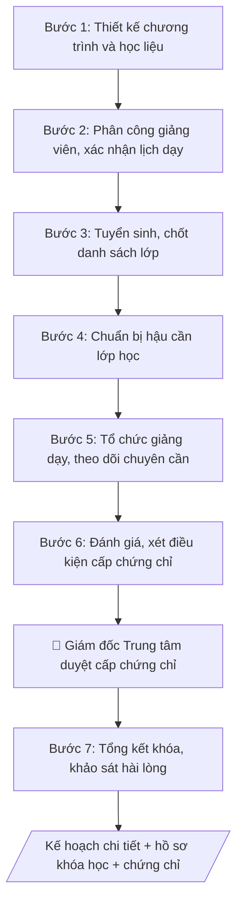

# Tổ chức khóa bồi dưỡng ngắn hạn

## Kiểm soát áp dụng và phê duyệt

Trước khi chạy quy trình, xác định `ngay_ap_dung`, `loai_hinh_truong`, `quy_che_noi_bo`, `nguon_du_lieu` và `nguoi_kiem_duyet`. Chỉ yêu cầu thông tin có liên quan đến nghiệp vụ; không dùng giá trị giả định thay dữ liệu bắt buộc. Hồ sơ có yếu tố pháp lý phải kèm văn bản gốc, tình trạng hiệu lực, điều khoản áp dụng và chuyển tiếp.

## Giới hạn và human gate

AI hỗ trợ chuẩn bị và đối chiếu. Cán bộ phụ trách kiểm tra dữ liệu/căn cứ, người có thẩm quyền duyệt và ký. Mọi đầu ra mặc định là **DỰ THẢO – CHỜ KIỂM DUYỆT**; không đánh dấu đã ký, đã duyệt hoặc đã công bố nếu chưa có chứng cứ. Dữ liệu sinh viên, sức khỏe, nhân sự và tài chính phải hạn chế theo mục đích, phân quyền và che thông tin định danh khi dùng ví dụ. Không tải dữ liệu lên dịch vụ ngoài khi chưa có quyền. Kiểm tra Luật 91/2025/QH15 về bảo vệ dữ liệu cá nhân (hiệu lực 01/01/2026) và quy định áp dụng trước xử lý/chia sẻ dữ liệu cá nhân.


## Khi nào dùng
Khi Trung tâm Đào tạo liên tục / Trường bồi dưỡng triển khai một khóa học cụ thể:
chuẩn bị giảng viên, học liệu, tuyển sinh, hậu cần và đánh giá kết quả.

## Đầu vào (Input)

| Trường | Mô tả | Bắt buộc |
|---|---|---|
| `ten_khoa` | Tên khóa bồi dưỡng | Có |
| `muc_tieu` | Mục tiêu, chuẩn đầu ra của khóa học | Có |
| `doi_tuong` | Đối tượng học viên, điều kiện đầu vào | Có |
| `thoi_luong` | Tổng số giờ / buổi, lịch học | Có |
| `chuong_trinh` | Các chuyên đề / module, phân bổ giờ | Có |
| `giang_vien` | Danh sách giảng viên dự kiến | Có |
| `hoc_phi` | Mức học phí, chính sách ưu đãi | Có |
| `phuong_thuc_danh_gia` | Kiểm tra, bài tập, chuyên cần... và điều kiện cấp chứng chỉ | Có |

## Quy trình

**Bước 1. Thiết kế chương trình và học liệu**
- Làm gì: từ `chuong_trinh` (các chuyên đề/module, phân bổ giờ) và `muc_tieu`, viết đề cương chi tiết từng module: mục tiêu module, nội dung, phương pháp giảng dạy, học liệu (slide, tài liệu đọc, bài tập thực hành); kiểm tra tổng giờ các module khớp với `thoi_luong`; đảm bảo mỗi mục tiêu trong `muc_tieu` được ít nhất 1 module "gánh".
- Dùng input: `chuong_trinh`, `muc_tieu`, `thoi_luong`.
- Vai trò: Giảng viên · AI hỗ trợ: soạn đề cương chi tiết từng module và bộ học liệu · ⏱ 3–5 ngày làm việc (ước tính)
- Lưu ý nghiệp vụ: bẫy phổ biến là chương trình "nặng lý thuyết, nhẹ thực hành" với khóa bồi dưỡng người đi làm — tỷ lệ thực hành nên ≥ 50%. Học liệu dùng lại từ nguồn khác phải kiểm tra bản quyền trước.
- → Kết quả bước: đề cương chi tiết từng module + bộ học liệu (slide, tài liệu đọc, bài tập).

**Bước 2. Phân công giảng viên và xác nhận lịch**
- Làm gì: đối chiếu chuyên môn từng giảng viên trong `giang_vien` với module được giao; gửi thư mời/xác nhận phân công, chốt lịch giảng dạy khớp với `thoi_luong` (khung giờ, ngày học); giảng viên ký xác nhận nội dung module trước khi giảng dạy; lập danh sách giảng viên dự phòng cho từng module.
- Dùng input: `giang_vien`, `thoi_luong` (+ đề cương chi tiết ở Bước 1).
- Vai trò: Giảng viên · AI hỗ trợ: lập bảng phân công và thư mời/xác nhận · ⏱ 2–3 ngày làm việc (ước tính)
- Lưu ý nghiệp vụ: phải có xác nhận bằng văn bản (email/thư mời) — thỏa thuận miệng dễ "vỡ" lịch sát ngày khai giảng. Giảng viên thỉnh giảng phải có hợp đồng và lý lịch khoa học lưu tại Phòng TCCB.
- → Kết quả bước: bảng phân công giảng viên (module – giảng viên – lịch dạy) đã được xác nhận + danh sách giảng viên dự phòng.

**Bước 3. Tuyển sinh và chốt danh sách lớp**
- Làm gì: soạn thông báo chiêu sinh (tên khóa, mục tiêu, đối tượng, lịch học, `hoc_phi` và chính sách ưu đãi, điều kiện cấp chứng chỉ); đăng trên các kênh của trung tâm; tiếp nhận đăng ký, thu học phí, kiểm tra điều kiện đầu vào theo `doi_tuong`; chốt danh sách lớp khi đủ sĩ số tối thiểu (hoặc đến thời hạn), lập danh sách chính thức.
- Dùng input: `ten_khoa`, `doi_tuong`, `hoc_phi`, `phuong_thuc_danh_gia` (điều kiện cấp chứng chỉ để công bố trong thông báo).
- Vai trò: Cán bộ Trung tâm · AI hỗ trợ: soạn thông báo chiêu sinh · ⏱ 5–10 ngày làm việc (ước tính)
- Lưu ý nghiệp vụ: công bố điều kiện cấp chứng chỉ NGAY trong thông báo chiêu sinh — tránh tranh chấp cuối khóa ("sao không nói trước"). Không nhận vượt sĩ số tối đa đã công bố. Học phí thu phải có biên lai, đúng mức đã phê duyệt.
- → Kết quả bước: danh sách lớp chính thức (họ tên, liên hệ, tình trạng nộp học phí).

**Bước 4. Chuẩn bị hậu cần**
- Làm gì: đặt phòng học theo sĩ số (đối chiếu danh sách lớp ở Bước 3), kiểm tra máy chiếu, âm thanh, wifi/mạng; chuẩn bị tài liệu phát tay, biểu mẫu điểm danh (QR/giấy), danh sách lớp giao cho giảng viên; phân công cán bộ phụ trách lớp làm đầu mối suốt khóa.
- Dùng input: `thoi_luong` (lịch học để đặt phòng) (+ danh sách lớp ở Bước 3).
- Vai trò: Giảng viên · AI hỗ trợ: tổng hợp danh mục kiểm tra, đối chiếu hồ sơ · ⏱ 1–2 ngày làm việc (ước tính)
- Lưu ý nghiệp vụ: kiểm tra thiết bị TRƯỚC buổi khai giảng ít nhất 1 ngày — sự cố kỹ thuật buổi đầu tiên làm giảm uy tín cả khóa học. Với lớp trực tuyến: kiểm tra đường truyền, phòng học ảo và phương án dự phòng.
- → Kết quả bước: biên bản kiểm tra cơ sở vật chất + bộ hồ sơ lớp (danh sách, biểu mẫu điểm danh, tài liệu phát tay).

**Bước 5. Tổ chức giảng dạy và theo dõi**
- Làm gì: khai giảng, phổ biến nội quy và điều kiện cấp chứng chỉ; điểm danh từng buổi theo `phuong_thuc_danh_gia`; giảng viên báo cáo tiến độ sau mỗi module; thu thập phản hồi giữa khóa của học viên (phiếu nhanh) và xử lý ngay các vấn đề phát sinh (giảng viên, học liệu, cơ sở vật chất).
- Dùng input: `phuong_thuc_danh_gia` (+ đề cương chi tiết ở Bước 1).
- Vai trò: Giảng viên · AI hỗ trợ: giảng viên tổ chức giảng dạy, AI tổng hợp điểm danh và phản hồi giữa khóa để xử lý kịp thời · ⏱ suốt thời gian diễn ra khóa học (ước tính)
- Lưu ý nghiệp vụ: theo dõi chuyên cần theo thời gian thực — học viên sắp vượt ngưỡng nghỉ cho phép phải được cảnh báo sớm, không để cuối khóa mới báo "không đủ điều kiện". Mọi điều chỉnh lịch học phải thông báo trước ít nhất 24 giờ.
- → Kết quả bước: bảng điểm danh/chuyên cần đầy đủ + báo cáo phản hồi giữa khóa đã xử lý.

**Bước 6. Đánh giá và xét cấp chứng chỉ**
- Làm gì: tổ chức kiểm tra/bài tập cuối khóa theo `phuong_thuc_danh_gia`; chấm và tổng hợp điểm; đối chiếu từng học viên với điều kiện cấp chứng chỉ (chuyên cần + điểm); lập 2 danh sách: đủ điều kiện và không đủ điều kiện (ghi rõ lý do từng người); trình Giám đốc Trung tâm ký duyệt cấp chứng chỉ (human gate).
- Dùng input: `ten_khoa`, `phuong_thuc_danh_gia` (+ bảng chuyên cần/điểm ở Bước 5).
- Vai trò: Giảng viên · AI hỗ trợ: soạn dự thảo văn bản trình ký, kiểm tra thể thức · ⏱ 3–5 ngày làm việc (ước tính)
- Lưu ý nghiệp vụ: tuyệt đối không "làm tròn" cho học viên thiếu 1–2% chuyên cần — tiền lệ này phá vỡ kỷ luật các khóa sau. Hồ sơ điểm/chuyên cần phải lưu đầy đủ để đối chiếu khi có khiếu nại.
- → Kết quả bước: bảng điểm tổng hợp + danh sách đề nghị cấp chứng chỉ (đủ/không đủ điều kiện, có lý do từng người).

**Bước 7. Tổng kết khóa học**
- Làm gì: khảo sát hài lòng cuối khóa; tổng hợp kết quả (sĩ số thực tế, tỷ lệ đạt, doanh thu/chi phí thực tế); viết báo cáo tổng kết: kết quả đạt được, tồn tại, bài học kinh nghiệm; lưu hồ sơ khóa học đầy đủ (đề cương, danh sách lớp, điểm danh, điểm, danh sách cấp chứng chỉ).
- Dùng input: `ten_khoa` (+ kết quả các Bước 1–6).
- Vai trò: Giám đốc Trung tâm · AI hỗ trợ: tổng hợp kết quả và soạn báo cáo tổng kết, Giám đốc Trung tâm duyệt và lưu hồ sơ khóa học · ⏱ 2–3 ngày làm việc (ước tính)
- Lưu ý nghiệp vụ: báo cáo tổng kết phải trung thực về tỷ lệ bỏ học/không đạt — đây là dữ liệu đầu vào cho kế hoạch năm sau. Hồ sơ khóa học lưu tối thiểu theo quy định để phục vụ thanh tra, kiểm tra.
- → Kết quả bước: báo cáo tổng kết khóa học + hồ sơ khóa học hoàn chỉnh đã lưu trữ.

## Luồng quy trình (Workflow)



## Đầu ra (Output)
- Kế hoạch chi tiết tổ chức khóa học (chương trình, giảng viên, lịch, hậu cần, dự toán).
- Danh sách lớp, bảng điểm/chuyên cần, hồ sơ xét cấp chứng chỉ.

**Cấu trúc output chuẩn** (sản phẩm chính: Kế hoạch chi tiết tổ chức khóa bồi dưỡng ngắn hạn):
1. Tiêu đề: tên trung tâm/trường + "KẾ HOẠCH CHI TIẾT" + tên khóa bồi dưỡng.
2. Phần 1 — Thông tin chung: mục tiêu/chuẩn đầu ra của khóa; thời lượng và lịch học (ngày khai giảng, khung giờ, thứ); đối tượng và sĩ số tối thiểu – tối đa; học phí và chính sách ưu đãi.
3. Phần 2 — Chương trình: bảng gồm các cột Module | Nội dung | Số giờ | Giảng viên.
4. Phần 3 — Tuyển sinh và hậu cần: mốc thời gian thông báo chiêu sinh, chốt danh sách; phòng học, thiết bị, hình thức điểm danh, tài liệu phát tay.
5. Phần 4 — Đánh giá và cấp chứng chỉ: điều kiện cấp (chuyên cần, điểm) và cách xét.
6. Phần 5 — Dự toán thu – chi của khóa học.

## Checklist nghiệm thu

- [ ] Đủ 6 phần theo "Cấu trúc output chuẩn": tiêu đề, Phần 1 — Thông tin chung, Phần 2 — Chương trình (bảng Module | Nội dung | Số giờ | Giảng viên), Phần 3 — Tuyển sinh và hậu cần, Phần 4 — Đánh giá và cấp chứng chỉ, Phần 5 — Dự toán thu – chi.
- [ ] Nội dung khớp với Input: tên khóa, mục tiêu/chuẩn đầu ra, đối tượng, thời lượng, chương trình, giảng viên, học phí, phương thức đánh giá.
- [ ] Không bịa đặt số liệu, minh chứng, trích dẫn.
- [ ] Tổng giờ các module khớp thời lượng khóa học; mỗi mục tiêu có ít nhất 1 module "gánh"; tỷ lệ thực hành ≥ 50% với khóa bồi dưỡng người đi làm.
- [ ] Căn cứ pháp lý đầy đủ, còn hiệu lực (quy chế đào tạo liên tục, bồi dưỡng ngắn hạn; quy định về mẫu và quản lý chứng chỉ).
- [ ] Đã qua Human gate: Giám đốc Trung tâm duyệt kế hoạch chi tiết, học phí, danh sách giảng viên và danh sách cấp chứng chỉ.
- [ ] Điều kiện cấp chứng chỉ đã công bố trong thông báo chiêu sinh; danh sách đủ/không đủ điều kiện ghi rõ lý do từng người.
- [ ] Giảng viên có xác nhận bằng văn bản, có danh sách dự phòng; học liệu kiểm tra bản quyền trước khi dùng.
- [ ] Hồ sơ khóa học lưu đầy đủ (đề cương, danh sách lớp, điểm danh, điểm, danh sách cấp chứng chỉ) theo thời hạn quy định.

Tiêu chí đạt = tất cả các ô được đánh dấu.

## Ví dụ mô phỏng (dữ liệu giả lập)

> Tất cả tên trường, cá nhân, số liệu dưới đây đều là **giả lập**, không liên quan tổ chức/cá nhân có thật.

### Input mẫu

| Trường | Giá trị |
|---|---|
| `ten_khoa` | Ứng dụng AI trong công việc văn phòng — Khóa 1/2027 |
| `muc_tieu` | Học viên sử dụng thành thạo công cụ AI hỗ trợ soạn thảo, tổng hợp, phân tích dữ liệu văn phòng |
| `doi_tuong` | Cán bộ văn phòng, tối thiểu 20 — tối đa 40 học viên/lớp |
| `thoi_luong` | 24 giờ (8 buổi tối, 18h00–21h00, thứ 3–5–7) |
| `chuong_trinh` | M1: Tổng quan AI (3h). M2: Soạn thảo văn bản với AI (6h). M3: Tổng hợp & phân tích dữ liệu (6h). M4: Tự động hóa quy trình (6h). M5: Đạo đức & bảo mật (3h). |
| `giang_vien` | TS. Nguyễn Văn B (M1, M5); ThS. Trần Thị C (M2, M3); KS. Đỗ Văn B (M4) |
| `hoc_phi` | 2.500.000đ/học viên; giảm 10% cho nhóm ≥5 người |
| `phuong_thuc_danh_gia` | Chuyên cần ≥80%, bài tập thực hành đạt ≥5/10 → đủ điều kiện cấp chứng chỉ |

### Output mẫu

```
TRUNG TÂM ĐÀO TẠO LIÊN TỤC – TRƯỜNG ĐẠI HỌC A

              KẾ HOẠCH CHI TIẾT
Khóa bồi dưỡng: Ứng dụng AI trong công việc văn phòng — Khóa 1/2027

1. THÔNG TIN CHUNG
- Mục tiêu: học viên sử dụng thành thạo công cụ AI hỗ trợ soạn thảo, tổng hợp,
phân tích dữ liệu văn phòng.
- Thời lượng: 24 giờ (8 buổi tối thứ 3–5–7, 18h00–21h00), khai giảng 12/01/2027.
- Đối tượng: cán bộ văn phòng; sĩ số 20–40 học viên.
- Học phí: 2.500.000đ/học viên (giảm 10% nhóm ≥5 người).

2. CHƯƠNG TRÌNH

| Module | Nội dung | Giờ | Giảng viên |
|--------|----------|-----|------------|
| M1 | Tổng quan AI | 3 | TS. Nguyễn Văn B |
| M2 | Soạn thảo văn bản với AI | 6 | ThS. Trần Thị C |
| M3 | Tổng hợp & phân tích dữ liệu | 6 | ThS. Trần Thị C |
| M4 | Tự động hóa quy trình | 6 | KS. Đỗ Văn B |
| M5 | Đạo đức & bảo mật khi dùng AI | 3 | TS. Nguyễn Văn B |

3. TUYỂN SINH & HẬU CẦN
- Thông báo chiêu sinh từ 01/12/2026; chốt danh sách 10/01/2027.
- Phòng B204 (40 chỗ), máy chiếu, wifi; điểm danh QR mỗi buổi.

4. ĐÁNH GIÁ – CẤP CHỨNG CHỈ
- Chuyên cần ≥80% số buổi; bài tập thực hành cuối khóa ≥5/10.
- Học viên đạt yêu cầu được cấp Chứng chỉ "Ứng dụng AI trong công việc văn phòng".

5. DỰ TOÁN: thu 100.000.000đ (40 HV) – chi 68.000.000đ.
```

## Human gate
- Giám đốc Trung tâm duyệt kế hoạch chi tiết, học phí và danh sách giảng viên.
- Giảng viên phụ trách xác nhận nội dung module trước khi giảng dạy.

## Giới hạn
- Không thay đổi học phí, thời lượng, chuẩn đầu ra sau khi đã chiêu sinh nếu chưa được phê duyệt.
- Không cấp chứng chỉ cho học viên không đủ điều kiện; không làm giả hồ sơ chuyên cần/điểm.
- Không sử dụng học liệu vi phạm bản quyền.

## Căn cứ & lưu ý
- Quy chế đào tạo liên tục, bồi dưỡng ngắn hạn của trường; quy định về mẫu và quản lý chứng chỉ.
- Không dùng tên thật của trường/cá nhân khi mô phỏng.

## Quản trị phiên bản

- Phiên bản gói: `1.1.0`; ngày cập nhật: `2026-10-09`.
- Kho nguồn: https://github.com/phamtruong91/dh-skills
- Người duy trì trên GitHub: `phamtruong91` (Phạm Văn Trường). Người phê duyệt nghiệp vụ: **chưa chỉ định**.
- Commit nguồn trước cập nhật: `78fd1d51b8acd1a724d9b9af6c488460bc7551ad`. Commit chứa phiên bản này xem bằng `git log -1 -- skills/to-chuc-khoa-boi-duong-ngan-han`; không tự gán SHA chưa tạo.
- Giấy phép: theo LICENSE của kho; bản quyền CES Global.
- Lịch sử 1.1.0: bổ sung metadata giao diện, kiểm soát áp dụng, quản trị phiên bản.
- Trạng thái: dự thảo nghiệp vụ; kiểm tra pháp lý trước thực thi. Ngày cập nhật không đồng nghĩa mọi văn bản đã được rà soát toàn văn.
