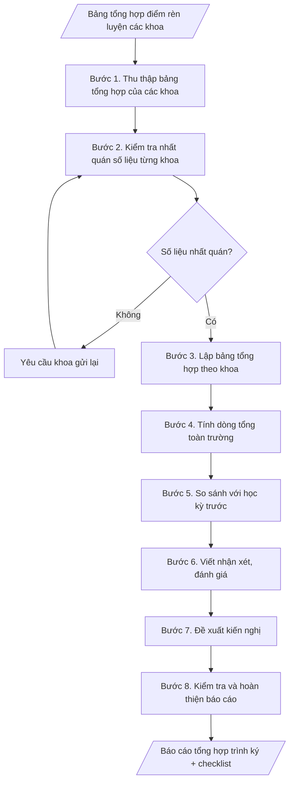

# Tổng hợp điểm rèn luyện toàn trường theo học kỳ

## Định dạng và file đầu ra

Định dạng đầu ra có thể chọn theo sản phẩm/yêu cầu: .xlsx, .csv, .pdf. Đọc mục “Định dạng bổ sung” trong quy cách đầu ra trước khi chọn.

**Phải tạo file thực tế để tải xuống, không chỉ trả nội dung trong chat.** Định dạng mặc định của skill: **.xlsx**. Nếu yêu cầu gồm cả báo cáo thuyết minh, tạo thêm file Word cho báo cáo; không ghép báo cáo dài vào bảng tính. Không chờ người dùng yêu cầu xuất file lần nữa. Ưu tiên định dạng người dùng chỉ định; đọc quy tắc xuất file tại references/quy-cach-dau-ra.md.

## Quy cách đầu ra và thông tin thiếu
Đọc [quy cách và cấu trúc sản phẩm](references/quy-cach-dau-ra.md) trước khi soạn/xuất. File giao chỉ gồm sản phẩm nghiệp vụ được yêu cầu; kiểm tra nội bộ không xuất kèm. Thiếu thông tin thì giữ nguyên trường/mục và chỗ điền theo mẫu gốc (dòng dấu chấm, dấu gạch hoặc ô trống); không tự điền dữ liệu mẫu, số 0, mã chờ xác minh hay dòng chờ ký. Mẫu chuyên ngành còn áp dụng được ưu tiên về cấu trúc, mã biểu và người ký. Bản đầy đủ: [quy tắc chung](references/quy-tac-chung.md).

## Kiểm soát áp dụng và phê duyệt
Trước khi chạy, xác định `ngay_ap_dung`, `loai_hinh_truong`, `quy_che_noi_bo`, `nguon_du_lieu`, `nguoi_kiem_duyet`; chỉ hỏi thông tin liên quan nghiệp vụ, không dùng giá trị giả định thay dữ liệu bắt buộc. Đối chiếu căn cứ pháp lý với văn bản gốc, hiệu lực, điều khoản áp dụng và chuyển tiếp. Bản đầy đủ: [quy tắc chung](references/quy-tac-chung.md).

## Giới hạn và human gate
AI hỗ trợ chuẩn bị và đối chiếu; cán bộ phụ trách kiểm tra dữ liệu/căn cứ, người có thẩm quyền duyệt và ký. Không đánh dấu đã ký, đã duyệt, đã công bố khi chưa có chứng cứ. Dữ liệu sinh viên, sức khỏe, nhân sự, tài chính chỉ dùng theo mục đích và phân quyền, che thông tin định danh khi dùng ví dụ (Luật 91/2025/QH15, hiệu lực 01/01/2026); không tải dữ liệu lên dịch vụ ngoài khi chưa có quyền. Bản đầy đủ: [quy tắc chung](references/quy-tac-chung.md).

## Khi nào dùng
Sau khi các khoa hoàn thành đánh giá kết quả rèn luyện sinh viên của học kỳ, khi Phòng Công tác
sinh viên cần tổng hợp toàn trường: lập bảng thống kê theo từng khoa (số sinh viên ở mỗi mức xếp
loại và tỷ lệ %), tính số liệu chung toàn trường, viết nhận xét – đánh giá – kiến nghị để báo cáo
Ban Giám hiệu và làm căn cứ xét học bổng, thi đua, khen thưởng.

## Đầu vào (Input)

| Trường | Mô tả | Bắt buộc |
|---|---|---|
| `hoc_ky` | Học kỳ tổng hợp (ví dụ: Học kỳ 1) | Có |
| `nam_hoc` | Năm học tổng hợp (ví dụ: 2026–2027) | Có |
| `du_lieu_khoa` | Kết quả từng khoa: tên khoa, tổng số SV được đánh giá, số SV ở mỗi mức xếp loại (Xuất sắc, Tốt, Khá, Trung bình, Yếu, Kém) | Có |
| `ky_truoc` | Số liệu tổng hợp của học kỳ trước (để so sánh biến động) | Không |
| `don_vi_bao_cao` | Đơn vị lập báo cáo (mặc định: Phòng Công tác sinh viên) | Không |
| `nguoi_ky` | Trưởng phòng Công tác sinh viên (thừa ủy quyền) / Phó Hiệu trưởng | Có |

## Quy trình

**Bước 1. Thu thập bảng tổng hợp của các khoa**
- Làm gì: tiếp nhận bảng tổng hợp điểm rèn luyện của từng khoa cho đúng học kỳ, năm học; đối
  chiếu danh sách khoa đã gửi/chưa gửi; kiểm tra mỗi bảng có chữ ký xác nhận của Trưởng khoa.
- Dùng input: `du_lieu_khoa`, `hoc_ky`, `nam_hoc`.
- Vai trò: Chuyên viên Phòng Công tác sinh viên · AI hỗ trợ: rà soát tính đầy đủ các bảng khoa · ⏱ ~2–4 giờ (ước tính)
- Lưu ý nghiệp vụ: chỉ nhận bảng đúng kỳ tổng hợp; loại trừ sinh viên bảo lưu, thôi học không
  thuộc diện đánh giá.
- → Kết quả bước: tập hợp bảng tổng hợp từng khoa đã tiếp nhận + danh sách khoa còn thiếu/
  chưa đạt yêu cầu cần gửi lại.

**Bước 2. Kiểm tra nhất quán số liệu từng khoa**
- Làm gì: với mỗi khoa, cộng số sinh viên ở 6 mức xếp loại (Xuất sắc, Tốt, Khá, Trung bình,
  Yếu, Kém) rồi đối chiếu với tổng số sinh viên được đánh giá của khoa; ghi nhận mọi chênh lệch.
- Dùng input: `du_lieu_khoa`.
- Vai trò: Chuyên viên Phòng Công tác sinh viên · AI hỗ trợ: cộng và đối chiếu số liệu từng khoa, phát hiện chênh lệch · ⏱ ~30 phút (ước tính)
- Lưu ý nghiệp vụ: chênh lệch khác 0 là lỗi số liệu, phải yêu cầu khoa gửi lại — không tự ý
  điều chỉnh số liệu của khoa.
- → Kết quả bước: bảng đối chiếu kiểm tra nhất quán (khoa đạt / khoa cần gửi lại, kèm nội
  dung lỗi cụ thể).

**Bước 3. Lập bảng tổng hợp theo khoa**
- Làm gì: dựng bảng với các cột: STT | Khoa | Tổng số SV | Xuất sắc (số lượng, %) | Tốt (số
  lượng, %) | Khá (số lượng, %) | Trung bình (số lượng, %) | Yếu (số lượng, %) | Kém (số
  lượng, %); tính tỷ lệ % từng mức trong phạm vi từng khoa.
- Dùng input: `du_lieu_khoa` (đã qua kiểm tra nhất quán ở bước 2).
- Vai trò: Chuyên viên Phòng Công tác sinh viên · AI hỗ trợ: lập bảng tổng hợp theo khoa, tính tỷ lệ % từng mức · ⏱ ~30–60 phút (ước tính)
- Lưu ý nghiệp vụ: tỷ lệ % tính trong từng khoa, làm tròn 1 chữ số thập phân.
- → Kết quả bước: bảng tổng hợp theo khoa (số lượng và tỷ lệ % từng mức xếp loại).

**Bước 4. Tính dòng tổng toàn trường**
- Làm gì: cộng dồn số sinh viên từng mức xếp loại của tất cả các khoa; tính tỷ lệ % từng mức
  trên tổng số sinh viên toàn trường; kiểm tra tổng các tỷ lệ xấp xỉ 100%.
- Dùng input: bảng tổng hợp theo khoa (kết quả bước 3).
- Vai trò: Chuyên viên Phòng Công tác sinh viên · AI hỗ trợ: cộng dồn toàn trường, kiểm tra tổng tỷ lệ xấp xỉ 100% · ⏱ ~15–30 phút (ước tính)
- Lưu ý nghiệp vụ: tổng số SV toàn trường phải bằng tổng cộng dồn các khoa; tỷ lệ làm tròn
  1 chữ số thập phân.
- → Kết quả bước: dòng tổng toàn trường (số lượng và tỷ lệ % từng mức), khớp với bảng tổng hợp.

**Bước 5. So sánh với học kỳ trước**
- Làm gì: tính chênh lệch tỷ lệ từng mức xếp loại giữa kỳ này và kỳ trước; xác định mức
  tăng/giảm đáng chú ý (biến động từ 2 điểm % trở lên).
- Dùng input: `ky_truoc`, dòng tổng toàn trường (kết quả bước 4).
- Vai trò: Chuyên viên Phòng Công tác sinh viên · AI hỗ trợ: tính chênh lệch tỷ lệ từng mức so với kỳ trước · ⏱ ~15–30 phút (ước tính)
- Lưu ý nghiệp vụ: nếu không có dữ liệu kỳ trước thì bỏ qua bước này và ghi rõ trong báo cáo;
  so sánh trên cùng thang mức xếp loại.
- → Kết quả bước: bảng so sánh biến động tỷ lệ từng mức (chênh lệch điểm %, nêu mức tăng/
  giảm đáng chú ý).

**Bước 6. Viết nhận xét – đánh giá**
- Làm gì: viết nhận xét chung (tỷ lệ Khá trở lên, diễn biến so với kỳ trước); nêu điểm sáng
  (khoa có tỷ lệ Xuất sắc/Tốt cao nhất, mức cải thiện tốt nhất); nêu tồn tại (khoa có tỷ lệ
  Yếu/Kém cao, nguyên nhân theo báo cáo của khoa); ghi trường hợp đặc biệt (sinh viên bị hạ
  xếp loại do kỷ luật, nếu có).
- Dùng input: bảng tổng hợp (bước 3–4), bảng so sánh (bước 5), `du_lieu_khoa` (nguyên nhân
  từ báo cáo của khoa).
- Vai trò: Trưởng Phòng Công tác sinh viên · AI hỗ trợ: soạn dự thảo nhận xét từ số liệu · ⏱ ~1–2 giờ (ước tính)
- Lưu ý nghiệp vụ: mọi nhận xét phải có căn cứ từ số liệu; không suy diễn nguyên nhân ngoài
  báo cáo của khoa.
- → Kết quả bước: dự thảo phần nhận xét – đánh giá (kết quả chung, điểm sáng, tồn tại,
  trường hợp đặc biệt).

**Bước 7. Đề xuất kiến nghị**
- Làm gì: đề xuất biện pháp nâng cao chất lượng rèn luyện (tăng cường hoạt động Đoàn – Hội,
  công tác cố vấn học tập, tuyên truyền nội quy...), ghi rõ thời hạn và đơn vị thực hiện cho
  từng kiến nghị.
- Dùng input: phần tồn tại (kết quả bước 6).
- Vai trò: Trưởng Phòng Công tác sinh viên · AI hỗ trợ: gợi ý biện pháp · ⏱ ~1 giờ (ước tính)
- Lưu ý nghiệp vụ: kiến nghị phải khả thi, gắn với đơn vị chịu trách nhiệm và mốc thời gian
  cụ thể.
- → Kết quả bước: dự thảo phần kiến nghị (biện pháp, thời hạn, đơn vị thực hiện).

**Bước 8. Kiểm tra và hoàn thiện báo cáo**
- Làm gì: kiểm tra số liệu cộng dồn, tỷ lệ %, tính căn cứ của nhận xét, thể thức văn bản hành
  chính và chữ ký; lắp ráp đầy đủ thành báo cáo hoàn chỉnh file theo định dạng đầu ra của skill.
- Dùng input: `don_vi_bao_cao`, `nguoi_ky`, kết quả các bước 3–7.
- Vai trò: Chuyên viên Phòng Công tác sinh viên · AI hỗ trợ: kiểm tra chéo số liệu toàn văn · ⏱ ~30–60 phút (ước tính)
- Lưu ý nghiệp vụ: kiểm tra chéo lần cuối trước khi trình ký; thực hiện đối chiếu nội bộ, không xuất kèm checklist
  số liệu.
- → Kết quả bước: báo cáo tổng hợp điểm rèn luyện hoàn chỉnh; phần kiểm tra giữ nội bộ số liệu,
  sẵn sàng trình ký.

## Luồng quy trình (Workflow)

## Đầu ra

File nghiệp vụ thực tế theo định dạng mặc định ở đầu skill hoặc định dạng người dùng yêu cầu, kèm liên kết tải trong phản hồi cuối.

Sản phẩm nghiệp vụ hoàn chỉnh theo [quy cách và cấu trúc](references/quy-cach-dau-ra.md), giữ các trường chưa có dữ liệu ở trạng thái trống. Không xuất kèm checklist/phụ lục kiểm tra đầu ra.

## Kiểm tra nội bộ trước khi giao

- [ ] Bố cục khớp mẫu áp dụng và cấu trúc tại references/quy-cach-dau-ra.md.
- [ ] Tổng các mức xếp loại của mỗi khoa bằng tổng số SV được đánh giá của khoa; dòng tổng toàn trường bằng tổng cộng dồn các khoa; tổng các tỷ lệ % xấp xỉ 100%.
- [ ] Tỷ lệ % tính trong phạm vi từng khoa, làm tròn 1 chữ số thập phân.
- [ ] Số liệu trong output khớp Input; sinh viên bảo lưu, thôi học không đưa vào bảng tổng hợp.
- [ ] Không bịa đặt số liệu; nhận xét phải có căn cứ từ số liệu, không suy diễn nguyên nhân ngoài báo cáo của khoa.
- [ ] So sánh với kỳ trước có số liệu đối chiếu cụ thể, hoặc ghi rõ khi không có dữ liệu kỳ trước.
- [ ] Kiến nghị khả thi, gắn đơn vị chịu trách nhiệm và mốc thời gian cụ thể.
- [ ] Đã qua Human gate: số liệu khoa có chữ ký xác nhận của Trưởng khoa; Trưởng phòng CTSV (thừa ủy quyền) hoặc Phó Hiệu trưởng ký báo cáo.

Tiêu chí đạt = tất cả các ô được đánh dấu.

## Căn cứ & lưu ý
- Thông tư 16/2015/TT-BGDĐT quy định về đánh giá kết quả rèn luyện của người học;
  các mức xếp loại: Xuất sắc (90–100), Tốt (80–<90), Khá (65–<80), Trung bình (50–<65),
  Yếu (35–<50), Kém (<35).
- Chỉ tổng hợp sinh viên thuộc diện đánh giá trong học kỳ; sinh viên bảo lưu, thôi học
  không đưa vào bảng tổng hợp.
- Số liệu các khoa gửi về phải có chữ ký xác nhận của Trưởng khoa; Phòng CTSV chịu trách
  nhiệm kiểm tra tính nhất quán trước khi tổng hợp toàn trường.
- Không dùng tên thật của trường/cá nhân khi mô phỏng.

## Quản trị phiên bản
- Phiên bản gói `1.3.2` (cập nhật 2026-10-10); hồ sơ đầy đủ tại [references/version.json](references/version.json).
- Người phê duyệt nghiệp vụ: **chưa chỉ định**. Trạng thái: dự thảo nghiệp vụ; kiểm tra pháp lý trước thực thi. Ngày cập nhật không đồng nghĩa mọi văn bản đã được rà soát toàn văn.
- Giấy phép theo LICENSE của kho (bản quyền CES Global). Lịch sử thay đổi: CHANGELOG.md.
