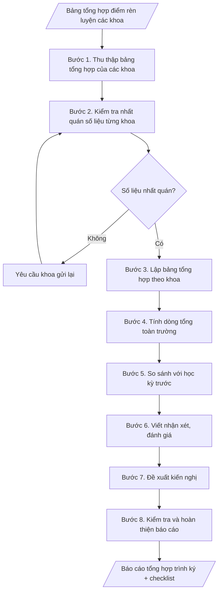

# Tổng hợp điểm rèn luyện toàn trường theo học kỳ

## Kiểm soát áp dụng và phê duyệt

Trước khi chạy quy trình, xác định `ngay_ap_dung`, `loai_hinh_truong`, `quy_che_noi_bo`, `nguon_du_lieu` và `nguoi_kiem_duyet`. Chỉ yêu cầu thông tin có liên quan đến nghiệp vụ; không dùng giá trị giả định thay dữ liệu bắt buộc. Hồ sơ có yếu tố pháp lý phải kèm văn bản gốc, tình trạng hiệu lực, điều khoản áp dụng và chuyển tiếp.

## Giới hạn và human gate

AI hỗ trợ chuẩn bị và đối chiếu. Cán bộ phụ trách kiểm tra dữ liệu/căn cứ, người có thẩm quyền duyệt và ký. Mọi đầu ra mặc định là **DỰ THẢO – CHỜ KIỂM DUYỆT**; không đánh dấu đã ký, đã duyệt hoặc đã công bố nếu chưa có chứng cứ. Dữ liệu sinh viên, sức khỏe, nhân sự và tài chính phải hạn chế theo mục đích, phân quyền và che thông tin định danh khi dùng ví dụ. Không tải dữ liệu lên dịch vụ ngoài khi chưa có quyền. Kiểm tra Luật 91/2025/QH15 về bảo vệ dữ liệu cá nhân (hiệu lực 01/01/2026) và quy định áp dụng trước xử lý/chia sẻ dữ liệu cá nhân.


## Khi nào dùng
Sau khi các khoa hoàn thành đánh giá kết quả rèn luyện sinh viên của học kỳ, khi Phòng Công tác
sinh viên cần tổng hợp toàn trường: lập bảng thống kê theo từng khoa (số sinh viên ở mỗi mức xếp
loại và tỷ lệ %), tính số liệu chung toàn trường, viết nhận xét – đánh giá – kiến nghị để báo cáo
Ban Giám hiệu và làm căn cứ xét học bổng, thi đua, khen thưởng.

## Đầu vào (Input)

| Trường | Mô tả | Bắt buộc |
|---|---|---|
| `hoc_ky` | Học kỳ tổng hợp (ví dụ: Học kỳ 1) | Có |
| `nam_hoc` | Năm học tổng hợp (ví dụ: 2026–2027) | Có |
| `du_lieu_khoa` | Kết quả từng khoa: tên khoa, tổng số SV được đánh giá, số SV ở mỗi mức xếp loại (Xuất sắc, Tốt, Khá, Trung bình, Yếu, Kém) | Có |
| `ky_truoc` | Số liệu tổng hợp của học kỳ trước (để so sánh biến động) | Không |
| `don_vi_bao_cao` | Đơn vị lập báo cáo (mặc định: Phòng Công tác sinh viên) | Không |
| `nguoi_ky` | Trưởng phòng Công tác sinh viên (thừa ủy quyền) / Phó Hiệu trưởng | Có |

## Quy trình

**Bước 1. Thu thập bảng tổng hợp của các khoa**
- Làm gì: tiếp nhận bảng tổng hợp điểm rèn luyện của từng khoa cho đúng học kỳ, năm học; đối
  chiếu danh sách khoa đã gửi/chưa gửi; kiểm tra mỗi bảng có chữ ký xác nhận của Trưởng khoa.
- Dùng input: `du_lieu_khoa`, `hoc_ky`, `nam_hoc`.
- Vai trò: Chuyên viên Phòng Công tác sinh viên · AI hỗ trợ: rà soát tính đầy đủ các bảng khoa · ⏱ ~2–4 giờ (ước tính)
- Lưu ý nghiệp vụ: chỉ nhận bảng đúng kỳ tổng hợp; loại trừ sinh viên bảo lưu, thôi học không
  thuộc diện đánh giá.
- → Kết quả bước: tập hợp bảng tổng hợp từng khoa đã tiếp nhận + danh sách khoa còn thiếu/
  chưa đạt yêu cầu cần gửi lại.

**Bước 2. Kiểm tra nhất quán số liệu từng khoa**
- Làm gì: với mỗi khoa, cộng số sinh viên ở 6 mức xếp loại (Xuất sắc, Tốt, Khá, Trung bình,
  Yếu, Kém) rồi đối chiếu với tổng số sinh viên được đánh giá của khoa; ghi nhận mọi chênh lệch.
- Dùng input: `du_lieu_khoa`.
- Vai trò: Chuyên viên Phòng Công tác sinh viên · AI hỗ trợ: cộng và đối chiếu số liệu từng khoa, phát hiện chênh lệch · ⏱ ~30 phút (ước tính)
- Lưu ý nghiệp vụ: chênh lệch khác 0 là lỗi số liệu, phải yêu cầu khoa gửi lại — không tự ý
  điều chỉnh số liệu của khoa.
- → Kết quả bước: bảng đối chiếu kiểm tra nhất quán (khoa đạt / khoa cần gửi lại, kèm nội
  dung lỗi cụ thể).

**Bước 3. Lập bảng tổng hợp theo khoa**
- Làm gì: dựng bảng với các cột: STT | Khoa | Tổng số SV | Xuất sắc (số lượng, %) | Tốt (số
  lượng, %) | Khá (số lượng, %) | Trung bình (số lượng, %) | Yếu (số lượng, %) | Kém (số
  lượng, %); tính tỷ lệ % từng mức trong phạm vi từng khoa.
- Dùng input: `du_lieu_khoa` (đã qua kiểm tra nhất quán ở bước 2).
- Vai trò: Chuyên viên Phòng Công tác sinh viên · AI hỗ trợ: lập bảng tổng hợp theo khoa, tính tỷ lệ % từng mức · ⏱ ~30–60 phút (ước tính)
- Lưu ý nghiệp vụ: tỷ lệ % tính trong từng khoa, làm tròn 1 chữ số thập phân.
- → Kết quả bước: bảng tổng hợp theo khoa (số lượng và tỷ lệ % từng mức xếp loại).

**Bước 4. Tính dòng tổng toàn trường**
- Làm gì: cộng dồn số sinh viên từng mức xếp loại của tất cả các khoa; tính tỷ lệ % từng mức
  trên tổng số sinh viên toàn trường; kiểm tra tổng các tỷ lệ xấp xỉ 100%.
- Dùng input: bảng tổng hợp theo khoa (kết quả bước 3).
- Vai trò: Chuyên viên Phòng Công tác sinh viên · AI hỗ trợ: cộng dồn toàn trường, kiểm tra tổng tỷ lệ xấp xỉ 100% · ⏱ ~15–30 phút (ước tính)
- Lưu ý nghiệp vụ: tổng số SV toàn trường phải bằng tổng cộng dồn các khoa; tỷ lệ làm tròn
  1 chữ số thập phân.
- → Kết quả bước: dòng tổng toàn trường (số lượng và tỷ lệ % từng mức), khớp với bảng tổng hợp.

**Bước 5. So sánh với học kỳ trước**
- Làm gì: tính chênh lệch tỷ lệ từng mức xếp loại giữa kỳ này và kỳ trước; xác định mức
  tăng/giảm đáng chú ý (biến động từ 2 điểm % trở lên).
- Dùng input: `ky_truoc`, dòng tổng toàn trường (kết quả bước 4).
- Vai trò: Chuyên viên Phòng Công tác sinh viên · AI hỗ trợ: tính chênh lệch tỷ lệ từng mức so với kỳ trước · ⏱ ~15–30 phút (ước tính)
- Lưu ý nghiệp vụ: nếu không có dữ liệu kỳ trước thì bỏ qua bước này và ghi rõ trong báo cáo;
  so sánh trên cùng thang mức xếp loại.
- → Kết quả bước: bảng so sánh biến động tỷ lệ từng mức (chênh lệch điểm %, nêu mức tăng/
  giảm đáng chú ý).

**Bước 6. Viết nhận xét – đánh giá**
- Làm gì: viết nhận xét chung (tỷ lệ Khá trở lên, diễn biến so với kỳ trước); nêu điểm sáng
  (khoa có tỷ lệ Xuất sắc/Tốt cao nhất, mức cải thiện tốt nhất); nêu tồn tại (khoa có tỷ lệ
  Yếu/Kém cao, nguyên nhân theo báo cáo của khoa); ghi trường hợp đặc biệt (sinh viên bị hạ
  xếp loại do kỷ luật, nếu có).
- Dùng input: bảng tổng hợp (bước 3–4), bảng so sánh (bước 5), `du_lieu_khoa` (nguyên nhân
  từ báo cáo của khoa).
- Vai trò: Trưởng Phòng Công tác sinh viên · AI hỗ trợ: soạn dự thảo nhận xét từ số liệu · ⏱ ~1–2 giờ (ước tính)
- Lưu ý nghiệp vụ: mọi nhận xét phải có căn cứ từ số liệu; không suy diễn nguyên nhân ngoài
  báo cáo của khoa.
- → Kết quả bước: dự thảo phần nhận xét – đánh giá (kết quả chung, điểm sáng, tồn tại,
  trường hợp đặc biệt).

**Bước 7. Đề xuất kiến nghị**
- Làm gì: đề xuất biện pháp nâng cao chất lượng rèn luyện (tăng cường hoạt động Đoàn – Hội,
  công tác cố vấn học tập, tuyên truyền nội quy...), ghi rõ thời hạn và đơn vị thực hiện cho
  từng kiến nghị.
- Dùng input: phần tồn tại (kết quả bước 6).
- Vai trò: Trưởng Phòng Công tác sinh viên · AI hỗ trợ: gợi ý biện pháp · ⏱ ~1 giờ (ước tính)
- Lưu ý nghiệp vụ: kiến nghị phải khả thi, gắn với đơn vị chịu trách nhiệm và mốc thời gian
  cụ thể.
- → Kết quả bước: dự thảo phần kiến nghị (biện pháp, thời hạn, đơn vị thực hiện).

**Bước 8. Kiểm tra và hoàn thiện báo cáo**
- Làm gì: kiểm tra số liệu cộng dồn, tỷ lệ %, tính căn cứ của nhận xét, thể thức văn bản hành
  chính và chữ ký; lắp ráp đầy đủ thành báo cáo hoàn chỉnh định dạng markdown.
- Dùng input: `don_vi_bao_cao`, `nguoi_ky`, kết quả các bước 3–7.
- Vai trò: Chuyên viên Phòng Công tác sinh viên · AI hỗ trợ: kiểm tra chéo số liệu toàn văn · ⏱ ~30–60 phút (ước tính)
- Lưu ý nghiệp vụ: kiểm tra chéo lần cuối trước khi trình ký; đính kèm checklist kiểm tra
  số liệu.
- → Kết quả bước: báo cáo tổng hợp điểm rèn luyện hoàn chỉnh + checklist kiểm tra số liệu,
  sẵn sàng trình ký.

## Luồng quy trình (Workflow)


## Đầu ra (Output)
- Bảng tổng hợp điểm rèn luyện toàn trường theo khoa (số lượng và tỷ lệ % từng mức xếp loại,
  dòng tổng toàn trường).
- Phần nhận xét – đánh giá – kiến nghị.
- Checklist kiểm tra số liệu.

**Cấu trúc output chuẩn:** khung cố định của Báo cáo tổng hợp điểm rèn luyện:
1. Tiêu đề văn bản hành chính: Quốc hiệu – Tiêu ngữ; tên đơn vị lập (`don_vi_bao_cao`); số,
   ký hiệu; địa danh, ngày tháng năm ban hành.
2. Tên báo cáo: "BÁO CÁO TỔNG HỢP ĐIỂM RÈN LUYỆN SINH VIÊN" + học kỳ, năm học (`hoc_ky`,
   `nam_hoc`).
3. Kính gửi Ban Giám hiệu + đoạn mở đầu nêu căn cứ (kết quả đánh giá rèn luyện do các khoa
   gửi về).
4. Phần I. Bảng tổng hợp theo khoa: cột STT | Khoa | Tổng số SV | từng mức xếp loại (số
   lượng, %) | dòng tổng toàn trường ở cuối bảng.
5. Phần II. Nhận xét, đánh giá: kết quả chung; điểm sáng; tồn tại và nguyên nhân; trường hợp
   đặc biệt.
6. Phần III. Kiến nghị: từng kiến nghị kèm thời hạn và đơn vị thực hiện.
7. Đoạn kết + Nơi nhận + chữ ký (`nguoi_ky`).

## Checklist nghiệm thu

- [ ] Đủ các phần theo "Cấu trúc output chuẩn": tiêu đề văn bản; tên báo cáo + học kỳ, năm học; kính gửi Ban Giám hiệu + căn cứ; Phần I. Bảng tổng hợp theo khoa (có dòng tổng toàn trường); Phần II. Nhận xét, đánh giá; Phần III. Kiến nghị; đoạn kết + nơi nhận + chữ ký.
- [ ] Tổng các mức xếp loại của mỗi khoa bằng tổng số SV được đánh giá của khoa; dòng tổng toàn trường bằng tổng cộng dồn các khoa; tổng các tỷ lệ % xấp xỉ 100%.
- [ ] Tỷ lệ % tính trong phạm vi từng khoa, làm tròn 1 chữ số thập phân.
- [ ] Số liệu trong output khớp Input; sinh viên bảo lưu, thôi học không đưa vào bảng tổng hợp.
- [ ] Không bịa đặt số liệu; nhận xét phải có căn cứ từ số liệu, không suy diễn nguyên nhân ngoài báo cáo của khoa.
- [ ] So sánh với kỳ trước có số liệu đối chiếu cụ thể, hoặc ghi rõ khi không có dữ liệu kỳ trước.
- [ ] Kiến nghị khả thi, gắn đơn vị chịu trách nhiệm và mốc thời gian cụ thể.
- [ ] Đã qua Human gate: số liệu khoa có chữ ký xác nhận của Trưởng khoa; Trưởng phòng CTSV (thừa ủy quyền) hoặc Phó Hiệu trưởng ký báo cáo.

Tiêu chí đạt = tất cả các ô được đánh dấu.

## Ví dụ mô phỏng (dữ liệu giả lập)

> Tất cả tên trường, tên khoa, cá nhân, số liệu dưới đây đều là **giả lập**,
> không liên quan tổ chức/cá nhân có thật.

### Input mẫu

| Trường | Giá trị |
|---|---|
| `hoc_ky` | Học kỳ 1 |
| `nam_hoc` | 2026–2027 |
| `du_lieu_khoa` | 06 khoa (chi tiết ở bảng tổng hợp bên dưới) |
| `ky_truoc` | Học kỳ 2, năm học 2025–2026: Khá trở lên 78,5%; Yếu, Kém 2,1% |
| `nguoi_ky` | Trưởng phòng Công tác sinh viên (thừa ủy quyền) |

### Output mẫu

```
TRƯỜNG ĐẠI HỌC A            CỘNG HÒA XÃ HỘI CHỦ NGHĨA VIỆT NAM
PHÒNG CÔNG TÁC SINH VIÊN                 Độc lập – Tự do – Hạnh phúc
      Số: 52/BC-ĐHA-CTSV
                                                 Thành phố C, ngày 20 tháng 02 năm 2027

               BÁO CÁO TỔNG HỢP ĐIỂM RÈN LUYỆN SINH VIÊN
                    Học kỳ 1, năm học 2026–2027

Kính gửi: Ban Giám hiệu Trường Đại học A

Căn cứ kết quả đánh giá rèn luyện sinh viên học kỳ 1, năm học 2026–2027 do các
khoa gửi về, Phòng Công tác sinh viên tổng hợp như sau:

I. BẢNG TỔNG HỢP THEO KHOA
```

| STT | Khoa | Tổng số SV | Xuất sắc | Tốt | Khá | Trung bình | Yếu | Kém |
|---|---|---|---|---|---|---|---|---|
| 1 | Công nghệ thông tin | 1.850 | 148 (8,0%) | 592 (32,0%) | 814 (44,0%) | 222 (12,0%) | 55 (3,0%) | 19 (1,0%) |
| 2 | Kinh tế | 2.100 | 189 (9,0%) | 714 (34,0%) | 903 (43,0%) | 231 (11,0%) | 42 (2,0%) | 21 (1,0%) |
| 3 | Quản trị kinh doanh | 1.600 | 112 (7,0%) | 480 (30,0%) | 720 (45,0%) | 208 (13,0%) | 64 (4,0%) | 16 (1,0%) |
| 4 | Kỹ thuật | 1.450 | 87 (6,0%) | 406 (28,0%) | 638 (44,0%) | 232 (16,0%) | 58 (4,0%) | 29 (2,0%) |
| 5 | Ngoại ngữ | 1.200 | 120 (10,0%) | 420 (35,0%) | 504 (42,0%) | 120 (10,0%) | 24 (2,0%) | 12 (1,0%) |
| 6 | Luật | 900 | 72 (8,0%) | 279 (31,0%) | 387 (43,0%) | 126 (14,0%) | 27 (3,0%) | 9 (1,0%) |
| | **Toàn trường** | **9.100** | **728 (8,0%)** | **2.891 (31,8%)** | **3.966 (43,6%)** | **1.139 (12,5%)** | **270 (3,0%)** | **106 (1,2%)** |

*(Số liệu giả lập)*

```
II. NHẬN XÉT, ĐÁNH GIÁ

1. Kết quả chung: tỷ lệ sinh viên đạt loại Khá trở lên toàn trường là 83,4%,
tăng 4,9 điểm % so với học kỳ 2 năm học 2025–2026 (78,5%); tỷ lệ Yếu, Kém là
4,2%, tăng 2,1 điểm % so với kỳ trước — cần theo dõi.

2. Điểm sáng: Khoa Ngoại ngữ có tỷ lệ Xuất sắc cao nhất (10,0%) và tỷ lệ
Tốt cao nhất (35,0%); Khoa Kinh tế có số lượng sinh viên Xuất sắc nhiều nhất
(189 sinh viên).

3. Tồn tại: Khoa Kỹ thuật có tỷ lệ Trung bình trở xuống cao nhất (22,0%), trong
đó tỷ lệ Kém 2,0% — cao nhất toàn trường; theo báo cáo của khoa, nguyên nhân
chủ yếu là sinh viên vi phạm quy định an toàn phòng thí nghiệm và vắng hoạt
động Đoàn – Hội.

4. Trường hợp đặc biệt: 03 sinh viên bị kỷ luật mức cảnh cáo trong học kỳ được
xếp loại tối đa Trung bình theo quy định; 01 sinh viên bị đình chỉ học tập xếp
loại Kém.

III. KIẾN NGHỊ

1. Các khoa, đặc biệt là Khoa Kỹ thuật, tăng cường tuyên truyền nội quy, quy chế
và tổ chức hoạt động Đoàn – Hội thu hút sinh viên tham gia trong học kỳ 2.

2. Phòng Công tác sinh viên phối hợp với Đoàn Thanh niên, Hội Sinh viên tổ chức
đợt sinh hoạt chuyên đề về văn hóa ứng xử và an toàn phòng thí nghiệm trong
tháng 3/2027.

3. Cố vấn học tập các lớp có tỷ lệ Yếu, Kém cao tổ chức gặp gỡ, nắm bắt nguyên
nhân và có biện pháp hỗ trợ sinh viên kịp thời./.

Nơi nhận:                                      TL. HIỆU TRƯỞNG
- Ban Giám hiệu (báo cáo);                     TRƯỞNG PHÒNG CTSV
- Các khoa (để thực hiện);
- Lưu: VT, CTSV.                                   [CHỜ KÝ]

                                              Nguyễn Văn Thành
```

### Checklist kiểm tra số liệu (output kèm theo)
- [x] Tổng các mức xếp loại của mỗi khoa bằng tổng số SV được đánh giá của khoa
- [x] Dòng tổng toàn trường bằng tổng cộng dồn các khoa
- [x] Tổng các tỷ lệ % xấp xỉ 100% (sai số làm tròn cho phép)
- [x] So sánh với kỳ trước có số liệu đối chiếu cụ thể
- [x] Nhận xét, kiến nghị có căn cứ từ số liệu bảng tổng hợp

## Căn cứ & lưu ý
- Thông tư 16/2015/TT-BGDĐT quy định về đánh giá kết quả rèn luyện của người học;
  các mức xếp loại: Xuất sắc (90–100), Tốt (80–<90), Khá (65–<80), Trung bình (50–<65),
  Yếu (35–<50), Kém (<35).
- Chỉ tổng hợp sinh viên thuộc diện đánh giá trong học kỳ; sinh viên bảo lưu, thôi học
  không đưa vào bảng tổng hợp.
- Số liệu các khoa gửi về phải có chữ ký xác nhận của Trưởng khoa; Phòng CTSV chịu trách
  nhiệm kiểm tra tính nhất quán trước khi tổng hợp toàn trường.
- Không dùng tên thật của trường/cá nhân khi mô phỏng.

## Quản trị phiên bản

- Phiên bản gói: `1.1.0`; ngày cập nhật: `2026-10-09`.
- Kho nguồn: https://github.com/phamtruong91/dh-skills
- Người duy trì trên GitHub: `phamtruong91` (Phạm Văn Trường). Người phê duyệt nghiệp vụ: **chưa chỉ định**.
- Commit nguồn trước cập nhật: `78fd1d51b8acd1a724d9b9af6c488460bc7551ad`. Commit chứa phiên bản này xem bằng `git log -1 -- skills/tong-hop-diem-ren-luyen`; không tự gán SHA chưa tạo.
- Giấy phép: theo LICENSE của kho; bản quyền CES Global.
- Lịch sử 1.1.0: bổ sung metadata giao diện, kiểm soát áp dụng, quản trị phiên bản.
- Trạng thái: dự thảo nghiệp vụ; kiểm tra pháp lý trước thực thi. Ngày cập nhật không đồng nghĩa mọi văn bản đã được rà soát toàn văn.
