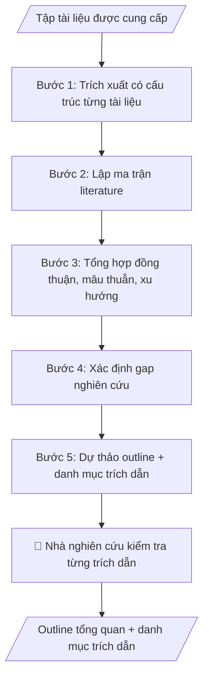

# Tổng quan tài liệu khoa học

## Định dạng và file đầu ra

Định dạng đầu ra có thể chọn theo sản phẩm/yêu cầu: .docx, .pdf, .tex, .bib, .md. Đọc mục “Định dạng bổ sung” trong quy cách đầu ra trước khi chọn.

**Phải tạo file thực tế để tải xuống, không chỉ trả nội dung trong chat.** Định dạng mặc định của skill: **.docx**. Nếu có bảng số liệu nghiệp vụ yêu cầu file bảng tính riêng, tạo thêm Excel theo yêu cầu; không tự tạo file kiểm tra. Không chờ người dùng yêu cầu xuất file lần nữa. Ưu tiên định dạng người dùng chỉ định; đọc quy tắc xuất file tại references/quy-cach-dau-ra.md.

## Quy cách đầu ra và thông tin thiếu
Đọc [quy cách và cấu trúc sản phẩm](references/quy-cach-dau-ra.md) trước khi soạn/xuất. File giao chỉ gồm sản phẩm nghiệp vụ được yêu cầu; kiểm tra nội bộ không xuất kèm. Thiếu thông tin thì giữ nguyên trường/mục và chỗ điền theo mẫu gốc (dòng dấu chấm, dấu gạch hoặc ô trống); không tự điền dữ liệu mẫu, số 0, mã chờ xác minh hay dòng chờ ký. Mẫu chuyên ngành còn áp dụng được ưu tiên về cấu trúc, mã biểu và người ký. Bản đầy đủ: [quy tắc chung](references/quy-tac-chung.md).

## Kiểm soát áp dụng và phê duyệt
Trước khi chạy, xác định `ngay_ap_dung`, `loai_hinh_truong`, `quy_che_noi_bo`, `nguon_du_lieu`, `nguoi_kiem_duyet`; chỉ hỏi thông tin liên quan nghiệp vụ, không dùng giá trị giả định thay dữ liệu bắt buộc. Đối chiếu căn cứ pháp lý với văn bản gốc, hiệu lực, điều khoản áp dụng và chuyển tiếp. Bản đầy đủ: [quy tắc chung](references/quy-tac-chung.md).

## Giới hạn và human gate
AI hỗ trợ chuẩn bị và đối chiếu; cán bộ phụ trách kiểm tra dữ liệu/căn cứ, người có thẩm quyền duyệt và ký. Không đánh dấu đã ký, đã duyệt, đã công bố khi chưa có chứng cứ. Dữ liệu sinh viên, sức khỏe, nhân sự, tài chính chỉ dùng theo mục đích và phân quyền, che thông tin định danh khi dùng ví dụ (Luật 91/2025/QH15, hiệu lực 01/01/2026); không tải dữ liệu lên dịch vụ ngoài khi chưa có quyền. Bản đầy đủ: [quy tắc chung](references/quy-tac-chung.md).

## Khi nào dùng
Khi viết phần tổng quan nghiên cứu cho đề tài, luận văn/luận án, bài báo khoa học.
Dùng chung cho giảng viên, nghiên cứu viên, học viên cao học, NCS ở mọi khoa/phòng.

## Đầu vào (Input)

| Trường | Mô tả | Bắt buộc |
|---|---|---|
| `cau_hoi_nghien_cuu` | Câu hỏi/mục tiêu nghiên cứu cần tổng quan | Có |
| `tai_lieu` | Danh sách tài liệu được phép dùng: tiêu đề, tác giả, năm, nguồn, file/tóm tắt | Có |
| `pham_vi` | Giới hạn năm xuất bản, loại nguồn (tạp chí, hội thảo...) | Không |
| `dinh_dang_trich_dan` | APA / IEEE / Vancouver... | Không (mặc định: APA) |

## Quy trình

**Bước 1. Trích xuất có cấu trúc từng tài liệu**
- Làm gì: Đọc từng tài liệu trong `tai_lieu`; trích: câu hỏi nghiên cứu, phương pháp, kết quả chính, hạn chế — kèm trích dẫn đầy đủ (tác giả, năm, nguồn); kiểm tra `pham_vi` (năm xuất bản, loại nguồn) để loại tài liệu ngoài phạm vi, ghi rõ lý do loại.
- Dùng input: `tai_lieu`, `pham_vi`, `cau_hoi_nghien_cuu`.
- Vai trò: Nhà nghiên cứu · AI hỗ trợ: trích xuất có cấu trúc từng tài liệu (câu hỏi, phương pháp, kết quả, hạn chế) · ⏱ ~20–40 phút (ước tính)
- Lưu ý nghiệp vụ: chỉ trích xuất từ tài liệu được cung cấp — TUYỆT ĐỐI không bịa thêm; thiếu thông tin ghi "không xác định"; giữ nguyên số liệu gốc, không diễn giải thêm.
- → Kết quả bước: Phiếu trích xuất có cấu trúc cho từng tài liệu.

**Bước 2. Lập ma trận literature**
- Làm gì: Dựng bảng ma trận: hàng = tài liệu, cột = phương pháp / dữ liệu / kết quả chính / hạn chế; điền nội dung từ phiếu trích xuất ở bước 1; kiểm tra mỗi ô đều có căn cứ trích dẫn rõ ràng.
- Dùng input: (phiếu trích xuất từ bước 1).
- Vai trò: Nhà nghiên cứu · AI hỗ trợ: dựng ma trận so sánh, đảm bảo mỗi ô có căn cứ trích dẫn · ⏱ ~15–25 phút (ước tính)
- Lưu ý nghiệp vụ: ma trận phải trung thực — không gom nhóm làm mờ khác biệt giữa các nghiên cứu; cột "hạn chế" là bắt buộc vì đó chính là nguồn của gap ở bước 4.
- → Kết quả bước: Ma trận so sánh tài liệu hoàn chỉnh.

**Bước 3. Tổng hợp xu hướng, đồng thuận, mâu thuẫn**
- Làm gì: Đọc ma trận theo chiều dọc từng cột: rút ra xu hướng chung, điểm các nghiên cứu đồng thuận, điểm mâu thuẫn; mỗi nhận định phải dẫn chiếu cụ thể tài liệu nào (tác giả, năm).
- Dùng input: `cau_hoi_nghien_cuu` (ma trận từ bước 2).
- Vai trò: Nhà nghiên cứu · AI hỗ trợ: tổng hợp xu hướng/đồng thuận/mâu thuẫn, mỗi nhận định dẫn chiếu tài liệu cụ thể · ⏱ ~15–25 phút (ước tính)
- Lưu ý nghiệp vụ: không suy diễn vượt quá dữ liệu trong ma trận; điểm mâu thuẫn phải nêu rõ cả hai phía, không "hòa giải" hộ nhà nghiên cứu.
- → Kết quả bước: Bản tổng hợp (xu hướng/đồng thuận/mâu thuẫn) có dẫn chiếu.

**Bước 4. Xác định gap nghiên cứu**
- Làm gì: Từ cột "hạn chế" và các điểm mâu thuẫn trong ma trận, liệt kê những câu hỏi chưa được trả lời; mỗi gap ghi rõ: dẫn từ tài liệu nào, vì sao là khoảng trống; sắp xếp theo mức độ liên quan đến `cau_hoi_nghien_cuu`.
- Dùng input: `cau_hoi_nghien_cuu` (ma trận từ bước 2, tổng hợp từ bước 3).
- Vai trò: Nhà nghiên cứu · AI hỗ trợ: xác định gap nghiên cứu dẫn từ tài liệu, sắp xếp theo liên quan đến câu hỏi nghiên cứu · ⏱ ~15–25 phút (ước tính)
- Lưu ý nghiệp vụ: gap phải dẫn từ tài liệu, không "nghĩ ra"; phân biệt gap thật với hạn chế đã được nghiên cứu khác lấp đầy.
- → Kết quả bước: Danh sách gap nghiên cứu có căn cứ.

**Bước 5. Dự thảo outline và danh mục trích dẫn**
- Làm gì: Dự thảo outline phần tổng quan bám theo ma trận + gap (mở đầu → các chủ đề → gap → hướng nghiên cứu); lập danh mục trích dẫn đầy đủ theo `dinh_dang_trich_dan` (mặc định APA); đối chiếu chéo: mọi trích dẫn trong outline đều có trong danh mục và ngược lại.
- Dùng input: `dinh_dang_trich_dan` (ma trận, tổng hợp, gap từ bước 2–4).
- Vai trò: Nhà nghiên cứu · AI hỗ trợ: dự thảo outline + danh mục trích dẫn theo định dạng, đối chiếu chéo hai chiều · ⏱ ~15–25 phút (ước tính)
- Lưu ý nghiệp vụ: kiểm tra kỹ chính tả tên tác giả, năm xuất bản — lỗi trích dẫn làm mất uy tín bài viết; outline chỉ là khung, không viết hộ nội dung phân tích sâu.
- → Kết quả bước: Outline phần tổng quan + danh mục trích dẫn chuẩn — sản phẩm cuối.
## Luồng quy trình (Workflow)

## Đầu ra

File nghiệp vụ thực tế theo định dạng mặc định ở đầu skill hoặc định dạng người dùng yêu cầu, kèm liên kết tải trong phản hồi cuối.

Sản phẩm nghiệp vụ hoàn chỉnh theo [quy cách và cấu trúc](references/quy-cach-dau-ra.md), giữ các trường chưa có dữ liệu ở trạng thái trống. Không xuất kèm checklist/phụ lục kiểm tra đầu ra.

## Kiểm tra nội bộ trước khi giao

- [ ] Output đầy đủ 5 phần theo cấu trúc sản phẩm tại references/quy-cach-dau-ra.md: câu hỏi nghiên cứu + phạm vi tổng quan; ma trận so sánh; tổng hợp; gap nghiên cứu; outline + danh mục trích dẫn.
- [ ] Chỉ tổng hợp từ tài liệu được cung cấp; mọi nhận định trong tổng hợp đều dẫn chiếu cụ thể tài liệu (tác giả, năm).
- [ ] TUYỆT ĐỐI không bịa trích dẫn: không tự tạo tên tác giả, năm, tạp chí, số liệu; thiếu thông tin ghi "không xác định".
- [ ] Mâu thuẫn được nêu rõ cả hai phía, không "hòa giải" hộ nhà nghiên cứu; gap dẫn từ tài liệu, phân biệt gap thật với hạn chế đã được nghiên cứu khác lấp đầy.
- [ ] Đối chiếu chéo: mọi trích dẫn trong outline đều có trong danh mục và ngược lại; chính tả tên tác giả, năm xuất bản chính xác.
- [ ] Đúng định dạng trích dẫn yêu cầu (APA/IEEE...); không tái tạo nguyên văn đoạn dài của tài liệu có bản quyền.
- [ ] Đã qua Human gate: nhà nghiên cứu/chủ nhiệm đề tài đã kiểm tra từng trích dẫn và từng kết luận tổng hợp.

> Tiêu chí đạt: tất cả các ô được đánh dấu.

## Human gate (người kiểm duyệt)
- **Nhà nghiên cứu/chủ nhiệm đề tài** kiểm tra từng trích dẫn, từng kết luận tổng hợp
  trước khi đưa vào bài viết.
- Giảng viên hướng dẫn duyệt đối với luận văn/luận án.

## Giới hạn (guardrails)
- **TUYỆT ĐỐI không bịa trích dẫn**: không tự tạo tên tác giả, năm, tạp chí, số liệu không có
  trong tài liệu đầu vào. Nếu thiếu thông tin, ghi rõ "không xác định" thay vì suy đoán.
- Chỉ tổng hợp từ tài liệu người dùng cung cấp hoặc nguồn xác thực được; không trích dẫn
  từ trí nhớ.
- Tuân thủ bản quyền: không tái tạo nguyên văn đoạn dài của tài liệu có bản quyền;
  chỉ tóm tắt và trích dẫn ngắn.
- Không thay nhà nghiên cứu đưa ra kết luận khoa học cuối cùng.

## Căn cứ & lưu ý
- Chuẩn trích dẫn APA/IEEE theo yêu cầu của tạp chí/cơ sở đào tạo.
- Không dùng tên thật của trường/cá nhân khi mô phỏng.

## Quản trị phiên bản
- Phiên bản gói `1.3.2` (cập nhật 2026-10-10); hồ sơ đầy đủ tại [references/version.json](references/version.json).
- Người phê duyệt nghiệp vụ: **chưa chỉ định**. Trạng thái: dự thảo nghiệp vụ; kiểm tra pháp lý trước thực thi. Ngày cập nhật không đồng nghĩa mọi văn bản đã được rà soát toàn văn.
- Giấy phép theo LICENSE của kho (bản quyền CES Global). Lịch sử thay đổi: CHANGELOG.md.
