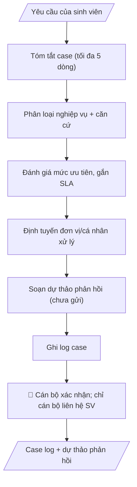

# Phân loại case sinh viên (triage)

## Kiểm soát áp dụng và phê duyệt

Trước khi chạy quy trình, xác định `ngay_ap_dung`, `loai_hinh_truong`, `quy_che_noi_bo`, `nguon_du_lieu` và `nguoi_kiem_duyet`. Chỉ yêu cầu thông tin có liên quan đến nghiệp vụ; không dùng giá trị giả định thay dữ liệu bắt buộc. Hồ sơ có yếu tố pháp lý phải kèm văn bản gốc, tình trạng hiệu lực, điều khoản áp dụng và chuyển tiếp.

## Giới hạn và human gate

AI hỗ trợ chuẩn bị và đối chiếu. Cán bộ phụ trách kiểm tra dữ liệu/căn cứ, người có thẩm quyền duyệt và ký. Mọi đầu ra mặc định là **DỰ THẢO – CHỜ KIỂM DUYỆT**; không đánh dấu đã ký, đã duyệt hoặc đã công bố nếu chưa có chứng cứ. Dữ liệu sinh viên, sức khỏe, nhân sự và tài chính phải hạn chế theo mục đích, phân quyền và che thông tin định danh khi dùng ví dụ. Không tải dữ liệu lên dịch vụ ngoài khi chưa có quyền. Kiểm tra Luật 91/2025/QH15 về bảo vệ dữ liệu cá nhân (hiệu lực 01/01/2026) và quy định áp dụng trước xử lý/chia sẻ dữ liệu cá nhân.

## Khi nào dùng
Khi đơn vị tiếp nhận phản ánh/khiếu nại/đề nghị của sinh viên qua phiếu, email, form trực tuyến:
khiếu nại điểm số, vướng mắc học phí, vấn đề KTX, đề nghị xác nhận... Cần phân loại nhanh,
đúng đơn vị xử lý, đúng mức độ ưu tiên — thay vì dồn vào một đầu mối xử lý thủ công.

## Đầu vào (Input)

| Trường | Mô tả | Bắt buộc |
|---|---|---|
| `kenh_tiep_nhan` | Phiếu / Email / Form trực tuyến / Trực tiếp | Có |
| `noi_dung_case` | Nội dung phản ánh của sinh viên (nguyên văn) | Có |
| `thong_tin_sv` | Mã SV, họ tên, khoa, khóa (để tra lịch sử) | Có |
| `quy_dinh_lien_quan` | Quy định, quy trình xử lý từng loại vụ việc + SLA | Có |
| `lich_su_xu_ly` | Các case trước đây của SV này (nếu có) | Không |

## Quy trình

**Bước 1. Tóm tắt case**
- Làm gì: Đọc `noi_dung_case` (nguyên văn), trích 4 yếu tố: ai (lấy từ `thong_tin_sv`), việc gì, xảy ra khi nào, mong muốn gì; viết gọn tối đa 5 dòng, giữ nguyên ý của sinh viên, không thêm suy diễn.
- Dùng input: `noi_dung_case`, `thong_tin_sv`.
- Vai trò: Cán bộ thụ lý · AI hỗ trợ: trích 4 yếu tố (ai — việc gì — khi nào — mong muốn gì), viết gọn ≤ 5 dòng · ⏱ ~5–10 phút (ước tính)
- Lưu ý nghiệp vụ: không suy đoán động cơ hay hoàn cảnh ngoài nội dung SV viết; nếu nội dung mơ hồ, ghi rõ "cần làm rõ thêm" thay vì đoán.
- → Kết quả bước: Bản tóm tắt case (≤ 5 dòng).

**Bước 2. Phân loại nghiệp vụ**
- Làm gì: Căn cứ `quy_dinh_lien_quan`, xếp case vào nhóm nghiệp vụ (học vụ / học phí-tài chính / học bổng / KTX / kỷ luật-khiếu nại / xác nhận-giấy tờ / hỗ trợ khác); ghi rõ căn cứ điều khoản phân loại; tra `lich_su_xu_ly` để phát hiện case lặp lại của cùng SV.
- Dùng input: `noi_dung_case`, `quy_dinh_lien_quan`, `lich_su_xu_ly` (bản tóm tắt từ bước 1).
- Vai trò: Cán bộ thụ lý · AI hỗ trợ: phân loại nghiệp vụ theo quy định, tra lịch sử phát hiện case lặp · ⏱ ~10–15 phút (ước tính)
- Lưu ý nghiệp vụ: case liên quan tâm lý/sức khỏe → phân loại "hỗ trợ khác" và chuyển ngay cho bộ phận tư vấn tâm lý/y tế, không phân tích sâu; case trùng lặp phải ghi chú để tránh xử lý chồng chéo.
- → Kết quả bước: Nhóm nghiệp vụ + căn cứ phân loại + ghi chú lịch sử.

**Bước 3. Đánh giá mức độ ưu tiên và gắn SLA**
- Làm gì: Chấm mức ưu tiên: Khẩn (ảnh hưởng quyền lợi sát hạn, an toàn) / Cao / Thường; tra `quy_dinh_lien_quan` để gắn SLA cụ thể (VD: phản hồi trong 3 ngày làm việc) và tính ra hạn chót theo ngày làm việc.
- Dùng input: `quy_dinh_lien_quan` (phân loại từ bước 2).
- Vai trò: Cán bộ thụ lý · AI hỗ trợ: chấm mức ưu tiên và gắn SLA, tính hạn chót theo ngày làm việc · ⏱ ~5–10 phút (ước tính)
- Lưu ý nghiệp vụ: mức Khẩn phải có căn cứ rõ ràng, không lạm dụng; hạn SLA tính theo ngày làm việc, trừ ngày nghỉ/lễ.
- → Kết quả bước: Mức độ ưu tiên + SLA + hạn chót.

**Bước 4. Định tuyến đơn vị xử lý**
- Làm gì: Theo phân loại nghiệp vụ, chỉ định đơn vị/cá nhân thụ lý; nếu case liên quan nhiều đơn vị: chỉ định một đầu mối chính + các đơn vị phối hợp; case vượt thẩm quyền hoặc nhạy cảm (kỷ luật, pháp lý) → định tuyến thẳng lên lãnh đạo đơn vị.
- Dùng input: `quy_dinh_lien_quan` (phân loại và ưu tiên từ bước 2–3).
- Vai trò: Cán bộ thụ lý · AI hỗ trợ: đề xuất định tuyến — một đầu mối chính + đơn vị phối hợp · ⏱ ~10–15 phút (ước tính)
- Lưu ý nghiệp vụ: một case chỉ có một đầu mối chính để tránh đùn đẩy; ghi rõ vai trò phối hợp của từng đơn vị liên quan.
- → Kết quả bước: Phiếu định tuyến (đơn vị xử lý, đầu mối, đơn vị phối hợp, hạn).

**Bước 5. Soạn dự thảo phản hồi sinh viên**
- Làm gì: Soạn thư/email trả lời SV ở dạng DỰ THẢO (chưa gửi): xác nhận đã tiếp nhận, nêu rõ hướng xử lý và thời hạn theo SLA; văn phong tôn trọng, rõ ràng; KHÔNG hứa hẹn kết quả xử lý cụ thể.
- Dùng input: `thong_tin_sv` (tóm tắt từ bước 1, SLA từ bước 3, định tuyến từ bước 4).
- Vai trò: Cán bộ thụ lý · AI hỗ trợ: soạn dự thảo phản hồi đúng SLA, văn phong tôn trọng (chưa gửi) · ⏱ ~10–15 phút + ~15–30 phút duyệt (ước tính)
- Lưu ý nghiệp vụ: bẫy thường gặp là hứa "sẽ giải quyết xong" — chỉ nêu "đang xử lý, sẽ phản hồi trước ngày X"; với case nhạy cảm, ngôn từ dự thảo phải thận trọng.
- → Kết quả bước: Dự thảo phản hồi sinh viên (CHƯA GỬI).

**Bước 6. Ghi log theo dõi**
- Làm gì: Ghi log: mã case theo quy ước thống nhất toàn trường, thời gian tiếp nhận và `kenh_tiep_nhan`, phân loại, ưu tiên, đơn vị xử lý, trạng thái "chờ cán bộ xác nhận".
- Dùng input: `kenh_tiep_nhan` (kết quả các bước 2–4).
- Vai trò: Cán bộ thụ lý · AI hỗ trợ: ghi log case (mã case thống nhất, trạng thái chờ xác nhận) · ⏱ ~5 phút (ước tính)
- Lưu ý nghiệp vụ: mã case thống nhất để tra cứu, tránh xử lý trùng lặp; log case không chia sẻ ra ngoài đơn vị xử lý (bảo mật thông tin cá nhân SV).
- → Kết quả bước: Log case hoàn chỉnh — đầu vào cho Human gate (cán bộ xác nhận).
## Luồng quy trình (Workflow)

## Đầu ra (Output)
- Case brief (tóm tắt + phân loại + ưu tiên + SLA).
- Phiếu định tuyến (đơn vị xử lý, đầu mối, hạn).
- Dự thảo phản hồi sinh viên (CHƯA GỬI).
- Log theo dõi case.

**Cấu trúc output chuẩn:** khung mẫu CỐ ĐỊNH của sản phẩm chính (Case brief):
1. Mã case + kênh tiếp nhận + thời gian tiếp nhận.
2. Tóm tắt case: ai — việc gì — xảy ra khi nào — mong muốn gì (tối đa 5 dòng).
3. Phân loại nghiệp vụ + căn cứ điều khoản.
4. Mức độ ưu tiên + SLA (hạn chót phản hồi).
5. Định tuyến: đơn vị xử lý, đầu mối chính, đơn vị phối hợp.
6. Dự thảo phản hồi (đính kèm, CHƯA GỬI).
7. Log theo dõi (trạng thái: chờ cán bộ xác nhận).

## Checklist nghiệm thu

- [ ] Case brief đầy đủ 7 phần theo Cấu trúc output chuẩn: mã case + kênh + thời gian tiếp nhận; tóm tắt (≤ 5 dòng); phân loại + căn cứ điều khoản; ưu tiên + SLA (hạn chót); định tuyến; dự thảo phản hồi đính kèm (chưa gửi); log theo dõi.
- [ ] Tóm tắt giữ nguyên ý sinh viên; nội dung mơ hồ ghi "cần làm rõ thêm", không suy đoán động cơ hay hoàn cảnh.
- [ ] Mỗi case có MỘT đầu mối chính duy nhất; case vượt thẩm quyền hoặc nhạy cảm (kỷ luật, pháp lý) đã định tuyến thẳng lên lãnh đạo đơn vị.
- [ ] Mức Khẩn có căn cứ rõ ràng, không lạm dụng; hạn SLA tính theo ngày làm việc (trừ ngày nghỉ/lễ).
- [ ] Dự thảo phản hồi KHÔNG hứa hẹn kết quả xử lý cụ thể — chỉ nêu hướng xử lý và thời hạn theo SLA; chỉ ở trạng thái dự thảo, chưa gửi.
- [ ] Bảo mật thông tin cá nhân sinh viên; log case không chia sẻ ngoài đơn vị xử lý; case liên quan tâm lý/sức khỏe đã chuyển ngay cho bộ phận tư vấn tâm lý/y tế, không phân tích sâu.
- [ ] Đã qua Human gate: cán bộ thụ lý đã xác nhận phân loại, ưu tiên và đơn vị xử lý; cán bộ là người duy nhất liên hệ và gửi phản hồi cho sinh viên.

> Tiêu chí đạt: tất cả các ô được đánh dấu.

## Ví dụ mô phỏng (dữ liệu giả lập)

> Tất cả tên trường, cá nhân, số liệu dưới đây đều là **giả lập**.
> Ví dụ: Phòng CTSV tiếp nhận — áp dụng tương tự cho mọi đơn vị.

### Input mẫu

| Trường | Giá trị |
|---|---|
| `kenh_tiep_nhan` | Email |
| `noi_dung_case` | "Em là SV năm 3, em thấy điểm rèn luyện học kỳ 1 của em bị 65 trong khi em tham gia đầy đủ hoạt động lớp. Em đề nghị kiểm tra lại." |
| `thong_tin_sv` | SV2024 000 0000, Phạm Văn B (giả lập), Khoa CNTT, K2023 |
| `quy_dinh_lien_quan` | Quy định đánh giá rèn luyện: SV được quyền khiếu nại trong 7 ngày từ khi công bố; Phòng CTSV chủ trì, khoa phối hợp; SLA phản hồi 3 ngày làm việc |

### Output mẫu

**CASE BRIEF**
**1. Mã case + kênh + thời gian tiếp nhận:** CASE-2026-0847 | Kênh: Email | Tiếp nhận: 09/10/2026.
**2. Tóm tắt:** SV Phạm Văn B (SV2024 000 0000, K2023, Khoa CNTT) khiếu nại điểm rèn luyện HK1 (65đ), cho rằng đã tham gia đầy đủ hoạt động lớp; đề nghị kiểm tra lại.
**3. Phân loại:** Khiếu nại điểm rèn luyện — căn cứ Quy định đánh giá rèn luyện: SV được khiếu nại trong 7 ngày từ khi công bố (còn trong hạn); lịch sử: không có case trước đây.
**4. Ưu tiên + SLA:** Cao (liên quan quyền lợi xét học bổng sắp tới) — SLA phản hồi trong 3 ngày làm việc → hạn chót 15/10/2026.
**5. Định tuyến:** Phòng CTSV (đầu mối: ThS. Đỗ Thị A) + Khoa CNTT phối hợp đối chiếu.
**6. Dự thảo phản hồi (CHƯA GỬI):**
"Kính gửi em Phạm Văn B, Phòng Công tác sinh viên đã tiếp nhận phản ánh của em về điểm rèn luyện học kỳ 1. Đơn vị đang phối hợp với Khoa CNTT kiểm tra lại và sẽ phản hồi em trước ngày 15/10/2026..."
**7. Log theo dõi:** CASE-2026-0847 | Email | 09/10/2026 | Khiếu nại điểm rèn luyện | Ưu tiên: Cao | Xử lý: Phòng CTSV | Trạng thái: chờ cán bộ xác nhận.

## Human gate (người kiểm duyệt)
1. **Cán bộ thụ lý**: xác nhận phân loại, mức độ ưu tiên và đơn vị xử lý trước khi chuyển đi.
2. **Cán bộ là người duy nhất liên hệ và gửi phản hồi cho sinh viên** — sau khi duyệt dự thảo của AI.
3. Case vượt thẩm quyền hoặc nhạy cảm (kỷ luật, pháp lý) chuyển ngay lãnh đạo đơn vị, không để AI
   "xử lý tiếp".

## Giới hạn (guardrails)
- KHÔNG tự gửi bất kỳ phản hồi nào cho sinh viên dưới mọi hình thức.
- KHÔNG chẩn đoán, tư vấn về tâm lý, sức khỏe của sinh viên — case liên quan chuyển ngay
  cho bộ phận tư vấn tâm lý/y tế của trường.
- Bảo mật tuyệt đối thông tin cá nhân của sinh viên; log case không chia sẻ ngoài đơn vị xử lý.
- KHÔNG hứa hẹn kết quả xử lý cụ thể với sinh viên trong dự thảo (chỉ nêu hướng và thời hạn).

## Căn cứ & lưu ý
- Quy định/quy trình xử lý từng loại vụ việc và SLA do trường ban hành là căn cứ duy nhất để
  phân loại và định tuyến.
- Nên có mã case thống nhất toàn trường để tra cứu, tránh xử lý trùng lặp.
- Mọi ví dụ đều giả lập; không dùng tên thật của trường/cá nhân.

## Quản trị phiên bản

- Phiên bản gói: `1.1.0`; ngày cập nhật: `2026-10-09`.
- Kho nguồn: https://github.com/phamtruong91/dh-skills
- Người duy trì trên GitHub: `phamtruong91` (Phạm Văn Trường). Người phê duyệt nghiệp vụ: **chưa chỉ định**.
- Commit nguồn trước cập nhật: `78fd1d51b8acd1a724d9b9af6c488460bc7551ad`. Commit chứa phiên bản này xem bằng `git log -1 -- skills/triage-case-sinh-vien`; không tự gán SHA chưa tạo.
- Giấy phép: theo LICENSE của kho; bản quyền CES Global.
- Lịch sử 1.1.0: bổ sung metadata giao diện, kiểm soát áp dụng, quản trị phiên bản.
- Trạng thái: dự thảo nghiệp vụ; kiểm tra pháp lý trước thực thi. Ngày cập nhật không đồng nghĩa mọi văn bản đã được rà soát toàn văn.
