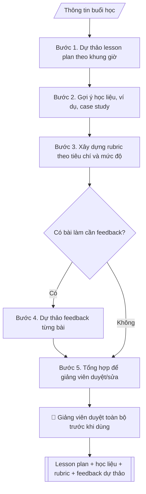

# Trợ lý giảng dạy

## Định dạng và file đầu ra

Định dạng đầu ra có thể chọn theo sản phẩm/yêu cầu: .docx, .pdf, .pptx. Đọc mục “Định dạng bổ sung” trong quy cách đầu ra trước khi chọn.

**Phải tạo file thực tế để tải xuống, không chỉ trả nội dung trong chat.** Định dạng mặc định của skill: **.docx**. Nếu có bảng số liệu nghiệp vụ yêu cầu file bảng tính riêng, tạo thêm Excel theo yêu cầu; không tự tạo file kiểm tra. Không chờ người dùng yêu cầu xuất file lần nữa. Ưu tiên định dạng người dùng chỉ định; đọc quy tắc xuất file tại references/quy-cach-dau-ra.md.

## Quy cách đầu ra và thông tin thiếu
Đọc [quy cách và cấu trúc sản phẩm](references/quy-cach-dau-ra.md) trước khi soạn/xuất. File giao chỉ gồm sản phẩm nghiệp vụ được yêu cầu; kiểm tra nội bộ không xuất kèm. Thiếu thông tin thì giữ nguyên trường/mục và chỗ điền theo mẫu gốc (dòng dấu chấm, dấu gạch hoặc ô trống); không tự điền dữ liệu mẫu, số 0, mã chờ xác minh hay dòng chờ ký. Mẫu chuyên ngành còn áp dụng được ưu tiên về cấu trúc, mã biểu và người ký. Bản đầy đủ: [quy tắc chung](references/quy-tac-chung.md).

## Kiểm soát áp dụng và phê duyệt
Trước khi chạy, xác định `ngay_ap_dung`, `loai_hinh_truong`, `quy_che_noi_bo`, `nguon_du_lieu`, `nguoi_kiem_duyet`; chỉ hỏi thông tin liên quan nghiệp vụ, không dùng giá trị giả định thay dữ liệu bắt buộc. Đối chiếu căn cứ pháp lý với văn bản gốc, hiệu lực, điều khoản áp dụng và chuyển tiếp. Bản đầy đủ: [quy tắc chung](references/quy-tac-chung.md).

## Giới hạn và human gate
AI hỗ trợ chuẩn bị và đối chiếu; cán bộ phụ trách kiểm tra dữ liệu/căn cứ, người có thẩm quyền duyệt và ký. Không đánh dấu đã ký, đã duyệt, đã công bố khi chưa có chứng cứ. Dữ liệu sinh viên, sức khỏe, nhân sự, tài chính chỉ dùng theo mục đích và phân quyền, che thông tin định danh khi dùng ví dụ (Luật 91/2025/QH15, hiệu lực 01/01/2026); không tải dữ liệu lên dịch vụ ngoài khi chưa có quyền. Bản đầy đủ: [quy tắc chung](references/quy-tac-chung.md).

## Khi nào dùng
Khi chuẩn bị bài giảng, xây dựng tiêu chí đánh giá (rubric), hoặc soạn nhận xét phản hồi
cho sinh viên. Dùng chung cho giảng viên mọi khoa/bộ môn, mọi học phần.

## Đầu vào (Input)

| Trường | Mô tả | Bắt buộc |
|---|---|---|
| `de_cuong_hoc_phan` | Đề cương học phần: mục tiêu, chuẩn đầu ra, nội dung | Có |
| `chu_de_buoi_hoc` | Chủ đề buổi học cần chuẩn bị | Có |
| `trinh_do_sinh_vien` | Năm thứ, trình độ đầu vào của lớp | Không |
| `thoi_luong` | Thời lượng buổi học (phút) | Không (mặc định: 90) |
| `bai_lam_an_danh` | Bài làm đã ẩn danh cần soạn feedback (nếu có) | Không |
| `tieu_chi_danh_gia` | Các tiêu chí đánh giá cần đưa vào rubric | Không |

## Quy trình

**Bước 1. Dự thảo lesson plan**
- Làm gì: từ `de_cuong_hoc_phan` xác định mục tiêu và chuẩn đầu ra gắn với `chu_de_buoi_hoc`;
  chia nội dung thành các hoạt động (mở đầu, triển khai, thực hành, tổng kết); phân bổ
  `thoi_luong` cho từng hoạt động; soạn câu hỏi gợi mở cho mỗi phần.
- Dùng input: `de_cuong_hoc_phan`, `chu_de_buoi_hoc`, `trinh_do_sinh_vien`, `thoi_luong`
- Vai trò: Giảng viên phụ trách học phần · AI hỗ trợ: dự thảo lesson plan theo khung giờ từ đề cương học phần · ⏱ ~15–20 phút (ước tính)
- Lưu ý nghiệp vụ: buổi học kỹ năng nên dành phần lớn thời lượng cho thực hành; ví dụ và
  mức độ toán phải phù hợp `trinh_do_sinh_vien`, không đưa nội dung vượt trình độ;
  câu hỏi gợi mở phải bám mục tiêu buổi học.
- → Kết quả bước: "dự thảo lesson plan theo khung giờ" (mục tiêu + các hoạt động +
  phân bổ thời gian + câu hỏi gợi mở).

**Bước 2. Gợi ý học liệu**
- Làm gì: đề xuất ví dụ minh họa, case study, tài liệu đọc thêm (bài báo, video, notebook)
  phù hợp chủ đề buổi học và trình độ sinh viên; ưu tiên học liệu mở, dễ truy cập.
- Dùng input: `de_cuong_hoc_phan`, `chu_de_buoi_hoc`, `trinh_do_sinh_vien`
- Vai trò: Giảng viên phụ trách học phần · AI hỗ trợ: gợi ý học liệu phù hợp chủ đề và trình độ sinh viên · ⏱ ~10–15 phút (ước tính)
- Lưu ý nghiệp vụ: không bịa tên sách/tác giả/link bài báo — chỉ gợi ý loại học liệu và
  nguồn kiểm chứng được; mọi học liệu phải bám đề cương học phần.
- → Kết quả bước: "danh sách học liệu đề xuất" (tên/loại + mục đích sử dụng +
  phù hợp đối tượng nào).

**Bước 3. Xây dựng rubric**
- Làm gì: từ `tieu_chi_danh_gia` (nếu không có thì suy từ mục tiêu buổi học ở bước 1),
  lập bảng tiêu chí × 4 mức độ (xuất sắc / tốt / đạt / chưa đạt) với mô tả cụ thể,
  đo được cho từng mức.
- Dùng input: `tieu_chi_danh_gia`, `de_cuong_hoc_phan`, `chu_de_buoi_hoc`
- Vai trò: Giảng viên phụ trách học phần · AI hỗ trợ: lập bảng rubric 4 mức độ với mô tả cụ thể từng mức để hiệu chỉnh chuyên môn · ⏱ ~15–30 phút (ước tính)
- Lưu ý nghiệp vụ: mỗi mức độ phải mô tả hành vi quan sát được, tránh từ mơ hồ
  ("khá tốt", "tương đối"); thang điểm thống nhất với quy chế đào tạo của trường.
- → Kết quả bước: "dự thảo rubric đánh giá" (bảng tiêu chí × mức độ với mô tả cụ thể).

**Bước 4. Dự thảo feedback** (chỉ khi có bài làm)
- Làm gì: đọc từng `bai_lam_an_danh`, đối chiếu với rubric ở bước 3; viết nhận xét theo
  cấu trúc: điểm mạnh → điểm cần cải thiện → gợi ý cụ thể; dùng giọng văn xây dựng,
  không dán nhãn.
- Dùng input: `bai_lam_an_danh`, kết quả bước 3
- Vai trò: Giảng viên phụ trách học phần · AI hỗ trợ: dự thảo feedback theo cấu trúc 3 phần cho từng bài đã ẩn danh · ⏱ ~5–10 phút/bài (ước tính)
- Lưu ý nghiệp vụ: bài làm phải được ẩn danh trước khi đưa vào xử lý; feedback chỉ là
  dự thảo — giảng viên là người gửi chính thức; không chấm điểm cuối cùng thay giảng viên.
- → Kết quả bước: "dự thảo feedback từng bài" (nhận xét theo cấu trúc 3 phần).

**Bước 5. Tổng hợp để giảng viên duyệt**
- Làm gì: gom lesson plan (bước 1) + học liệu (bước 2) + rubric (bước 3) + feedback
  (bước 4, nếu có) thành một bộ hồ sơ buổi học; đánh dấu các phần cần giảng viên quyết
  (nội dung chuyên môn, thang điểm, ngôn từ feedback) để duyệt/sửa trước khi sử dụng.
- Dùng input: kết quả các bước 1–4
- Vai trò: Giảng viên phụ trách học phần · AI hỗ trợ: tổng hợp lesson plan + học liệu + rubric + feedback thành bộ hồ sơ buổi học · ⏱ ~20–30 phút (ước tính)
- Lưu ý nghiệp vụ: ghi rõ trạng thái "DỰ THẢO — giảng viên duyệt trước khi dùng";
  không gửi bất kỳ phần nào cho sinh viên khi chưa được duyệt.
- → Kết quả bước: "bộ hồ sơ buổi học hoàn chỉnh (dự thảo)" = Output cuối.
## Luồng quy trình (Workflow)

## Đầu ra

File nghiệp vụ thực tế theo định dạng mặc định ở đầu skill hoặc định dạng người dùng yêu cầu, kèm liên kết tải trong phản hồi cuối.

Sản phẩm nghiệp vụ hoàn chỉnh theo [quy cách và cấu trúc](references/quy-cach-dau-ra.md), giữ các trường chưa có dữ liệu ở trạng thái trống. Không xuất kèm checklist/phụ lục kiểm tra đầu ra.

## Kiểm tra nội bộ trước khi giao

- [ ] Bố cục khớp mẫu áp dụng và cấu trúc tại references/quy-cach-dau-ra.md.
- [ ] Mục tiêu buổi học gắn đúng chuẩn đầu ra trong `de_cuong_hoc_phan`.
- [ ] Tiến trình khung giờ khớp tổng `thoi_luong`; nội dung, ví dụ, mức độ phù hợp `trinh_do_sinh_vien`; câu hỏi gợi mở bám mục tiêu buổi học.
- [ ] Rubric đủ 4 mức độ với mô tả hành vi quan sát được (không từ mơ hồ như "khá tốt"); thang điểm thống nhất quy chế đào tạo.
- [ ] Học liệu gợi ý kiểm chứng được (không bịa tên sách/tác giả/link) và bám đề cương học phần.
- [ ] Feedback bài làm chỉ xử lý bài đã ẩn danh, theo cấu trúc điểm mạnh → cần cải thiện → gợi ý cụ thể; không chấm điểm cuối cùng thay giảng viên.
- [ ] Bộ hồ sơ ghi rõ trạng thái "DỰ THẢO — giảng viên duyệt trước khi dùng"; không gửi bất kỳ phần nào cho sinh viên khi chưa duyệt.
- [ ] Đã qua Human gate: giảng viên duyệt toàn bộ (lesson plan, học liệu, rubric, feedback) trước khi sử dụng.

> Tiêu chí đạt: tất cả các ô được đánh dấu.

## Human gate (người kiểm duyệt)
- **Giảng viên phụ trách học phần duyệt TOÀN BỘ** (lesson plan, học liệu, rubric, feedback)
  trước khi sử dụng hoặc gửi cho sinh viên.
- Khoa/bộ môn duyệt khi rubric dùng cho đánh giá chính thức.

## Giới hạn (guardrails)
- Không chấm điểm cuối cùng hay quyết định kết quả học tập thay giảng viên.
- Bài làm của sinh viên phải được ẩn danh trước khi đưa vào xử lý.
- Không sử dụng đề thi/bài kiểm tra có tính bảo mật.
- Feedback chỉ mang tính dự thảo — giảng viên là người gửi chính thức.
- Không bịa kiến thức chuyên môn; nội dung phải bám đề cương học phần.

## Căn cứ & lưu ý
- Theo đề cương chi tiết học phần và quy chế đào tạo của trường.
- Không dùng tên thật của trường/cá nhân khi mô phỏng.

## Quản trị phiên bản
- Phiên bản gói `1.3.2` (cập nhật 2026-10-10); hồ sơ đầy đủ tại [references/version.json](references/version.json).
- Người phê duyệt nghiệp vụ: **chưa chỉ định**. Trạng thái: dự thảo nghiệp vụ; kiểm tra pháp lý trước thực thi. Ngày cập nhật không đồng nghĩa mọi văn bản đã được rà soát toàn văn.
- Giấy phép theo LICENSE của kho (bản quyền CES Global). Lịch sử thay đổi: CHANGELOG.md.
