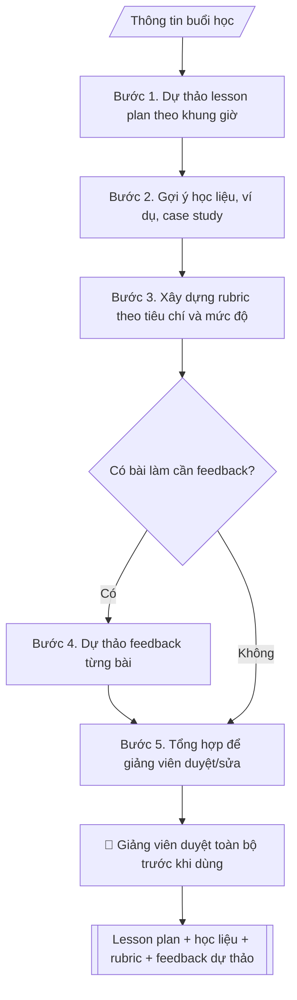

# Skill: Trợ lý giảng dạy

## Khi nào dùng
Khi chuẩn bị bài giảng, xây dựng tiêu chí đánh giá (rubric), hoặc soạn nhận xét phản hồi
cho sinh viên. Dùng chung cho giảng viên mọi khoa/bộ môn, mọi học phần.

## Đầu vào (Input)

| Trường | Mô tả | Bắt buộc |
|---|---|---|
| `de_cuong_hoc_phan` | Đề cương học phần: mục tiêu, chuẩn đầu ra, nội dung | Có |
| `chu_de_buoi_hoc` | Chủ đề buổi học cần chuẩn bị | Có |
| `trinh_do_sinh_vien` | Năm thứ, trình độ đầu vào của lớp | Không |
| `thoi_luong` | Thời lượng buổi học (phút) | Không (mặc định: 90) |
| `bai_lam_an_danh` | Bài làm đã ẩn danh cần soạn feedback (nếu có) | Không |
| `tieu_chi_danh_gia` | Các tiêu chí đánh giá cần đưa vào rubric | Không |

## Quy trình

**Bước 1. Dự thảo lesson plan**
- Làm gì: từ `de_cuong_hoc_phan` xác định mục tiêu và chuẩn đầu ra gắn với `chu_de_buoi_hoc`;
  chia nội dung thành các hoạt động (mở đầu, triển khai, thực hành, tổng kết); phân bổ
  `thoi_luong` cho từng hoạt động; soạn câu hỏi gợi mở cho mỗi phần.
- Dùng input: `de_cuong_hoc_phan`, `chu_de_buoi_hoc`, `trinh_do_sinh_vien`, `thoi_luong`
- Vai trò: Giảng viên phụ trách học phần · AI hỗ trợ: dự thảo lesson plan theo khung giờ từ đề cương học phần · ⏱ ~15–20 phút (ước tính)
- Lưu ý nghiệp vụ: buổi học kỹ năng nên dành phần lớn thời lượng cho thực hành; ví dụ và
  mức độ toán phải phù hợp `trinh_do_sinh_vien`, không đưa nội dung vượt trình độ;
  câu hỏi gợi mở phải bám mục tiêu buổi học.
- → Kết quả bước: "dự thảo lesson plan theo khung giờ" (mục tiêu + các hoạt động +
  phân bổ thời gian + câu hỏi gợi mở).

**Bước 2. Gợi ý học liệu**
- Làm gì: đề xuất ví dụ minh họa, case study, tài liệu đọc thêm (bài báo, video, notebook)
  phù hợp chủ đề buổi học và trình độ sinh viên; ưu tiên học liệu mở, dễ truy cập.
- Dùng input: `de_cuong_hoc_phan`, `chu_de_buoi_hoc`, `trinh_do_sinh_vien`
- Vai trò: Giảng viên phụ trách học phần · AI hỗ trợ: gợi ý học liệu phù hợp chủ đề và trình độ sinh viên · ⏱ ~10–15 phút (ước tính)
- Lưu ý nghiệp vụ: không bịa tên sách/tác giả/link bài báo — chỉ gợi ý loại học liệu và
  nguồn kiểm chứng được; mọi học liệu phải bám đề cương học phần.
- → Kết quả bước: "danh sách học liệu đề xuất" (tên/loại + mục đích sử dụng +
  phù hợp đối tượng nào).

**Bước 3. Xây dựng rubric**
- Làm gì: từ `tieu_chi_danh_gia` (nếu không có thì suy từ mục tiêu buổi học ở bước 1),
  lập bảng tiêu chí × 4 mức độ (xuất sắc / tốt / đạt / chưa đạt) với mô tả cụ thể,
  đo được cho từng mức.
- Dùng input: `tieu_chi_danh_gia`, `de_cuong_hoc_phan`, `chu_de_buoi_hoc`
- Vai trò: Giảng viên phụ trách học phần · AI hỗ trợ: lập bảng rubric 4 mức độ với mô tả cụ thể từng mức để hiệu chỉnh chuyên môn · ⏱ ~15–30 phút (ước tính)
- Lưu ý nghiệp vụ: mỗi mức độ phải mô tả hành vi quan sát được, tránh từ mơ hồ
  ("khá tốt", "tương đối"); thang điểm thống nhất với quy chế đào tạo của trường.
- → Kết quả bước: "dự thảo rubric đánh giá" (bảng tiêu chí × mức độ với mô tả cụ thể).

**Bước 4. Dự thảo feedback** (chỉ khi có bài làm)
- Làm gì: đọc từng `bai_lam_an_danh`, đối chiếu với rubric ở bước 3; viết nhận xét theo
  cấu trúc: điểm mạnh → điểm cần cải thiện → gợi ý cụ thể; dùng giọng văn xây dựng,
  không dán nhãn.
- Dùng input: `bai_lam_an_danh`, kết quả bước 3
- Vai trò: Giảng viên phụ trách học phần · AI hỗ trợ: dự thảo feedback theo cấu trúc 3 phần cho từng bài đã ẩn danh · ⏱ ~5–10 phút/bài (ước tính)
- Lưu ý nghiệp vụ: bài làm phải được ẩn danh trước khi đưa vào xử lý; feedback chỉ là
  dự thảo — giảng viên là người gửi chính thức; không chấm điểm cuối cùng thay giảng viên.
- → Kết quả bước: "dự thảo feedback từng bài" (nhận xét theo cấu trúc 3 phần).

**Bước 5. Tổng hợp để giảng viên duyệt**
- Làm gì: gom lesson plan (bước 1) + học liệu (bước 2) + rubric (bước 3) + feedback
  (bước 4, nếu có) thành một bộ hồ sơ buổi học; đánh dấu các phần cần giảng viên quyết
  (nội dung chuyên môn, thang điểm, ngôn từ feedback) để duyệt/sửa trước khi sử dụng.
- Dùng input: kết quả các bước 1–4
- Vai trò: Giảng viên phụ trách học phần · AI hỗ trợ: tổng hợp lesson plan + học liệu + rubric + feedback thành bộ hồ sơ buổi học · ⏱ ~20–30 phút (ước tính)
- Lưu ý nghiệp vụ: ghi rõ trạng thái "DỰ THẢO — giảng viên duyệt trước khi dùng";
  không gửi bất kỳ phần nào cho sinh viên khi chưa được duyệt.
- → Kết quả bước: "bộ hồ sơ buổi học hoàn chỉnh (dự thảo)" = Output cuối.
## Luồng quy trình (Workflow)


## Đầu ra (Output)
- Lesson plan chi tiết theo khung giờ.
- Gợi ý học liệu và câu hỏi.
- Rubric đánh giá.
- Dự thảo feedback từng bài (nếu có).

**Cấu trúc output chuẩn** (sản phẩm chính: Lesson plan):
1. Tiêu đề buổi học (học phần, chủ đề, thời lượng, đối tượng sinh viên).
2. Mục tiêu buổi học (gắn với chuẩn đầu ra của đề cương).
3. Tiến trình theo khung giờ (mở đầu → triển khai → thực hành → tổng kết; mỗi phần:
   nội dung + thời lượng + câu hỏi gợi mở).
4. Học liệu đề xuất (ví dụ, case study, tài liệu đọc thêm).
5. Ghi chú duyệt (trạng thái dự thảo — giảng viên duyệt trước khi dùng).

## Checklist nghiệm thu

- [ ] Đủ 5 phần theo Cấu trúc output chuẩn: tiêu đề buổi học, mục tiêu, tiến trình khung giờ, học liệu đề xuất, ghi chú duyệt.
- [ ] Mục tiêu buổi học gắn đúng chuẩn đầu ra trong `de_cuong_hoc_phan`.
- [ ] Tiến trình khung giờ khớp tổng `thoi_luong`; nội dung, ví dụ, mức độ phù hợp `trinh_do_sinh_vien`; câu hỏi gợi mở bám mục tiêu buổi học.
- [ ] Rubric đủ 4 mức độ với mô tả hành vi quan sát được (không từ mơ hồ như "khá tốt"); thang điểm thống nhất quy chế đào tạo.
- [ ] Học liệu gợi ý kiểm chứng được (không bịa tên sách/tác giả/link) và bám đề cương học phần.
- [ ] Feedback bài làm chỉ xử lý bài đã ẩn danh, theo cấu trúc điểm mạnh → cần cải thiện → gợi ý cụ thể; không chấm điểm cuối cùng thay giảng viên.
- [ ] Bộ hồ sơ ghi rõ trạng thái "DỰ THẢO — giảng viên duyệt trước khi dùng"; không gửi bất kỳ phần nào cho sinh viên khi chưa duyệt.
- [ ] Đã qua Human gate: giảng viên duyệt toàn bộ (lesson plan, học liệu, rubric, feedback) trước khi sử dụng.

> Tiêu chí đạt: tất cả các ô được đánh dấu.

## Ví dụ mô phỏng (dữ liệu giả lập)

> Tất cả tên học phần, nội dung dưới đây đều là **giả lập**.

### Input mẫu

| Trường | Giá trị |
|---|---|
| `de_cuong_hoc_phan` | Nhập môn Trí tuệ nhân tạo — CĐR: giải thích được khái niệm học máy cơ bản |
| `chu_de_buoi_hoc` | Học máy có giám sát: hồi quy tuyến tính |
| `trinh_do_sinh_vien` | Năm 2, đã học Toán cao cấp và Lập trình Python |
| `thoi_luong` | 90 phút |

### Output mẫu

```
LESSON PLAN (dự thảo — giảng viên duyệt trước khi dùng)

1. Tiêu đề buổi học
Học phần: Nhập môn Trí tuệ nhân tạo | Chủ đề: Hồi quy tuyến tính
Thời lượng: 90 phút | Đối tượng: sinh viên năm 2, đã học Toán cao cấp và Python (giả lập)

2. Mục tiêu buổi học
Giải thích được mô hình hồi quy tuyến tính, hàm mất mát và ý tưởng tối ưu
(gắn chuẩn đầu ra: giải thích được khái niệm học máy cơ bản).

3. Tiến trình theo khung giờ
- Mở đầu (10'): đặt vấn đề — dự đoán điểm thi từ số giờ học (ví dụ gần gũi).
  Câu hỏi gợi mở: "Với dữ liệu điểm thi các khóa trước, làm sao dự đoán điểm của bạn?"
- Lý thuyết (25'): mô hình y = ax + b; hàm mất mát; ý tưởng tối ưu.
  Câu hỏi gợi mở: "Đường thẳng nào 'gần' các điểm dữ liệu nhất và đo bằng gì?"
- Thực hành (40'): SV chạy code Python với bộ dữ liệu giả lập, vẽ đường hồi quy.
  Câu hỏi gợi mở: "Thay đổi a, b thì đường hồi quy và sai số thay đổi ra sao?"
- Tổng kết (15'): kiểm tra nhanh 3 câu hỏi; giao bài tập về nhà.

4. Học liệu đề xuất
- Ví dụ minh họa: bộ dữ liệu điểm thi – giờ học (giả lập, dùng chung cả buổi).
- Case study: dự đoán giá nhà từ diện tích (mức năm 2).
- Tài liệu đọc thêm: chương hồi quy trong giáo trình học máy của học phần.

5. Ghi chú duyệt
DỰ THẢO — giảng viên duyệt nội dung chuyên môn và câu hỏi trước khi dùng.

RUBRIC (bài thực hành — dự thảo):
| Tiêu chí | Xuất sắc (9-10) | Tốt (7-8) | Đạt (5-6) | Chưa đạt (<5) |
|---|---|---|---|---|
| Hiểu mô hình | Giải thích được mọi thành phần | Giải thích được phần lớn | Hiểu cơ bản | Chưa hiểu |
| Code chạy đúng | Chạy đúng, tối ưu | Chạy đúng | Chạy có lỗi nhỏ | Không chạy |
```

## Human gate (người kiểm duyệt)
- **Giảng viên phụ trách học phần duyệt TOÀN BỘ** (lesson plan, học liệu, rubric, feedback)
  trước khi sử dụng hoặc gửi cho sinh viên.
- Khoa/bộ môn duyệt khi rubric dùng cho đánh giá chính thức.

## Giới hạn (guardrails)
- Không chấm điểm cuối cùng hay quyết định kết quả học tập thay giảng viên.
- Bài làm của sinh viên phải được ẩn danh trước khi đưa vào xử lý.
- Không sử dụng đề thi/bài kiểm tra có tính bảo mật.
- Feedback chỉ mang tính dự thảo — giảng viên là người gửi chính thức.
- Không bịa kiến thức chuyên môn; nội dung phải bám đề cương học phần.

## Căn cứ & lưu ý
- Theo đề cương chi tiết học phần và quy chế đào tạo của trường.
- Không dùng tên thật của trường/cá nhân khi mô phỏng.
